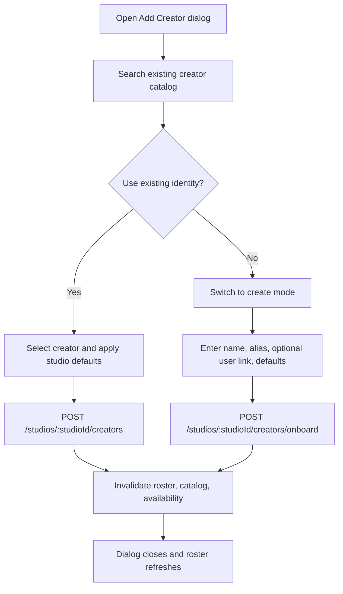
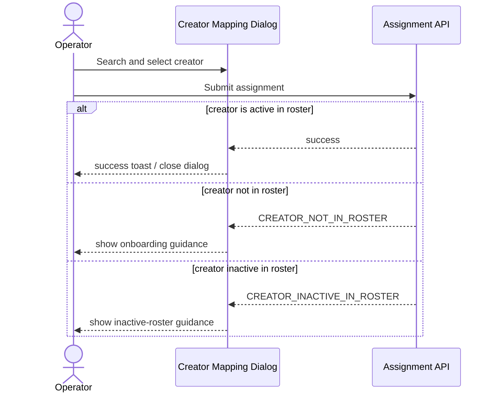

# Studio Creator Onboarding — Frontend Design

> **Status**: Implemented (PR #32)
> **Phase scope**: Phase 4 Wave 1
> **Owner app**: `apps/erify_studios`
> **Product source**: [`docs/features/studio-creator-onboarding.md`](../../../../docs/features/studio-creator-onboarding.md)
> **Depends on**: Studio creator roster UI ✅, backend onboarding + onboarding-user lookup endpoints

## Purpose

Extend the studio roster surface so a studio admin can complete routine creator intake without leaving `/studios/$studioId/creators`, while making creator-mapping failures understandable when a creator has not been onboarded to the studio roster.

## Scope

| Change | Type | Priority |
| --- | --- | --- |
| Search-first onboarding dialog on creator roster page | Primary UI flow | Primary |
| Optional user-link search in create mode | New feature API + form field | Primary |
| Human-readable roster enforcement feedback in creator mapping | UX refinement | Primary |
| Role-aware "ask admin / go to roster" guidance | Empty/error state | Secondary |

## Ordered Task List

### FE-1 Feature API And Contracts

- [x] Consume the new onboarding payload/error contracts from `@eridu/api-types`.
- [x] Extend `src/features/studio-creator-roster/api/studio-creator-roster.ts` with `onboardStudioCreator()` and `useOnboardStudioCreator()`.
- [x] Add `src/features/studio-creator-roster/api/get-onboarding-users.ts` for `GET /studios/:studioId/creators/onboarding-users`.
- [x] Add `useStudioCreatorOnboardingUsersQuery()` with forwarded `AbortSignal` and feature-local query keys.
- [x] Invalidate roster, creator-catalog, and creator-availability query families after successful onboarding.

### FE-2 Roster Dialog Restructure

- [x] Refactor `src/features/studio-creator-roster/components/add-studio-creator-dialog.tsx` into explicit `search` and `create` modes.
- [x] Keep `search` as the default mode every time the dialog opens.
- [x] Preserve the current search term when switching between modes.
- [x] Keep existing add/reactivate behavior for actionable `NONE` and `INACTIVE` results.
- [x] Render `ACTIVE` matches in non-actionable helper UI instead of the selectable combobox list.

### FE-3 Create Mode And Optional User Link

- [x] Add create-mode fields for `name`, `alias`, optional user link, and compensation defaults.
- [x] Keep compensation validation aligned with existing roster rules and field-level copy.
- [x] Use the new studio-scoped onboarding-user search hook for the optional `user_id` field.
- [x] Do not call `/admin/users` or reuse `useUsersQuery()` in this flow.
- [x] Submit create mode through `useOnboardStudioCreator()` and close only on success.

### FE-4 Mapping Error Handling

- [x] Update `src/features/studio-show-creators/components/add-creator-dialog.tsx` to show role-aware onboarding guidance before submit and on typed failure.
- [x] Update `src/features/studio-show-creators/components/show-creator-list.tsx` so single-show assignment surfaces readable `CREATOR_NOT_IN_ROSTER` and `CREATOR_INACTIVE_IN_ROSTER` copy.
- [x] Update `src/features/studio-show-creators/api/bulk-assign-creators-to-shows.ts` to preserve structured error reasons for the dialog layer.
- [x] Update `src/features/studio-show-creators/components/bulk-creator-assignment-dialog.tsx` to stay open on error-only or actionable partial failures.
- [x] Add admin CTA routing back to `/studios/$studioId/creators` where the user can actually resolve the problem.

### FE-5 Test Coverage

- [x] Add component tests proving the dialog defaults to search mode.
- [x] Add tests proving the create CTA appears after search even when results exist.
- [x] Add tests proving active roster matches are visible but not actionable.
- [x] Add tests proving create mode uses the studio onboarding-user endpoint instead of admin users.
- [x] Add tests for query invalidation after successful onboarding.
- [x] Add tests for single-show and bulk-mapping roster error messaging and keep-open behavior.

### FE-6 Verification Gate

- [x] Run `pnpm --filter erify_studios lint`.
- [x] Run `pnpm --filter erify_studios typecheck`.
- [x] Run `pnpm --filter erify_studios test`.
- [x] Run `pnpm --filter erify_studios build` if route wiring or shared package exports change.

## Design Decisions

- The dialog must always start with catalog search.
- "Create and onboard new creator" becomes available after search, not only on zero results.
- The studios app must **not** reuse `useUsersQuery()` because it calls `/admin/users`.
- No shared combobox API change is required for this slice. Non-actionable matches are shown through feature-specific helper UI instead of disabled combobox options.
- Creator mapping search remains partly discovery-first in this slice because the current availability endpoint is intentionally loose; typed write-time errors remain authoritative.

## Route And Access

No new route is added. The onboarding flow remains on:

- `/studios/$studioId/creators`

Access stays unchanged:

| Surface | Access | Change |
| --- | --- | --- |
| Creator roster page | `ADMIN` write, `MANAGER` + `TALENT_MANAGER` read | No route change |
| Add Creator button | `ADMIN` only | Launches redesigned onboarding dialog |
| Creator mapping dialogs | `ADMIN`, `MANAGER`, `TALENT_MANAGER` | Better off-roster guidance and error handling |

## Roster Dialog UX

### Overall Flow



### Search Mode

The current `AddStudioCreatorDialog` becomes a two-mode flow with `search` as the default mode.

**Data source**

- `useCreatorCatalogQuery(studioId, { search, include_rostered: true, limit: 50 })`

**Result handling**

Split catalog results into three groups:

1. **Actionable**
   - `roster_state = NONE`
   - `roster_state = INACTIVE`
   - these appear in the combobox and can be submitted
2. **Already active in this studio**
   - `roster_state = ACTIVE`
   - these are shown in a small informational list below the combobox, not as selectable options
3. **No useful match chosen**
   - admin can switch to create mode after search

This keeps duplicate-prevention visible without requiring disabled-option support in the shared combobox.

**Create CTA rule**

- show `Create and onboard new creator` after the admin has searched
- do not require zero results
- keep copy explicit that creator identities are global across studios

### Create Mode

Create mode is opened from the same dialog, not a separate route.

Fields:

| Field | Type | Required | Notes |
| --- | --- | --- | --- |
| Name | text input | Yes | Global creator name |
| Alias | text input | Yes | Display / stage name |
| User link | async combobox | No | Uses studio onboarding-user search endpoint |
| Default rate | number input | No | Studio-level compensation default |
| Rate type | select | No | Reuse existing compensation options |
| Commission rate | number input | Conditional | Required if COMMISSION or HYBRID |

Behavior:

- `Back to search` returns to search mode without losing the current catalog search term
- compensation validation reuses the existing roster helper logic
- submit calls the onboard mutation and closes only on successful create

### Copy

- Dialog title: `Add Creator to Roster`
- Search placeholder: `Search creators by name or alias...`
- Search helper: `Search first to reuse an existing creator identity when possible.`
- Create CTA: `Create and onboard new creator`
- Create subtitle: `New creators are global identities shared across studios.`
- Active-match helper label: `Already active in this studio`

## User Lookup In Create Mode

The optional `user_id` field gets a dedicated feature API.

### New Feature API

Recommended file:

- `src/features/studio-creator-roster/api/get-onboarding-users.ts`

Contract:

```typescript
GET /studios/:studioId/creators/onboarding-users?search=alice&limit=20
```

Response type:

- reuse `UserApiResponse` from `@eridu/api-types/users`

Why new API instead of reusing existing users hooks:

- `useUsersQuery()` currently targets `/admin/users`
- that is the wrong authorization boundary for studio-admin-owned onboarding

### User Combobox Rendering

Display label format:

- `name (email)` when email exists
- fallback to `name`

Empty-state copy:

- `No eligible users found. Linking can be skipped for now.`

## API Layer

### Add To Existing Roster API Module

Extend `src/features/studio-creator-roster/api/studio-creator-roster.ts` with:

- `onboardStudioCreator()`
- `useOnboardStudioCreator()`

The mutation should invalidate:

- `studioCreatorRosterKeys.listPrefix(studioId)`
- `creatorCatalogKeys.listPrefix(studioId)`
- `creatorAvailabilityKeys.listPrefix(studioId)`

### New Onboarding User Search Hook

Add a dedicated query hook for create mode:

```typescript
useStudioCreatorOnboardingUsersQuery(
  studioId,
  { search, limit },
  enabled,
)
```

This hook should:

- forward `AbortSignal`
- use a short warm cache like other studio reads
- stay feature-local instead of living under the admin users feature

## Creator Mapping UX

The design must match current backend reality: search endpoints are not yet a full roster-eligibility oracle.

### Single-Show Assignment Dialog

Current state:

- uses `GET /studios/:studioId/creators/availability`
- that endpoint is still intentionally loose until availability hardening ships

Design for this slice:

- keep the existing availability-driven search
- do **not** claim search results are already roster-safe
- add persistent helper text in the dialog:
  - admin: `Can't find the right creator? Add them to the studio roster first.`
  - manager / talent manager: `Can't find the right creator? Ask a studio admin to add them to the studio roster.`
- map write-time failures:
  - `CREATOR_NOT_IN_ROSTER` → onboarding guidance
  - `CREATOR_INACTIVE_IN_ROSTER` → inactive roster guidance

### Bulk Assignment Dialog

Current state:

- uses catalog search plus aggregated mutation results
- currently closes too aggressively because the dialog callback treats any mutation success as a terminal success, even when the payload contains errors

Design for this slice:

- keep catalog-based creator discovery for now
- surface readable reason labels for:
  - `CREATOR_NOT_IN_ROSTER`
  - `CREATOR_INACTIVE_IN_ROSTER`
- keep the dialog open when the result contains only errors or partial failure that still needs user attention
- close only when the assignment outcome is fully successful or skipped-only

### Guidance Rules

Use `useStudioAccess(studioId)` inside mapping dialogs or pass a precomputed capability flag from the route.

Guidance copy:

- **Admin**
  - `Creator is not in this studio's roster. Add them to the roster first.`
  - CTA link to `/studios/$studioId/creators`
- **Manager / Talent Manager**
  - `Creator is not in this studio's roster. Ask a studio admin to onboard them.`



## File Inventory

| File | Action |
| --- | --- |
| `src/features/studio-creator-roster/api/studio-creator-roster.ts` | Add onboard mutation |
| `src/features/studio-creator-roster/api/get-onboarding-users.ts` | New feature API for studio-safe user lookup |
| `src/features/studio-creator-roster/components/add-studio-creator-dialog.tsx` | Redesign into search/create two-mode onboarding flow |
| `src/features/studio-show-creators/components/add-creator-dialog.tsx` | Add role-aware onboarding guidance and write-error mapping |
| `src/features/studio-show-creators/components/show-creator-list.tsx` | Surface readable roster error copy for single-show assign |
| `src/features/studio-show-creators/api/bulk-assign-creators-to-shows.ts` | Preserve structured error results so dialog can decide whether to close |
| `src/features/studio-show-creators/components/bulk-creator-assignment-dialog.tsx` | Add readable roster error labels and keep-open behavior on actionable failures |

## Testing

### Component / Hook Tests

- roster dialog defaults to search mode
- create CTA appears after search, not only on zero results
- active roster matches render in helper UI, not as selectable add targets
- create mode validates required `name` and `alias_name`
- create mode user lookup uses the studio onboarding-user endpoint, not admin users
- onboard mutation invalidates roster/catalog/availability queries
- single-show assignment renders readable off-roster guidance on typed failure
- bulk dialog does not auto-close on error-only or partial-failure results

### Manual Smoke

1. As `ADMIN`, open `/studios/$studioId/creators`, search a real existing creator, add/reactivate, and verify roster refresh.
2. As `ADMIN`, search, switch to create mode, optionally link a user, onboard, and verify the new creator appears in roster.
3. In single-show mapping, submit an off-roster creator via race/API path and confirm the UI shows onboarding guidance.
4. In bulk mapping, confirm readable roster-error labels and that the dialog remains open when user action is still needed.

## Assumptions Locked For Implementation

- No shared `AsyncCombobox` or `AsyncMultiCombobox` API change is required.
- Search mode prevents duplicate add/reactivate actions through feature-local helper UI for active matches.
- Single-show mapping still relies on a loose discovery endpoint in this slice; write-time errors are the authoritative roster gate.
