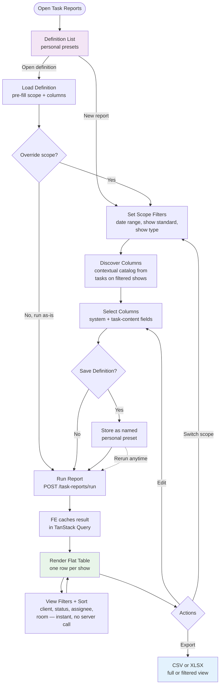
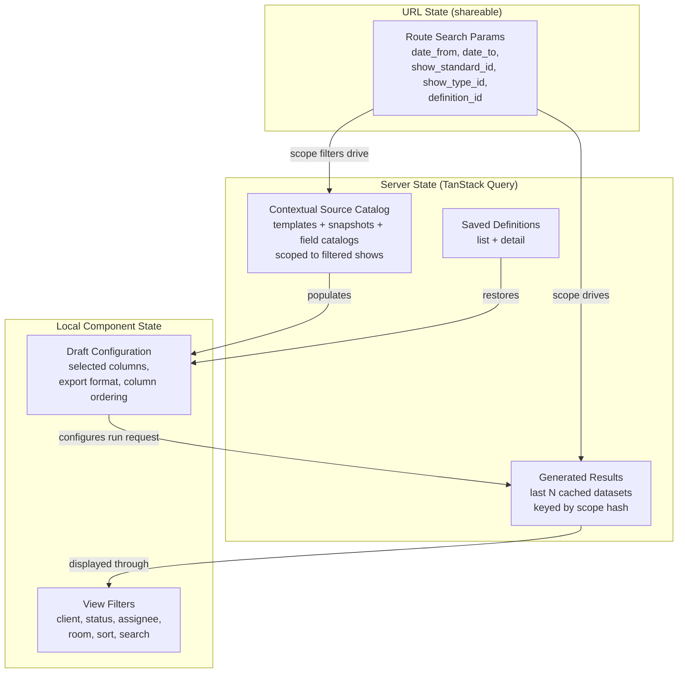

# Task Submission Reporting & Export — Frontend Design

> **TLDR**: Add a studio-scoped report-builder page with a show-first workflow: managers filter shows, discover contextual task columns, select columns, generate a flat table JSON (returned inline), then cache the result and apply client-side view filters, sorting, and CSV/XLSX export.

## 1. Purpose

Provide a manager workflow that sits between the current per-task review queue and a future warehouse/reporting stack. This replaces the moderation team's current Google Sheets workflow where they manually input data and use filter views to review shows by time range.

Primary user outcomes:

1. summarize moderation metrics such as GMV and views across many shows,
2. review premium-show post-production URLs for QC,
3. slice and sort the generated table by client, status, or any column — all client-side,
4. export a reusable spreadsheet — no CSV/XLSX files are generated or stored server-side.

## 2. Scope

In scope:

1. studio-scoped report builder UI with show-first workflow
2. scope filter controls (date range, show standard, show type)
3. contextual column discovery and selection
4. server-side generation trigger with inline result response
5. flat table rendering (rows[] ready to display — no client-side merge)
6. client-side view filters (client, status, assignee, room, sort, search) on the cached dataset
7. TanStack Query cache for last N generated datasets (instant switching)
8. client-side CSV export from cached JSON
9. client-side XLSX export from cached JSON
10. saved definitions as the landing view (personal presets)

Out of scope:

1. scheduled emails / recurring exports
2. cross-studio reporting
3. BI dashboards / pivot-table builder
4. offline task editing changes to existing execution flows
5. server-side result storage (generation is fast, FE caches)

## 3. Recommended Route Shape

Add a dedicated manager-facing page:

- `/studios/$studioId/task-reports`

Rationale:

- keeps feature studio-scoped,
- avoids overloading `review-queue`, which is still per-task operational review,
- leaves room for future report categories under the same route.

## 4. Primary Studio-Manager Flow



Steps:

1. Open `Task Reports` — lands on the **definition list** (personal presets)
2. Open an existing definition (pre-fills scope + columns) or start new
3. **Set scope filters** — date range, show standard, show type. These determine what data the BE generates. At least one required.
4. **Discover columns** — BE returns contextual catalog from tasks on filtered shows
5. **Select columns** — defines the target table schema
6. **Save definition** (optional) — store as named personal preset before running
7. **Run report** — BE generates flat table, returns full JSON inline
8. **FE caches** the result in TanStack Query (last N datasets cached)
9. **Review flat table** — one row per show, all columns pre-merged by BE
10. **Apply view filters** — client, status, assignee, room, sort, search — all instant, no server call
11. **Export** — CSV or XLSX from full or currently filtered view
12. **Edit** — go back to scope/column selection with state preserved

## 5. UX Structure

### 5.1 Page sections

Recommended route decomposition:

1. `task-reports/index.tsx` — route container, manages scope vs result view
2. `report-definition-list.tsx` — landing view: saved definitions, create new
3. `report-scope-filters.tsx` — scope filter controls (date range, show standard, show type)
4. `report-column-picker.tsx` — contextual column selection from discovered catalog
5. `report-workspace-table.tsx` — flat table display with view filter toolbar
6. `report-view-filters.tsx` — client-side filter controls (client, status, assignee, room, sort, search)
7. `report-export-bar.tsx` — CSV/XLSX export actions

This route will exceed 200 LOC quickly; keep container/orchestration separate from table/export sections.

### 5.1.1 Extraction-ready file layout

Per the `package-extraction-strategy` skill, isolate pure logic into a `lib/` subdirectory with zero framework imports:

```
src/features/task-reports/
  ├── api/                               # TanStack Query hooks (React-coupled)
  ├── components/                        # UI components (React-coupled)
  ├── hooks/                             # React hooks (React-coupled)
  └── lib/                               # PORTABLE: pure functions only
      ├── filter-rows.ts                 # Client-side view filter logic
      ├── sort-rows.ts                   # Client-side column sort
      ├── serialize-csv.ts               # CSV export serializer
      └── serialize-xlsx.ts              # XLSX export serializer
```

`lib/` files must not import React, TanStack, or any app-specific module. They take result JSON as input and return plain objects/strings.

### 5.2 Column picker UX

The column picker appears **after** scope filters are set. It shows only columns from the contextual catalog — templates/snapshots that actually have submitted tasks on the filtered shows.

Three column categories:

1. **System columns** (always available): show name, show start time, client, assignee, task status, studio room, show standard, show type
2. **Standard fields** (merged across templates): fields marked `standard: true` in the template schema. These appear as a single group regardless of which template they come from (e.g., one `GMV` column, not 30 template-specific `GMV` columns). Standard fields are the primary mechanism for cross-client reporting.
3. **Custom fields** (template-scoped): non-standard fields grouped by source template. Each template group shows its own custom fields.

The column picker should render standard fields first (as a "Standard Fields" group), then custom fields grouped by template.

**User-facing explanation**: The "Standard Fields" group header should include a brief description: *"These fields are shared across all templates — selecting one includes data from every template that collects it."* Custom field groups should show: *"These fields are specific to [template name]."* This helps managers understand why GMV appears once (standard) while template-specific notes appear per-template (custom).

Each template group should show:

- template name
- task type
- submitted task count in the contextual catalog
- selected field count

Standard fields show:

- field label and key
- number of templates contributing to this field
- total submitted task count across all contributing templates

Incompatible source groups (different template schemas) are surfaced early so managers know export may split. Standard fields never cause splits — they merge by design.

### 5.3 Result table

The result table renders the flat `rows[]` directly — one row per show, with all selected columns.

**Table header**: display `row_count` and `generated_at`. E.g., "487 shows · Generated 2 min ago". This gives immediate confidence that the scope is correct.

**View filter toolbar**: positioned above the table. Controls for:
- client dropdown/search
- show status filter
- assignee filter
- studio room filter
- text search across all visible columns
- column sort (click column header to toggle asc/desc)

All view filters are applied client-side on the cached `rows[]`. The table re-renders instantly.

**Default sort order**: The BE returns rows sorted by `show.startTime DESC` (most-recent shows first). This is the initial display order. The manager can re-sort by any column via the column header — this is a client-side re-sort on the cached data, not a server request.

**BE vs FE responsibility boundary for sort and filter**:

| Concern | Owner | Notes |
|---------|-------|-------|
| Row order in API response | BE | `show.startTime DESC` — deterministic, stable |
| Column sort (click header) | FE | Re-sorts cached `rows[]` in memory |
| View filters (client, status, etc.) | FE | Filters cached `rows[]` in memory |
| Scope filters (date, show type, etc.) | BE | Triggers re-generation |
| Text search | FE | Searches across cached row values |
| Export row order | FE | Matches current sort (filtered view) or BE order (full export) |

**Cell rendering**:
- `null` values rendered as blank cells (not zero — missing data must be visually distinct)
- file/url fields as clickable links
- numeric fields right-aligned
- multiselect fields as comma-separated tags

> **Numeric summaries deferred**: A footer summary strip (row count, sum, average for numeric columns) is a natural UX enhancement but is deferred from MVP. The cached result contains raw row data — the FE can compute summaries client-side when this becomes a product requirement. See [docs/ideation/task-analytics-summaries.md](../../../../docs/ideation/task-analytics-summaries.md).

### 5.4 Export UX

Export controls use `column_map` from the result to determine partition behavior:

- single compatible group → one CSV or one XLSX sheet
- multiple groups → multiple CSV downloads or one XLSX workbook with multiple sheets

Export options:
- **Export all** — exports the full dataset (all rows, ignoring view filters)
- **Export filtered** — exports only the currently visible rows (respects view filters and sort)

Do not hide version splits. Managers need to know when outputs were separated because snapshot schemas differ.

**Pre-export partition preview**: When the result contains multiple partition groups (from `column_map`), the export bar should show a preview before download: *"This report includes columns from N different templates. Export will create N separate files (CSV) or N sheets (XLSX)."* with a list of partition names. The manager confirms before export proceeds. For single-partition results, export starts immediately with no confirmation.

## 6. State Management Plan

### State Layer Architecture



### 6.1 Server state

Use TanStack Query for:

- **contextual source catalog** — `useQuery` (re-fetches when scope filters change)
- saved definition list/detail — `useQuery`
- mutation endpoints for definition CRUD — `useMutation`
- report generation — `useMutation` (returns full result JSON inline)

The generation mutation caches the result in a query key so it can be re-accessed without re-fetching:

```typescript
// Source catalog — contextual to scope filters
const sourceCatalogQuery = useQuery({
  queryKey: taskReportSourceKeys.list(studioId, {
    dateFrom, dateTo, showStandardId, showTypeId, submittedStatuses,
  }),
  queryFn: () => getTaskReportSources(studioId, {
    date_from: dateFrom,
    date_to: dateTo,
    show_standard_id: showStandardId,
    show_type_id: showTypeId,
    submitted_statuses: submittedStatuses,
  }),
  enabled: hasAtLeastOneFilter,
});

// Report generation — returns full result inline
const runReportMutation = useMutation({
  mutationFn: (payload: RunReportPayload) =>
    runTaskReport(studioId, payload),
  onSuccess: (data) => {
    // Cache the result under a scope-derived query key
    queryClient.setQueryData(
      taskReportResultKeys.forScope(studioId, scopeHash),
      data,
    );
  },
});

// Cached result — read from cache, no re-fetch
const resultQuery = useQuery({
  queryKey: taskReportResultKeys.forScope(studioId, scopeHash),
  queryFn: () => { throw new Error('Should be populated by mutation'); },
  enabled: false,  // never auto-fetches — populated by mutation
});
```

**Cache depth**: Configure TanStack Query's `gcTime` (garbage collection time) to retain the last ~5 result datasets. Default `gcTime` is 5 minutes; increase to 30 minutes for report results. This allows managers to switch between recent scopes (e.g., last week vs this week) without re-generating.

Do not override the app-wide `staleTime: 0` default unless the source catalog is proven static enough to justify it.

### 6.2 URL state

Keep shareable scope filters in the route search schema:

- `date_from`
- `date_to`
- `show_standard_id`
- `show_type_id`
- optional `definition_id`

This preserves back/forward behavior and allows managers to share scope views. A URL with `definition_id` loads the definition's scope + columns.

View filters (client, status, sort) are **not** in the URL — they are ephemeral session state.

### 6.3 Local component state

Use local state for:

**Draft configuration** (pre-run):
- selected columns (from the contextual catalog)
- local export format selection
- UI-only column ordering

**View filters** (post-run):
- client filter
- show status filter
- assignee filter
- studio room filter
- sort column + direction
- search text

Store only stable identifiers in local state where possible (`definitionId`, `columnKey`, `fieldKey`), then derive full objects from query data.

### 6.4 IndexedDB for cross-session persistence (milestone 2)

For MVP, TanStack Query in-memory cache is sufficient. Results are lost on page refresh but re-generation is fast (< 1s).

For milestone 2, optionally persist the last N results in IndexedDB using `idb-keyval`:

- Cache key: `task_report:${studioId}:${scopeHash}`
- On page load, hydrate TanStack Query from IndexedDB
- On generation, write to both TanStack Query and IndexedDB
- LRU eviction: keep last 5 entries per studio

## 7. API Layer Plan

Create dedicated task-report API declarations and query keys:

- `get-task-report-sources.ts` (contextual catalog — accepts scope filters)
- `get-task-report-definitions.ts`
- `create-task-report-definition.ts`
- `update-task-report-definition.ts`
- `delete-task-report-definition.ts`
- `run-task-report.ts` (mutation — generates and returns full result inline)

Query keys should include studio scope and scope filters for cache isolation.

Example key families:

- `taskReportSourceKeys.list(studioId, scopeFilters)` — invalidates when scope changes
- `taskReportDefinitionKeys.list(studioId)`
- `taskReportDefinitionKeys.detail(studioId, definitionUid)`
- `taskReportResultKeys.forScope(studioId, scopeHash)` — cached result per scope

## 8. Client Data Model

### Result-to-Display Data Flow

```mermaid
graph LR
    subgraph "Generated Result (inline response)"
        ROWS[rows[]<br/>flat show-centric objects<br/>one row per show]
        COLS[columns[]<br/>ordered descriptors<br/>with source metadata]
        CMAP[column_map<br/>partition grouping<br/>for export splitting]
        WARN[warnings[]<br/>version conflicts,<br/>duplicate flags]
    end

    subgraph "TanStack Query Cache"
        CACHE[(Cached Result<br/>keyed by scope hash<br/>last N retained)]
    end

    subgraph "View Filter Layer (client-side)"
        FILT[filter-rows<br/>client, status,<br/>assignee, room, search]
        SORT[sort-rows<br/>any column asc/desc]
    end

    subgraph "Display"
        TABLE[Flat Table<br/>filtered + sorted rows<br/>columns as headers]
        META[Result Metadata<br/>row count, generated_at]
        BADGES[Warning Badges<br/>duplicates, missing data]
    end

    subgraph "Export (lib/)"
        CSV_S[serialize-csv<br/>uses column_map<br/>for partition splits]
        XLSX_S[serialize-xlsx<br/>one sheet per<br/>partition group]
    end

    ROWS --> CACHE
    COLS --> CACHE
    CACHE --> FILT
    FILT --> SORT
    SORT --> TABLE
    COLS --> TABLE
    WARN --> BADGES
    CACHE --> CSV_S
    CACHE --> XLSX_S
    CMAP --> CSV_S
    CMAP --> XLSX_S
```

The frontend treats the generated result as a **cached dataset for client-side exploration**:

- `rows[]` — flat JSON objects, one per show, keyed by column identifiers
- `columns[]` — ordered column descriptors (key, label, type, source metadata)
- `column_map` — groups columns by source `template_uid` for export sheet splitting. Standard fields (no template prefix) belong to a shared partition and never cause export splits
- `warnings[]` — version conflicts, duplicate-source flags

Client responsibilities:

1. cache the result in TanStack Query (retain last N datasets)
2. render `rows[]` as table rows and `columns[]` as table headers
3. apply view filters (client, status, assignee, room, search) on the cached `rows[]`
4. apply column sort on the filtered rows
5. read `column_map` at export time to group columns by source partition for CSV/XLSX splitting
6. surface duplicate-source warnings when present in the result
7. display result metadata (`row_count`, `generated_at`)

**Key simplification**: The FE receives a complete flat table and focuses on **exploration** (filter, sort, search) and **export**. No merge step, no pagination, no server round-trips for view changes.

## 9. Export Implementation Strategy

### 9.1 CSV

CSV can be implemented with a small local serializer.

Rules:

- read `column_map` to determine if a single file or multiple files are needed
- flatten arrays (`multiselect`) into semicolon-space (`; `) — standard CSV convention to avoid conflict with the comma delimiter
- export file/url fields as URL strings
- preserve empty string vs `null` distinctions consistently
- include system columns first, then selected task fields
- when multiple partition groups exist, generate one CSV per group
- support "export all" vs "export filtered" modes

### 9.2 XLSX

Recommend adding a browser-side workbook library only when this route ships.

**Library candidates** (evaluate before implementation):

| Library | Size (gzip) | License | Notes |
|---------|-------------|---------|-------|
| ExcelJS | ~300KB | MIT | Streaming support, MIT license, active maintenance |
| SheetJS (xlsx) | ~500KB | Apache-2.0 (community) | Full-featured, dual-licensed (community vs pro) |

**Recommendation**: Start with ExcelJS for MIT licensing and smaller bundle. Only consider SheetJS if ExcelJS lacks a needed capability (e.g. advanced formatting).

Preferred approach:

- lazy-load the dependency from the export action via dynamic `import()`,
- generate one sheet per partition group (using `column_map` to split),
- reuse the exact same normalized rows used by CSV.

Why lazy-load:

- no current workbook library exists in `erify_studios`,
- export is an infrequent manager action,
- avoids inflating the initial route bundle.

### 9.3 Export serialization with Web Worker

For large datasets (1,000+ rows), CSV and XLSX serialization can block the main thread. Use a Web Worker to run serialization off the main thread:

- Transfer the result JSON to a worker via `postMessage` (structured clone).
- Worker runs `serialize-csv` or `serialize-xlsx` (from `lib/`) and returns the Blob.
- Main thread triggers the download from the Blob.
- Show a progress bar during serialization (the worker can post progress updates).

This follows the same pattern as the existing image compressor in the codebase. For MVP, main-thread serialization is acceptable for typical result sizes (< 500 rows). Add the worker when export performance becomes noticeable.

### 9.4 Generation progress indicator

During `POST /task-reports/run`, show a progress bar or spinner with *"Generating report..."*. Typical generation completes in < 1s, but large scopes (1,000+ shows) may take 2–5s. The progress indicator should:

- appear immediately on "Run Report" click,
- show an indeterminate progress bar (the BE does not stream progress for synchronous generation),
- disappear when the response arrives and the table renders.

If async generation is added later (BE milestone 3), the progress bar can switch to determinate mode using job status polling.

## 10. Link and File Preview Rules

1. URL/file fields render as anchors in the preview table.
2. Image-style URLs may optionally show thumbnail preview on row expand, not inline in dense tables.
3. Export output should remain plain URLs; do not attempt to embed files.
4. If backend later moves to signed URLs, this page must display a warning or refresh links before export.

## 11. Empty, Warning, and Error States

Required states:

1. no definitions yet — show "Create your first report" prompt
2. no scope filters set — prompt to set at least one scope filter
3. no columns discovered — "No submitted tasks found for the selected shows"
4. no columns selected — disable Run button
5. view filters produce zero rows — "No shows match the current filters" with clear-filters action
6. multi-partition export warning (schema differences between source groups)
7. duplicate-source-on-show warning (see below)
8. result generation in progress — show progress indicator
9. result generation failed — show error with scope details and "Retry" button
10. result too large (matched task count exceeds the studio's configurable cap, default 10,000) — show error clarifying this is a result-size limit (not a date-range restriction) and suggesting scope narrowing
11. multi-target task rows — if a task targets multiple shows (rare), it produces one row per show. The row count may exceed the show count. No special UX needed — this is correct behavior

### 11.1 Duplicate-source-on-show UX

When the API returns `_duplicate_source = true` for a row:

- display each duplicate as a **separate row** in the preview table,
- show a warning badge (e.g. amber icon) on affected rows with tooltip: "Multiple submissions found for this show and source",
- group duplicate rows visually (e.g. subtle background tint or indentation) so they are distinguishable from separate shows,
- export includes all duplicate rows — do not collapse or merge,
- if any duplicates exist in the workspace, show a summary banner above the table: "N shows have duplicate submissions — review before exporting".

This is a data-hygiene signal: managers should investigate whether duplicates represent legitimate re-assignments or stale tasks that should be cleaned up.

## 12. Testing Plan

### 12.1 Unit tests

1. `filter-rows` — client-side filtering by client, status, assignee, room, search
2. `sort-rows` — column sort with numeric, string, date, null handling
3. `serialize-csv` — escaping, array handling, partition splitting, filtered-view export
4. `serialize-xlsx` — multi-sheet structure using `column_map`

### 12.2 Component tests

1. definition list as landing view — load, create, delete
2. scope filter controls — at least one required, filter change triggers catalog refetch
3. contextual column picker — shows only columns from discovered catalog
4. result table renders flat `rows[]` directly as table rows
5. view filter toolbar — client, status, assignee, room, search all apply instantly
6. column sort — click header toggles asc/desc, null values sort last
7. blank cells for `null` values (not zero)
8. file/url cells render clickable links
9. result metadata header shows row count and generated_at
10. export controls reflect single-group vs multi-group behavior (from `column_map`)
11. generation progress indicator during `runReport` mutation
12. "Edit" action navigates back to builder with state preserved

### 12.3 Integration tests

1. set scope filters → discover columns → select → run → display flat table → apply view filters
2. saved definition pre-fills scope + columns on load
3. re-running with different scope replaces the cached result
4. switching between recently generated datasets (different scope) is instant from cache
5. "Export filtered" respects current view filter state
6. "Export all" ignores view filters

## 13. Rollout Recommendation

### Milestone FE-1 (Core workflow + definitions)

1. definition list as landing view (list, create, save, load)
2. scope filter controls with URL state (date range, show standard, show type)
3. contextual source catalog fetch (re-fetches when scope filters change)
4. inline column picker from discovered catalog
5. "Run Report" action → receive inline result → cache in TanStack Query
6. flat table rendering directly from `rows[]` and `columns[]`
7. result metadata header (`row_count`, `generated_at`)
8. client-side view filters (client, status, assignee, room)
9. client-side column sort (click header)
10. text search across visible columns
11. duplicate-source warning badges
12. CSV export from cached JSON (single partition, full + filtered)

Rationale: validate the full **definition → filter shows → discover columns → select → run → review → filter → sort → export** loop. Definitions are included from day one because they are the landing experience and the Google Sheets replacement.

### Milestone FE-2 (Polish + persistence)

1. definition clone and edit
2. date preset selection in definition save (this_week, this_month, custom)
3. multi-partition CSV and XLSX export (using `column_map` for sheet splitting)
4. XLSX multi-sheet export (lazy-loaded ExcelJS)
5. IndexedDB for cross-session result persistence (last 5 per studio)
6. richer row details / thumbnail preview for QC links
7. stronger compatibility warnings and partition labels
8. role-aware source defaults (e.g. pre-select moderation templates for `MODERATION_MANAGER`)

## 14. Risks and Mitigations

### 14.1 Large result payload

Risk:

- large results (1,000+ rows, 200KB+ JSON) may cause slow rendering or memory pressure.

Mitigation:

- BE enforces a 10,000-row cap — limits maximum result size,
- lazy rendering with virtualized table rows (if result exceeds ~500 rows, consider `@tanstack/react-virtual`),
- view filters reduce the visible row count, improving render performance.

### 14.2 Cache invalidation

Risk:

- cached results become stale if tasks are submitted/approved between runs.

Mitigation:

- submissions change infrequently once completed — the typical use case is reviewing historical data,
- the result metadata shows `generated_at` so the manager knows data freshness,
- re-running is fast (< 1s) — the manager can always refresh.

### 14.3 Multi-version confusion

Risk:

- managers may not understand why exports split into multiple outputs.

Mitigation:

- label partition groups clearly by template + snapshot version in the column picker,
- explain the split in the export bar before download,
- `column_map` metadata makes partition boundaries explicit.

### 14.4 Page refresh loses cached results

Risk:

- TanStack Query in-memory cache is lost on page refresh. The manager must re-run.

Mitigation:

- re-generation is fast (< 1s) — acceptable for MVP,
- IndexedDB persistence (milestone 2) eliminates this issue,
- saved definitions preserve the scope + columns — only the "Run" click is needed.

### 14.5 Contextual catalog latency

Risk:

- the source catalog endpoint queries based on scope filters, adding a dependency between filter changes and catalog loading.

Mitigation:

- debounce filter changes before triggering catalog refetch (300ms),
- show a loading skeleton in the column picker while catalog loads,
- `enabled: hasAtLeastOneFilter` prevents unnecessary requests with no filters set.

## 15. Verification Plan

When implemented, verify at minimum:

- `pnpm --filter erify_studios lint`
- `pnpm --filter erify_studios typecheck`
- `pnpm --filter erify_studios test`

Manual smoke should cover:

1. open Task Reports → see definition list as landing page
2. create a definition → set scope filters → discover columns → select → save → run
3. verify flat table renders with row count and generated_at in header
4. apply client filter → table updates instantly without server call
5. sort by show start time, then by a numeric task-content column
6. text search across show names
7. export one compatible CSV (full dataset)
8. export filtered view CSV (only visible rows)
9. switch to a different scope (different week) → verify new generation
10. switch back → verify previous result loads from cache instantly
11. refresh page → verify definition loads, re-run needed (MVP behavior)
