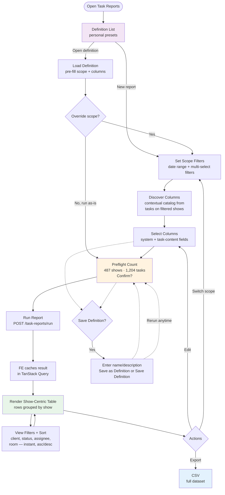
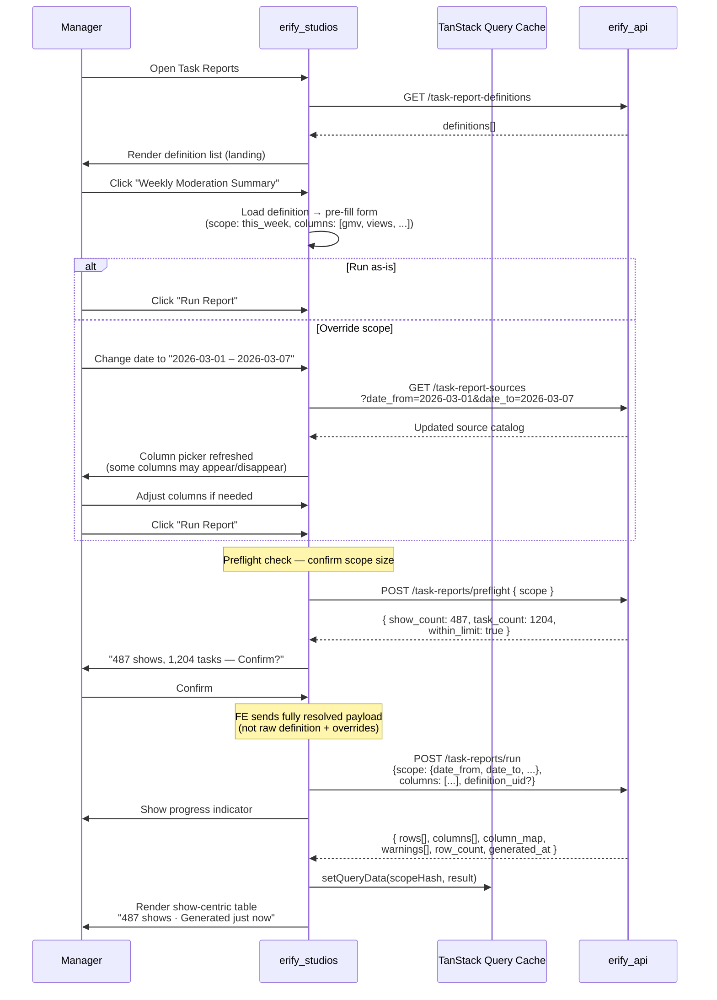
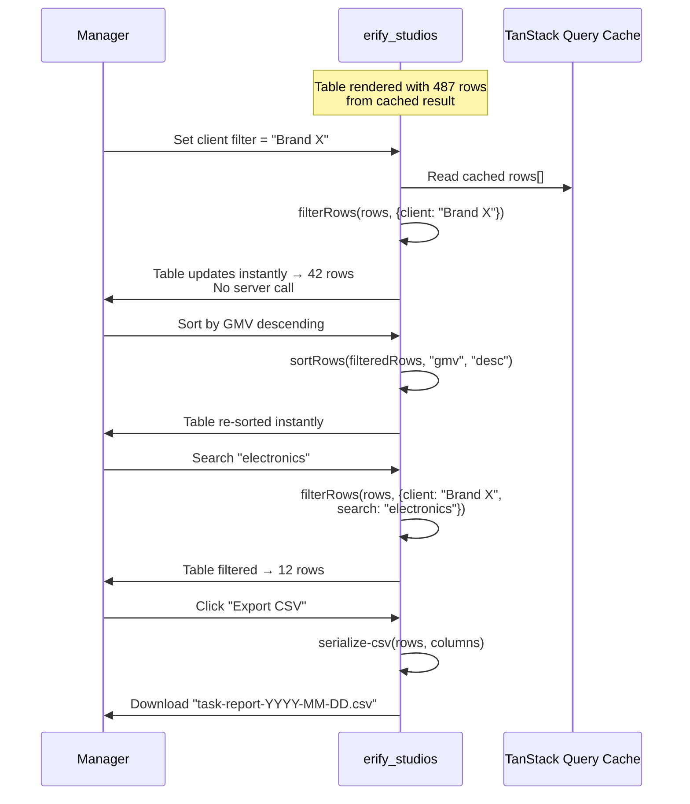
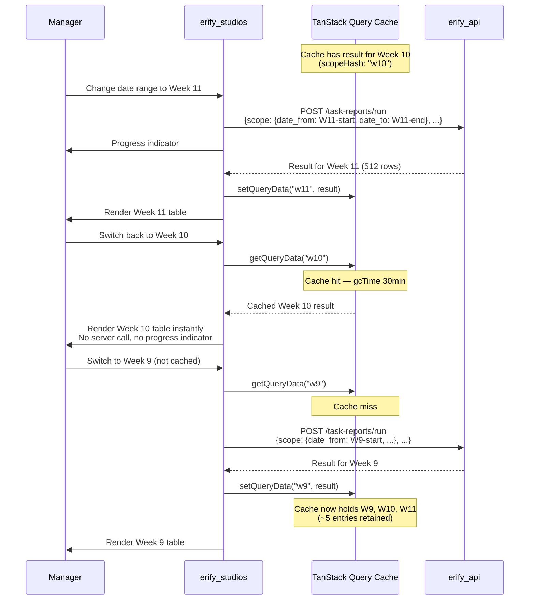

# Task Submission Reporting & Export — Frontend Design

> **TLDR**: Add a studio-scoped report-builder page with a show-first workflow: managers filter shows, discover contextual task columns, select columns, generate a flat table JSON (returned inline), then cache the result and apply client-side view filters, sorting, and CSV export.

## 1. Purpose

Provide a **management and oversight workflow** that sits between the current per-task review queue and a future warehouse/reporting stack. This replaces the moderation team's current Google Sheets workflow where they manually input data and use filter views to review shows by time range.

This tool is for **managers and admins** — not for junior moderators or operators. Operators submit tasks through existing mobile/desktop workflows and do not interact with the report builder.

Primary user outcomes:

1. summarize shared moderation KPIs (GMV, views, conversion) across many shows and brands,
2. review premium-show post-production URLs for QC,
3. slice and sort the generated table by client, status, or any column — all client-side,
4. export a reusable spreadsheet — no CSV files are generated or stored server-side.

> **Design principle: strong semantics, flexible operations.** The FE surfaces a semantic standardization layer — shared fields with fixed keys, types, and categories that merge across templates — while keeping custom fields template-scoped. This gives managers clean cross-template columns for KPIs, QC evidence, and compliance indicators without constraining how templates are designed or how operators submit data. See PRD [Design Principles](../../../../docs/prd/task-submission-reporting.md#design-principles).

## 2. Scope

In scope:

1. studio-scoped report builder UI with show-first workflow
2. scope filter controls with one date-range picker and compoundable multi-selects (`client`, `show standard`, `show type`, `submitted statuses`, `source templates`) plus `Reset all filters`
3. contextual column discovery and selection
4. server-side generation trigger with inline result response
5. flat table rendering with strict one-row-per-show (rows[] ready to display — no client-side merge)
6. client-side view filters (client, status, assignee, room, search) shown only when matching row metadata exists, plus a `Clear view filters` utility and simple asc/desc column sort on the cached dataset
7. TanStack Query cache for last N generated datasets (instant switching), plus a builder affordance to reopen the last cached result for the same scope + columns
8. client-side CSV export from cached JSON (full dataset, one flat file)
9. saved definitions as the landing view (personal presets) with explicit builder save actions (`Save as Definition` / `Save Definition`)

Out of scope:

1. scheduled emails / recurring exports
2. cross-studio reporting
3. BI dashboards / pivot-table builder
4. offline task editing changes to existing execution flows
5. server-side result storage (generation is fast, FE caches)
6. XLSX export (candidate for a later phase)

## 3. Recommended Route Shape

Use split routes for single-purpose UX:

- Viewer/landing: `/studios/$studioId/task-reports`
- Builder/run workspace: `/studios/$studioId/task-reports/builder`

Rationale:

- keeps feature studio-scoped,
- removes in-page mode toggles and context switching,
- makes definitions-first navigation explicit (viewer -> builder),
- keeps report result flow (preflight -> run -> table/export) contained in builder route.

## 4. Primary Studio-Manager Flow



Steps:

1. Open `Task Reports` — lands on the **definition list** (personal presets)
2. Open an existing definition (pre-fills scope + columns) or start new
3. **Set scope filters** — one required date-range picker plus compoundable multi-select filters (`client`, `show standard`, `show type`, `submitted statuses`, `source templates`). These determine what data the BE generates. `date_from` + `date_to` are **mandatory** for source discovery, preflight, and run. `Reset all filters` restores defaults.
4. **Discover columns** — BE returns contextual catalog from tasks on filtered shows
5. **Select columns** — defines the target table schema
6. **Save definition** (optional) — enter definition name/description and save via `Save as Definition` (new) or `Save Definition` (existing)
7. **Preflight check** — FE calls `POST /task-reports/preflight` and shows scope summary: *"487 shows, 1,204 tasks"*. Over-limit scopes are blocked when either show-count (row volume) or task-count exceeds the limit. Run is enabled only after a successful preflight.
8. **Run report** — BE generates show-centric table, returns full JSON inline
9. **FE caches** the result in TanStack Query (last N datasets cached) and surfaces a "View cached result" affordance when scope + columns match
10. **Review table** — strictly one row per show, all columns pre-merged by BE. Duplicates resolved by latest-wins; multi-target tasks merge into each show's row.
11. **Apply view filters** — client, status, assignee, room, search — all instant, no server call. Filters read hidden row metadata returned by the BE, so they still work even if those values are not visible columns. Assignee filtering supports multi-assignee rows. Filters only appear when values exist; `Clear view filters` resets them.
12. **Export** — CSV from the full dataset (view filters do not affect export)
13. **Edit** — go back to scope/column selection with state preserved

## Critical Flow Sequences

### Flow 1: Definition load → override → run



### Flow 2: Client-side view filters → export



### Flow 3: Cache switching between scopes



## 5. UX Structure

### 5.1 Page sections

Recommended route decomposition:

1. `task-reports/index.tsx` — viewer route (definitions landing)
2. `task-reports/builder.tsx` — builder route (scope + columns + preflight/run + result)
3. `task-report-definitions-viewer.tsx` — definition list actions
4. `report-scope-filters.tsx` — scope filter controls (single date-range picker, compoundable multi-selects for client/show standard/show type/statuses/source templates, reset utility)
5. `report-column-picker.tsx` — contextual column selection from discovered catalog
6. `report-result-table.tsx` — flat table display with view filter toolbar
7. `report-view-filters.tsx` — client-side filter controls (client, status, room, sort, search)

This route will exceed 200 LOC quickly; keep container/orchestration separate from table/export sections.

### 5.1.1 Extraction-ready file layout

Per the `package-extraction-strategy` skill, isolate pure logic into a `lib/` subdirectory with zero framework imports:

```
src/features/task-reports/
  ├── api/                               # TanStack Query hooks (React-coupled)
  ├── components/                        # UI components (React-coupled)
  ├── hooks/                             # React hooks (React-coupled)
  └── lib/                               # PORTABLE: pure functions only
      ├── filter-rows.ts                 # Client-side view filter logic
      ├── sort-rows.ts                   # Client-side column sort
      └── serialize-csv.ts               # CSV export serializer
```

`lib/` files must not import React, TanStack, or any app-specific module. They take result JSON as input and return plain objects/strings.

### 5.2 Column picker UX

The column picker appears **after** scope filters are set. It shows only columns from the contextual catalog — templates/snapshots that actually have submitted tasks on the filtered shows. Users do not manually pick `show_ids`; show scope is derived by filters.

Three column categories — reflecting the semantic boundary between standardized reporting fields and template-specific data:

1. **System columns** (always available): show id, show name, show external id, client name, start/end time, show standard, show type, room
2. **Shared fields** (canonical reporting vocabulary, merged across templates): fields marked `standard: true` in the template schema. These have fixed keys, types, and categories managed by studio ADMINs — the semantic standardization layer for cross-template reporting. They appear sub-grouped by category (`Metrics`, `Evidence`, `Status`) regardless of which template they come from (e.g., one `GMV` column, not 30 template-specific `GMV` columns). This is a small set (5–15 fields) managed in studio settings (§5.4).
3. **Custom fields** (template-scoped, never merged): all other fields, grouped by source template. Each template group shows its own custom fields. These are the majority of fields in any template and remain fully under each template author's control.

The column picker should render shared fields first (as a "Shared Fields" group, sub-grouped by category: Metrics / Evidence / Status), then custom fields grouped by template.
Selected columns are summarized in-order with move up/down and remove controls; this order is preserved in the result table and CSV export.

Shared fields are managed by studio ADMINs in studio settings (see §5.4). Keys, types, and categories are immutable once created. ADMINs and MANAGERs select shared fields when building templates. In the report builder, shared fields appear as merged columns sub-grouped by category — managers don't need to manage them here.

**User-facing explanation**: The "Shared Fields" group header should include a brief description: *"These fields are shared across all templates — selecting one includes data from every template that collects it."* Each category sub-group should have a subtitle: Metrics — *"Numeric KPIs"*, Evidence — *"Proof artifacts"*, Status — *"Compliance indicators"*. Custom field groups should show: *"These fields are specific to [template name]."* This helps managers understand why GMV appears once (shared field) while template-specific notes appear per-template (custom).

Each template group should show:

- template name
- task type
- submitted task count in the contextual catalog
- selected field count

Shared fields show:

- field label, key, and type (category grouping stays visible)

Incompatible source groups (different template schemas) are surfaced early so managers know export may split. Shared fields never cause splits — they merge by design.

#### High-density behavior (large scoped datasets)

When scope includes many client-dedicated moderation templates (for example 30+ brands with loop-heavy schemas), column discovery must reduce noise by default:

1. **Scope telemetry strip** before field list:
   - templates in scope
   - submitted tasks in scope
   - custom/shared field option counts
2. **Noise controls**:
   - search input across template name + field label/key/type
   - `Selected only` toggle
   - `Templates with selection` toggle
3. **Template-group collapse strategy**:
   - if template count > 10, groups are collapsed by default
   - highest submitted-task templates are expanded initially
   - explicit `Expand all templates` / `Collapse all templates` actions
4. **Large-scope hint**:
   - informational banner clarifies that groups are collapsed intentionally and recommends search/selected-only for faster narrowing
5. **Shared field discoverability is preserved**:
   - shared fields stay in a dedicated section grouped by category (Metrics/Evidence/Status), independent of template collapse state

**Column limit**: The picker enforces the 50-column hard cap. Show a live counter ("{n} of 50 selected") and disable further selection when the cap is reached. At 30+ columns, show a soft warning about table readability (see §5.3.1).

### 5.3 Result table

The result table renders `rows[]` directly — strictly **one row per show**, with all selected columns merged in. Custom fields from different templates appear as separate columns on the same row. The row count always equals the show count.

Each row also carries hidden filter metadata for the toolbar: `client_id`, `client_name`, `show_status_id`, `show_status_name`, `studio_room_id`, `studio_room_name`, `assignee_ids`, and `assignee_names`. When there is exactly one unique assignee in the merged row, the BE also returns scalar `assignee_id` and `assignee_name` for backward-compatible consumers.

**Table header**: display `row_count` and `generated_at`. E.g., "487 shows · Generated 2 min ago". This gives immediate confidence that the scope is correct.

**View filter toolbar**: positioned above the table. Controls for:
- client dropdown/search
- show status filter
- assignee filter
- studio room filter
- text search across all visible columns
- column sort (click column header to toggle asc/desc)
- `Clear view filters` action

Filters appear only when matching values exist in the dataset. All view filters are applied client-side on the cached `rows[]` using this hidden metadata, and the table re-renders instantly.

**Default sort order**: The BE returns rows sorted by `show.startTime DESC` (most-recent shows first). This is the initial display order.

**Sorting is simple FE-side asc/desc.** The manager clicks any column header to toggle ascending/descending sort on the cached data. No multi-column sort, no server round-trip. This is intentionally minimal — the cached dataset is small enough for instant in-memory sorting.

**BE vs FE responsibility boundary**:

| Concern | Owner | Notes |
|---------|-------|-------|
| Row order in API response | BE | `show.startTime DESC` — deterministic, stable |
| Column sort (click header) | FE | Simple asc/desc toggle on cached `rows[]` |
| View filters (client, status, etc.) | FE | Filters cached `rows[]` in memory |
| Scope filters (date, show type, etc.) | BE | Triggers re-generation |
| Text search | FE | Searches across cached row values |
| Export row order | FE | Matches current sort; export always includes the full dataset |

**Cell rendering**:
- `null` values rendered as blank cells (not zero — missing data must be visually distinct)
- `url` and `file` values render as clickable links in the table (plain URLs in export)
- `date` and `datetime` values render in a human-readable format in the table
- file/url fields as clickable links
- numeric fields right-aligned
- multiselect fields as comma-separated tags

> **Numeric summaries deferred**: A footer summary strip (row count, sum, average for numeric columns) is a natural UX enhancement but is deferred from MVP. The cached result contains raw row data — the FE can compute summaries client-side when this becomes a product requirement. See [docs/ideation/task-analytics-summaries.md](../../../../docs/ideation/task-analytics-summaries.md).

### 5.3.1 Wide-table constraints and UX

The table can have up to 50 columns (BE hard cap). In practice, tables with 20+ columns are difficult to read on screen. Since the **primary deliverable is the exported spreadsheet** (managers do further analysis in Excel/Sheets), the table UI is for spot-checking — not for reading every cell.

**Hard constraint:**
- **50-column hard cap** — enforced at both FE (column picker disables further selection) and BE (validation rejects > 50). This bounds response size and prevents abuse.

**UX patterns for wide tables (implement progressively):**

| Pattern | Priority | Description |
|---------|----------|-------------|
| **Frozen system columns** | MVP | Pin the first 2–3 system columns (show name, client, start time) so they remain visible during horizontal scroll. Standard in spreadsheet tools. |
| **Horizontal virtual scroll** | MVP | Virtualize columns — only render visible columns in the DOM. Prevents layout thrashing with 30+ columns. Use `@tanstack/react-virtual` (already evaluated for row virtualization). |
| **Column group headers** | MVP | Group columns by category (System, Shared Fields — Metrics / Evidence / Status, Custom — by template). Collapsible groups are deferred but group headers provide orientation. |
| **Column count indicator** | MVP | Show "{n} of 50 columns selected" in the column picker and a "{n} columns" badge on the table. Helps managers understand table width before generating. |
| **Soft warning at 30+** | MVP | When the manager selects > 30 columns, show an informational note: *"Wide tables are best reviewed in the exported spreadsheet. The table preview may require horizontal scrolling."* Not blocking — just guidance. |
| **Column visibility toggles** | FE-2 | Let managers hide/show columns in the table view without changing the export. The current UI shows all selected columns. |
| **Column pinning** | FE-2 | Let managers pin additional columns beyond the default frozen ones. |
| **Collapsible column groups** | FE-2 | Collapse custom field groups to one summary column in the table; expand to see all. Export always includes expanded columns. |

**Key design decision: table display columns vs. export columns.** The column picker defines what goes in the *export*. The table displays all selected columns by default; column visibility toggles are a future enhancement (FE-2). This separates the "review" concern (I want to see 10 key columns) from the "export" concern (I want all 35 columns in my spreadsheet).

**Why 50, not lower?** Managers export for Excel analysis where 50 columns is comfortable with freeze panes. A lower cap (e.g., 30) would force managers to run multiple reports and merge them — worse UX than a wide table. The soft warning at 30 guides managers who care about table readability; the hard cap at 50 protects system resources.

### 5.4 Shared fields settings (ADMIN only)

Shared fields are managed in **studio settings**, not in the report builder. This is a separate page/section accessible to studio ADMINs only. Shared fields define the canonical reporting vocabulary — a small set of fields (5–15) with fixed keys, types, and categories that merge across templates for cross-template analysis. They are studio-scoped for now (one studio in operation), with room for future multi-studio divergence or sharing.

**UI:** A list view in studio settings, organized by category sub-groups (`Metrics`, `Evidence`, `Status`):
- Shows all shared fields (key, type, category, label, active/inactive status), grouped by category
- **Add** button → form with key (snake_case, validated), type (dropdown), category (dropdown: metric/evidence/status), label, description. Key, type, and category become immutable after creation.
- **Edit** → only label and description can be changed. Key, type, and category fields are read-only with a lock icon and tooltip: *"Key, type, and category cannot be changed after creation."* Clearing a description is supported by saving it as blank.
- **Deactivate** → toggle `is_active`. Deactivated fields are hidden from the template editor picker but the key remains reserved (shown as "Inactive" in the settings list).
- No delete action — keys are reserved forever.
- After create/update/deactivate, shared-fields query cache is invalidated so template builder pages see latest options immediately.
- Template builder supports repeated insertion for moderation loops by generating loop-scoped unique keys. Canonical shared semantics (`standard: true`) apply only when the inserted key exactly matches the shared-field key.

**Category sub-grouping:** The settings list groups fields by category with clear section headers:
- **Metrics** — numeric KPIs (GMV, views, orders, etc.)
- **Evidence** — proof artifacts (QC images, proof URLs, etc.)
- **Status** — compliance/readiness indicators (QC ready, post-production complete, etc.)

This grouping mirrors how shared fields appear in the column picker (§5.2), providing consistency across the settings and report builder UIs.

**Why in settings, not in the report builder:** The report builder is for managers reviewing data. Shared field management affects template design and data structure — it belongs in studio configuration, accessible only to ADMINs.

**Template builder availability contract (create/edit pages):**
- On mount, template create/edit pages revalidate `GET /studios/:studioId/settings/shared-fields` (do not rely on stale in-memory cache only).
- If the request fails, show a visible warning banner: shared-field insertion is unavailable, but manual custom-field authoring remains available.
- Shared-field insertion picker renders active fields only (`is_active: true`).

**File locations (current implementation):**
- Settings UI: `src/features/studio-shared-fields/components/studio-shared-fields-settings.tsx`
- Settings route: `src/routes/studios/$studioId/settings/shared-fields.tsx`
- Template builder consumption: `src/routes/studios/$studioId/task-templates/new.tsx` and `src/routes/studios/$studioId/task-templates/$templateId.tsx`

### 5.5 Export UX

Export always produces **one flat file** — a single CSV with all columns. No multi-file splitting, no multi-sheet partitioning. All columns (system + shared fields + custom fields from any number of templates) appear in a single table.

Export options:
- **Export CSV** — exports the full dataset (all rows, ignoring view filters; preserves current sort)

Column headers in the export should include template origin for custom fields (e.g., "Notes (Brand X Template)") so the manager can distinguish same-named custom fields from different templates.

## 6. State Management Plan

### State Layer Architecture

```mermaid
graph TB
    subgraph "URL State (shareable)"
        URL[Route Search Params<br/>date_from, date_to,<br/>client_id[], show_standard_id[], show_type_id[],<br/>submitted_statuses[], source_templates[], definition_id]
    end

    subgraph "Server State (TanStack Query)"
        SRC[Contextual Source Catalog<br/>templates + snapshots + field catalogs<br/>scoped to filtered shows]
        DEF[Saved Definitions<br/>list + detail]
        RES[Generated Results<br/>last N cached datasets<br/>keyed by scope hash]
    end

    subgraph "Local Component State"
        DRAFT[Draft Configuration<br/>selected columns,<br/>export format, column ordering]
        VFILT[View Filters<br/>client, status, assignee,<br/>room, sort, search]
    end

    URL -->|scope filters drive| SRC
    URL -->|scope drives| RES
    SRC -->|populates| DRAFT
    DEF -->|restores| DRAFT
    DRAFT -->|configures run request| RES
    RES -->|displayed through| VFILT
```

### 6.1 Server state

Use TanStack Query for:

- **contextual source catalog** — `useQuery` (re-fetches when scope filters change)
- saved definition list/detail — `useQuery`
- mutation endpoints for definition CRUD — `useMutation`
- report generation — `useMutation` (returns full result JSON inline)

The generation mutation caches the result in a query key so it can be re-accessed without re-fetching:

```typescript
// Source catalog — contextual to scope filters
const sourceCatalogQuery = useQuery({
  queryKey: taskReportSourceKeys.list(studioId, {
    dateFrom,
    dateTo,
    clientIds,
    showStandardIds,
    showTypeIds,
    submittedStatuses,
    sourceTemplateIds,
  }),
  queryFn: () => getTaskReportSources(studioId, {
    date_from: dateFrom,
    date_to: dateTo,
    client_id: clientIds,
    show_standard_id: showStandardIds,
    show_type_id: showTypeIds,
    submitted_statuses: submittedStatuses,
    source_templates: sourceTemplateIds,
  }),
  // Date range is required for source discovery to avoid unbounded scans.
  enabled: hasRequiredDateRange,
});

// Preflight count — lightweight scope validation before generation
const preflightMutation = useMutation({
  mutationFn: (payload: PreflightPayload) =>
    preflightTaskReport(studioId, payload),
  // Returns { show_count, task_count, within_limit, limit }
});

// Report generation — returns full result inline
const runReportMutation = useMutation({
  mutationFn: (payload: RunReportPayload) =>
    runTaskReport(studioId, payload),
  onSuccess: (data) => {
    // Cache the result under a scope-derived query key
    queryClient.setQueryData(
      taskReportResultKeys.forScope(studioId, scopeHash),
      data,
    );
  },
});

// Save definition — explicit builder actions
const createDefinitionMutation = useMutation({
  mutationFn: (payload: CreateTaskReportDefinitionInput) =>
    createTaskReportDefinition(studioId, payload),
});

const updateDefinitionMutation = useMutation({
  mutationFn: ({ definitionId, payload }: {
    definitionId: string;
    payload: UpdateTaskReportDefinitionInput;
  }) => updateTaskReportDefinition(studioId, definitionId, payload),
});

// Cached result — read from cache, no re-fetch
const resultQuery = useQuery({
  queryKey: taskReportResultKeys.forScope(studioId, scopeHash),
  queryFn: () => { throw new Error('Should be populated by mutation'); },
  enabled: false,  // never auto-fetches — populated by mutation
});
```

**Cache depth**: Configure TanStack Query's `gcTime` (garbage collection time) to retain the last ~5 result datasets. Default `gcTime` is 5 minutes; increase to 30 minutes for report results. This allows managers to switch between recent scopes (e.g., last week vs this week) without re-generating.

Do not override the app-wide `staleTime: 0` default unless the source catalog is proven static enough to justify it.

### 6.2 URL state

Keep shareable scope filters in the route search schema:

- `date_from`
- `date_to`
- `client_id[]`
- `show_standard_id[]`
- `show_type_id[]`
- `submitted_statuses[]`
- `source_templates[]`
- optional `definition_id`

This preserves back/forward behavior and allows managers to share scope views. A URL with `definition_id` loads the definition's scope + columns.

View filters (client, status, sort) are **not** in the URL — they are ephemeral session state.

### 6.3 Local component state

Use local state for:

**Draft configuration** (pre-run):
- selected columns (from the contextual catalog)
- local export format selection
- UI-only column ordering

**View filters** (post-run):
- client filter
- show status filter
- assignee filter
- studio room filter
- sort column + direction
- search text

Store only stable identifiers in local state where possible (`definitionId`, `columnKey`, `fieldKey`), then derive full objects from query data.

### 6.4 IndexedDB for cross-session persistence (milestone 2)

For MVP, TanStack Query in-memory cache is sufficient. Results are lost on page refresh but re-generation is fast (< 1s).

For milestone 2, optionally persist the last N results in IndexedDB using `idb-keyval`:

- Cache key: `task_report:${studioId}:${scopeHash}`
- On page load, hydrate TanStack Query from IndexedDB
- On generation, write to both TanStack Query and IndexedDB
- LRU eviction: keep last 5 entries per studio

## 7. API Layer Plan

Create dedicated task-report API declarations and query keys:

- `get-task-report-sources.ts` (contextual catalog — accepts scope filters)
- `get-task-report-definitions.ts`
- `create-task-report-definition.ts`
- `update-task-report-definition.ts`
- `delete-task-report-definition.ts`
- `preflight-task-report.ts` (mutation — lightweight count before generation)
- `run-task-report.ts` (mutation — generates and returns full result inline)

Query keys should include studio scope and scope filters for cache isolation.

Example key families:

- `taskReportSourceKeys.list(studioId, scopeFilters)` — invalidates when scope changes
- `taskReportDefinitionKeys.list(studioId)`
- `taskReportDefinitionKeys.detail(studioId, definitionUid)`
- `taskReportResultKeys.forScope(studioId, scopeHash)` — cached result per scope

## 8. Client Data Model

### Result-to-Display Data Flow

```mermaid
graph LR
    subgraph "Generated Result (inline response)"
        ROWS[rows[]<br/>show-centric objects<br/>strictly one per show]
        COLS[columns[]<br/>ordered descriptors<br/>with source metadata]
        CMAP[column_map<br/>display grouping only<br/>template origin metadata]
        WARN[warnings[]<br/>version conflicts,<br/>duplicate flags]
    end

    subgraph "TanStack Query Cache"
        CACHE[(Cached Result<br/>keyed by scope hash<br/>last N retained)]
    end

    subgraph "View Filter Layer (client-side)"
        FILT[filter-rows<br/>client, status,<br/>assignee, room, search]
        SORT[sort-rows<br/>any column asc/desc]
    end

    subgraph "Display"
        TABLE[Flat Table<br/>filtered + sorted rows<br/>columns as headers]
        META[Result Metadata<br/>row count, generated_at]
        BADGES[Warning Badges<br/>duplicates, missing data]
    end

    subgraph "Export (lib/)"
        CSV_S[serialize-csv<br/>one flat file<br/>all columns]
    end

    ROWS --> CACHE
    COLS --> CACHE
    CACHE --> FILT
    FILT --> SORT
    SORT --> TABLE
    COLS --> TABLE
    WARN --> BADGES
    CACHE --> CSV_S
    CMAP --> CSV_S
```

The frontend treats the generated result as a **cached dataset for client-side exploration**:

- `rows[]` — strictly one row per show, keyed by column identifiers — all task data merged into a single flat row, plus hidden metadata for client/status/room/assignee view filters
- `columns[]` — ordered column descriptors (key, label, type, source metadata)
- `column_map` — maps each column to its source `template_uid` for display grouping (not export splitting — export is always one flat file)
- `warnings[]` — version conflicts, duplicate-source flags

Client responsibilities:

1. cache the result in TanStack Query (retain last N datasets)
2. render `rows[]` as table rows (one per show) and `columns[]` as table headers
3. apply view filters (client, status, assignee, room, search) on the cached `rows[]`
4. apply simple asc/desc column sort on the filtered rows
5. export all columns into one flat CSV file — `column_map` is for display grouping, not export splitting
6. surface warning summaries from `warnings[]` alongside the result table
7. display result metadata (`row_count` = show count, `generated_at`)

**Key simplification**: The FE receives a complete flat table (one row per show) and focuses on **exploration** (filter, sort, search) and **export** (one flat file). No merge step, no multi-file export, no pagination, no server round-trips for view changes.

## 9. Export Implementation Strategy

### 9.1 CSV

CSV can be implemented with a small local serializer.

Rules:

- always produce **one CSV file** — all columns in a single flat table
- flatten arrays (`multiselect`) into semicolon-space (`; `) — standard CSV convention to avoid conflict with the comma delimiter
- export file/url fields as URL strings
- preserve empty string vs `null` distinctions consistently
- include system columns first, then shared fields (grouped by category: Metrics / Evidence / Status), then custom fields (grouped by template)
- custom field column headers include template name for disambiguation (e.g., "Notes (Brand X)")
- export always includes the full dataset (view filters do not affect export)

### 9.2 XLSX (future)

XLSX export is deferred. If/when it ships, add a browser-side workbook library.

**Library candidates** (evaluate before implementation):

| Library | Size (gzip) | License | Notes |
|---------|-------------|---------|-------|
| ExcelJS | ~300KB | MIT | Streaming support, MIT license, active maintenance |
| SheetJS (xlsx) | ~500KB | Apache-2.0 (community) | Full-featured, dual-licensed (community vs pro) |

**Recommendation**: Start with ExcelJS for MIT licensing and smaller bundle. Only consider SheetJS if ExcelJS lacks a needed capability (e.g. advanced formatting).

Preferred approach:

- lazy-load the dependency from the export action via dynamic `import()`,
- generate **one sheet** with all columns — no multi-sheet splitting,
- reuse the exact same normalized rows used by CSV.

Why lazy-load:

- no current workbook library exists in `erify_studios`,
- export is an infrequent manager action,
- avoids inflating the initial route bundle.

### 9.3 Export serialization with Web Worker (future)

For large datasets (1,000+ rows), CSV serialization can block the main thread. If export performance becomes noticeable, use a Web Worker:

- Transfer the result JSON to a worker via `postMessage` (structured clone).
- Worker runs `serialize-csv` (from `lib/`) and returns the Blob.
- Main thread triggers the download from the Blob.
- Show a progress bar during serialization (the worker can post progress updates).

For current MVP-sized datasets, main-thread CSV serialization is acceptable.

### 9.4 Preflight gating and generation progress

**Preflight step** (before generation):

The manager clicks **Preflight Scope** to call `POST /task-reports/preflight`. The response includes `show_count`, `task_count`, and `within_limit`. The UI shows a summary card:

- *"487 shows, 1,204 tasks — scope ready"* when `within_limit` is true.
- If `within_limit` is `false`: show whether limit breach is from `show_count` or `task_count` and prompt to narrow filters. **Run** remains disabled.

This prevents wasted generation on over-broad filters and gives the manager confidence in scope size before committing.

**Generation progress** (after preflight):

During `POST /task-reports/run`, show a spinner with *"Generating report..."*. Typical generation completes in < 1s, but large scopes (1,000+ shows) may take 2–5s. The progress indicator should:

- appear immediately after clicking **Run**,
- show an indeterminate spinner (the BE does not stream progress for synchronous generation),
- disappear when the response arrives and the table renders.

If async generation is added later (BE milestone 3), the progress indicator can switch to determinate mode using job status polling.

## 10. Link and File Preview Rules

1. URL/file fields render as anchors in the preview table.
2. Image-style URLs may optionally show thumbnail preview on row expand, not inline in dense tables.
3. Export output should remain plain URLs; do not attempt to embed files.
4. If backend later moves to signed URLs, this page must display a warning or refresh links before export.

## 11. Empty, Warning, and Error States

Required states:

1. no definitions yet — show "Create your first report" prompt
2. missing required date range — prompt to set `date_from` + `date_to` before discovery/preflight/run
3. no columns discovered — "No submitted tasks found for the selected shows"
4. no columns selected — disable Run button
5. save definition blocked — show inline/toast guidance when definition name is empty, date range is incomplete, or no compatible columns are selected
6. **preflight over limit** — `within_limit: false` from preflight. Show whether scope exceeds limit by `show_count` or `task_count`, with guidance to narrow filters. Run stays disabled.
7. **preflight summary** — show `show_count` and `task_count` after preflight; run is disabled until preflight succeeds
8. view filters produce zero rows — "No rows match the current filters" with clear-filters action
9. **warning summary** — surface warnings returned by the API in a summary card above the table
10. result generation in progress — show progress indicator
11. result generation failed — show error with scope details and "Retry" button

### 11.1 Warning summary UX

When the API returns warnings (duplicate sources, version conflicts, missing fields), show a summary card above the table with the most recent items and a count of additional warnings. The table remains single-row-per-show; warnings are informational.

## 12. Testing Plan

### 12.1 Unit tests

1. `filter-rows` — client-side filtering by client, status, assignee, room, search
2. `sort-rows` — simple asc/desc column sort with numeric, string, date, null handling
3. `serialize-csv` — escaping, array handling, single-file output, filtered/full export

### 12.2 Component tests

1. definition list as landing view — load, create, delete
2. scope filter controls — required date range, compoundable multi-select filters, and reset utility behavior
3. contextual column picker — shows only columns from discovered catalog, with shared fields sub-grouped by category and custom fields grouped by template
4. column picker enforces 50-column hard cap with live counter; soft warning at 30+
5. save definition actions — `Save as Definition` for new drafts, `Save Definition` for existing definition edits
6. save definition guards — missing name/date-range/compatible columns block save with guidance
7. preflight summary shows `show_count` and `task_count` before generation
8. preflight over-limit state blocks Run and shows guidance
9. result table renders one row per show — `rows[]` length equals show count
10. frozen system columns remain visible during horizontal scroll
11. view filter toolbar — client, status, assignee, room, search all apply instantly
12. column sort — click header toggles simple asc/desc, null values sort last
13. blank cells for `null` values (not zero)
14. file/url cells render clickable links
15. result metadata header shows row count and generated_at
16. export produces one flat file with all columns (no multi-file splitting)
17. generation progress indicator during `runReport` mutation
18. "Edit" action navigates back to builder with state preserved

### 12.3 Integration tests

1. set scope filters → discover columns → select → run → display flat table → apply view filters
2. saved definition pre-fills scope + columns on load
3. re-running with different scope replaces the cached result
4. switching between recently generated datasets (different scope) is instant from cache
5. "Export visible CSV" respects current view filter state
6. "Export full CSV" ignores view filters

## 13. Rollout Recommendation

### Milestone FE-1 (Core workflow + definitions)

1. definition list as landing view (list, create, save, load)
2. scope filter controls with URL state (required date range + compoundable multi-selects for client/show standard/show type/status/source template + reset utility)
3. contextual source catalog fetch (re-fetches when scope filters change)
4. inline column picker from discovered catalog (shared fields sub-grouped by category + custom fields by template) with 50-column hard cap, live counter, and soft warning at 30+
5. frozen system columns (show name, client, start time) + horizontal virtual scroll for wide tables
6. column group headers (System, Shared Fields — Metrics / Evidence / Status, Custom — by template)
7. definition metadata form (name + optional description) and explicit save actions (`Save as Definition` / `Save Definition`)
8. preflight summary before generation (show/task counts, over-limit blocking)
9. "Run Report" action → receive inline result → cache in TanStack Query
10. show-centric table rendering directly from `rows[]` and `columns[]`
11. result metadata header (`row_count`, `generated_at`)
12. client-side view filters (client, status, assignee, room)
13. client-side column sort (simple asc/desc toggle)
14. text search across visible columns
15. warning summary card when `warnings[]` are returned
16. CSV export from cached JSON (one flat file, full dataset)

Rationale: validate the full **definition → filter shows → discover columns → select → preflight → run → review → filter → sort → export** loop. Definitions are included from day one because they are the landing experience and the Google Sheets replacement.

### Milestone FE-2 (Polish + persistence)

1. definition clone and edit
2. date preset selection in definition save (this_week, this_month, custom)
3. XLSX single-sheet export (lazy-loaded ExcelJS)
4. column visibility toggles — hide/show columns in table view without affecting export
5. column pinning — pin additional columns beyond default frozen ones
6. collapsible column groups — collapse custom field groups to summary column in table; export always expanded
7. IndexedDB for cross-session result persistence (last 5 per studio)
8. richer row details / thumbnail preview for QC links
9. stronger compatibility warnings and partition labels
10. role-aware source defaults (e.g. pre-select moderation templates for `MODERATION_MANAGER`)

## 14. Risks and Mitigations

### 14.1 Large result payload

Risk:

- large results (1,000+ rows, 200KB+ JSON) may cause slow rendering or memory pressure.

Mitigation:

- BE enforces a 10,000-row cap — limits maximum result size,
- lazy rendering with virtualized table rows (if result exceeds ~500 rows, consider `@tanstack/react-virtual`),
- view filters reduce the visible row count, improving render performance.

### 14.2 Cache invalidation

Risk:

- cached results become stale if tasks are submitted/approved between runs.

Mitigation:

- submissions change infrequently once completed — the typical use case is reviewing historical data,
- the result metadata shows `generated_at` so the manager knows data freshness,
- re-running is fast (< 1s) — the manager can always refresh.

### 14.3 Wide tables from many templates

Risk:

- if a show has tasks from many different templates, the row may have many columns with most being `null` — a wide, sparse table.

Mitigation:

- the column picker is contextual — only columns from templates with submitted tasks in scope are offered,
- managers can select only the columns they need — they don't have to include all custom fields,
- shared fields merge across templates, keeping the shared KPI columns compact,
- `column_map` metadata groups columns by template for visual clarity in the table header.

### 14.4 Page refresh loses cached results

Risk:

- TanStack Query in-memory cache is lost on page refresh. The manager must re-run.

Mitigation:

- re-generation is fast (< 1s) — acceptable for MVP,
- IndexedDB persistence (milestone 2) eliminates this issue,
- saved definitions preserve the scope + columns — only the "Run" click is needed.

### 14.5 Contextual catalog latency

Risk:

- the source catalog endpoint queries based on scope filters, adding a dependency between filter changes and catalog loading.

Mitigation:

- debounce filter changes before triggering catalog refetch (300ms),
- show a loading skeleton in the column picker while catalog loads,
- `enabled: hasRequiredDateRange` prevents source lookups until a bounded date range is provided.
- Backend contract also enforces required date range for source discovery (`GET /task-report-sources`), preflight, and run.

## 15. Verification Plan

When implemented, verify at minimum:

- `pnpm --filter erify_studios lint`
- `pnpm --filter erify_studios typecheck`
- `pnpm --filter erify_studios test`

For large-scope UX simulation dataset:

- `pnpm --filter erify_api db:seed:report-simulation`
- This seeds 30 client-dedicated moderation templates, 8-loop schemas (20 fields/loop), and >100 submitted tasks per simulation template to stress-test column selection UX.

Manual smoke should cover:

1. open Task Reports → see definition list as landing page
2. create a definition → set scope filters → discover columns → select → save
3. preflight confirmation shows show count and task count before generation
4. over-limit scope → Confirm button disabled with guidance message
5. confirm → run → verify show-centric table renders with row count and generated_at
6. apply client filter → table updates instantly without server call
7. sort by show start time (asc/desc toggle), then by a numeric task-content column
8. text search across show names
9. export one compatible CSV (full dataset)
10. export filtered view CSV (only visible rows)
11. switch to a different scope (different week) → verify preflight + new generation
12. switch back → verify previous result loads from cache instantly
13. refresh page → verify definition loads, re-run needed (MVP behavior)
