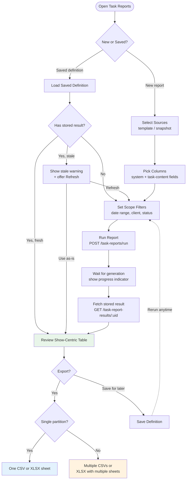
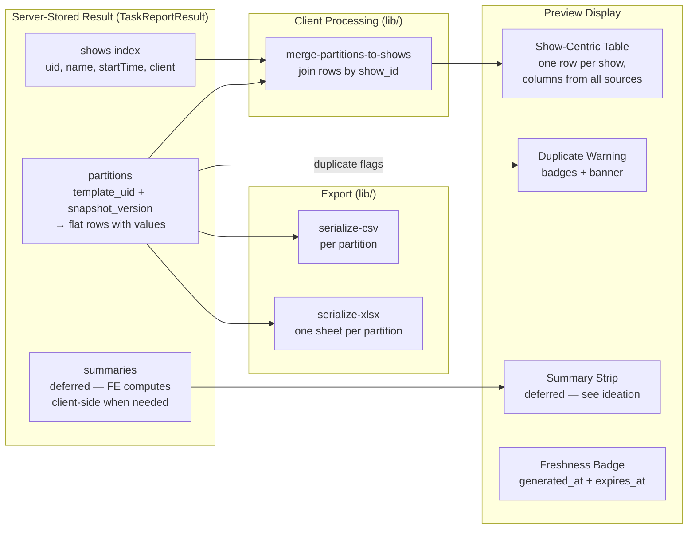

# Task Submission Reporting & Export — Frontend Design

> **TLDR**: Add a studio-scoped report-builder page where managers choose submitted-task sources and columns, trigger server-side result generation, retrieve stored JSON results for cross-device access, review show-centric tables with QC links, and export client-side CSV/XLSX from the stored JSON.

## 1. Purpose

Provide a manager workflow that sits between the current per-task review queue and a future warehouse/reporting stack.

Primary user outcomes:

1. summarize moderation metrics such as GMV and views across many shows,
2. review premium-show post-production URLs for QC,
3. export a reusable spreadsheet from server-stored JSON results — no CSV/XLSX files are generated or stored server-side.

## 2. Scope

In scope:

1. studio-scoped report builder UI
2. source/template/snapshot selection
3. show/task filter controls
4. server-side result generation trigger and retrieval
5. cross-device result access (server-stored JSON, any authenticated device)
6. client-side CSV export from stored JSON
7. client-side XLSX export from stored JSON
8. optional IndexedDB cache for offline speed (not primary persistence)

Out of scope:

1. scheduled emails / recurring exports
2. cross-studio reporting
3. BI dashboards / pivot-table builder
4. offline task editing changes to existing execution flows

## 3. Recommended Route Shape

Add a dedicated manager-facing page:

- `/studios/$studioId/task-reports`

Rationale:

- keeps feature studio-scoped,
- avoids overloading `review-queue`, which is still per-task operational review,
- leaves room for future report categories under the same route.

## 4. Primary Studio-Manager Flow



Steps:

1. Open `Task Reports`
2. Pick a saved definition or start a new report
3. If a saved definition has a stored result: load it instantly (cross-device access). If stale, offer refresh.
4. Select one or more sources (moderation template / snapshot, post-production template / snapshot)
5. Choose fields/columns from the source catalog
6. Set scope filters (show date range, client, task status, assignee / show)
7. Click `Run Report` — triggers server-side result generation
8. Wait for generation to complete (progress indicator), then fetch the stored result
9. Review show-centric table (blank cells for missing, clickable links)
10. Export as CSV or XLSX from the server-stored JSON result

## 5. UX Structure

### 5.1 Page sections

Recommended route decomposition:

1. `task-reports/index.tsx` — route container only
2. `report-definition-panel.tsx` — saved definitions and naming
3. `report-source-builder.tsx` — source selection + column picker
4. `report-scope-filters.tsx` — shareable URL-backed filters
5. `report-workspace-table.tsx` — preview table
6. `report-export-bar.tsx` — CSV/XLSX export actions and cache controls

This route will exceed 200 LOC quickly; keep container/orchestration separate from table/export sections.

### 5.1.1 Extraction-ready file layout

Per the `package-extraction-strategy` skill, isolate pure logic into a `lib/` subdirectory with zero framework imports:

```
src/features/task-reports/
  ├── api/                               # TanStack Query hooks (React-coupled)
  ├── components/                        # UI components (React-coupled)
  ├── hooks/                             # React hooks (React-coupled)
  └── lib/                               # PORTABLE: pure functions only
      ├── merge-partitions-to-shows.ts   # partition → show-centric merge
      ├── serialize-csv.ts               # CSV export serializer
      └── serialize-xlsx.ts              # XLSX export serializer
```

`lib/` files must not import React, TanStack, or any app-specific module. They take stored result JSON as input and return plain objects/strings. This makes future extraction to a shared `@eridu/report-engine` package a file move, not a rewrite. Do not extract until a second consumer (e.g. `erify_creators`) exists.

Note: `definition-hash.ts` is no longer needed — the BE manages result identity and caching. The FE references results by `result_uid`, not a client-computed hash.

### 5.2 Source selection UX

Each source card should show:

- template name
- task type
- snapshot version or "All matched versions"
- submitted task count in current source catalog
- selected field count

Column picker behavior:

- system columns (show name, show start time, client, assignee, task status) are always available,
- task-content columns come from snapshot field catalogs,
- incompatible source groups are surfaced early so managers know export may split.

### 5.3 Preview workspace

The preview table is show-centric.

Each row should be able to display:

- show metadata
- selected metrics from moderation task(s)
- selected QC link/file fields from post-production task(s)
- source-status indicators when a selected task is missing or not yet submitted

> **Numeric summaries deferred**: A footer summary strip (row count, sum, average for numeric columns) is a natural UX enhancement but is deferred from MVP. The stored result contains raw partition data — the FE can compute summaries client-side when this becomes a product requirement. See [docs/ideation/task-analytics-summaries.md](../../../../docs/ideation/task-analytics-summaries.md).

### 5.4 Export UX

Export controls should make partition behavior explicit:

- single compatible group -> one CSV or one XLSX sheet
- multiple groups -> multiple CSV downloads or one XLSX workbook with multiple sheets

Do not hide version splits. Managers need to know when outputs were separated because snapshot schemas differ.

## 6. State Management Plan

### State Layer Architecture

```mermaid
graph TB
    subgraph "URL State (shareable)"
        URL[Route Search Params<br/>date_from, date_to, client_id,<br/>task_status[], definition_id,<br/>result_id]
    end

    subgraph "Server State (TanStack Query)"
        SRC[Source Catalog<br/>templates + snapshots + field catalogs]
        DEF[Saved Definitions<br/>list + detail + latest result_uid]
        RES[Stored Result<br/>shows[] + partitions[]]
    end

    subgraph "Local Component State"
        DRAFT[Draft Configuration<br/>selected sources, columns,<br/>export format, column ordering]
    end

    subgraph "IndexedDB (optional speed cache)"
        IDB[(Result Cache<br/>result_uid → stored JSON)]
    end

    URL -->|drives| RES
    SRC -->|populates| DRAFT
    DEF -->|restores| DRAFT
    DEF -->|provides result_uid| RES
    DRAFT -->|configures run request| RES
    RES -->|optional cache| IDB
    IDB -->|fast restore| RES
```

### 6.1 Server state

Use TanStack Query for:

- source catalog — `useQuery`
- saved definition list/detail — `useQuery`
- mutation endpoints for definition CRUD — `useMutation`
- report generation — `useMutation` (triggers `POST /task-reports/run`, returns `result_uid`)
- result retrieval — `useQuery` (fetches stored JSON from `GET /task-report-results/:resultUid`)

The report workflow uses a **two-step mutation + query** pattern, not `useInfiniteQuery`:

```typescript
// Step 1: Trigger result generation
const runReportMutation = useMutation({
  mutationFn: (payload: RunReportPayload) =>
    runTaskReport(studioId, payload),
  onSuccess: (data) => {
    // Navigate to result view with the new result_uid
    navigate({
      to: '/studios/$studioId/task-reports',
      params: { studioId },
      search: { result_id: data.result_uid },
    });
  },
});

// Step 2: Retrieve stored result
const resultQuery = useQuery({
  queryKey: taskReportResultKeys.detail(studioId, resultUid),
  queryFn: () => getTaskReportResult(studioId, resultUid),
  enabled: !!resultUid,
});
```

**Why not `useInfiniteQuery`**: The BE generates the complete result server-side and stores it as JSONB. The FE fetches the stored result in one request — no page accumulation needed. This eliminates the "Load More" UX complexity and enables cross-device access.

Do not override the app-wide `staleTime: 0` default unless the source catalog is proven static enough to justify it.

### 6.2 URL state

Keep shareable scope filters and result reference in the route search schema:

- `date_from`
- `date_to`
- `client_id`
- `task_status[]`
- optional `definition_id`
- optional `result_id` (points to the active result for display)

This preserves back/forward behavior and allows managers to share report views. A URL with `result_id` is a direct link to a stored result — usable on any device.

> **Shared-link breakage**: Re-running a report soft-deletes the previous result. If a manager shared a URL containing a now-deleted `result_id`, the API returns 410 Gone. The FE must handle this gracefully: detect the 410, strip `result_id` from the URL, navigate to the definition view (using `definition_id` if present), and show a prompt to re-run. Do not surface a raw error page.

### 6.3 Local component state

Use local state for in-progress draft configuration only:

- selected sources
- selected columns
- local export format selection
- UI-only column ordering

Store only stable identifiers in local state where possible (`definitionId`, `sourceKey`, `fieldKey`), then derive full objects from query data.

### 6.4 IndexedDB workspace cache (optional)

IndexedDB is **no longer the primary persistence layer**. The server-stored `TaskReportResult` is the source of truth. IndexedDB serves as an optional speed optimization:

1. After fetching a result from the API, cache the full JSON in IndexedDB keyed by `result_uid`.
2. On subsequent visits to the same result, load from IndexedDB first (instant), then validate against `generated_at` from a lightweight API call.
3. If the server result has been refreshed (new `result_uid`), discard the IndexedDB cache and fetch fresh.

Reuse the existing repo pattern of `idb-keyval`.

Suggested cache key:

- `task_report_result:${studioId}:${resultUid}`

Behavior:

1. on successful result fetch, write to IndexedDB
2. on revisit, check IndexedDB first → show instantly with "loaded from cache" badge
3. validate freshness via lightweight metadata check (result `generated_at`)
4. allow manual `Clear Cache`

This is a **milestone 2** concern. For MVP, fetch stored results directly from the API on every visit — the single-row JSONB read is fast enough.

## 7. API Layer Plan

Create dedicated task-report API declarations and query keys, for example:

- `get-task-report-sources.ts`
- `get-task-report-definitions.ts`
- `create-task-report-definition.ts`
- `update-task-report-definition.ts`
- `delete-task-report-definition.ts`
- `run-task-report.ts` (mutation — triggers server-side result generation)
- `get-task-report-result.ts` (query — fetches stored result by UID)
- `get-task-report-results.ts` (query — lists recent results)

Query keys should include studio scope and result UID for cache isolation.

Example key families:

- `taskReportSourceKeys.list(studioId, filters)`
- `taskReportDefinitionKeys.list(studioId)`
- `taskReportDefinitionKeys.detail(studioId, definitionUid)`
- `taskReportResultKeys.detail(studioId, resultUid)`
- `taskReportResultKeys.list(studioId, filters)`

## 8. Client Data Model

### Stored Result-to-Display Data Flow



The frontend treats the stored result as three layers:

1. `shows[]` index
2. `partitions[]` flat rows

Client responsibilities:

1. merge partition rows onto show rows for preview (display concern)
2. keep partition boundaries for export
3. surface duplicate-source warnings when present in the result
6. display freshness metadata (`generated_at`, `expires_at`) and offer refresh when stale
7. handle the (rare) case where a single task appears under multiple shows (multi-target tasks) — each show row is independent

Note: the backend resolves the `TaskTarget` → `Show` join during result generation, so the stored result contains flat `show_id` per row. The frontend does not need to understand the polymorphic target model.

**Key simplification vs FE-heavy approach**: The FE no longer accumulates pages, computes summaries from raw data, or manages cross-page state. It receives a complete, pre-processed result and focuses on display and export serialization.

## 9. Export Implementation Strategy

### 9.1 CSV

CSV can be implemented with a small local serializer.

Rules:

- flatten arrays (`multiselect`) into a deterministic delimiter such as `; `
- export file/url fields as URL strings
- preserve empty string vs `null` distinctions consistently
- include system columns first, then selected task fields

### 9.2 XLSX

Recommend adding a browser-side workbook library only when this route ships.

**Library candidates** (evaluate before implementation):

| Library | Size (gzip) | License | Notes |
|---------|-------------|---------|-------|
| ExcelJS | ~300KB | MIT | Streaming support, MIT license, active maintenance |
| SheetJS (xlsx) | ~500KB | Apache-2.0 (community) | Full-featured, dual-licensed (community vs pro) |

**Recommendation**: Start with ExcelJS for MIT licensing and smaller bundle. Only consider SheetJS if ExcelJS lacks a needed capability (e.g. advanced formatting).

Preferred approach:

- lazy-load the dependency from the export action via dynamic `import()`,
- generate one sheet per partition,
- reuse the exact same normalized rows used by CSV.

Why lazy-load:

- no current workbook library exists in `erify_studios`,
- export is an infrequent manager action,
- avoids inflating the initial route bundle.

## 10. Link and File Preview Rules

1. URL/file fields render as anchors in the preview table.
2. Image-style URLs may optionally show thumbnail preview on row expand, not inline in dense tables.
3. Export output should remain plain URLs; do not attempt to embed files.
4. If backend later moves to signed URLs, this page must display a warning or refresh links before export.

## 11. Empty, Warning, and Error States

Required states:

1. no source selected
2. selected source has no submitted tasks in current scope
3. result available but stale (past `expires_at`) — show warning badge + "Refresh" button
4. multi-partition export warning
5. duplicate-source-on-show warning (see below)
6. result generation in progress — show progress indicator
7. result generation failed — show error with scope details and "Retry" button
8. result too large (matched task count exceeds the studio's configurable cap, default 10,000) — show error clarifying this is a result-size limit (not a date-range restriction) and suggesting scope narrowing (e.g. narrow date range, filter by client or show)
9. saved definition has no result yet — show "Run Report" prompt

### 11.1 Duplicate-source-on-show UX

When the API returns `duplicate_source_on_show = true` for a row:

- display each duplicate as a **separate row** in the preview table,
- show a warning badge (e.g. amber icon) on affected rows with tooltip: "Multiple submissions found for this show and source",
- group duplicate rows visually (e.g. subtle background tint or indentation) so they are distinguishable from separate shows,
- export includes all duplicate rows — do not collapse or merge,
- if any duplicates exist in the workspace, show a summary banner above the table: "N shows have duplicate submissions — review before exporting".

This is a data-hygiene signal: managers should investigate whether duplicates represent legitimate re-assignments or stale tasks that should be cleaned up.

## 12. Testing Plan

### 12.1 Unit tests

1. partition-to-preview merge logic (`merge-partitions-to-shows`)
2. CSV serializer escaping and array handling (`serialize-csv`)
3. XLSX multi-sheet structure (`serialize-xlsx`)

### 12.2 Component tests

1. source selection and field picker interactions
2. preview table renders blank state for missing submissions
3. file/url cells render clickable links
4. export controls reflect single-group vs multi-group behavior
5. freshness badge shows correct state (fresh / stale / no result)
6. stale result shows warning with "Refresh" action
7. generation progress indicator during `runReport` mutation

### 12.3 Integration tests

1. run report → receive result_uid → fetch and display stored result
2. saved definition loads latest stored result on open (cross-device scenario)
3. re-running a report replaces the displayed result with fresh data
4. stale result warning triggers re-generation and displays updated result
5. URL with `result_id` loads the stored result directly (shareable link)

## 13. Rollout Recommendation

### Milestone FE-1 (Core workflow validation)

1. source catalog + inline column picker (no saved definitions yet)
2. scope filters with URL state
3. "Run Report" action → trigger BE generation → fetch and display stored result
4. show-centric preview table with partition merge
5. freshness badge (`generated_at` / `expires_at`)
7. duplicate-source warning badges
8. CSV export from stored JSON

Rationale: validate the core generate → retrieve → review → export loop. No page accumulation, no IndexedDB — the stored result is the single source of truth.

### Milestone FE-2 (Persistence + polish)

1. saved definition panel (list, create, update, delete, rerun) with latest `result_uid` linkage
2. XLSX multi-sheet export (lazy-loaded ExcelJS)
3. optional IndexedDB cache for offline speed (cache stored result by `result_uid`)
4. richer row details / thumbnail preview for QC links
5. stronger compatibility warnings and partition labels
6. role-aware source defaults (e.g. pre-select moderation templates for `MODERATION_MANAGER`)
7. result list view (recent reports across definitions)

## 14. Risks and Mitigations

### 14.1 Large result payload

Risk:

- stored results (100KB–5MB JSON) may cause slow rendering or memory pressure in the browser.

Mitigation:

- BE enforces a 10,000-row cap — limits maximum result size,
- lazy rendering with virtualized table rows (if result exceeds ~500 rows, consider `@tanstack/react-virtual`),
- export serialization operates on the stored JSON directly — no additional in-memory copies needed.

### 14.2 Result staleness

Risk:

- managers may act on stale results (e.g. tasks approved/rejected since the result was generated).

Mitigation:

- prominent freshness badge showing `generated_at` timestamp,
- `expires_at` triggers a visual warning (amber badge) when the result is stale,
- one-click "Refresh" action re-runs the report and replaces the stored result.

### 14.3 Multi-version confusion

Risk:

- managers may not understand why exports split into multiple outputs.

Mitigation:

- label partitions clearly by template + snapshot version,
- explain the split in the export bar before download.

### 14.4 Generation wait time

Risk:

- large reports may take several seconds to generate, leading to perceived unresponsiveness.

Mitigation:

- show a progress indicator during generation (spinner + "Generating report..."),
- for MVP (synchronous generation), typical reports complete in < 3s,
- if BE adds async generation (milestone BE-3), FE polls `GET /task-report-results/:uid` until status transitions to `READY`.

## 15. Verification Plan

When implemented, verify at minimum:

- `pnpm --filter erify_studios lint`
- `pnpm --filter erify_studios typecheck`
- `pnpm --filter erify_studios test`

Manual smoke should cover:

1. build a moderation metrics report by date range + client
2. run report and verify stored result loads correctly
3. open the same report on a different device/browser (cross-device access)
4. verify stale result shows warning and "Refresh" re-generates
5. export one compatible CSV from stored JSON
6. export a multi-partition XLSX workbook
