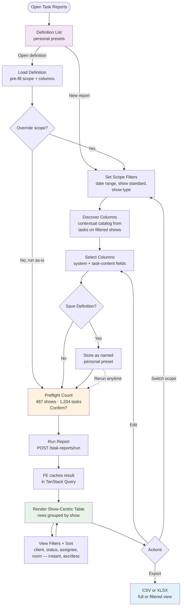
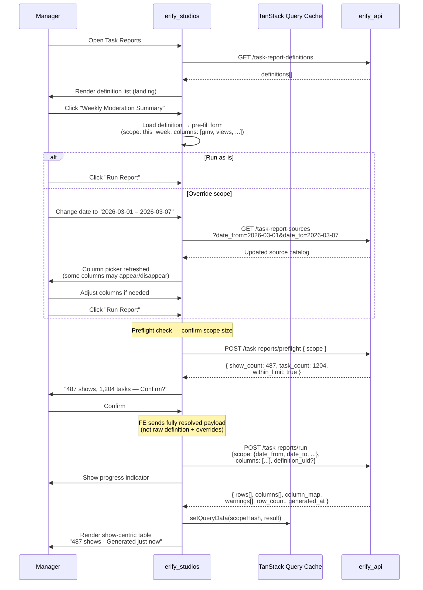
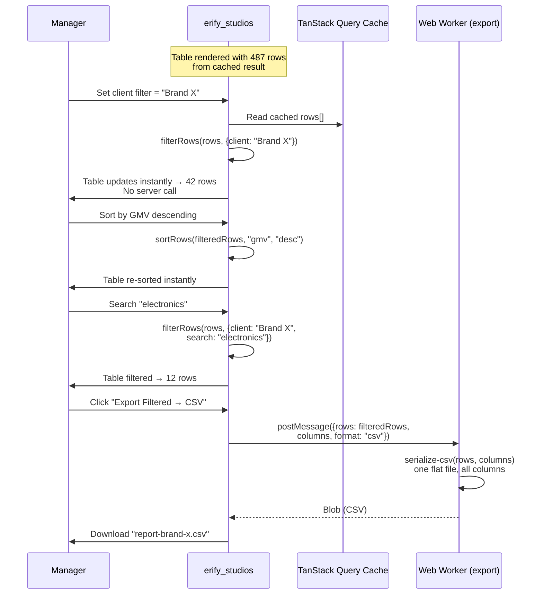
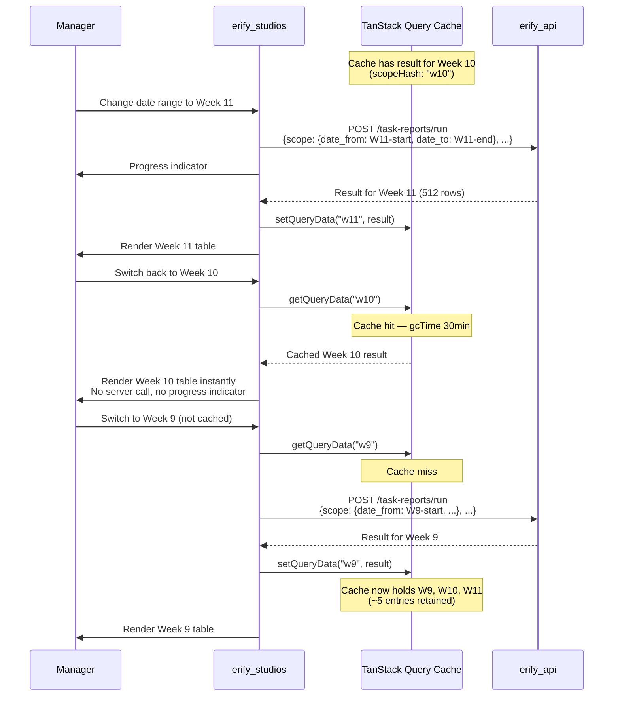
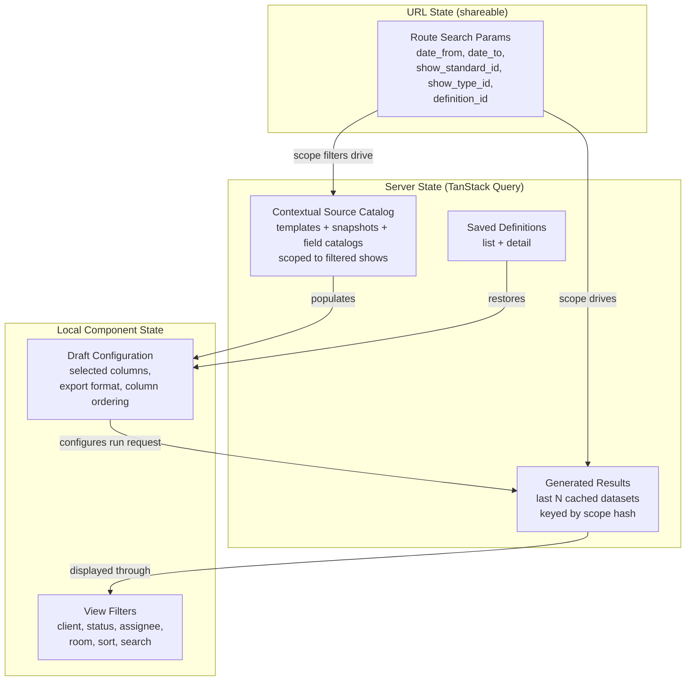

# Task Submission Reporting & Export — Frontend Design

> **TLDR**: Add a studio-scoped report-builder page with a show-first workflow: managers filter shows, discover contextual task columns, select columns, generate a flat table JSON (returned inline), then cache the result and apply client-side view filters, sorting, and CSV/XLSX export.

## 1. Purpose

Provide a **management and oversight workflow** that sits between the current per-task review queue and a future warehouse/reporting stack. This replaces the moderation team's current Google Sheets workflow where they manually input data and use filter views to review shows by time range.

This tool is for **managers and admins** — not for junior moderators or operators. Operators submit tasks through existing mobile/desktop workflows and do not interact with the report builder.

Primary user outcomes:

1. summarize shared moderation KPIs (GMV, views, conversion) across many shows and brands,
2. review premium-show post-production URLs for QC,
3. slice and sort the generated table by client, status, or any column — all client-side,
4. export a reusable spreadsheet — no CSV/XLSX files are generated or stored server-side.

## 2. Scope

In scope:

1. studio-scoped report builder UI with show-first workflow
2. scope filter controls (date range, show standard, show type)
3. contextual column discovery and selection
4. server-side generation trigger with inline result response
5. flat table rendering with strict one-row-per-show (rows[] ready to display — no client-side merge)
6. client-side view filters (client, status, assignee, room, search) and simple asc/desc column sort on the cached dataset
7. TanStack Query cache for last N generated datasets (instant switching)
8. client-side CSV export from cached JSON (one flat file)
9. client-side XLSX export from cached JSON (one sheet)
10. saved definitions as the landing view (personal presets)

Out of scope:

1. scheduled emails / recurring exports
2. cross-studio reporting
3. BI dashboards / pivot-table builder
4. offline task editing changes to existing execution flows
5. server-side result storage (generation is fast, FE caches)

## 3. Recommended Route Shape

Add a dedicated manager-facing page:

- `/studios/$studioId/task-reports`

Rationale:

- keeps feature studio-scoped,
- avoids overloading `review-queue`, which is still per-task operational review,
- leaves room for future report categories under the same route.

## 4. Primary Studio-Manager Flow



Steps:

1. Open `Task Reports` — lands on the **definition list** (personal presets)
2. Open an existing definition (pre-fills scope + columns) or start new
3. **Set scope filters** — date range, show standard, show type. These determine what data the BE generates. At least one required.
4. **Discover columns** — BE returns contextual catalog from tasks on filtered shows
5. **Select columns** — defines the target table schema
6. **Save definition** (optional) — store as named personal preset before running
7. **Preflight check** — FE calls `POST /task-reports/preflight` and shows scope summary: *"487 shows, 1,204 tasks"*. Over-limit scopes are blocked with guidance. Manager confirms before generation.
8. **Run report** — BE generates show-centric table, returns full JSON inline
9. **FE caches** the result in TanStack Query (last N datasets cached)
10. **Review table** — show-centric rows (typically one per show; duplicates/multi-target tasks may expand), all columns pre-merged by BE
11. **Apply view filters** — client, status, assignee, room, search — all instant, no server call. Column sorting is simple asc/desc on any column.
12. **Export** — CSV or XLSX from full or currently filtered view
13. **Edit** — go back to scope/column selection with state preserved

## Critical Flow Sequences

### Flow 1: Definition load → override → run



### Flow 2: Client-side view filters → export



### Flow 3: Cache switching between scopes



## 5. UX Structure

### 5.1 Page sections

Recommended route decomposition:

1. `task-reports/index.tsx` — route container, manages scope vs result view
2. `report-definition-list.tsx` — landing view: saved definitions, create new
3. `report-scope-filters.tsx` — scope filter controls (date range, show standard, show type)
4. `report-column-picker.tsx` — contextual column selection from discovered catalog
5. `report-workspace-table.tsx` — flat table display with view filter toolbar
6. `report-view-filters.tsx` — client-side filter controls (client, status, assignee, room, sort, search)
7. `report-export-bar.tsx` — CSV/XLSX export actions

This route will exceed 200 LOC quickly; keep container/orchestration separate from table/export sections.

### 5.1.1 Extraction-ready file layout

Per the `package-extraction-strategy` skill, isolate pure logic into a `lib/` subdirectory with zero framework imports:

```
src/features/task-reports/
  ├── api/                               # TanStack Query hooks (React-coupled)
  ├── components/                        # UI components (React-coupled)
  ├── hooks/                             # React hooks (React-coupled)
  └── lib/                               # PORTABLE: pure functions only
      ├── filter-rows.ts                 # Client-side view filter logic
      ├── sort-rows.ts                   # Client-side column sort
      ├── serialize-csv.ts               # CSV export serializer
      └── serialize-xlsx.ts              # XLSX export serializer
```

`lib/` files must not import React, TanStack, or any app-specific module. They take result JSON as input and return plain objects/strings.

### 5.2 Column picker UX

The column picker appears **after** scope filters are set. It shows only columns from the contextual catalog — templates/snapshots that actually have submitted tasks on the filtered shows.

Three column categories:

1. **System columns** (always available): show name, show start time, client, assignee, task status, studio room, show standard, show type
2. **Shared metrics** (merged across templates): fields marked `standard: true` in the template schema. These appear as a single group regardless of which template they come from (e.g., one `GMV` column, not 30 template-specific `GMV` columns). This is a small set (5–8 fields) managed by studio ADMINs in settings (§5.4).
3. **Custom fields** (template-scoped): all other fields, grouped by source template. Each template group shows its own custom fields. These are the majority of fields in any template.

The column picker should render shared metrics first (as a "Shared Metrics" group), then custom fields grouped by template.

Shared metrics are managed by studio ADMINs in studio settings (see §5.5). Keys and types are immutable once created. ADMINs and MANAGERs select shared metrics when building templates. In the report builder, shared metrics appear as merged columns — managers don't need to manage them here.

**User-facing explanation**: The "Shared Metrics" group header should include a brief description: *"These KPIs are shared across all templates — selecting one includes data from every template that collects it."* Custom field groups should show: *"These fields are specific to [template name]."* This helps managers understand why GMV appears once (shared metric) while template-specific notes appear per-template (custom).

Each template group should show:

- template name
- task type
- submitted task count in the contextual catalog
- selected field count

Shared metrics show:

- field label and key
- number of templates contributing to this metric
- total submitted task count across all contributing templates

Incompatible source groups (different template schemas) are surfaced early so managers know export may split. Shared metrics never cause splits — they merge by design.

### 5.3 Result table

The result table renders `rows[]` directly — strictly **one row per show**, with all selected columns merged in. Custom fields from different templates appear as separate columns on the same row. The row count always equals the show count.

**Table header**: display `row_count` and `generated_at`. E.g., "487 shows · Generated 2 min ago". This gives immediate confidence that the scope is correct.

**View filter toolbar**: positioned above the table. Controls for:
- client dropdown/search
- show status filter
- assignee filter
- studio room filter
- text search across all visible columns
- column sort (click column header to toggle asc/desc)

All view filters are applied client-side on the cached `rows[]`. The table re-renders instantly.

**Default sort order**: The BE returns rows sorted by `show.startTime DESC` (most-recent shows first). This is the initial display order.

**Sorting is simple FE-side asc/desc.** The manager clicks any column header to toggle ascending/descending sort on the cached data. No multi-column sort, no server round-trip. This is intentionally minimal — the cached dataset is small enough for instant in-memory sorting.

**BE vs FE responsibility boundary**:

| Concern | Owner | Notes |
|---------|-------|-------|
| Row order in API response | BE | `show.startTime DESC` — deterministic, stable |
| Column sort (click header) | FE | Simple asc/desc toggle on cached `rows[]` |
| View filters (client, status, etc.) | FE | Filters cached `rows[]` in memory |
| Scope filters (date, show type, etc.) | BE | Triggers re-generation |
| Text search | FE | Searches across cached row values |
| Export row order | FE | Matches current sort (filtered view) or BE order (full export) |

**Cell rendering**:
- `null` values rendered as blank cells (not zero — missing data must be visually distinct)
- file/url fields as clickable links
- numeric fields right-aligned
- multiselect fields as comma-separated tags

> **Numeric summaries deferred**: A footer summary strip (row count, sum, average for numeric columns) is a natural UX enhancement but is deferred from MVP. The cached result contains raw row data — the FE can compute summaries client-side when this becomes a product requirement. See [docs/ideation/task-analytics-summaries.md](../../../../docs/ideation/task-analytics-summaries.md).

### 5.4 Shared metrics settings (ADMIN only)

Shared metrics are managed in **studio settings**, not in the report builder. This is a separate page/section accessible to studio ADMINs only.

**UI:** A simple list view in studio settings:
- Shows all shared metrics (key, type, label, active/inactive status)
- **Add** button → form with key (snake_case, validated), type (dropdown), label, description. Key and type become immutable after creation.
- **Edit** → only label and description can be changed. Key and type fields are read-only with a lock icon and tooltip: *"Key and type cannot be changed after creation."*
- **Deactivate** → toggle `is_active`. Deactivated metrics are hidden from the template editor picker but the key remains reserved (shown as "Inactive" in the settings list).
- No delete action — keys are reserved forever.

**Why in settings, not in the report builder:** The report builder is for managers reviewing data. Shared metrics management affects template design and data structure — it belongs in studio configuration, accessible only to ADMINs.

**File location:** `src/features/studio-settings/components/SharedMetricsList.tsx` (or within the existing studio settings feature).

### 5.5 Export UX

Export always produces **one flat file** — one CSV or one XLSX sheet with all columns. No multi-file splitting, no multi-sheet partitioning. All columns (system + shared metrics + custom fields from any number of templates) appear in a single table.

Export options:
- **Export all** — exports the full dataset (all rows, ignoring view filters)
- **Export filtered** — exports only the currently visible rows (respects view filters and sort)

Column headers in the export should include template origin for custom fields (e.g., "Notes (Brand X Template)") so the manager can distinguish same-named custom fields from different templates.

## 6. State Management Plan

### State Layer Architecture



### 6.1 Server state

Use TanStack Query for:

- **contextual source catalog** — `useQuery` (re-fetches when scope filters change)
- saved definition list/detail — `useQuery`
- mutation endpoints for definition CRUD — `useMutation`
- report generation — `useMutation` (returns full result JSON inline)

The generation mutation caches the result in a query key so it can be re-accessed without re-fetching:

```typescript
// Source catalog — contextual to scope filters
const sourceCatalogQuery = useQuery({
  queryKey: taskReportSourceKeys.list(studioId, {
    dateFrom, dateTo, showStandardId, showTypeId, submittedStatuses,
  }),
  queryFn: () => getTaskReportSources(studioId, {
    date_from: dateFrom,
    date_to: dateTo,
    show_standard_id: showStandardId,
    show_type_id: showTypeId,
    submitted_statuses: submittedStatuses,
  }),
  enabled: hasAtLeastOneFilter,
});

// Preflight count — lightweight scope validation before generation
const preflightMutation = useMutation({
  mutationFn: (payload: PreflightPayload) =>
    preflightTaskReport(studioId, payload),
  // Returns { show_count, task_count, within_limit, limit }
});

// Report generation — returns full result inline
const runReportMutation = useMutation({
  mutationFn: (payload: RunReportPayload) =>
    runTaskReport(studioId, payload),
  onSuccess: (data) => {
    // Cache the result under a scope-derived query key
    queryClient.setQueryData(
      taskReportResultKeys.forScope(studioId, scopeHash),
      data,
    );
  },
});

// Cached result — read from cache, no re-fetch
const resultQuery = useQuery({
  queryKey: taskReportResultKeys.forScope(studioId, scopeHash),
  queryFn: () => { throw new Error('Should be populated by mutation'); },
  enabled: false,  // never auto-fetches — populated by mutation
});
```

**Cache depth**: Configure TanStack Query's `gcTime` (garbage collection time) to retain the last ~5 result datasets. Default `gcTime` is 5 minutes; increase to 30 minutes for report results. This allows managers to switch between recent scopes (e.g., last week vs this week) without re-generating.

Do not override the app-wide `staleTime: 0` default unless the source catalog is proven static enough to justify it.

### 6.2 URL state

Keep shareable scope filters in the route search schema:

- `date_from`
- `date_to`
- `show_standard_id`
- `show_type_id`
- optional `definition_id`

This preserves back/forward behavior and allows managers to share scope views. A URL with `definition_id` loads the definition's scope + columns.

View filters (client, status, sort) are **not** in the URL — they are ephemeral session state.

### 6.3 Local component state

Use local state for:

**Draft configuration** (pre-run):
- selected columns (from the contextual catalog)
- local export format selection
- UI-only column ordering

**View filters** (post-run):
- client filter
- show status filter
- assignee filter
- studio room filter
- sort column + direction
- search text

Store only stable identifiers in local state where possible (`definitionId`, `columnKey`, `fieldKey`), then derive full objects from query data.

### 6.4 IndexedDB for cross-session persistence (milestone 2)

For MVP, TanStack Query in-memory cache is sufficient. Results are lost on page refresh but re-generation is fast (< 1s).

For milestone 2, optionally persist the last N results in IndexedDB using `idb-keyval`:

- Cache key: `task_report:${studioId}:${scopeHash}`
- On page load, hydrate TanStack Query from IndexedDB
- On generation, write to both TanStack Query and IndexedDB
- LRU eviction: keep last 5 entries per studio

## 7. API Layer Plan

Create dedicated task-report API declarations and query keys:

- `get-task-report-sources.ts` (contextual catalog — accepts scope filters)
- `get-task-report-definitions.ts`
- `create-task-report-definition.ts`
- `update-task-report-definition.ts`
- `delete-task-report-definition.ts`
- `preflight-task-report.ts` (mutation — lightweight count before generation)
- `run-task-report.ts` (mutation — generates and returns full result inline)

Query keys should include studio scope and scope filters for cache isolation.

Example key families:

- `taskReportSourceKeys.list(studioId, scopeFilters)` — invalidates when scope changes
- `taskReportDefinitionKeys.list(studioId)`
- `taskReportDefinitionKeys.detail(studioId, definitionUid)`
- `taskReportResultKeys.forScope(studioId, scopeHash)` — cached result per scope

## 8. Client Data Model

### Result-to-Display Data Flow

```mermaid
graph LR
    subgraph "Generated Result (inline response)"
        ROWS[rows[]<br/>show-centric objects<br/>typically one per show]
        COLS[columns[]<br/>ordered descriptors<br/>with source metadata]
        CMAP[column_map<br/>partition grouping<br/>for export splitting]
        WARN[warnings[]<br/>version conflicts,<br/>duplicate flags]
    end

    subgraph "TanStack Query Cache"
        CACHE[(Cached Result<br/>keyed by scope hash<br/>last N retained)]
    end

    subgraph "View Filter Layer (client-side)"
        FILT[filter-rows<br/>client, status,<br/>assignee, room, search]
        SORT[sort-rows<br/>any column asc/desc]
    end

    subgraph "Display"
        TABLE[Flat Table<br/>filtered + sorted rows<br/>columns as headers]
        META[Result Metadata<br/>row count, generated_at]
        BADGES[Warning Badges<br/>duplicates, missing data]
    end

    subgraph "Export (lib/)"
        CSV_S[serialize-csv<br/>one flat file<br/>all columns]
        XLSX_S[serialize-xlsx<br/>one sheet<br/>all columns]
    end

    ROWS --> CACHE
    COLS --> CACHE
    CACHE --> FILT
    FILT --> SORT
    SORT --> TABLE
    COLS --> TABLE
    WARN --> BADGES
    CACHE --> CSV_S
    CACHE --> XLSX_S
    CMAP --> CSV_S
    CMAP --> XLSX_S
```

The frontend treats the generated result as a **cached dataset for client-side exploration**:

- `rows[]` — strictly one row per show, keyed by column identifiers — all task data merged into a single flat row
- `columns[]` — ordered column descriptors (key, label, type, source metadata)
- `column_map` — maps each column to its source `template_uid` for display grouping (not export splitting — export is always one flat file)
- `warnings[]` — version conflicts, duplicate-source flags

Client responsibilities:

1. cache the result in TanStack Query (retain last N datasets)
2. render `rows[]` as table rows (one per show) and `columns[]` as table headers
3. apply view filters (client, status, assignee, room, search) on the cached `rows[]`
4. apply simple asc/desc column sort on the filtered rows
5. export all columns into one flat file (CSV or single XLSX sheet) — `column_map` is for display grouping, not export splitting
6. surface duplicate-source warning badges on rows where latest-wins conflict resolution was applied
7. display result metadata (`row_count` = show count, `generated_at`)

**Key simplification**: The FE receives a complete flat table (one row per show) and focuses on **exploration** (filter, sort, search) and **export** (one flat file). No merge step, no multi-file export, no pagination, no server round-trips for view changes.

## 9. Export Implementation Strategy

### 9.1 CSV

CSV can be implemented with a small local serializer.

Rules:

- always produce **one CSV file** — all columns in a single flat table
- flatten arrays (`multiselect`) into semicolon-space (`; `) — standard CSV convention to avoid conflict with the comma delimiter
- export file/url fields as URL strings
- preserve empty string vs `null` distinctions consistently
- include system columns first, then shared metrics, then custom fields (grouped by template)
- custom field column headers include template name for disambiguation (e.g., "Notes (Brand X)")
- support "export all" vs "export filtered" modes

### 9.2 XLSX

Recommend adding a browser-side workbook library only when this route ships.

**Library candidates** (evaluate before implementation):

| Library | Size (gzip) | License | Notes |
|---------|-------------|---------|-------|
| ExcelJS | ~300KB | MIT | Streaming support, MIT license, active maintenance |
| SheetJS (xlsx) | ~500KB | Apache-2.0 (community) | Full-featured, dual-licensed (community vs pro) |

**Recommendation**: Start with ExcelJS for MIT licensing and smaller bundle. Only consider SheetJS if ExcelJS lacks a needed capability (e.g. advanced formatting).

Preferred approach:

- lazy-load the dependency from the export action via dynamic `import()`,
- generate **one sheet** with all columns — no multi-sheet splitting,
- reuse the exact same normalized rows used by CSV.

Why lazy-load:

- no current workbook library exists in `erify_studios`,
- export is an infrequent manager action,
- avoids inflating the initial route bundle.

### 9.3 Export serialization with Web Worker

For large datasets (1,000+ rows), CSV and XLSX serialization can block the main thread. Use a Web Worker to run serialization off the main thread:

- Transfer the result JSON to a worker via `postMessage` (structured clone).
- Worker runs `serialize-csv` or `serialize-xlsx` (from `lib/`) and returns the Blob.
- Main thread triggers the download from the Blob.
- Show a progress bar during serialization (the worker can post progress updates).

This follows the same pattern as the existing image compressor in the codebase. For MVP, main-thread serialization is acceptable for typical result sizes (< 500 rows). Add the worker when export performance becomes noticeable.

### 9.4 Preflight confirmation and generation progress

**Preflight step** (before generation):

After the manager clicks "Run Report", the FE calls `POST /task-reports/preflight` with the scope. The response includes `show_count`, `task_count`, and `within_limit`. The FE shows:

- *"487 shows, 1,204 tasks — Generate report?"* with a **Confirm** button.
- If `within_limit` is `false`: *"This scope includes {task_count} tasks, which exceeds the limit of {limit}. Please narrow your scope filters."* — the Confirm button is disabled.

This prevents wasted generation on over-broad filters and gives the manager confidence in scope size before committing.

**Generation progress** (after confirmation):

During `POST /task-reports/run`, show a progress bar or spinner with *"Generating report..."*. Typical generation completes in < 1s, but large scopes (1,000+ shows) may take 2–5s. The progress indicator should:

- appear immediately after confirmation,
- show an indeterminate progress bar (the BE does not stream progress for synchronous generation),
- disappear when the response arrives and the table renders.

If async generation is added later (BE milestone 3), the progress bar can switch to determinate mode using job status polling.

## 10. Link and File Preview Rules

1. URL/file fields render as anchors in the preview table.
2. Image-style URLs may optionally show thumbnail preview on row expand, not inline in dense tables.
3. Export output should remain plain URLs; do not attempt to embed files.
4. If backend later moves to signed URLs, this page must display a warning or refresh links before export.

## 11. Empty, Warning, and Error States

Required states:

1. no definitions yet — show "Create your first report" prompt
2. no scope filters set — prompt to set at least one scope filter
3. no columns discovered — "No submitted tasks found for the selected shows"
4. no columns selected — disable Run button
5. **preflight over limit** — `within_limit: false` from preflight. Show: *"This scope includes {task_count} tasks (limit: {limit}). Narrow your scope filters."* Disable the Confirm button.
6. **preflight confirmation** — show `show_count` and `task_count` with Confirm button before generation
7. view filters produce zero rows — "No rows match the current filters" with clear-filters action
8. **duplicate-source warning badge** — rows where multiple tasks matched the same show + template show a warning badge (see below). The row stays single (latest-wins merge), but the badge flags it for data hygiene review.
9. result generation in progress — show progress indicator
10. result generation failed — show error with scope details and "Retry" button

### 11.1 Duplicate-source warning UX

When the API returns `_has_duplicate_source = true` for a row:

- the row stays **single** (latest-wins merge was applied by the BE),
- show a warning badge (e.g., amber icon) on the affected row with tooltip: *"Multiple submissions found for this show — showing the most recent"*,
- if any duplicate-source rows exist, show a summary banner above the table: *"N shows had duplicate submissions — the most recent was used"*,
- export includes the merged row — the warning is informational, not structural.

This is a data-hygiene signal: managers should investigate whether duplicates represent legitimate re-assignments or stale tasks that should be cleaned up.

## 12. Testing Plan

### 12.1 Unit tests

1. `filter-rows` — client-side filtering by client, status, assignee, room, search
2. `sort-rows` — simple asc/desc column sort with numeric, string, date, null handling
3. `serialize-csv` — escaping, array handling, single-file output, filtered-view export
4. `serialize-xlsx` — single-sheet output with all columns

### 12.2 Component tests

1. definition list as landing view — load, create, delete
2. scope filter controls — at least one required, filter change triggers catalog refetch
3. contextual column picker — shows only columns from discovered catalog, with shared metrics and custom fields grouped
4. preflight confirmation shows `show_count` and `task_count` before generation
5. preflight over-limit state disables Confirm button and shows guidance
6. result table renders one row per show — `rows[]` length equals show count
7. view filter toolbar — client, status, assignee, room, search all apply instantly
8. column sort — click header toggles simple asc/desc, null values sort last
9. blank cells for `null` values (not zero)
10. file/url cells render clickable links
11. result metadata header shows row count and generated_at
12. export produces one flat file with all columns (no multi-file splitting)
13. generation progress indicator during `runReport` mutation
14. "Edit" action navigates back to builder with state preserved

### 12.3 Integration tests

1. set scope filters → discover columns → select → run → display flat table → apply view filters
2. saved definition pre-fills scope + columns on load
3. re-running with different scope replaces the cached result
4. switching between recently generated datasets (different scope) is instant from cache
5. "Export filtered" respects current view filter state
6. "Export all" ignores view filters

## 13. Rollout Recommendation

### Milestone FE-1 (Core workflow + definitions)

1. definition list as landing view (list, create, save, load)
2. scope filter controls with URL state (date range, show standard, show type)
3. contextual source catalog fetch (re-fetches when scope filters change)
4. inline column picker from discovered catalog (shared metrics + custom fields)
5. preflight count confirmation before generation (show/task counts, over-limit blocking)
6. "Run Report" action → receive inline result → cache in TanStack Query
7. show-centric table rendering directly from `rows[]` and `columns[]`
8. result metadata header (`row_count`, `generated_at`)
9. client-side view filters (client, status, assignee, room)
10. client-side column sort (simple asc/desc toggle)
11. text search across visible columns
12. duplicate-source warning badges
13. CSV export from cached JSON (one flat file, full + filtered)

Rationale: validate the full **definition → filter shows → discover columns → select → preflight → run → review → filter → sort → export** loop. Definitions are included from day one because they are the landing experience and the Google Sheets replacement.

### Milestone FE-2 (Polish + persistence)

1. definition clone and edit
2. date preset selection in definition save (this_week, this_month, custom)
3. XLSX single-sheet export (lazy-loaded ExcelJS)
5. IndexedDB for cross-session result persistence (last 5 per studio)
6. richer row details / thumbnail preview for QC links
7. stronger compatibility warnings and partition labels
8. role-aware source defaults (e.g. pre-select moderation templates for `MODERATION_MANAGER`)

## 14. Risks and Mitigations

### 14.1 Large result payload

Risk:

- large results (1,000+ rows, 200KB+ JSON) may cause slow rendering or memory pressure.

Mitigation:

- BE enforces a 10,000-row cap — limits maximum result size,
- lazy rendering with virtualized table rows (if result exceeds ~500 rows, consider `@tanstack/react-virtual`),
- view filters reduce the visible row count, improving render performance.

### 14.2 Cache invalidation

Risk:

- cached results become stale if tasks are submitted/approved between runs.

Mitigation:

- submissions change infrequently once completed — the typical use case is reviewing historical data,
- the result metadata shows `generated_at` so the manager knows data freshness,
- re-running is fast (< 1s) — the manager can always refresh.

### 14.3 Wide tables from many templates

Risk:

- if a show has tasks from many different templates, the row may have many columns with most being `null` — a wide, sparse table.

Mitigation:

- the column picker is contextual — only columns from templates with submitted tasks in scope are offered,
- managers can select only the columns they need — they don't have to include all custom fields,
- shared metrics merge across templates, keeping the shared KPI columns compact,
- `column_map` metadata groups columns by template for visual clarity in the table header.

### 14.4 Page refresh loses cached results

Risk:

- TanStack Query in-memory cache is lost on page refresh. The manager must re-run.

Mitigation:

- re-generation is fast (< 1s) — acceptable for MVP,
- IndexedDB persistence (milestone 2) eliminates this issue,
- saved definitions preserve the scope + columns — only the "Run" click is needed.

### 14.5 Contextual catalog latency

Risk:

- the source catalog endpoint queries based on scope filters, adding a dependency between filter changes and catalog loading.

Mitigation:

- debounce filter changes before triggering catalog refetch (300ms),
- show a loading skeleton in the column picker while catalog loads,
- `enabled: hasAtLeastOneFilter` prevents unnecessary requests with no filters set.

## 15. Verification Plan

When implemented, verify at minimum:

- `pnpm --filter erify_studios lint`
- `pnpm --filter erify_studios typecheck`
- `pnpm --filter erify_studios test`

Manual smoke should cover:

1. open Task Reports → see definition list as landing page
2. create a definition → set scope filters → discover columns → select → save
3. preflight confirmation shows show count and task count before generation
4. over-limit scope → Confirm button disabled with guidance message
5. confirm → run → verify show-centric table renders with row count and generated_at
6. apply client filter → table updates instantly without server call
7. sort by show start time (asc/desc toggle), then by a numeric task-content column
8. text search across show names
9. export one compatible CSV (full dataset)
10. export filtered view CSV (only visible rows)
11. switch to a different scope (different week) → verify preflight + new generation
12. switch back → verify previous result loads from cache instantly
13. refresh page → verify definition loads, re-run needed (MVP behavior)
