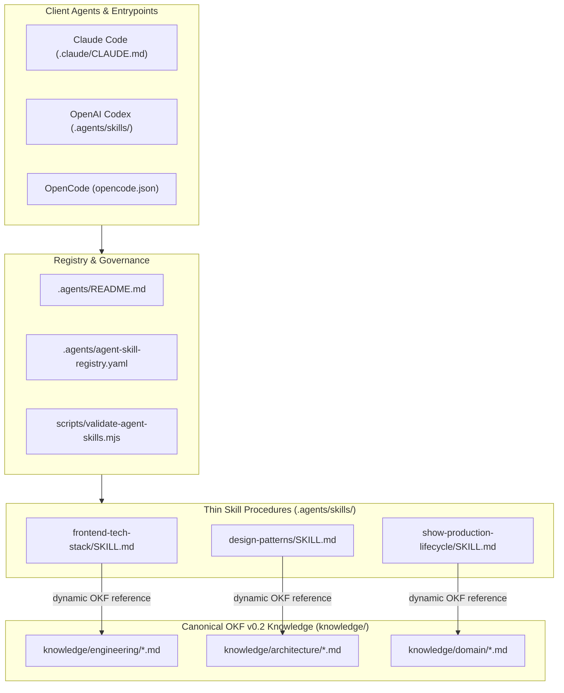
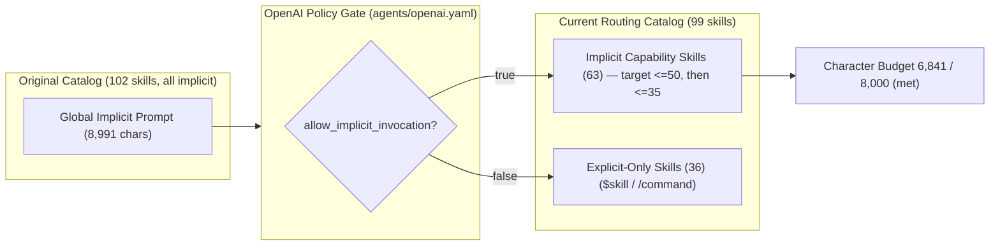

# Agent Content Reorganization

## Status

This is the migration inventory and execution plan for the entries indexed under `.agents/skills/`. It establishes review and bookkeeping scope; provisional classifications still require focused content review.

**Current count: 90 skills — 57 implicitly invocable, 33 explicit-only, 6,185 implicit description characters.** The original audit recorded 94; the catalog grew to 102 before the OKF migration began, the first consolidation PR brought three entries down to 99, and the domain-clustering PR merged ten more into four surviving skills to reach 90. Dispositions below are derived from the `kind` field in [`.agents/agent-skill-registry.yaml`](../../.agents/agent-skill-registry.yaml), which `pnpm agents:validate` keeps in sync with the skill directories — so this table can no longer silently drift from the tree.

The Agentic Tool Enhancement & OKF Consolidation program that produced these counts has closed; its record is in § Program Record below. One constraint it set is still unmet: the implicit catalog is at 57 against a 50/35 target, and closing that gap is now an open decision tracked in [`agent-implicit-catalog-count-cap.md`](../ideation/agent-implicit-catalog-count-cap.md), not a scheduled delivery step.

A content move is complete only when routing, links, validation, and behavior have been verified with Claude Code, Codex, and OpenCode. The most recent verification is recorded in § Cross-Client Routing Verification.

Canonical references:

- [`.agents/README.md`](../../.agents/README.md) — taxonomy and admission rules.
- [`AGENT_OPERATING_MODEL.md`](./AGENT_OPERATING_MODEL.md) — target reasoning lifecycle, mode timing, pattern-consumer model, portfolio targets, and exit criteria.

## Why Reorganize

The current skill directory combines several different concerns:

- genuine task procedures;
- lifecycle and reasoning interventions;
- thin wrappers around repository workflows;
- presentation modes;
- architecture, pattern, and technology references;
- current domain state;
- duplicated review doctrine;
- client routing surfaces.

This weakens retrieval because every entry competes in the skill catalog even when it is not a task capability. It also gives factual content a skill lifecycle rather than an OKF or documentation lifecycle.

Examples of obvious shape mismatch:

- [`frontend-tech-stack`](../../.agents/skills/frontend-tech-stack/SKILL.md) is primarily a technology/version and project-structure reference.
- [`design-patterns`](../../.agents/skills/design-patterns/SKILL.md) is primarily repository architecture doctrine.
- [`show-production-lifecycle`](../../.agents/skills/show-production-lifecycle/SKILL.md) is primarily a domain model, lifecycle state, current surfaces, and known gaps.
- [`zoom-out`](../../.agents/skills/zoom-out/SKILL.md) is an orientation intervention but is currently modeled as an explicit user mode.
- [`grill-me`](../../.agents/skills/grill-me/SKILL.md) and [`grill-with-docs`](../../.agents/skills/grill-with-docs/SKILL.md) duplicate decision-questioning behavior and apply it too broadly.

## Target State

The reorganization is not complete when files have merely moved. The target is a smaller operating system with clear consumers and lifecycle timing.

### Target portfolio

| Category | Target |
| --- | ---: |
| Lifecycle and reasoning skills | 5–10 |
| Concrete capability skills | 20–40 |
| Review lenses | 5–10 |
| Workflow wrappers | Fewer than 10 where cross-client discovery requires them |
| Presentation modes | 1–3 explicit-only |
| Standalone knowledge/pattern entries in implicit catalog | 0 |

### Catalog milestones

1. First milestone: no more than **50 implicitly invocable skills**.
2. Post-consolidation target: **35 or fewer implicitly invocable skills**.
3. Every implicit entry must name an action or reasoning gate and a verifiable output.
4. Every manual workflow and presentation mode must be explicit-only where client support permits.
5. Pattern and guide knowledge must be loaded by consumer skills rather than competing directly in global routing.

The ranges are not quotas. A skill survives only when its trigger, procedure, and output remain materially distinct.

### Two constraints, tracked separately

| Constraint | Limit | Current | State |
| --- | --- | --- | --- |
| Implicit description characters (Codex catalog budget) | 8,000 | **6,185** | ✅ Met |
| Implicitly invocable skill count | ≤50, then ≤35 | **57** | ❌ Not met — 7 short of the first milestone |
| Regression ratchet (`implicit_catalog_ceiling`) | 57 | 57 | 🔒 Enforced — validation fails if exceeded |

These are independent. Meeting the character budget did not move the count. **Do not report one as satisfying the other.**

`pnpm agents:validate` counts only frontmatter `description` characters toward the Codex catalog budget. Thinning a `SKILL.md` **body** saves nothing against that budget — the entire reduction comes from `allow_implicit_invocation: false`. Do not delete body content in the name of catalog savings.

## Canonical Development Flow

The target flow is:

```text
orient
  → resolve material decisions
  → select knowledge and procedures
  → plan and implement
  → review through relevant lenses
  → verify and reconcile knowledge
  → present
```

Correct timing matters:

- context expansion happens before planning;
- decision challenge happens before implementation, only when a material choice remains;
- patterns are selected after scope is understood and before implementation;
- review lenses are selected from change signals, not invoked indiscriminately;
- presentation modes run after reasoning and must not control technical decisions.

## Revised Provisional Inventory

Counts below come from the `kind` field in [`.agents/agent-skill-registry.yaml`](../../.agents/agent-skill-registry.yaml). Regenerate with:

```bash
rg -o '^    kind: (.+)$' -r '$1' .agents/agent-skill-registry.yaml | sort | uniq -c | sort -rn
```

| Disposition | Registry `kind` | Count | Meaning |
| --- | --- | ---: | --- |
| Keep as procedural skill | `capability-skill` | 69 | Task-triggered and procedural; still subject to quality review |
| Thin skill plus extracted knowledge | `thin-wrapper` | 8 | Predominantly factual; doctrine belongs in `knowledge/` with routing/procedure retained — 4 of the 8 have landed it, 4 are still pending |
| Workflow wrapper | `workflow-bridge` | 6 | Authoritative orchestration belongs under `.agents/workflows/` |
| Presentation mode | `presentation-mode` | 7 | Output style only, explicit user trigger — all 7 are `implicit: false` |
| **Total** | | **90** | Matches the generated index and the skill directories |

Routing split: **57 implicitly invocable**, **33 explicit-only**, ratcheted by `implicit_catalog_ceiling`. Both the "no more than 50" milestone and the "35 or fewer" post-consolidation target are unmet.

### How the implicit catalog gets reduced

By **knowledge extraction and consolidation** — not by marking retained capability classes explicit-only. This is canon, not preference:

- [`.agents/README.md`](../../.agents/README.md) § Target Catalog: the implicit catalog **should contain** lifecycle and reasoning capabilities, concrete implementation and **operational** capabilities, and declared **review lenses**. It should **not** contain standalone pattern or technology guides, domain and architecture reference documents, duplicated workflow bodies, or unrequested presentation modes.
- [`AGENT_OPERATING_MODEL.md`](./AGENT_OPERATING_MODEL.md) § Catalog targets: reach "**no more than 50**" in the first reorganization milestone, reach "**35 or fewer**" after "**overlap consolidation and knowledge extraction**", and mark **manual workflows and presentation modes** explicit-only.

An attempt to reach the milestone by marking 18 human-decision-triggered skills explicit-only was rejected on review ([#368](https://github.com/allenlin90/eridu-services/pull/368)). That attempt used a different axis — "human decision vs. an agent touched this code" — which is defensible on its own terms, but it flipped members of the classes canon retains in the implicit catalog (7 deployed-platform operations, `pr-ui-screenshot-review`, `plan-workflow-completeness`), and it substituted a lever canon does not sanction for the two it does. The routing change was removed rather than merged with the canonical documents left asserting the superseded rule, which the [pattern/direction-change gate](../../.agents/skills/agent-instruction-maintenance/SKILL.md) treats as blocking.

**Extraction relocates facts; it does not by itself remove a catalog entry.** An earlier revision of the program plan claimed 66 − 25 = 41 from extraction. That is wrong, and the counter-evidence is already in the repo: all eight skills whose doctrine moved to [`knowledge/`](../../knowledge/index.md) in PR #367 — `database-patterns`, `design-patterns`, `frontend-tech-stack`, `show-production-lifecycle`, and the rest — are still `implicit: true`. The skill remains as a thin procedure.

The implicit count decrements only when an entry is:

1. **deleted** — extraction leaves no genuine procedure behind, so the skill itself retires; or
2. **merged** — two overlapping skills consolidate into one.

PR #367 judged all eight of its candidates to have a genuine procedure worth keeping. That is a real prior: some fraction of any extraction batch will stay in the catalog, not retire from it.

If a narrow explicit-only class is still wanted later — for example "operates an external deployed system" — it must be proposed as a deliberate amendment to `.agents/README.md` and `AGENT_OPERATING_MODEL.md`, with cross-client routing parity evidence, **in its own PR**. It must not ride along in a delivery PR.

### Candidate disposition table (PR 3)

The 25 entries the § Target portfolio budgets at 0 as standalone pattern or technology guides were reviewed one by one against the routing test in [`.agents/README.md`](../../.agents/README.md). Each carries a disposition, and the resulting count is derived from those decisions rather than from the size of the list.

| # | Skill | Disposition | Basis |
| ---: | --- | --- | --- |
| 1 | `admin-list-pattern` | **consolidate into `table-view-pattern`** | Same trigger ("build a list route") and same shared primitives (`useTableUrlState`, `DataTable`); it differed only by pagination stack |
| 2 | `studio-list-pattern` | **consolidate into `table-view-pattern`** | As above — card grid is a third surface of one list capability, not a distinct trigger |
| 3 | `solid-principles` | **consolidate into `code-quality`** | A design lens applied during the same review pass; its two references moved intact as `references/solid-{backend,frontend}.md` |
| 4 | `table-view-pattern` | keep as thin skill | Extraction complete (#367); now owns all three list surface stacks |
| 5 | `backend-controller-pattern-nestjs` | keep as thin skill | Extraction complete (#367); body is an ordered controller procedure |
| 6 | `database-patterns` | keep as thin skill | Extraction complete (#367); body is rule selection + migration procedure |
| 7 | `design-patterns` | keep as thin skill | Extraction complete (#367); body is a decision procedure |
| 8 | `frontend-tech-stack` | keep as thin skill | Extraction complete (#367); body is a workspace setup/upgrade procedure |
| 9 | `pwa-best-practices` | keep as thin skill | Extraction complete (#367); body is a migration procedure with a production HTTP verification step |
| 10 | `code-quality` | keep as thin skill, extraction pending | Owns the pre-submission gate and now the SOLID lens; the generic lint/type/testing doctrine is durable and still unextracted |
| 11 | `engineering-best-practices-enforcer` | keep as thin skill | Declared review lens with a scanner script and an output contract — a retained class, no factual body to extract |
| 12 | `frontend-i18n` | keep as thin skill | Ordered how-to (add key → regenerate → consume); no durable doctrine large enough to earn a concept |
| 13 | `api-performance-optimization` | keep as thin skill, extraction pending | Audit workflow is procedural; the lean-select, aggregation, and bulk-guard rules are durable facts |
| 14 | `backend-testing-patterns` | keep as thin skill, extraction pending | Real-database completion gate is procedural; the per-layer test doctrine is factual |
| 15 | `data-validation` | keep as thin skill, extraction pending | Registered `capability-skill` with empty `knowledge_sources`; three-layer contract and UID rules are durable |
| 16 | `frontend-api-layer` | keep as thin skill, extraction pending | Query-key factory, mutation, and freshness-tier rules are durable |
| 17 | `frontend-code-quality` | keep as thin skill, extraction pending | Decomposition procedure is real; naming, route-access, and layout doctrine is factual |
| 18 | `frontend-error-handling` | keep as thin skill, extraction pending | Layered error architecture is factual |
| 19 | `frontend-performance` | keep as thin skill, extraction pending | Optimization rules are factual; measurement is the procedure |
| 20 | `frontend-state-management` | keep as thin skill, extraction pending | Registered `capability-skill` with empty `knowledge_sources`; the decision tree and cache rules are durable |
| 21 | `frontend-testing-patterns` | keep as thin skill, extraction pending | Environment gotchas (happy-dom, `lazyRouteComponent`) are durable facts |
| 22 | `frontend-ui-components` | keep as thin skill, extraction pending | Largest candidate (176 lines); decision priority, responsive dialog, and three-perspective patterns are all doctrine |
| 23 | `observability-logging` | keep as thin skill, extraction pending | Levels and never-log tables are durable facts |
| 24 | `secure-coding-practices` | keep as thin skill, extraction pending | Per-feature checklist is a review lens; the nine rules are durable |
| 25 | `shift-schedule-pattern` | keep as thin skill, extraction pending | Already listed under § Pending extraction; business rules belong in `knowledge/domain/` |

**Derived count: 66 → 63 implicit.** Three consolidations, zero retirements. The other 22 keep their catalog entry, which matches the PR #367 prior — extraction relocates facts and leaves a thin procedure behind.

**The 25-candidate list does not reach either target.** The gap is **13 entries to "no more than 50"** and **28 to "35 or fewer"**, and no remaining entry on this list decrements the count. Closing that gap needs consolidation decisions over the *whole* implicit catalog, not further work on this list, and per § How the implicit catalog gets reduced that is an explicit decision in its own PR — not an assumption folded into a delivery PR. The options and their decision gates are in [`agent-implicit-catalog-count-cap.md`](../ideation/agent-implicit-catalog-count-cap.md).

### Domain clustering consolidation

Ten skills merged into four surviving skills by mechanism 2 (**merged**) in § How the implicit catalog gets reduced. Every merged body and reference file moved **verbatim** into the surviving skill's `references/` — the moves are recorded as renames in the delivering commit, so no doctrine was rewritten or summarized.

| Merged away | Into | Basis |
| --- | --- | --- |
| `service-pattern-nestjs`, `backend-controller-pattern-nestjs`, `repository-pattern-nestjs`, `orchestration-service-nestjs` | `nestjs-architecture` | One `erify_api` layering doctrine split across four catalog entries with the same trigger ("change an `erify_api` backend layer"). Placement stays with `erify-api-capability-refactoring`, which the new skill defers to in a banner. |
| `table-view-pattern` | `frontend-ui-components` | List and table surfaces are a component-composition concern; both already shared `@eridu/ui` primitives and the same "build a UI surface" trigger. |
| `soft-delete-restore`, `local-database-cli` | `database-patterns` | Restore is the inverse of the soft-delete rule the target skill already owns; the local CLI is the terminal-side companion to the same persistence work. |
| `backend-testing-patterns`, `frontend-code-quality`, `secure-coding-practices` | `code-quality` | Three review lenses over changed code, which is exactly what the target skill is. |

**Considered and deliberately not merged:**

- `authentication-authorization-nestjs` — its subject is `eridu_auth` login, sessions, and cross-app JWT, not `erify_api` layering. Folding it into `nestjs-architecture` would conflate two applications and collide with `erify-authorization`.
- `ai-platform-capability-verification` — a verification methodology for deployed Open WebUI and LiteLLM behavior, triggered by a capability claim rather than by changed code. It is not a code-quality lens.

**Derived count: 63 → 57 implicit, 99 → 90 skills.** The `nestjs-architecture` merge is count-neutral on the implicit catalog — three of its four inputs were already explicit-only — so the six-entry reduction comes from the other three merges. The first milestone is still **7 entries away** and remains an open decision in [`agent-implicit-catalog-count-cap.md`](../ideation/agent-implicit-catalog-count-cap.md).

An attempt to reach the milestone by marking 18 human-decision-triggered skills explicit-only was rejected on review and replaced by the two levers canon sanctions — consolidation and knowledge extraction. The goal was never dropped; the plan changed. See § How the implicit catalog gets reduced.

Cross-cutting review flags are orthogonal to `kind` and are not counted in the table: **3 reasoning-intervention entries** must move into lifecycle timing rather than remain explicit modes, and **6 consolidation-review entries** have overlapping capability boundaries. Both sets are addressed by the consolidation PRs.

All 8 skills PR #367 targeted completed their extraction — their doctrine now lives in [`knowledge/`](../../knowledge/index.md) and each carries a `knowledge_sources` entry. That set is **not** the same as the 8 registry `thin-wrapper` entries: only 4 of the `thin-wrapper` entries (`database-patterns`, `design-patterns`, `frontend-tech-stack`, `show-production-lifecycle`) overlap it. The other 4 — `ai-workspace-control-plane`, `operations-review-surface`, `shift-schedule-pattern`, `task-template-builder` — carry the classification with no extraction behind it yet and are listed under § Pending extraction.

### Keep as procedural skill — provisional

- `agent-instruction-maintenance`
- `ai-platform-capability-verification`
- `ai-platform-release-management`
- `api-performance-optimization`
- `astro-starlight-best-practices`
- `authentication-authorization-nestjs`
- `backend-large-file-refactor`
- `data-compatibility-migration`
- `data-validation`
- `diagnose`
- `doc-hygiene`
- `domain-refactor-cutover-strategy`
- `environment-configuration-zod`
- `eridu-auth-oauth-provider`
- `eridu-docs-information-architecture`
- `eridu-playwright`
- `eridu-security-threat-model`
- `erify-api-capability-refactoring`
- `erify-authorization`
- `excel-creator-mapping`
- `fact-extraction-pipeline`
- `file-upload-presign`
- `frontend-api-layer`
- `frontend-bundle-splitting`
- `frontend-error-handling`
- `frontend-i18n`
- `frontend-performance`
- `frontend-state-management`
- `frontend-testing-patterns`
- `frontend-ui-components`
- `graphify`
- `jsonb-analytics-snapshot`
- `litellm-admin-api`
- `monorepo-doc-layering`
- `nestjs-architecture`
- `observability-logging`
- `openwebui-assistant-adapter`
- `openwebui-extensibility-design`
- `openwebui-groups-permissions`
- `openwebui-mcp-tool-integration`
- `openwebui-rest-api`
- `upload-openwebui-skill`
- `package-extraction-strategy`
- `plan-workflow-completeness`
- `pr-ui-screenshot-review`
- `prod-data-sync`
- `prototype`
- `pwa-best-practices`
- `railway-template-config`
- `schedule-continuity-workflow`
- `setup-matt-pocock-skills`
- `shared-api-types`
- `spreadsheet`
- `ssr-auth-integration`
- `template-system-fact-migration`
- `ui-mockup-discussion`
- `user-facing-docs`
- `wiki-knowledge-maintainer`

This category means “not yet an obvious move candidate,” not “already ideal.” Pattern-named entries in this list still require a factual-versus-procedural review.

### Thin skill plus extracted knowledge

**Extracted (live in [`knowledge/`](../../knowledge/index.md) as strict OKF v0.2 concepts):**

| Skill | Knowledge concept |
| --- | --- |
| `nestjs-architecture` (was `backend-controller-pattern-nestjs`) | [`architecture/backend-controller-pattern-nestjs`](../../knowledge/architecture/backend-controller-pattern-nestjs.md) |
| `database-patterns` | [`architecture/database-patterns`](../../knowledge/architecture/database-patterns.md) |
| `design-patterns` | [`architecture/design-patterns`](../../knowledge/architecture/design-patterns.md) |
| `frontend-tech-stack` | [`engineering/frontend-tech-stack`](../../knowledge/engineering/frontend-tech-stack.md) |
| `pwa-best-practices` | [`engineering/pwa-best-practices`](../../knowledge/engineering/pwa-best-practices.md) |
| `nestjs-architecture` (was `service-pattern-nestjs`) | [`architecture/service-pattern-nestjs`](../../knowledge/architecture/service-pattern-nestjs.md) |
| `show-production-lifecycle` | [`domain/show-production-lifecycle`](../../knowledge/domain/show-production-lifecycle.md) |
| `frontend-ui-components` (was `table-view-pattern`) | [`engineering/table-view-pattern`](../../knowledge/engineering/table-view-pattern.md) |

**Pending extraction** — registry entries with an empty `knowledge_sources`. Two groups, and they overlap:

1. **`thin-wrapper` entries whose classification anticipates an extraction that has not happened.** The `kind` claims the doctrine already moved; it has not.

   - `ai-workspace-control-plane`
   - `operations-review-surface`
   - `shift-schedule-pattern`
   - `task-template-builder`

2. **The 14 rows marked *extraction pending* in § Candidate disposition table.** These are registered `capability-skill` — the classification makes no completeness claim — but they still carry durable doctrine inline. The list is maintained in that table and is not duplicated here.

Expected pattern:

```text
SKILL.md
  trigger + knowledge selection + task workflow + verification

knowledge/... or docs/...
  canonical patterns, architecture, domain concepts, current state, and policies

references/...
  implementation depth needed only after selecting the skill
```

The first extraction pilot covered `frontend-tech-stack` (engineering stack knowledge), `design-patterns` (architecture doctrine), and `show-production-lifecycle` (business-domain lifecycle), then extended to the five other concepts in the table above.

Each extraction must land with the skill or reasoning consumer that retrieves and applies the new canonical source.

**Extraction rules learned from the pilot** — every one of these was violated on the first attempt and caught in review:

- **Move content verbatim.** Resummarizing doctrine into a four-step procedure deletes rules; it does not extract them. If the concept is shorter than what it replaced, content was lost.
- **Thinning a `SKILL.md` body saves no catalog tokens.** `pnpm agents:validate` counts frontmatter `description` characters only. Deleting body content buys nothing.
- **Verify every code-level claim against source.** State values, guard names, and component names written from memory come out wrong; structural validation will not catch it.
- **Preserve cited section numbering** and repoint every citing document in the same PR.
- **Keep `references/` reachable** from either the thin skill or the knowledge concept.

### Workflow wrappers

- `codebase-hardening-program`
- `doc-lifecycle`
- `knowledge-sync`
- `pr-ready`
- `repository-health`
- `tdd`
- `tech-debt-delivery`
- `to-issues`
- `to-prd`
- `triage`

A wrapper may remain under `.agents/skills/` for cross-client discoverability. Its body should route to one authoritative workflow and contain no second copy of the steps.

Review whether `schedule-continuity-workflow` should join this category after inspecting whether its implementation procedure is independent of its orchestration flow.

## Mode and Reasoning Corrections

The previous “explicit modes” category was incorrect because it grouped four different functions.

### `caveman` — presentation mode

Target:

- remain explicit-only;
- affect communication after reasoning, not exploration, planning, implementation, or review;
- default to turn-scoped unless the user explicitly requests persistence;
- retain clarity overrides for warnings, destructive actions, decisions, and verification.

It should eventually move to a presentation-mode registry if Claude, Codex, and OpenCode can consume one consistently.

### `zoom-out` — orientation reasoning

Target:

- retire as an explicit-only presentation-style skill;
- merge its useful behavior into context orientation, impact analysis, planning, and architecture review;
- trigger automatically when the affected scope, callers, ownership, runtime, or domain context is unclear;
- produce a concrete system map and authority-source list before planning.

### `grill-me` — bounded decision challenge

Target:

- replace “interview relentlessly” with a bounded decision-resolution procedure;
- inspect code and canonical knowledge before asking questions;
- challenge only material unresolved choices;
- order questions by dependency and stop once implementation can proceed;
- record decisions, rationale, rejected alternatives, and remaining gates.

### `grill-with-docs` — domain reconciliation

Target:

- merge its decision questioning into the common decision-challenge procedure;
- move glossary, terminology, and ADR policy into canonical domain/documentation governance;
- run contradiction detection during orientation and review;
- replace assumed generic `CONTEXT.md` paths with this repository’s actual docs and OKF sources.

## Pattern and Guide Extraction Target

### Rule

A pattern says what a good implementation looks like. A capability skill says how to complete a concrete task using the applicable patterns.

Pattern and guide documents should therefore be knowledge or reference material unless they also contain a distinct reusable procedure.

### Likely extraction families

- frontend and backend technology-stack guides;
- design and SOLID doctrine;
- controller, service, repository, orchestration, and persistence patterns;
- API route and schema conventions;
- testing strategy and quality checklists;
- UI, list, table, and state-management patterns;
- domain lifecycle, relationship, and current-surface descriptions;
- deployed platform topology and version-sensitive facts.

This does not necessarily delete every corresponding skill. It makes the skill thin and procedural while moving the canonical facts into knowledge.

### Primary pattern consumers

Pattern knowledge should normally be consumed by:

1. context orientation and impact analysis;
2. pattern selection and design reasoning;
3. concrete implementation capabilities;
4. declared review lenses;
5. knowledge reconciliation after changes.

A developer should request “implement this service” or “review this architecture.” The consumer skill should select service, persistence, SOLID, and repository doctrine automatically. The developer should not need to name every pattern file.

## Engineering Review Target

The current cluster is:

- `code-quality`
- `engineering-best-practices-enforcer`
- `improve-codebase-architecture`

Target responsibilities:

| Target capability | Responsibility |
| --- | --- |
| Repository-convention review | Check repo rules, package/dependency policy, verification, documentation lifecycle |
| Architecture reasoning/review | Map context, find coupling and ownership problems, compare design alternatives |
| Code-quality verification | Run and interpret lint, typecheck, test, build, and static quality signals |
| Pattern knowledge | SOLID, deep modules, clean-code heuristics, and architectural vocabulary |

`solid-principles` became a reference lens inside [`code-quality`](../../.agents/skills/code-quality/SKILL.md) rather than an always-on global implementation skill (PR 3). `improve-codebase-architecture` should retain a procedural architecture-discovery/review capability but load terminology and principles as knowledge. `engineering-best-practices-enforcer` should become the repository-convention review. `code-quality` owns deterministic quality tooling, verification, and the SOLID design lens.

## Skill-Authoring Target

Current cluster:

- `eridu-skill-creator`
- `write-a-skill`

Target:

- one repository-authoritative agent-content authoring capability;
- generic Agent Skills format guidance as a reference;
- one classification gate covering skills, workflows, rules, knowledge, modes, and adapters;
- no overlapping implicit triggers.

## Additional Clusters to Inspect

- ~~`admin-list-pattern`, `studio-list-pattern`, and `table-view-pattern`~~ — consolidated into `table-view-pattern` (PR 3), then folded into `frontend-ui-components` (domain clustering);
- `doc-hygiene`, `doc-lifecycle`, `knowledge-sync`, `monorepo-doc-layering`, and `user-facing-docs`;
- ~~`frontend-code-quality`, `code-quality`, and repository-convention review~~ — consolidated into `code-quality` (domain clustering);
- `ai-workspace-control-plane`, Open WebUI skills, LiteLLM skills, and future `infra/` knowledge;
- feature-specific pattern skills whose current-state facts already exist in feature, domain, or app documentation.

## Machine-Readable Registry Target

**Shipped.** The registry is [`.agents/agent-skill-registry.yaml`](../../.agents/agent-skill-registry.yaml) and the validator is `scripts/validate-agent-skills.mjs` (`pnpm agents:validate`). Repository-specific classification fields stayed out of every `SKILL.md`, so no client had to tolerate unknown frontmatter. The shipped entry shape:

```yaml
version: 1
implicit_catalog_ceiling: 63
skills:
  show-production-lifecycle:
    kind: thin-wrapper
    authority: procedural
    implicit: true
    lifecycle_stage: [ orient, implement, review ]
    knowledge_sources:
      - knowledge/domain/show-production-lifecycle.md
    migration_status: canonical
```

What the validator enforces today:

- every skill directory has exactly one registry entry, and every registry entry has a directory;
- every registry entry carries all six fields with the right type — a missing or mistyped field would silently disable the check that depends on it;
- `implicit` agrees with the skill's `agents/openai.yaml` `policy.allow_implicit_invocation`, so registry intent and Codex routing cannot drift;
- `implicit_catalog_ceiling` ratchets the implicit count — validation fails on growth and warns when the count drops below the ceiling without the ceiling being lowered;
- `implicit_catalog_limit` and `post_consolidation_limit` warn until met;
- every `SKILL.md` has frontmatter whose `name` matches its directory and whose `description` is non-empty;
- every relative link in a skill or knowledge document resolves;
- `knowledge/` is structurally valid OKF v0.2 — bundle-root `okf_version`, non-empty `type` and `description` per concept, and index coverage;
- the generated `INDEX.md` is not stale.

What no script checks — these remain reviewer responsibilities:

- whether a documented state value, guard, component, or script name actually exists;
- whether presentation modes and reasoning interventions are classified at the right lifecycle gate;
- whether two sources claim canonical authority for the same facts.

**Structural validation is necessary but not sufficient.** This document remains the reviewed inventory and must be updated when classifications change.

## Migration Waves

### Wave 0 — taxonomy, operating model, and inventory

- Define content classes and admission rules.
- Define the target reasoning lifecycle and catalog targets.
- Record all current entries (94 at audit time; 99 today — see § Status).
- Update skill-authoring guidance to reject knowledge-shaped additions.
- Do not move live content.

### Wave 1 — reasoning timing and mode correction

- Move zoom-out behavior into automatic orientation and impact-analysis gates.
- Replace grill behavior with bounded decision challenge.
- Move domain contradiction checks into orientation and review.
- Keep caveman as presentation-only and explicit.
- Add representative routing tests for each lifecycle intervention.

### Wave 2 — classification registry and validator

- Add the external registry.
- Validate coverage, lifecycle stage, invocation policy, destinations, links, and authority.
- Include classification state in generated indexes without making knowledge invocable.

### Wave 3 — three representative knowledge splits

1. `frontend-tech-stack` → engineering-stack knowledge plus a thin or retired skill.
2. `design-patterns` → architecture-pattern knowledge plus focused pattern-selection/review procedures.
3. `show-production-lifecycle` → OKF domain concept plus thin change-impact and implementation routing.

Land each extraction with the skill or reasoning consumer that retrieves and applies the new source. Verify the same representative tasks with Claude Code, Codex, and OpenCode before removing duplicated text.

### Wave 4 — workflow and review reconciliation

- Move authoritative multi-step procedures under `.agents/workflows/`.
- Keep thin discovery wrappers only where needed.
- Resolve engineering review and skill-authoring clusters.
- Select review lenses from change signals.

### Wave 5 — broader pattern extraction

- Extract controller/service/repository, database, frontend, testing, and UI pattern knowledge.
- Thin implementation skills so they select rather than duplicate patterns.
- Review feature and domain skills as canonical OKF sources mature.

### Wave 6 — platform and publication alignment

- Align AI platform skills with the eventual `infra/` migration.
- Update QMD collections and Open WebUI publication paths.
- Preserve access, stable IDs, and citations.

### Wave 7 — catalog consolidation

- Reach the first <=50 implicit milestone. **Open** — the catalog is at 63 and the reviewed candidate list is exhausted; see [`agent-implicit-catalog-count-cap.md`](../ideation/agent-implicit-catalog-count-cap.md).
- Remove obsolete wrappers and overlapping triggers. **Partially done** — three consolidations landed; overlap clusters outside the 25 candidates are unreviewed.
- Target <=35 implicit entries after evidence shows routing remains reliable. **Open**, gated on the same decision.

## Acceptance Criteria for Each Migration

A migrated entry is complete only when:

- the task routes correctly in Claude Code, Codex, and OpenCode;
- reasoning interventions occur at the intended lifecycle gate;
- `SKILL.md` is procedural and materially smaller when knowledge was extracted;
- canonical knowledge has appropriate OKF or documentation metadata;
- the consumer skill selects the extracted source without requiring the user to name it;
- stable links and source provenance are preserved;
- old duplicate authority is removed or explicitly marked transitional;
- presentation modes do not alter reasoning, warning, or verification behavior;
- `pnpm agents:validate`, classification validation, and Markdown-link validation pass;
- the registry or this inventory records the final disposition.

## Compatibility Invariants

These bound every agent-content move, not just the ones already made.

- **Public skill entrypoints preserved.** Public skill IDs (`pr-ready`, `knowledge-sync`, `repository-health`, `upload-openwebui-skill`, `graphify`, `caveman`, `setup-matt-pocock-skills`, and the rest) must remain discoverable and invocable across Claude Code, Codex, and OpenCode. Codex `interface:` metadata (display name, short description, icons, default prompt) is part of the entrypoint and must survive any `agents/openai.yaml` edit.
- **Thin bridge pattern.** When static reference material moves to `knowledge/`, a thin procedural bridge remains at `.agents/skills/<name>/SKILL.md`, and every `references/` file stays reachable from either the bridge or the knowledge concept.
- **Zero loss of doctrine.** Content moves to `knowledge/` **verbatim**. Resummarizing doctrine into bullets is not migration — it deletes rules. Section numbering that other documents cite (for example `database-patterns` §6 and §12) is preserved, and every citing document is repointed in the same PR.
- **No invented facts.** Every code-level claim written into `knowledge/` — state values, guard names, component names, script names — is verified against source first. `pnpm agents:validate` checks bundle structure, not truth.
- **Zero loss of functionality.** Changes must be net-positive for prompt context size and execution speed without breaking existing slash commands or `$skill` / `/skill` triggers.

## Cross-Client Routing Verification

Last verified after the domain-clustering consolidation, against the three clients in the supported matrix.

| Surface | Client | Result |
| --- | --- | --- |
| `.agents/skills/` — 90 directories, each with a `SKILL.md` | all | ✅ 90 directories, 90 registry entries, zero orphans in either direction |
| `agents/openai.yaml` invocation policy vs registry `implicit` | Codex | ✅ 33 explicit-only, 57 implicit, **0 mismatches** |
| Public entrypoint discoverability and `interface:` metadata | Codex | ✅ all public IDs present and none named a consolidated skill; `display_name` / `short_description` / `default_prompt` intact where declared — 14 `interface:` blocks, up from 13 (`nestjs-architecture` added, none removed) |
| `.claude/skills` → `../.agents/skills` symlink | Claude Code | ✅ resolves; `nestjs-architecture/SKILL.md` visible through it |
| `.claude/CLAUDE.md` thin-adapter rule (≤30 lines, imports `AGENTS.md`) | Claude Code | ✅ 27 lines |
| `.opencode/skills` → `../.agents/skills` symlink | OpenCode | ✅ resolves; `nestjs-architecture/SKILL.md` visible through it |
| `opencode.json` instruction loading | OpenCode | ✅ loads `AGENTS.md` and `.agents/rules/*.mdc` |
| Relative-link resolution from each client's discovery root | all | ✅ 489 links resolved identically through `.agents/skills`, `.claude/skills`, and `.opencode/skills` — the symlink roots sit at the same depth, so `../../../../` reaches the repo root in all three. 8 unresolved, all pre-existing and none in a consolidated file (3 are illustrative placeholders). |
| Skill paths cited in `AGENTS.md`, `README.md`, `.agents/README.md`, `.agents/rules/*.mdc`, `.cursor/rules/*.mdc`, `opencode.json` | all | ✅ zero dangling paths |
| Generated `.agents/skills/INDEX.md` | all | ✅ 90 entries, not stale |

Re-run this check whenever a skill is added, removed, consolidated, or reclassified — the registry/`openai.yaml` parity and ratchet lines are covered by `pnpm agents:validate`; the symlink, adapter-length, link-resolution, and dangling-path lines are not.

**Reference-file depth is a cross-client constraint.** A skill's `references/` file sits four levels below the repo root (`.agents/skills/<skill>/references/`). Both client symlink roots (`.claude/skills`, `.opencode/skills`) sit at the same depth, so a `../../../../` link resolves identically whichever root a client walks. Moving a `SKILL.md` body into a `references/` file during consolidation therefore requires adding exactly one `../` to every relative link in it — the link-resolution row above is what proves that was done.

## Program Record

The Agentic Tool Enhancement & OKF Consolidation program ran as four rows and closed with one constraint unmet. Its execution tracker previously lived at `docs/prd/agentic-tool-enhancement.md` and was retired here — it was never a PRD (no user stories, no acceptance criteria, no user-facing feature), and its durable content is now split between this document and [`agent-implicit-catalog-count-cap.md`](../ideation/agent-implicit-catalog-count-cap.md).

| Row | Delivered | PR |
| ---: | --- | --- |
| 1 | Skill registry, validator enforcement, OKF v0.2 bundle with eight extracted concepts, toolsuite docs; catalog characters 8,991 → 7,074 | [#367](https://github.com/allenlin90/eridu-services/pull/367) |
| 2 | Superseded — its explicit-only lever conflicts with canonical routing doctrine; merged docs-only to record the plan change | [#368](https://github.com/allenlin90/eridu-services/pull/368) |
| 3 | Reviewed disposition for all 25 extraction candidates; three consolidations applied; implicit 66 → 63 | [#369](https://github.com/allenlin90/eridu-services/pull/369) |
| 4 | Final inventory reconciliation, cross-client routing verification, tracker retirement | this change |

**Why the program existed.** `.agents/skills/` had grown to 102 entries mixing *procedures* (what an agent should do) with *knowledge* (what is true about this repo's architecture, domain, and stack). Two costs followed: every implicitly invocable skill contributed its `description` to the catalog Codex injects per session — 8,991 characters against a ~8,000-character fallback budget, so Codex could silently shorten or drop entries — and durable facts were reachable only by loading a whole procedural skill, with no lifecycle metadata to distinguish current doctrine from stale.

**What is true after it.** [`knowledge/`](../../knowledge/index.md) is a real, machine-checkable OKF v0.2 bundle rather than a contract with nothing conforming to it; the Codex catalog fits its character budget with a ratchet preventing regression; and the skill tree, the registry, and every client adapter agree with each other under `pnpm agents:validate`.

### Client routing and knowledge flow



### Catalog policy gate


