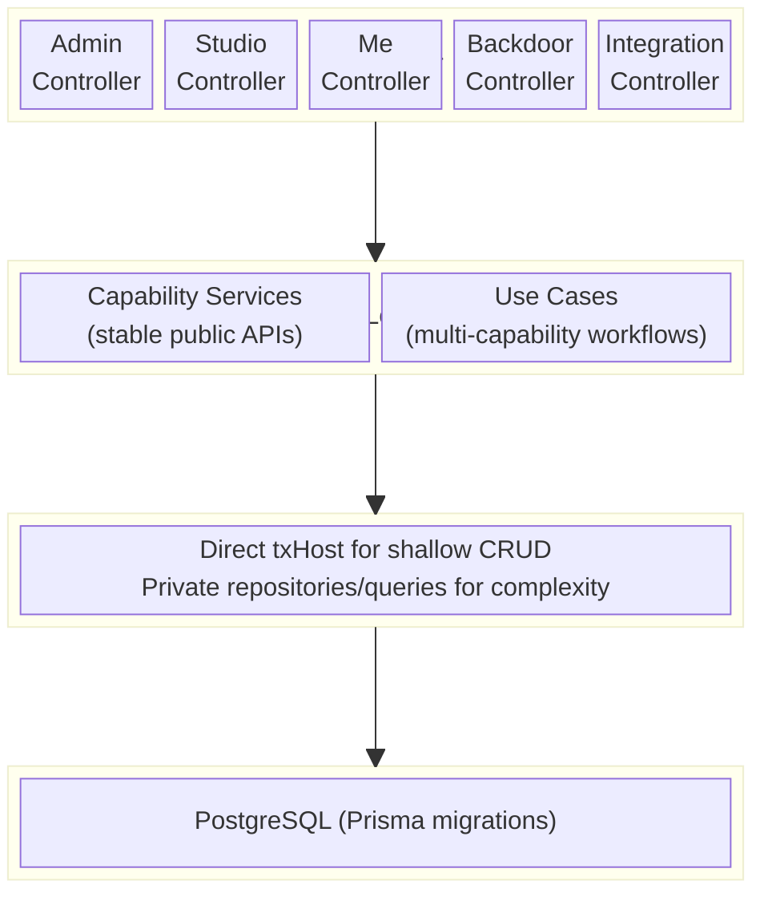

# System Architecture Overview

> **TLDR**: Eridu Services is a monorepo with frontend apps, backend services, and shared packages. `erify_api` currently provides the main operational backend using NestJS, Prisma, Zod, and `@eridu/auth-sdk`. This document is the root-level system architecture reference; app-local docs describe implementation details.

> Root-level reference for high-level architecture decisions and cross-app terminology. For backend implementation patterns, see the skills listed below and the `erify_api` implementation docs.

> **Direction (2026-07):** new `erify_api` work follows capability-first placement and the accepted persistence matrix (`erify-api-capability-refactoring`, per [`ARCHITECTURE_REFACTORING_GUIDE.md`](../../apps/erify_api/docs/design/ARCHITECTURE_REFACTORING_GUIDE.md)). Shallow bounded CRUD may live in a capability service through `TransactionHost.tx`; complex or reusable persistence stays private behind a repository, store, or query provider.

---

## Tech Stack

| Layer         | Technology                                       |
| ------------- | ------------------------------------------------ |
| Runtime       | Node.js (NestJS)                                 |
| ORM           | Prisma (PostgreSQL)                              |
| Auth          | `@eridu/auth-sdk` (JWT/JWKS), `StudioMembership` |
| API Contracts | `@eridu/api-types` (Zod schemas)                 |
| API Docs      | OpenAPI + Scalar UI                              |
| Monorepo      | Turborepo + pnpm workspaces                      |

## System Boundaries

| Layer | Primary Artifacts | Responsibility |
| ----- | ----------------- | -------------- |
| Product / Roadmap | `docs/roadmap`, `docs/product` | Cross-app planning, domain language, phase ownership |
| Backend | `apps/erify_api`, `apps/eridu_auth` | Operational APIs, auth, persistence, orchestration |
| Frontend | `apps/erify_studios`, `apps/erify_creators` | User workflows, task/shows UX, operator/admin surfaces |
| Shared Packages | `packages/*` | Contracts, auth SDK, UI, i18n, TS config |

## Module Architecture



<details>
<summary>ASCII fallback</summary>

```
┌──────────────────────────────────────────────────┐
│                   HTTP Layer                     │
│  Admin / Studio / Me / Backdoor / Integration    │
│  Controllers (extends Base*Controller)           │
└──────────────────┬───────────────────────────────┘
                   │
┌──────────────────▼───────────────────────────────┐
│              Business Logic Layer                │
│  Capability Services (stable public APIs)        │
│  Use Cases (multi-capability workflows)          │
└──────────────────┬───────────────────────────────┘
                   │
┌──────────────────▼───────────────────────────────┐
│              Persistence Boundary                │
│  Direct txHost for shallow bounded CRUD          │
│  Private repositories/queries for complexity     │
└──────────────────┬───────────────────────────────┘
                   │
┌──────────────────▼───────────────────────────────┐
│                Database                          │
│  PostgreSQL (via Prisma migrations)              │
└──────────────────────────────────────────────────┘
```

</details>

## Runtime Boundaries

`erify_api` is a modular NestJS backend that can expose multiple runtime
entrypoints over the same capability and persistence layers. Each runtime
imports the modules needed for its transport and audience rather than booting
every route surface.

| Runtime | Entrypoint | Audience | Transport | Boundary |
| ------- | ---------- | -------- | --------- | -------- |
| REST | `apps/erify_api/src/main.ts` | Admin, studio, user, and integration clients | HTTP routes | Public/API-key guarded depending on route |
| MCP | `apps/erify_api/src/main.mcp.ts` | OpenWebUI first, LiteLLM/partners later | Streamable HTTP MCP | Private Railway service in Phase 1 |
| Worker | Future `apps/erify_api/src/main.worker.ts` | Async jobs such as [notification delivery](../prd/notification-system.md) and reports | Queue/job processors | Private worker process |

Public partner/client MCP access is a separate API posture from the private OpenWebUI rollout. It needs an explicit authn/authz, rate-limit, and audit model before a public domain or external ingress is attached; see [Public MCP Access Control](../ideation/public-mcp-access-control.md).

Runtime adapters stay thin:

```text
REST Controller ┐
MCP Tool        ├─> Use Case / Service ─> Persistence ─> Database
Worker Processor ┘                         ├─ direct txHost
                                           └─ private repository/queries
```

Controllers, MCP tools, and worker processors translate transport-specific
input/output. Business rules live in capability services/use cases. The
selected persistence boundary remains private: direct `txHost` for shallow CRUD
or a named provider for complex persistence.

## Controller Scopes

| Scope       | Route Prefix          | Auth                                             | Base Class               |
| ----------- | --------------------- | ------------------------------------------------ | ------------------------ |
| Admin       | `admin/*`             | `@AdminProtected()` → `isSystemAdmin`            | `BaseAdminController`    |
| Studio      | `studios/:studioId/*` | `@StudioProtected([roles])` → `StudioMembership` | `BaseStudioController`   |
| Me (User)   | `me/*`                | JWT only                                         | `BaseController`         |
| Backdoor    | `backdoor/*`          | API Key (`@Backdoor()`)                          | `BaseBackdoorController` |
| Integration | varies                | Custom guards                                    | Custom base              |

## Key Architectural Decisions

1. **UID-based external IDs** — Internal `bigint` PKs are never exposed. All API endpoints use `uid` (prefixed string) mapped to `id` in responses.
2. **Zod response serialization** — `@ZodResponse(Schema)` on every endpoint ensures no internal data leaks.
3. **Global guards** — `JwtAuthGuard`, `AdminGuard`, `StudioGuard` registered globally; routes opt-in via decorators.
4. **CLS transactions** — `@Transactional()` from `@nestjs-cls/transactional`; never pass `tx` as parameter.
5. **Soft deletes** — All entities use `deletedAt` timestamps; the selected persistence boundary applies active-row predicates and scoped soft-delete writes.
6. **Module exports = capability APIs only** — Services and intentional query APIs may be public; repositories/stores remain private.

## Monorepo Packages

| Package                | Purpose                                           |
| ---------------------- | ------------------------------------------------- |
| `@eridu/api-types`       | Shared Zod schemas and TypeScript types (FE ↔ BE) |
| `@eridu/auth-sdk`        | JWT validation, JWKS management                   |
| `@eridu/browser-upload`  | Client-side image compression and upload helpers  |
| `@eridu/ui`              | Shared React UI components                        |
| `@eridu/i18n`            | Internationalization                              |
| `@eridu/eslint-config`   | Shared linting rules                              |
| `@eridu/typescript-config` | Shared TypeScript configs                      |

## Skills Reference

For detailed implementation patterns, see `.agents/skills/`:

| Skill                                 | Covers                                                     |
| ------------------------------------- | ---------------------------------------------------------- |
| `erify-api-capability-refactoring`    | Capability/module placement and persistence selection (authoritative)       |
| `backend-controller-pattern-nestjs`   | All controller types, base classes, response serialization |
| `service-pattern-nestjs`              | Capability services, typed APIs, direct or provider-backed persistence      |
| `repository-pattern-nestjs`           | Selective private repositories, filtering, optimistic locking              |
| `orchestration-service-nestjs`        | Capability workflow coordination, `@Transactional`, processors             |
| `authentication-authorization-nestjs` | JWT validation, token storage, protected routes            |
| `erify-authorization`                 | AdminGuard, StudioProtected, role-based access             |
| `database-patterns`                   | Soft delete, bulk ops, transactions, nested writes         |
| `data-validation`                     | ID mapping, input validation, response serialization       |
| `shared-api-types`                    | Zod schemas, DTO transforms, subpath imports               |
| `design-patterns`                     | Layer boundaries, module exports, service architecture     |

## Related Documentation

- **[Business Domain](../domain/BUSINESS.md)** — Product/domain concepts and entity meaning
- **[Root Roadmap](../roadmap/README.md)** — Cross-app phase ownership
- **[erify_api Architecture Reference](../../apps/erify_api/docs/README.md)** — Backend implementation docs
- **[erify_studios Docs](../../apps/erify_studios/docs/README.md)** — Frontend workflow docs
