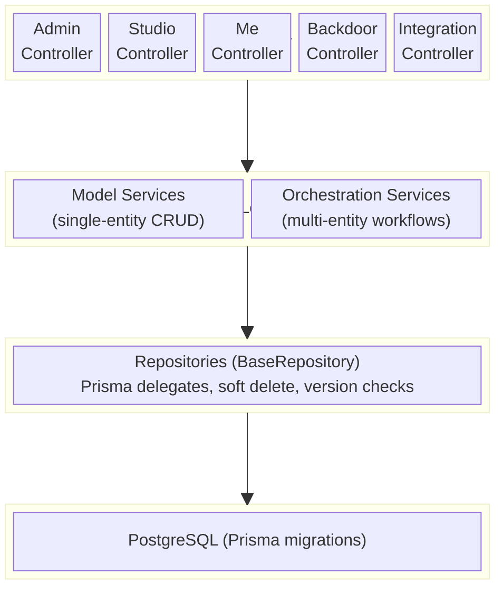

# System Architecture Overview

> **TLDR**: Eridu Services is a monorepo with frontend apps, backend services, and shared packages. `erify_api` currently provides the main operational backend using NestJS, Prisma, Zod, and `@eridu/auth-sdk`. This document is the root-level system architecture reference; app-local docs describe implementation details.

> Root-level reference for high-level architecture decisions and cross-app terminology. For backend implementation patterns, see the skills listed below and the `erify_api` implementation docs.

---

## Tech Stack

| Layer         | Technology                                       |
| ------------- | ------------------------------------------------ |
| Runtime       | Node.js (NestJS)                                 |
| ORM           | Prisma (PostgreSQL)                              |
| Auth          | `@eridu/auth-sdk` (JWT/JWKS), `StudioMembership` |
| API Contracts | `@eridu/api-types` (Zod schemas)                 |
| API Docs      | OpenAPI + Scalar UI                              |
| Monorepo      | Turborepo + pnpm workspaces                      |

## System Boundaries

| Layer | Primary Artifacts | Responsibility |
| ----- | ----------------- | -------------- |
| Product / Roadmap | `docs/roadmap`, `docs/product` | Cross-app planning, domain language, phase ownership |
| Backend | `apps/erify_api`, `apps/eridu_auth` | Operational APIs, auth, persistence, orchestration |
| Frontend | `apps/erify_studios`, `apps/erify_creators` | User workflows, task/shows UX, operator/admin surfaces |
| Shared Packages | `packages/*` | Contracts, auth SDK, UI, i18n, TS config |

## Module Architecture



<details>
<summary>ASCII fallback</summary>

```
┌──────────────────────────────────────────────────┐
│                   HTTP Layer                     │
│  Admin / Studio / Me / Backdoor / Integration    │
│  Controllers (extends Base*Controller)           │
└──────────────────┬───────────────────────────────┘
                   │
┌──────────────────▼───────────────────────────────┐
│              Business Logic Layer                │
│  Model Services (single entity CRUD)             │
│  Orchestration Services (multi-entity workflows) │
└──────────────────┬───────────────────────────────┘
                   │
┌──────────────────▼───────────────────────────────┐
│              Data Access Layer                   │
│  Repositories (extends BaseRepository)           │
│  Prisma delegates, soft delete, version checks   │
└──────────────────┬───────────────────────────────┘
                   │
┌──────────────────▼───────────────────────────────┐
│                Database                          │
│  PostgreSQL (via Prisma migrations)              │
└──────────────────────────────────────────────────┘
```

</details>

## Runtime Boundaries

`erify_api` is a modular NestJS backend that can expose multiple runtime entrypoints over the same service/repository layer. Each runtime imports the modules needed for its transport and audience rather than booting every route surface.

| Runtime | Entrypoint | Audience | Transport | Boundary |
| ------- | ---------- | -------- | --------- | -------- |
| REST | `apps/erify_api/src/main.ts` | Admin, studio, user, and integration clients | HTTP routes | Public/API-key guarded depending on route |
| MCP | `apps/erify_api/src/main.mcp.ts` | OpenWebUI first, LiteLLM/partners later | Streamable HTTP MCP | Private Railway service in Phase 1 |
| Worker | Future `apps/erify_api/src/main.worker.ts` | Async jobs such as [notification delivery](../prd/notification-system.md) and reports | BullMQ processors | Private worker process |

Public partner/client MCP access is a separate API posture from the private OpenWebUI rollout. It needs an explicit authn/authz, rate-limit, and audit model before a public domain or external ingress is attached; see [Public MCP Access Control](../ideation/public-mcp-access-control.md).

Runtime adapters stay thin:

```text
REST Controller ┐
MCP Tool        ├─> Use Case / Service ─> Repository ─> Database
BullMQ Worker   ┘
```

Controllers, MCP tools, and BullMQ processors translate transport-specific input/output. Business rules live in services/use-cases and repositories remain the data-access boundary.

## Controller Scopes

| Scope       | Route Prefix          | Auth                                             | Base Class               |
| ----------- | --------------------- | ------------------------------------------------ | ------------------------ |
| Admin       | `admin/*`             | `@AdminProtected()` → `isSystemAdmin`            | `BaseAdminController`    |
| Studio      | `studios/:studioId/*` | `@StudioProtected([roles])` → `StudioMembership` | `BaseStudioController`   |
| Me (User)   | `me/*`                | JWT only                                         | `BaseController`         |
| Backdoor    | `backdoor/*`          | API Key (`@Backdoor()`)                          | `BaseBackdoorController` |
| Integration | varies                | Custom guards                                    | Custom base              |

## Key Architectural Decisions

1. **UID-based external IDs** — Internal `bigint` PKs are never exposed. All API endpoints use `uid` (prefixed string) mapped to `id` in responses.
2. **Zod response serialization** — `@ZodResponse(Schema)` on every endpoint ensures no internal data leaks.
3. **Global guards** — `JwtAuthGuard`, `AdminGuard`, `StudioGuard` registered globally; routes opt-in via decorators.
4. **CLS transactions** — `@Transactional()` from `@nestjs-cls/transactional`; never pass `tx` as parameter.
5. **Soft deletes** — All entities use `deletedAt` timestamps; base repository filters automatically.
6. **Module exports = services only** — Repositories are private; services are the module's public API.

## Monorepo Packages

| Package                | Purpose                                           |
| ---------------------- | ------------------------------------------------- |
| `@eridu/api-types`       | Shared Zod schemas and TypeScript types (FE ↔ BE) |
| `@eridu/auth-sdk`        | JWT validation, JWKS management                   |
| `@eridu/browser-upload`  | Client-side image compression and upload helpers  |
| `@eridu/ui`              | Shared React UI components                        |
| `@eridu/i18n`            | Internationalization                              |
| `@eridu/eslint-config`   | Shared linting rules                              |
| `@eridu/typescript-config` | Shared TypeScript configs                      |

## Skills Reference

For detailed implementation patterns, see `.agents/skills/`:

| Skill                                 | Covers                                                     |
| ------------------------------------- | ---------------------------------------------------------- |
| `backend-controller-pattern-nestjs`   | All controller types, base classes, response serialization |
| `service-pattern-nestjs`              | Model services, ORM decoupling, error handling             |
| `repository-pattern-nestjs`           | BaseRepository, filtering, optimistic locking              |
| `orchestration-service-nestjs`        | Multi-service coordination, `@Transactional`, processors   |
| `authentication-authorization-nestjs` | JWT validation, token storage, protected routes            |
| `erify-authorization`                 | AdminGuard, StudioProtected, role-based access             |
| `database-patterns`                   | Soft delete, bulk ops, transactions, nested writes         |
| `data-validation`                     | ID mapping, input validation, response serialization       |
| `shared-api-types`                    | Zod schemas, DTO transforms, subpath imports               |
| `design-patterns`                     | Layer boundaries, module exports, service architecture     |

## Related Documentation

- **[Business Domain](../domain/BUSINESS.md)** — Product/domain concepts and entity meaning
- **[Root Roadmap](../roadmap/README.md)** — Cross-app phase ownership
- **[erify_api Architecture Reference](../../apps/erify_api/docs/README.md)** — Backend implementation docs
- **[erify_studios Docs](../../apps/erify_studios/docs/README.md)** — Frontend workflow docs
