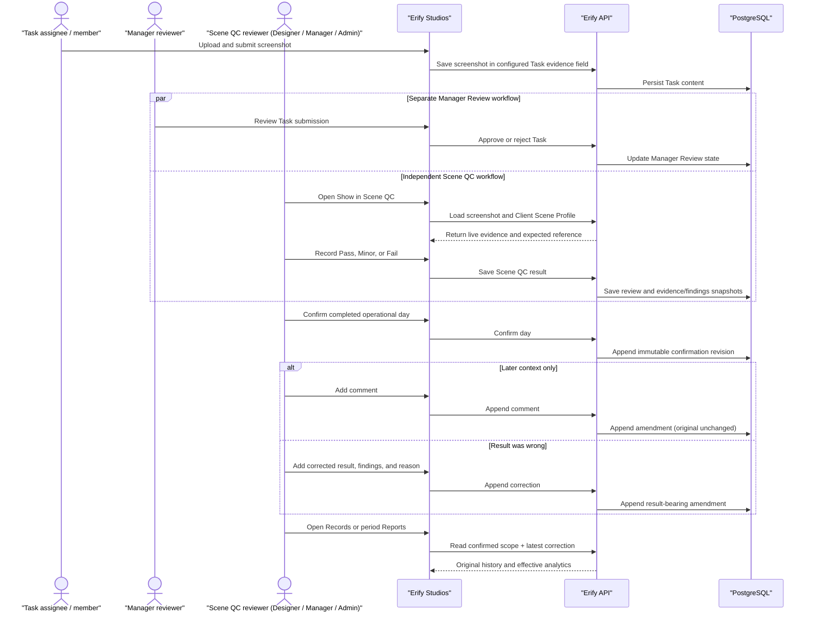

# Feature: Scene Quality Control

> **Status**: ✅ Shipped — Phase 5 item 23
> **Workstream**: Replace the read-only Scene Review workspace with a persisted, Show-level Scene QC workflow
> **Canonical docs**: [apps/erify_studios/docs/SCENE_QC.md](../../apps/erify_studios/docs/SCENE_QC.md), [apps/erify_api/docs/SCENE_QC.md](../../apps/erify_api/docs/SCENE_QC.md)

## Problem

The prior `/studios/:studioId/scene-review` route (PR #319, Phase 5 item 22) provided secure screenshot inspection but persisted no QC outcome. Reviewers could not record a Show-level scene result, compare evidence with the Client's expected-scene reference, classify issues consistently, measure completion across an operational day, confirm a completed day, append a correction without rewriting history, or analyze confirmed QC records over time.

## Users

| Role | Scene QC access |
| --- | --- |
| `DESIGNER` | Manage Client Scene Profiles and shared QC options, review Shows, edit draft results, confirm a completed operational day, and inspect records and reports |
| `MANAGER` | Same Scene QC workflow as Designer |
| `ADMIN` | Same Scene QC workflow as Designer |
| `MODERATION_MANAGER` | No Scene QC route or API access |
| Other studio roles | No Scene QC route or API access |

Designer, Manager, and Admin share identical Scene QC permissions. Daily confirmation attests that the advisory Scene QC dataset is complete; it is not an independent quality approval and does not require segregation between reviewer and confirmer. Designating a Task Template image field as Scene QC evidence rides existing Task Template permissions, not Scene QC access — a Manager performing Scene QC is not performing the separate Manager Review process, and Scene QC never grants Task Review mutations.

## Product Rules

- One QC result belongs to one Show, even when several Tasks or images supply evidence. A Show review can contain multiple evidence assets but never produces competing effective results for the same operational-day scope.
- Allowed outcomes are `PASS`, `MINOR`, and `FAIL`. `MINOR` and `FAIL` require at least one structured element/defect finding. The note is optional for every outcome. A blank, corrupted, or non-viewable image can be recorded as `FAIL` with a structured finding and optional context.
- The issue vocabulary is organization-wide. Built-in options reproduce the source specification's scene-type-gated element/defect catalog; custom options created by Designer, Manager, or Admin are immediately shared with every Scene QC reviewer.
- Removing a custom option retires it from future selection. Review and amendment findings snapshot keys and labels, so past records remain readable.
- A scheduled Show is eligible for Scene QC unless it is in terminal `CANCELLED` state; `CANCELLED_PENDING_RESOLUTION` remains eligible because production may have occurred.
- An eligible Show with no explicitly designated image evidence is blocked, remains incomplete, and cannot receive an outcome. There is no waiver — incorrect Show lifecycle data must be corrected at its source.
- A missing Client Scene Profile is a warning, not a blocker.
- The operational day is complete only when every eligible Show has an effective outcome. An incomplete day cannot be confirmed and produces no manager report.
- Daily confirmation is append-only. A later scope change (Show added, reactivated, rescheduled in/out, or terminally cancelled) marks the latest confirmation stale; reconfirmation appends a new revision and never rewrites a prior one.
- A confirmed review is immutable. Comments and result corrections are appended as ordered amendments; the latest result-bearing amendment is the effective outcome in Records and period analytics.
- Records are server-backed, paginated, and filterable by date range, Client, platform, and outcome, independent of the daily workflow.
- The manager report is available only for a confirmed day, in-app and as CSV. Report identity and breakdown dimensions are pinned at confirmation time so later Show/Client/Platform/Scene Profile label changes never rewrite a historical report.
- Reports is a separate workspace for confirmed-history analytics over week, month, quarter, or custom ranges, with pass-rate/result trends, Client comparison, centralized issue counts, and browser print/save-as-PDF output.
- A Client has at most one active Scene Profile (one reference image plus a required `GRAPHIC_BG` or `REAL_BACKDROP` scene type). Replacing it updates the Client's profile in place; it does not retroactively change what an already-confirmed review appears to have been compared against, because each review snapshots the exact expected image and scene type shown at save time.
- Scene QC is advisory: it never changes Task, Manager Review, or Show state. It performs no task selection, due-date edit, status action, or bulk approval.

## Key Product Decisions

Locked for Stage 1 (the accepted implementation plan's decision table, lifted here as the durable rationale record):

| Question | Stage 1 decision | Reason |
| --- | --- | --- |
| Review anchor | One effective review per Show | Verifies the Show's complete scene setup even when several Tasks or images supply evidence. |
| Actors | Designer, Manager, and Admin have the same Scene QC permissions | Confirmation attests completeness of an advisory dataset; it is not an independent approval or the separate Manager Review process. Actor audit remains mandatory. Moderation Manager is excluded. |
| Task Template evidence configuration | Existing Task Template permissions apply | Evidence designation changes a Task Template and must not broaden template administration through Scene QC access. |
| Hard prerequisite | At least one explicit image evidence record | Without an image, there is nothing to review. |
| Unusable image | The operator may record Fail with a structured issue and optional note | A present record that renders blank, corrupt, or non-viewable is evidence of an unusable submission; a transient browser load error must not auto-fail it. |
| Missing Scene Profile | Warning, not blocker | Scene QC can still assess the supplied live evidence. |
| Eligible lifecycle states | All scheduled Shows except terminal `CANCELLED` | `CANCELLED_PENDING_RESOLUTION` remains in scope because production may have occurred; incorrect lifecycle data must be corrected at its source. |
| Daily confirmation | Append-only confirmation revisions | A changed Show scope makes the latest confirmation stale and requires reconfirmation without rewriting history. |
| Confirmed review editing | Immutable through normal controls; comments and corrections append amendments | Corrections must remain attributable without rewriting the confirmed review or prior amendments. |
| Scene Profile resolution | The Client's single active Scene Profile, if any | No per-Show or per-platform override; deterministic Client-level resolution is enough until Stage 2 composition is validated. |
| Stage 1 Scene Profile shape | One mutable reference image + scene type per Client; no revisions, no reusable Material identity, no composition | Matches the source spec's one-benchmark-per-brand model. Richer composition and versioning are deferred (see [material-management](../ideation/material-management.md)). |
| Scene type | Required as `GRAPHIC_BG` or `REAL_BACKDROP` | Preserves the source taxonomy gate without assuming one type across all Clients. |
| Operational timezone | One shared operational-timezone constant (`Asia/Bangkok`), fixed 06:00 start hour | Exactly one Studio exists today and every operator/server caller already agrees on `Asia/Bangkok`. Promote to a real per-Studio column only when a second timezone studio appears (see [studio-config-settings](../ideation/studio-config-settings.md) §6). |
| Manager report | In-app plus CSV, available only from a complete current confirmation | The report is advisory and must identify exactly which confirmation it represents. |
| Taxonomy | One organization-wide catalog; Designer, Manager, and Admin manage it | QC know-how should be shared across the organization. Studio scoping is deferred until a second Studio reveals a real incompatibility. |
| Cutover | Direct replacement behind an integration branch; no dual public API | The prior Scene Review implementation stored no QC outcomes and had no data contract worth migrating. |

## Review and History Sequence

Task submission is upstream of both review workflows. Once a configured Task evidence field contains a valid screenshot, Manager Review and Scene QC can proceed independently. Manager Review approval does not gate Scene QC, and Scene QC never mutates Task or Manager Review state.

## Delivery Scope

- **Delivered together:** persisted Show-level outcomes, Client Scene Profiles, structured issue taxonomy, daily confirmation, immutable Records with amendments, daily manager report/CSV, and period analytics with print/PDF behavior.
- **Deferred profile depth:** reusable versioned Scene Materials and per-Show/per-platform overrides remain in [material-management](../ideation/material-management.md).
- **Deferred Studio configuration:** taxonomy scoping and a Designer-management policy are recorded in [studio-config-settings](../ideation/studio-config-settings.md) and activate only when multi-Studio evidence justifies them.

## Acceptance Record

- [x] Designer, Manager, and Admin can create and edit Scene QC outcomes and confirm a completed day; Moderation Manager cannot access Scene QC.
- [x] Designer, Manager, and Admin can manage the Stage 1 Client-owned Scene Profile (single reference image and scene type).
- [x] Existing Task Template permissions, rather than Scene QC role access alone, control who can designate a Task image field as Scene QC evidence.
- [x] Scene QC activity by a Manager does not enter or mutate the separate Manager Review flow.
- [x] The default queue covers exactly one operational day; Shows come from existing persisted schedule data, with no CSV upload.
- [x] One Show appears once in the review queue and can expose multiple eligible evidence assets.
- [x] The selected Show resolves the Client's active Scene Profile when available; a missing profile is a warning, not a blocker.
- [x] Every eligible Show remains in the daily completion denominator; terminally cancelled Shows are excluded, `cancelled_pending_resolution` Shows remain eligible.
- [x] A Show with no image evidence is blocked, cannot receive a QC outcome, and prevents daily confirmation.
- [x] Blank, corrupted, or non-viewable image evidence can be recorded as Fail with a structured issue and optional note.
- [x] Desktop compares live evidence and expected scene side by side; mobile keeps the outcome form adjacent to the visual context.
- [x] Pass has no issue findings; Minor and Fail require structured findings; notes are optional for all results.
- [x] Daily confirmation is unavailable until every expected Show has an effective outcome; confirmation records actor, time, included Shows, and revision.
- [x] A scope change after confirmation marks the day stale and requires an append-only reconfirmation revision.
- [x] A confirmed day makes its manager report available in-app and as CSV, with identity, confirmed scope, outcome totals, Client/platform breakdowns, Show-level detail, and an exception list.
- [x] A historical report continues to render its confirmation-time Show, Client, platform, and Scene Profile labels after later source edits.
- [x] Scene QC cannot change Task status, approve or reject Tasks, or change Show lifecycle state.
- [x] Records can be filtered by date range, Client, platform, and result with server pagination.
- [x] Confirmed records cannot be deleted.
- [x] Confirmed reviews and past amendments cannot be edited; comments and corrections append ordered, audited amendments.
- [x] Designer, Manager, and Admin can manage the organization-wide taxonomy; built-ins are protected and custom entries can be retired from future use.
- [x] Reports supports week, month, quarter, and custom confirmed-history ranges and browser print/save-as-PDF output.

## Canonical References

- Frontend: [apps/erify_studios/docs/SCENE_QC.md](../../apps/erify_studios/docs/SCENE_QC.md)
- Backend: [apps/erify_api/docs/SCENE_QC.md](../../apps/erify_api/docs/SCENE_QC.md)
- Role model: [rbac-roles.md](./rbac-roles.md), [STUDIO_ROLE_USE_CASES_AND_VIEWS.md](../../apps/erify_studios/docs/STUDIO_ROLE_USE_CASES_AND_VIEWS.md)
- Deferred scope: [material-management](../ideation/material-management.md) (Materials/overrides), [studio-config-settings](../ideation/studio-config-settings.md) (future taxonomy scoping, Designer policy, per-Studio timezone)
- Roadmap: [PHASE_5.md item 23](../roadmap/PHASE_5.md#23-scene-qc-replacement)
