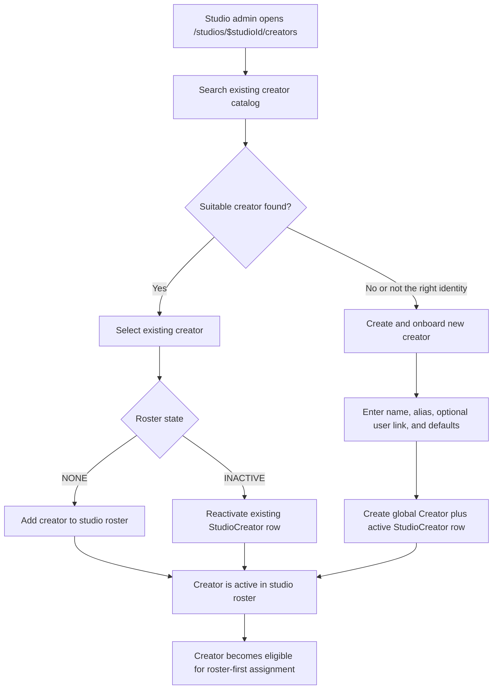

# Feature: Studio Creator Onboarding

> **Status**: ✅ Implemented — Phase 4 Wave 1, 2026-03-30 (PR #32)
> **Workstream**: Creator operations — studio onboarding and roster governance completion
> **Depends on**: [Studio Creator Roster](./studio-creator-roster.md)
> **Implementation refs**: [API types](../../packages/api-types/src/studio-creators/schemas.ts), [BE controller](../../apps/erify_api/src/studios/studio-creator/studio-creator.controller.ts), [BE service](../../apps/erify_api/src/models/studio-creator/studio-creator.service.ts), [BE canonical](../../apps/erify_api/docs/STUDIO_CREATOR_ONBOARDING.md), [FE dialog](../../apps/erify_studios/src/features/studio-creator-roster/components/add-studio-creator-dialog.tsx), [FE design](../../apps/erify_studios/docs/design/STUDIO_CREATOR_ONBOARDING_DESIGN.md)

## Problem

Studio admins could manage roster defaults and map creators to shows, but they could not onboard a brand-new creator without system-admin help. `/system/creators` was the only surface that could create a global `Creator` record, leaving routine talent intake dependent on a route reserved for system admins.

Additionally, the assignment write path only blocked *inactive* roster rows — creators with no roster entry at all could be silently assigned to shows, and the UI showed no actionable guidance when that happened.

## Users

| Role | Need |
| --- | --- |
| Studio Admin | Onboard brand-new creators from the studio workspace; reactivate roster rows; maintain defaults |
| Studio Manager | Assign only active roster creators; understand why a creator cannot be assigned |
| Studio Talent Manager | Same as Manager for assignment; clear handoff when a creator is missing from the roster |

## What Was Delivered

### Studio-owned onboarding endpoint

- `POST /studios/:studioId/creators/onboard` — creates a global `Creator` and an active `StudioCreator` row in one atomic transaction
- `ADMIN`-only; no change to `/system/creators` or broader role permissions
- Optional `user_id` links a creator to a platform user account; looked up through a studio-safe endpoint, not `/admin/users`
- `GET /studios/:studioId/creators/onboarding-users?search=&limit=` — studio-guarded user search that excludes soft-deleted users and users linked to active creators, while keeping users linked only to soft-deleted creators eligible

### Search-first onboarding dialog

- The **Add Creator** dialog on `/studios/$studioId/creators` now has two modes: `search` (default) and `create`
- Search mode queries the existing creator catalog; active matches are shown as non-actionable helpers to prevent duplicates
- **Create and onboard new creator** becomes available after any catalog search — not only on zero results
- Create mode collects name, alias, optional user link, and studio compensation defaults
- Switching back to search preserves the current search term

### Roster-first assignment enforcement fix

- `bulkAssignCreatorsToShow` previously only blocked *inactive* roster rows; creators with no roster entry at all were silently assigned
- Assignment now checks roster membership before active state:
  - `CREATOR_NOT_IN_ROSTER` (422) — creator exists globally but has no `StudioCreator` row for the studio
  - `CREATOR_INACTIVE_IN_ROSTER` (422) — creator has a row but it is inactive
- Already-assigned creators remain idempotently skipped before any roster check (no false-positive failures on re-submission)

### Role-aware mapping guidance

- Single-show assignment dialog shows persistent helper text explaining what to do when a creator is missing
- Write-time `CREATOR_NOT_IN_ROSTER` and `CREATOR_INACTIVE_IN_ROSTER` failures surface readable copy instead of raw error codes
- **Admin** sees a direct CTA to `/studios/$studioId/creators`; **Manager / Talent Manager** sees "ask a studio admin"
- Bulk assignment dialog stays open when errors remain that require user action; closes only on full success or skip-only outcomes

## User Flow

## Key Product Decisions

- **Creator identity remains global** — `Creator` is not studio-scoped, but studio-owned intake no longer requires `/system/*`.
- **Search first, create second** — catalog search is mandatory before the create path appears; reduces duplicate identity risk.
- **Loose discovery, strict writes** — creator-mapping search remains broad until availability hardening ships; assignment writes are the authoritative roster gate.
- **No silent auto-create from mapping** — onboarding is explicit through the roster flow so defaults and audit intent are captured at the right moment.
- **Studio-safe user linking** — optional `user_id` uses a dedicated studio-guarded endpoint, not the admin user list.
- **Reactivation over duplication** — re-adding an inactive creator reactivates the existing `StudioCreator` row; creating a duplicate is not permitted.

## Acceptance Record

- [x] Studio admin can onboard a brand-new creator from `/studios/$studioId/creators` without using `/system/*`.
- [x] Onboarding flow always begins with catalog search before showing create-new.
- [x] Create-new path remains available after catalog search even when returned matches are visible but not suitable.
- [x] Creating a new creator from the studio flow creates both the global `Creator` and the active `StudioCreator` row atomically.
- [x] Existing catalog creators can still be added or reactivated from the same surface.
- [x] Optional user linking is completed from the studio onboarding flow without depending on `/admin/users`.
- [x] Managers and talent managers cannot assign `roster_state = NONE` creators from single-show or bulk mapping.
- [x] Mapping UI shows a clear "onboard to roster first" message when a creator is missing or when assignment is rejected as `CREATOR_NOT_IN_ROSTER`.
- [x] Studio creator onboarding no longer depends on `/system/creators` for ordinary day-to-day operations.

## Forward References

- Roster management: [studio-creator-roster.md](./studio-creator-roster.md)
- Creator mapping flows: [creator-mapping.md](./creator-mapping.md)
- Full availability gate (deferred): [creator-availability-hardening.md](../prd/creator-availability-hardening.md)
