# Studio Shared Fields: Dedicated Table

**Status:** Ideation. Deferred follow-up to task-template v2 Phase 5; ships as documentation only.
**Scope:** Promote the studio shared-field registry from a JSONB array embedded inside `Studio.metadata` to a dedicated Prisma model. Decouples shared-field identity from the studio metadata blob, adds DB-level integrity (unique constraint, FK targetability, indexed lookup), and creates space for proper admin tooling, audit, and lifecycle management without disturbing the v2 schema-engine cutover.

---

## TL;DR

Today the registry lives at `Studio.metadata.shared_fields[]`. After task-template v2 Phase 5, every active template's `shared_field_key` references it — the registry is now a primary identity contract, not a convenience list. JSONB is the wrong storage for that contract: no `(studio_id, key)` unique constraint, no efficient indexed lookup, no targetable referent for tooling, and any edit rewrites a metadata blob shared with unrelated keys.

This ideation proposes a `studio_shared_fields` table whose first migration backfills today's registry into two record kinds:

- **`canonical`** — the canonical shared fields admins curate going forward (e.g., `gmv`, `cto`, `views`). One row per `(studio_id, key)`.
- **`legacy_reference`** — at most one row per studio, holding the **verbatim** pre-migration `Studio.metadata.shared_fields[]` array under a `legacy_entries` JSONB column. Used only by v1-snapshot lookups and historical reporting; never shown in the builder picker, never targeted by new authoring.

The registry mess (96 suffixed entries per studio in production) becomes a single legacy row plus a clean canonical set. `Studio.metadata.shared_fields[]` is removed in a follow-up window once the table is bedded in.

---

## Why now

Phase 5 of task-template v2 lands the structural v1→v2 migration but explicitly **defers** the registry cleanup (no removal of suffixed entries, no canonicalization sweep on already-v2 templates) to keep the cutover focused. After Phase 5:

- Every v2 template references a `shared_field_key` — no longer just a label, but the runtime identity used by validation (`task-template.service.ts`) and by report descriptor projection.
- 96 of 98 entries per studio are suffix-family workarounds (`gmv_l1`..`gmv_l8`) that are no longer needed structurally — v2 supports `(shared_field_key, group)` so a single canonical `gmv` covers all loops.
- The admin shared-fields UI surface keeps growing (CRUD, bulk import, audit) and each enhancement bumps against the JSONB envelope.

Task-template v2 redesigned the schema engine; this ideation does the analogous redesign for the registry it now relies on.

---

## Premises & Constraints

| #  | Premise                                                                                                                                                  | Why it matters                                                                                                                                          |
| -- | -------------------------------------------------------------------------------------------------------------------------------------------------------- | ------------------------------------------------------------------------------------------------------------------------------------------------------- |
| P1 | Phase 5 has shipped before this work begins.                                                                                                             | Templates already reference `shared_field_key`; the registry must continue to satisfy that contract throughout migration.                               |
| P2 | **Lossless migration of existing entries.** Every entry in today's `Studio.metadata.shared_fields[]` survives the cutover, either as canonical or legacy. | v1 snapshot reads still resolve suffixed keys (`gmv_l1`) for category/label metadata; we do not regress historical reports.                              |
| P3 | **Zero user-visible change** in the admin UI surface and template authoring flow during the structural migration. CRUD endpoints continue to behave the same. | Rolling out a storage change is the goal; redesigning the admin UX is a separate effort.                                                                |
| P4 | `Studio.metadata.shared_fields[]` is **removed in a follow-up phase**, not the same window the table goes live.                                          | Keeps a verifiable rollback path: until app code stops writing to metadata, we can revert without data loss.                                            |
| P5 | One source of truth post-cutover. Application code stops reading from `Studio.metadata.shared_fields[]` once the table is the source.                     | Two-source state is a bug factory. The cutover is brief, but it must end.                                                                               |
| P6 | The `legacy_reference` row is **at most one per studio** and is **never** the target of new authoring.                                                   | Keeps the canonical table clean; the legacy row is a compatibility shim, not an ongoing data model.                                                      |
| P7 | No new authorization model. Existing `sharedFields` studio access continues to gate writes.                                                              | Permission model evolution is out of scope for this redesign.                                                                                           |

---

## Proposed Design

### Table shape

```prisma
model StudioSharedField {
  id            BigInt   @id @default(autoincrement())
  uid           String   @unique               // ssf_<nanoid>
  studio        Studio   @relation(fields: [studioId], references: [id])
  studioId      BigInt

  key           String                          // canonical snake_case
  type          String                          // matches FieldTypeEnum on the template side
  category      String?                         // 'metric' | 'evidence' | 'status' | …
  label         String
  description   String?
  isActive      Boolean  @default(true)

  kind          SharedFieldKind  @default(CANONICAL)
  legacyEntries Json?                           // populated only for kind=LEGACY_REFERENCE

  createdAt     DateTime @default(now())
  updatedAt     DateTime @updatedAt
  deletedAt     DateTime?

  @@unique([studioId, key])
  @@index([studioId, isActive, kind])
}

enum SharedFieldKind {
  CANONICAL
  LEGACY_REFERENCE
}
```

UID prefix: `ssf_`, lowercase nanoid suffix consistent with existing project conventions.

### Two record kinds

- **`CANONICAL`** — the shared fields admins curate. One row per `(studio_id, key)`. Targeted by builder picker, validated against by template save, source-discovery for v2 snapshots. Soft-deletable via `deletedAt`.
- **`LEGACY_REFERENCE`** — at most one row per studio. `key` is a sentinel value (e.g., `__legacy__`) so the unique constraint allows it, `legacyEntries` stores the full pre-migration `shared_fields[]` array verbatim. Used by v1-snapshot lookups only; never shown in the picker, never targeted by new authoring.

```jsonc
// Example legacy_reference row (one per studio)
{
  "kind": "LEGACY_REFERENCE",
  "key": "__legacy__",
  "type": "text",          // sentinel, never read
  "label": "Pre-v2 registry snapshot",
  "is_active": false,
  "legacy_entries": [
    { "key": "gmv_l1", "type": "number", "category": "metric", "label": "GMV (Loop 1)", "is_active": true },
    { "key": "gmv_l2", "type": "number", "category": "metric", "label": "GMV (Loop 2)", "is_active": true },
    /* … 94 more, taken verbatim from Studio.metadata.shared_fields[] at migration time … */
  ]
}
```

### Lookup contract

| Caller                                              | Lookup                                                                                                                                                         |
| --------------------------------------------------- | -------------------------------------------------------------------------------------------------------------------------------------------------------------- |
| Builder picker                                      | `WHERE studioId = ? AND kind = 'CANONICAL' AND deletedAt IS NULL AND isActive = true`                                                                            |
| Template save validation (v2)                        | `WHERE studioId = ? AND key = ? AND kind = 'CANONICAL' AND deletedAt IS NULL`                                                                                    |
| Source discovery / report run, **v2 snapshots**     | Same as builder picker; descriptor projection is registry-agnostic.                                                                                              |
| Source discovery / report run, **v1 snapshots**     | First try `(studioId, key, CANONICAL)`. On miss, look up the studio's `LEGACY_REFERENCE` row and scan `legacy_entries[]` for `key`. Miss → category undefined.   |
| Admin shared-fields list                             | `WHERE studioId = ? AND kind = 'CANONICAL'` (legacy row is invisible to operators).                                                                              |

The v1 fallback is the only place `legacy_entries` is read at runtime. Once v1 snapshots stop being read (post-Phase 7 of task-template v2, or later), the fallback path becomes unreachable and the legacy rows can be retired.

---

## Migration Plan

Single migration window. Data flows in one direction: **JSONB → table**.

```mermaid
flowchart LR
    A[Studio.metadata.shared_fields&#91;&#93;] --> B[Backfill script]
    B --> C[CANONICAL rows<br/>for current curated fields]
    B --> D[1 LEGACY_REFERENCE row per studio<br/>verbatim copy of pre-migration array]
    C --> E[Reads/writes switch to table]
    D --> E
    E --> F[Follow-up: drop shared_fields from Studio.metadata]
```



### Phases

| Phase | Goal                                                                                                                        | Exit criteria                                                                                                              |
| ----- | --------------------------------------------------------------------------------------------------------------------------- | -------------------------------------------------------------------------------------------------------------------------- |
| **0** | Land this ideation. Confirm scope, premises, table shape with reviewers.                                                    | Doc merged.                                                                                                                |
| **1** | Prisma migration adds `studio_shared_fields` + enum. App code unchanged.                                                    | Migration deployed. Table exists, empty, no app reads/writes.                                                              |
| **2** | Backfill script (`apps/erify_api/scripts/backfill-studio-shared-fields.ts`). Dry-run / apply, idempotent (skip-if-rows-exist for studio). | All studios have one `LEGACY_REFERENCE` row + N `CANONICAL` rows derived from their pre-migration registry; metadata untouched. |
| **3** | Repository / service / controller switch to read from the table. `Studio.metadata.shared_fields[]` becomes write-only on the legacy path (mirror writes), then write-disabled. | Endpoints serve from the table; legacy column stops being written. App tests pass.                                          |
| **4** | Drop `shared_fields` key from `Studio.metadata` writes. Optional: a one-shot script deletes the key from existing rows.     | `Studio.metadata` no longer contains `shared_fields`. Single source of truth.                                              |
| **5** | (Deferred) Remove `LEGACY_REFERENCE` rows once v1 snapshot reads no longer occur.                                            | Aligns with task-template v2 Phase 7 retirement of v1 readers.                                                             |

### Backfill rules (Phase 2)

For each studio:

1. Read `Studio.metadata.shared_fields[]`.
2. Decide a canonical set:
   - Each unsuffixed entry (`gmv`, `session_review_feedback`) is canonical as-is.
   - For each suffix family (`gmv_l1`..`gmv_lN`) where all variants share `type` and `category`, derive a canonical base entry (`gmv`) — but **only** insert it as a canonical row if the base doesn't already appear in the array. (Existing canonical entries always win; we never overwrite admin intent.)
3. Insert each canonical entry as a `CANONICAL` row with stable `(uid, studio_id, key, type, category, label, description, is_active)` mapped 1:1.
4. Insert one `LEGACY_REFERENCE` row holding the entire pre-migration `shared_fields[]` array verbatim under `legacy_entries`.
5. Do **not** modify `Studio.metadata.shared_fields[]`. Phase 3+ removes it once reads have moved.

The script is dry-run / apply, idempotent (re-runs detect existing rows for the studio and skip), and produces a per-studio JSON summary suitable for review.

### App code switch (Phase 3)

- Repository: `StudioSharedFieldRepository` over the new table; existing JSONB-backed repository becomes a thin shim during the transition.
- Service: `StudioService.getSharedFields(studioUid)` returns canonical rows + legacy entries fused into the same shape today's callers expect (a flat `SharedField[]`), with a new optional flag (`{ includeLegacy?: boolean }`) defaulting to today's behavior.
- Controllers / endpoints: unchanged contract.
- Frontend: unchanged.
- v1 fallback path uses an additional repository method (`findLegacyEntry(studioId, key)`) that reads the legacy row.

---

## Decisions of Record

The follow-up PR should restate these so reviewers don't reopen them.

- **Source of truth:** dedicated table after Phase 3. `Studio.metadata.shared_fields[]` is removed in Phase 4. No two-source steady state.
- **Legacy preservation:** one `LEGACY_REFERENCE` row per studio holding the verbatim pre-migration array. Never shown in the picker, never the target of new authoring, never edited by humans.
- **Identity:** `(studio_id, key)` unique; `key` for legacy rows uses a reserved sentinel (`__legacy__`) so the unique constraint admits the special case without polluting the canonical key namespace.
- **API contract:** existing endpoints unchanged. Optional follow-up: expose a `kind` filter or a separate "legacy registry" endpoint for admin auditing.
- **Soft delete** with `deletedAt` (mirrors `Task`, `TaskTemplate`, etc.). Hard delete is reserved for explicit cleanup tooling.
- **Permission model:** unchanged. `sharedFields` studio access continues to gate writes.

---

## Open Items

| Item                                                                                                                                                                    | When                  |
| ----------------------------------------------------------------------------------------------------------------------------------------------------------------------- | --------------------- |
| Exact `legacy_entries` JSON shape — verbatim array vs. `{ "version": "v1-pre-table", "entries": [...] }` envelope. Envelope leaves room for future schema notes.        | Phase 1 PRD gate      |
| Versioning of canonical entries (rename `gmv` → `gmv_total`, type change `text` → `textarea`). Suggest: forbid type change while referenced; allow label/description edit; defer rename. | Phase 3 PRD gate      |
| Whether to add a string-FK-shaped check (validation, not DB FK) from template `shared_field_key` to canonical key on save.                                              | Phase 3 PRD gate      |
| Sentinel key collision risk if a studio admin somehow names a real shared field `__legacy__`. Suggest: validation on save rejects the sentinel namespace.                | Phase 3 PRD gate      |
| When to drop `LEGACY_REFERENCE` rows. Aligned with task-template v2 Phase 7 retirement, or a separate threshold-based gate.                                              | Phase 5 (deferred)    |

---

## Reversibility

| Phase | Reversible? | How                                                                                                                                |
| ----- | ----------- | ---------------------------------------------------------------------------------------------------------------------------------- |
| 1     | Yes         | Drop migration; table is empty.                                                                                                    |
| 2     | Yes         | Truncate `studio_shared_fields`. `Studio.metadata` is untouched. Re-runs of the backfill are idempotent.                            |
| 3     | Yes (until first table-only write) | Revert app code to read/write `Studio.metadata.shared_fields[]`. Mirror-write layer makes both stores consistent during the cutover. |
| 4     | One-way after the metadata key is dropped | Backwards migration would require backfilling JSONB from the table.                                                                |
| 5     | One-way     | Aligned with v1 snapshot retirement.                                                                                               |

The reversibility cliff is at Phase 4. Phases 1–3 are designed so we can roll back without data loss while operators verify the table-backed behavior in production.

---

## Out of Scope

These are tempting to bundle but kept separate to keep the redesign shippable:

- Cross-studio shared-field templates / clone-from-other-studio.
- Versioning / audit trail for canonical entries (rename history, deprecation notes).
- A new admin UI surface (the existing `/studios/$studioId/shared-fields` page is rewritten in place).
- Aggregation rule storage (where to store `sum`/`average` rules per shared field) — belongs in report-definition redesign.
- Permission model evolution.

---

## Relationship to Task-Template v2

This ideation is the natural continuation of the task-template v2 redesign (`../features/task-templates.md`). The v2 redesign decoupled field identity inside templates (key vs. id vs. shared_field_key); this redesign decouples shared-field identity from the studio metadata blob. The two redesigns share the same compatibility pattern: **lossless legacy preservation + one-way cutover with a clear reversibility cliff**.

When this lands, the task-template v2 redesign's Phase 7 (v1 snapshot retirement) and this ideation's Phase 5 (legacy_reference cleanup) collapse into a single deferred-cleanup operation.
