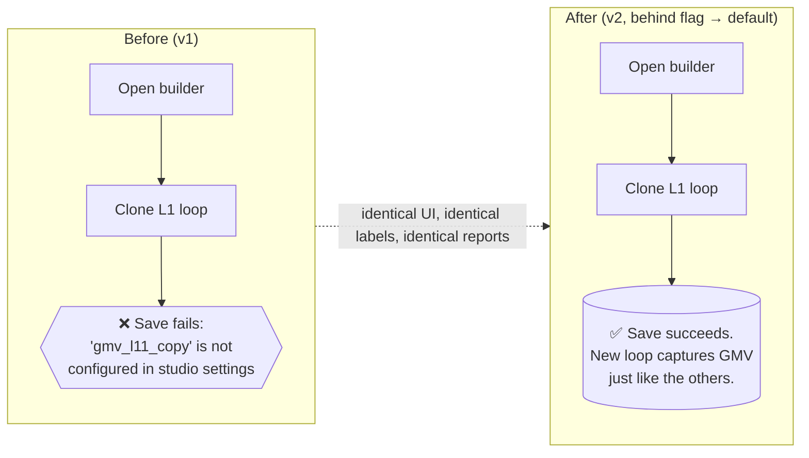
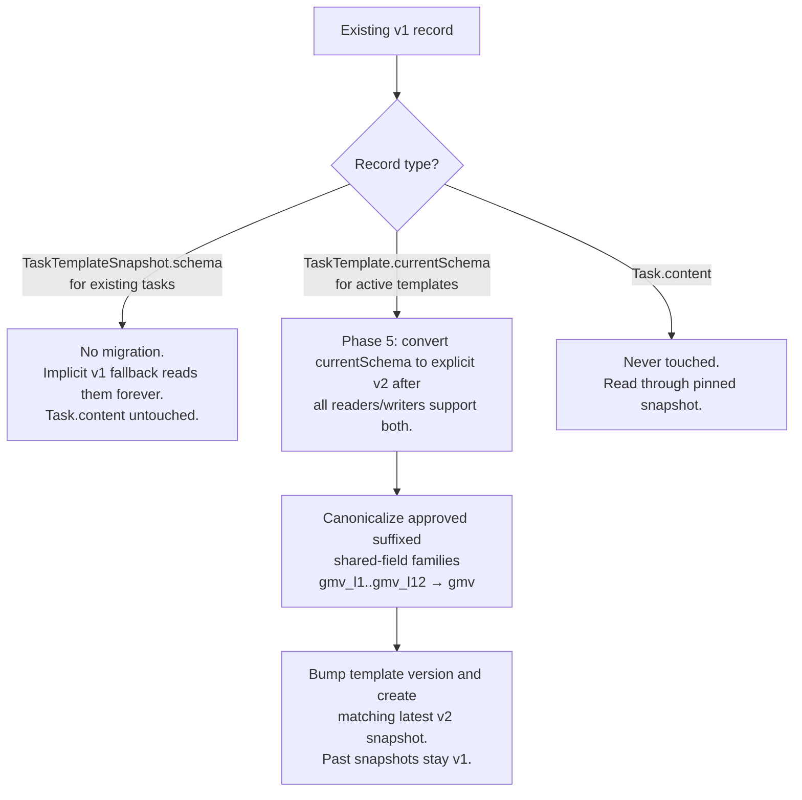
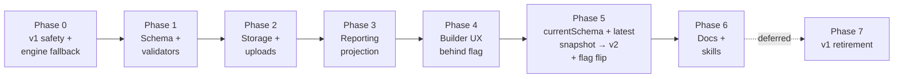
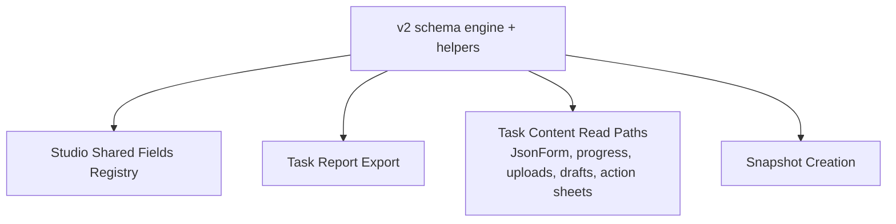

# Task Template Redesign: Decoupled Field Identity

**Status:** Direction accepted. Implementation gates are being clarified before PRD authoring.
**Scope:** Schema v2 for task template field items. Versioned coexistence with v1 snapshots; controlled upgrade of active `TaskTemplate.currentSchema` records plus matching latest v2 snapshots after readers/writers support both. No historical `Task.content` migration.

---

## TL;DR

`field.key` currently plays three roles at once: editor handle, content storage key, and shared-field reference. v2 splits those into three attributes (`key`, `id`, `shared_field_key`) so the same canonical shared input can appear in multiple loops without per-loop suffix workarounds. The change reuses existing JSON envelopes and snapshot immutability — no Prisma migration, no new tables, no rewrite of submitted task content.

**The user-facing premise: nothing changes for users except that cloning a loop stops failing.** Builder layout, execution sheet, review surfaces, report export — all visually and behaviorally identical. The schema version is invisible.

---

## Premises & Constraints

These are non-negotiable. If implementation forces any of them to break, stop and revisit the design.

| #   | Premise                                                                                                                    | Why it matters                                                                                                                                                |
| --- | -------------------------------------------------------------------------------------------------------------------------- | ------------------------------------------------------------------------------------------------------------------------------------------------------------- |
| P1  | **Zero user-visible change** beyond the loop-clone fix. No new prompts, no schema-version jargon, no migration banners.    | Users must not perceive this as a feature change. The builder picker that replaces the `standard` toggle reads as "Link to shared field" — same mental model. |
| P2  | **`Task.content` is never rewritten.** Submitted, draft, completed, and reviewed task content stays byte-for-byte stable.  | The snapshot mechanism IS the migration story. Touching content creates audit and reversibility risk that this design refuses to take on.                     |
| P3  | **No Prisma migration.** All new metadata lives inside existing JSON envelopes (`currentSchema`, new `snapshot.schema`).   | The DB columns are already opaque JSON. Adding columns would expand blast radius without unlocking anything we need.                                          |
| P4  | **v1 reads work forever.** v1 snapshots remain readable through engine-routed helpers indefinitely; no forced retirement.  | Templates that retire naturally let v1 paths age out. We should not be forced to backfill historical content under deadline pressure.                         |
| P5  | **Snapshot immutability is preserved.** Once a task pins a snapshot, that snapshot's schema JSON does not change.          | This is the existing contract. Phase 5 creates new v2 snapshots for future tasks instead of rewriting pinned v1 snapshots.                                    |
| P6  | **Studio shared-field registry shape is unchanged.** No schema or endpoint changes; admins continue to pre-create entries. | Keeps the admin UI and API surface stable. Decouples the schema redesign from a registry refactor.                                                            |

---

## What the User Sees (Before vs. After)



That diagram is the entire user-visible delta. Everything below is engineering scaffolding to deliver it safely.

---

## The Problem: One Identifier, Three Jobs

Today, every field item carries a single `key` string that is asked to do incompatible work:

```mermaid
flowchart TD
    K["field.key = 'gmv'"]
    K --> R1[Editor handle<br/>shown in builder UI]
    K --> R2[Storage key<br/>task.content&#91;'gmv'&#93; = 1500]
    K --> R3[Canonical reference<br/>links to studio.shared_fields&#91;'gmv'&#93;<br/>when standard=true]
    R2 -.->|forces template-wide<br/>uniqueness| Conflict{{"Conflict:<br/>can't have GMV in L1 AND L2<br/>without renaming one"}}
    R3 -.->|forces global<br/>uniqueness| Conflict
    R1 -.->|forces human readability| Conflict
```



The workaround in production: append `_l1`, `_l2`, …, `_l12` to keys, AND register every suffixed entry in the studio shared-fields registry as its own canonical shared field. This passes v1 validation but pollutes the registry, fragments identity, and is the direct cause of the loop-clone bug.

The clone bug: `task-template-builder.tsx:782-787` calls `createUniqueCopiedKey()`, which appends `_copy` to keys but preserves `standard: true`. The cloned `gmv_l11_copy` was never registered, so the backend rejects the save.

The bug is a symptom. The redesign fixes the structural cause.

---

## The Redesign: Three Attributes, Three Jobs

```mermaid
flowchart TD
    subgraph V2["v2 field item"]
        K2["field.key = 'gmv'<br/><i>(editor handle, per-loop unique)</i>"]
        I2["field.id = 'fld_a8x9k2lm0p'<br/><i>(path-safe, storage key)</i>"]
        S2["field.shared_field_key = 'gmv'<br/><i>(canonical shared input reference)</i>"]
    end
    K2 --> U1[Builder UI label]
    I2 --> U2["task.content&#91;'fld_a8x9k2lm0p'&#93; = 1500"]
    S2 --> U3["studio.shared_fields&#91;'gmv'&#93;<br/>category, type, label"]
    style K2 fill:#e8f4ff
    style I2 fill:#fff4e8
    style S2 fill:#e8ffe8
```



### Field item shape

| Attribute                                                                                     | v1                                                  | v2                                                                      |
| --------------------------------------------------------------------------------------------- | --------------------------------------------------- | ----------------------------------------------------------------------- |
| `id`                                                                                          | Stable React key, ad-hoc UUID                       | **Path-safe `fld_<lowercase_nanoid>`. Storage key in `task.content`.**  |
| `key`                                                                                         | Globally unique, doubles as storage + canonical ref | Editor handle, **unique per `group` (loop)**                            |
| `standard`                                                                                    | Boolean flag                                        | **Removed.**                                                            |
| `shared_field_key`                                                                            | —                                                   | **Optional. Presence = "this field reports to that canonical metric".** |
| `group`, `type`, `label`, `required`, `validation`, `default_value`, `description`, `options` | unchanged                                           | unchanged                                                               |

### Engine envelope (top-level metadata in the existing schema JSON)

```jsonc
// v1 legacy documents. Absence of engine metadata is permanently interpreted as v1.
{ "items": [ /* … */ ], "metadata": { /* … */ } }

// Optional explicit v1, accepted but not required.
{ "schema_version": 1, "schema_engine": "task_template_v1",
  "content_key_strategy": "field_key",
  "report_projection_strategy": "v1_standard_key",
  "items": [ /* … */ ], "metadata": { /* … */ } }

// v2
{ "schema_version": 2, "schema_engine": "task_template_v2",
  "content_key_strategy": "field_id",
  "report_projection_strategy": "v2_shared_field_key",
  "items": [ /* … */ ], "metadata": { /* … */ } }
```

All schema writers for v2 and later must write explicit `schema_version` and `schema_engine`. A schema without those fields is v1 by definition, even if a future v3 exists. Unknown engine metadata, mismatched version/engine pairs, or a v2-shaped document missing engine metadata fail closed as invalid schema instead of being silently rewritten.

### Field id contract

A single helper in `packages/api-types/src/task-management/task-schema-engine.ts`:

```typescript
TASK_TEMPLATE_FIELD_ID_PATTERN = /^fld_[a-z0-9]{10,}$/;
createTaskTemplateFieldId(): `fld_${string}`;
isTaskTemplateFieldId(value: unknown): value is `fld_${string}`;
```

Lower-case alphanumeric via `globalThis.crypto.getRandomValues` (works in Node 22 and the browser, no new dependency). All v2 id-generation sites — builder, clone, normalization, seeds, factories — must call it. v1 ids are accepted only on v1 schemas.

### Validation rules (v2)

1. Per-loop key uniqueness (same `key` in different `group`s is allowed).
2. Global field-id uniqueness; ids must match the path-safe pattern. The v2 schema enforces this at the Zod level: `FieldItemV2Schema.id = z.string().regex(TASK_TEMPLATE_FIELD_ID_PATTERN)`. The v1 reader path keeps `z.string()` so legacy UUIDs (`crypto.randomUUID()` output) continue to parse on v1 snapshots.
3. `shared_field_key`, if set, must exist in `studio.metadata.shared_fields[]` with matching `type`.
4. Multiple templates may use the same `shared_field_key` in the same loop group. A single schema must not define two fields with the same `(shared_field_key, group)` unless a future product rule explicitly introduces repeatable field semantics.
5. Every `group` must correspond to a loop id in `metadata.loops[]`.
6. Loop ids must match `/^l\d+$/` (or the looser `/^[a-z][a-z0-9_]*$/` if future authoring needs headroom) because they are part of shared loop report column identity and template-local loop column identity. **This codifies the existing builder behavior**: `createNextLoop()` in `task-template-builder.tsx` is the only loop-id generator and always emits `l${ordinal}`, the loop-edit UI exposes `name` editing only (no rename-loop-id affordance), and production data confirms only `l1`…`l13` exist across all 54 active templates and all 94 snapshots. v2 turns the de-facto rule into a schema-level assertion; no production migration is required, and the v1 reader path is left unchanged per P4.

`standard: true` becomes the presence of `shared_field_key`. Same enforcement, different attribute. No semantic loss.

---

## How v1 and v2 Coexist

```mermaid
flowchart LR
    Task[Task instance] --> Snap[Pinned snapshot]
    Snap --> Engine{"getSchemaEngine(schema)"}
    Engine -->|v1 / absent| V1Path[v1 reader]
    Engine -->|v2| V2Path[v2 reader]
    V1Path --> CK1["content&#91;field.key&#93;"]
    V2Path --> CK2["content&#91;field.id&#93;"]
    CK1 --> Desc[Version-neutral<br/>report descriptor]
    CK2 --> Desc
    Desc --> Out[Aligned report columns]
```



One compatibility layer in `@eridu/api-types/task-management`. No version checks scattered through components.

```typescript
getSchemaEngine(schema)              // absent metadata: v1; explicit metadata: routed engine or unsupported-engine error
getFieldContentKey(schema, field)    // v1: field.key, v2: field.id
getFieldReportColumnKey(schema, templateUid, field)
getFieldReportDescriptor(schema, templateUid, field)
getFieldSharedKey(schema, field)     // v1: standard ? key : null, v2: shared_field_key ?? null
```

Report descriptors are semantic and version-neutral. They are not raw storage keys. For repeated shared fields in looped schemas, `getFieldReportDescriptor()` derives the report column key from `(shared_field_key, group)`:

- loop `l1` shared `gmv` contributes to column `gmv_l1`;
- loop `l2` shared `gmv` contributes to column `gmv_l2`;
- the same `(shared_field_key, group)` from different task templates resolves to the same report column;
- a different group is a different column, because loop 1 and loop 2 are different reported positions;
- when a non-canonicalized legacy suffix is preserved as `shared_field_key: "gmv_l1"` with `group: "l1"`, the descriptor uses `gmv_l1` verbatim instead of appending the group again;
- if the shared input is a note/evidence/status field, it still resolves to the same per-loop shared column across templates; it is not summed;
- numeric sum or any other aggregation is opt-in through report-definition metadata and only valid when the shared-field type/category supports that aggregation;
- non-loop shared fields use the base shared key;
- template-local non-loop fields use `${templateUid}:${key}`;
- template-local loop fields use `${templateUid}:${group}:${key}` so repeated custom keys such as `notes` stay distinguishable across loops.

Report descriptors align columns only. They do not decide row grain. **v2 keeps v1's show-grain row aggregation** (one row per show). Empirically, 149/802 ACTIVE shows have multiple ACTIVE templates assigned and only 1 of those has any shared-field overlap; v2 descriptor projection is collision-equivalent to v1 for that single show (first-write-wins). The row-grain refactor (one moderation input row) is deferred; see `docs/ideation/multi-moderation-template-warning.md`.

This same descriptor pattern is the compatibility rule for future schema versions: each new schema engine may change storage details, but it must project fields into the stable descriptor contract so saved report definitions do not depend on storage identity.

---

## Builder Error Handling and Cutover Invalidation

Engine routing is transparent on the server, but the builder runs in the client and may hold an in-flight v1 edit at the moment Phase 5 upgrades the underlying `currentSchema` and latest snapshot to v2. That window also covers users who keep a tab open with stale data after a normalization run.

The contract:

- Every save and every initial load compares the engine of the locally-held schema against the engine reported by the server.
- A mismatch hard-reloads the builder with a clear message that the template was upgraded elsewhere and any unsaved edits in this tab were dropped.
- No silent merge, no attempt to translate in-flight v1 edits into v2 shape. Translation across the storage-key change is unsafe in the general case, and silently doing it would violate P1.
- Before mounting the editable builder, template create/edit routes parse the schema through the shared engine helper. Invalid schemas, unsupported future engines, and v2-shaped documents that forgot explicit metadata render a blocking error state with the template id/name and the parse reason. The editor and save controls are unavailable in that state.
- The blocking error state points operators toward the normalization script's `--validate-only` output and targeted cleanup. The builder never silently drops fields, rewrites schema metadata, or guesses an engine.

This is a real but rare UX cost — it only fires for users actively editing during the cutover window or editing on a stale tab. It is accepted as the trade-off for keeping engine routing strict and avoiding a hidden v1↔v2 translation layer in the builder.

The same engine-mismatch check applies to JsonForm sessions on a task that gets pinned to a snapshot mid-edit; submitting through the wrong engine triggers a reload rather than a coerced submit.

---

## Versioning & Migration Policy

### Schema version today

Every `TaskTemplate.currentSchema` and `TaskTemplateSnapshot.schema` record is **implicit v1**: the JSON contains no `schema_version` or `schema_engine` field, and readers infer v1 by absence. `task.content` is keyed by `field.key`. The clone bug is structural to v1 — `field.key` cannot be both globally unique within the template and match a registered shared-field key for cloned canonical metrics — so v1 cannot fix it properly.

Phase 0 patches the UX with a narrowly scoped block. The clone is blocked when **all** of the following hold:

- The schema engine is v1.
- The action is a loop clone (or any clone path that copies a shared field).
- At least one field being cloned has `standard: true`.

When blocked, the builder shows a message pointing the user to the existing workflow ("Add a new loop and use 'Add field' to pick the existing shared field from the picker."). Clones of non-shared fields and clones on v2 schemas are unaffected. The structural fix lands in v2.

Implicit and explicit v1 are interchangeable on read once the engine helpers are deployed. No metadata migration is required for v1; the absence of engine metadata is the durable legacy-v1 marker.

### Migration matrix



| Record                                          | Migration                                                                                                                             | Why                                                                                                          |
| ----------------------------------------------- | ------------------------------------------------------------------------------------------------------------------------------------- | ------------------------------------------------------------------------------------------------------------ |
| `TaskTemplateSnapshot.schema` (existing tasks)  | No migration. Existing implicit-v1 snapshots remain unchanged.                                                                        | Submitted content is keyed by v1 `field.key`; the implicit-v1 reader is the compatibility layer.             |
| `TaskTemplate.currentSchema` (active templates) | After Phases 1-4 ship, convert to explicit v2 with suffix-family canonicalization.                                                    | Future template edits should use the latest design without forcing rebuild. Labels, groups, types preserved. |
| Latest snapshot for each upgraded template      | Phase 5 bumps `TaskTemplate.version` and creates a new `TaskTemplateSnapshot` whose `schema` matches the upgraded v2 `currentSchema`. | Task generation pins the latest snapshot, so future tasks need a v2 snapshot, not only v2 `currentSchema`.   |
| `Task.content`                                  | Never changed.                                                                                                                        | Snapshot-routed; auditable; no migration window needed.                                                      |

**Cross-cutting invariants** (apply to every record type above, regardless of engine):

- **Loop-id format** is asserted on v2 (`/^l\d+$/`). Production conforms; the script flags any non-conforming case as a manual-resolve item rather than auto-renaming.
- **Snapshot orphaning** is treated as a hard error in app code. Engine routing throws when `Task.snapshot` is null; the FK stays `onDelete: SetNull` for schema flexibility but no production task is null today (1358/1358 verified).
- **Direct `Task.content` consumers** (ad-hoc SQL, analytics, BI) must read the pinned snapshot's engine envelope before interpreting content keys. v1-keyed and v2-keyed tasks coexist after Phase 5; raw-key queries silently miss one side.

### Operational script

`apps/erify_api/scripts/normalize-task-template-schemas.ts`:

- `--dry-run` — counts only, writes nothing.
- `--current-to-v2` — upgrades active `currentSchema` records, generates `fld_…` ids, maps approved suffix families to base `shared_field_key`, bumps `TaskTemplate.version`, and creates the matching latest v2 snapshot. **Skip-if-already-v2 is the default.** Before any work on a template, the script parses `schema_engine` via the engine helper; if the `currentSchema` is already v2 it logs "already upgraded, skipping" and performs no writes — no id regeneration, no version bump, no new snapshot. This is the idempotency contract: re-runs trust the engine envelope as the source of truth, not the snapshot count or the presence of `fld_…` ids. Builder edits made between runs (which create their own v2 snapshots through the normal update path) are respected. There is no `--force` flag; re-canonicalization after Phase 5 is out of scope until a real operational need surfaces.
- `--validate-only` — reports invalid, unsupported, or ambiguous schema documents without writing. Broken active templates are handled by targeted cleanup, not opportunistic coercion during normal builder load. Loop-id format is asserted as a guard, not normalized: a non-conforming loop id (none exist in current production data) is surfaced as a manual-resolve case rather than auto-renamed, because auto-renaming would silently break shared loop column identity (`gmv_l3` → `gmv_xxx`) and any saved report definitions referencing it. On already-v2 templates `--validate-only` also asserts post-conditions: every field has a stable `fld_…` id matching the path-safe pattern, and the latest snapshot's engine matches the `currentSchema` engine.
- `--apply` — required for any write. JSONL backup per run, post-apply parse verification, idempotent re-runs (via skip-if-already-v2). Partial-failure recovery is automatic: if a run crashes halfway through the 54 active templates, re-running picks up only the ones that didn't transition.
- Rollback = replay the JSONL backup. Never touches `Task.content`.

### Suffix-family canonicalization rules

The script never writes to `studio.metadata.shared_fields[]`. It mirrors the existing operational pattern: studio admins pre-create shared fields, and the picker selects from the pre-created list.

- Pattern: `^(?<base>[a-z][a-z0-9_]*?)_l[0-9]+$`.
- Canonicalize **only** when both hold:
  - All suffix variants share the same `type` and compatible shared-field `category`.
  - The base shared field (e.g., `gmv`) already exists in `studio.metadata.shared_fields[]`.
- Otherwise, leave the field as a v2 item with `shared_field_key` set to the original suffixed key (e.g., `shared_field_key: "gmv_l1"`). Preserves the admin's intent and keeps reporting deterministic.
- **Per-`(shared_field_key, group)` collision guard.** Before canonicalizing a suffix family, the script checks whether canonicalization would produce two fields with the same `(shared_field_key, group)` in the same schema (e.g., a template with both raw `gmv` and `gmv_l1` in loop `l1`). If yes, skip canonicalization for that family in that template — leave both fields with their original `shared_field_key` values verbatim — and surface the case in `--validate-only` output for manual review. Production check confirms zero such cases exist today (suffix families and raw shared fields don't co-occur in the same loop), but the guard prevents the script from writing a self-invalid v2 schema if the case ever appears.
- Preserve loop-specific `label` on each item.
- Aggregation eligibility is not part of canonicalization. A text/evidence suffix family can canonicalize to a base shared field when the base exists and the type/category match; it still exports as non-summed values unless a product-specific aggregation rule exists.
- Keep suffixed shared-field entries in the registry while any v1 snapshot, v1 current schema, or v1 saved report column still references them.

Dry-run output lists every suffix family that would canonicalize if its base entry existed, so admins can pre-create the bases they want canonicalized and re-run. Skipping pre-creation simply yields a v2 schema with suffixed `shared_field_key` values — no data is lost, just no canonicalization.

---

## Production Data Context

Read-only checks against the synced local DB:

- 54 active templates, 94 snapshots, 1,358 tasks. All implicit v1.
- 51/54 templates use loops; up to 13 loops × 245 fields. Loop ids are uniformly `l1`…`l13` across both `currentSchema` and snapshot data; `field.group` values reference only those loop ids (or `null` for non-loop fields). No non-conforming loop ids exist, so v2's loop-id assertion needs no production migration.
- 2,569 currentSchema fields and 3,929 snapshot fields use `_l<N>` suffix keys; all are `standard: true`.
- Studio shared-field registry: 98 entries, 96 of which are loop-suffixed. Only `session_review_feedback` and `session_review_mc` are unsuffixed.
- 31 saved report columns across 2 definitions, including 7 suffixed shared columns.
- ACTIVE task type assignments: 802 shows total; 149 (18.6%) have multiple ACTIVE templates assigned (legitimate "live moderation + post-show audit" pattern). Of those 149, only **1** show has any shared-field overlap between its templates. SETUP and CLOSURE types have zero multi-template shows. Implication: v2's descriptor projection introduces no new collision risk vs. v1; the single overlapping show retains today's first-write-wins behavior.

The workaround already canonicalized loop-suffixed entries as separate shared fields. Reports continue to work via descriptor-routed v1 readers; current-schema canonicalization replaces that workaround with base shared identity so future authoring, cloning, and cross-template report alignment use the same contract.

---

## Local-First Validation

Every phase runs end-to-end against the synced local DB before any production touch. The local DB shares production's data shape (54 active templates, 94 snapshots, 1,358 tasks, 96 suffixed shared fields, 31 saved-report columns), so the local pass exercises every code path the production rollout will hit.

| Phase | Local artifact captured before promoting to production                                                                                                                |
| ----- | --------------------------------------------------------------------------------------------------------------------------------------------------------------------- |
| 0     | Clone now blocks with a UX message instead of a backend rejection. All 54 active templates and 94 existing snapshots remain parse-clean through implicit-v1 fallback. |
| 1–2   | A v2 template round-trips: create → submit → draft → progress → upload → re-open. v1 byte-for-byte stable.                                                            |
| 3     | Mixed-version report run matches the v1 baseline column-for-column against the 2 saved definitions.                                                                   |
| 4     | The `gmv_l11_copy` clone scenario reproduces on v1 (now blocked with a UX message) and succeeds on v2 (clean clone with new `fld_…` ids).                             |
| 5     | `--current-to-v2 --dry-run` JSONL is reviewed; apply runs cleanly; e2e smoke (create / submit / upload / report / clone) on an upgraded template.                     |

A concurrency check is part of the local-first artifact set: open two builder tabs on the same template, run `--current-to-v2 --apply` in another terminal, and verify the engine-mismatch reload fires on save in the stale tab. This is the single highest-uncertainty piece of the design and must not be exercised first in production.

The production rollout mirrors the local sequence per phase: dry-run → row-count signoff → apply with JSONL backup → post-apply parse verification → flag flip. Reversibility per the table at the end of this doc still holds.

---

## Implementation Phases



| Phase | Goal                                                                                                                                                                                                                                                                                                                                                                                                                                                                                                                                             | Exit criteria                                                                                                                                                                                                                                                                                                         |
| ----- | ------------------------------------------------------------------------------------------------------------------------------------------------------------------------------------------------------------------------------------------------------------------------------------------------------------------------------------------------------------------------------------------------------------------------------------------------------------------------------------------------------------------------------------------------ | --------------------------------------------------------------------------------------------------------------------------------------------------------------------------------------------------------------------------------------------------------------------------------------------------------------------- |
| **0** | Block v1 clone *only* when a shared field (`standard: true`) is being cloned, with a UX message pointing to the picker workflow. Non-shared clones still work. Ship engine helpers that read absent metadata as v1 and reject unsupported explicit engines.                                                                                                                                                                                                                                                                                      | Clone of shared fields no longer reaches the registry rejection; clone of non-shared fields unaffected; active `currentSchema` and historical snapshots parse through implicit-v1 fallback; `Task.content` untouched; v1 remains the only engine in use.                                                              |
| **1** | Add v2 schema, `FieldItemV2Schema`, field-id helper, branched `validateSchema()`, FE builder schema mirror, and blocking builder error states for invalid/unsupported schemas.                                                                                                                                                                                                                                                                                                                                                                   | v2 creatable in tests/internal flows; invalid/unsupported schemas cannot be edited accidentally; v1 unchanged. No v2 user surfaces yet.                                                                                                                                                                               |
| **2** | Route content read/write, JsonForm, progress, drafts, action sheets, and uploads through `getFieldContentKey()`.                                                                                                                                                                                                                                                                                                                                                                                                                                 | v2 task storage works end-to-end; v1 byte-for-byte stable.                                                                                                                                                                                                                                                            |
| **3** | Source discovery + run projection through `getFieldReportDescriptor()`. Descriptor-derived shared loop column keys preserve saved report keys and align the same loop across task templates. **Row grain unchanged: show-grain (one row per show) is preserved.** Cross-template column collisions retain v1's first-write-wins behavior — empirically affects 1 production show today and is collision-equivalent under v2 (see Production Data Context). Mixed-version reports verified against saved definitions.                             | Mixed v1+v2 reports align column-for-column with v1 baseline against the 2 saved definitions. Row count and show-grain unchanged. Cross-template column-collision behavior unchanged from v1.                                                                                                                         |
| **4** | Behind-flag v2 builder. Existing shared-field picker rewired to write `shared_field_key` instead of `standard`. Clone-loop copies items as-is with new `fld_…` ids.                                                                                                                                                                                                                                                                                                                                                                              | Clone bug reproduces and passes on v2. v1 builder unchanged.                                                                                                                                                                                                                                                          |
| **5** | **Prerequisite:** the latest `erify_studios` deploy includes Phase 0–4 helpers and the v2 schema parser (only one web client, no mobile today). Then: `--current-to-v2` dry-run → apply. Upgrade active `currentSchema`, bump template versions, create matching latest v2 snapshots, then flip default to v2. End-to-end smoke (create / submit / upload / report / clone). Stale tabs opened against pre-Phase-0 builds are accepted as a brief reload-required window; strict parse + uniform error messaging makes the failure mode obvious. | Active templates and their latest snapshots are v2; task generation pins v2 snapshots for future tasks; new templates default v2; historical tasks read through unchanged v1 snapshots; stale-client failure mode produces a single uniform "client out of date — reload" error rather than scattered parse failures. |
| **6** | `feature-version-cutover` workflow: split `docs/features/task-templates.md`, update reporting/backend/frontend docs and skills, seed updated to v2 canonical.                                                                                                                                                                                                                                                                                                                                                                                    | All developer references describe v2 as current; v1 archived.                                                                                                                                                                                                                                                         |
| **7** | Optional. v1 helper retirement only if production v1 task count drops below a manual threshold.                                                                                                                                                                                                                                                                                                                                                                                                                                                  | Deferred.                                                                                                                                                                                                                                                                                                             |

---

## Adjacent Surfaces



### Studio Shared Fields Registry — *parallel*

- Files: `apps/erify_api/src/studios/studio-settings/studio-shared-fields.controller.ts`, `apps/erify_studios/src/routes/studios/$studioId/shared-fields.tsx`.
- Registry shape and endpoints unchanged. `studio.metadata.shared_fields[]` continues to validate via `sharedFieldsListSchema`.
- Admins continue to pre-create shared fields. The normalization script reads from the registry, never writes to it. If admins want suffixed families canonicalized, they pre-create base entries and re-run; otherwise v2 schemas keep suffixed `shared_field_key` values verbatim.
- Suffixed entries cannot be removed while any v1 snapshot, v1 currentSchema, or v1 saved report column still references them. Phase 7 is the only safe point for cleanup.

### Task Report Export — *downstream of Phase 3*

- Files:
  - `apps/erify_api/src/models/task-report/task-report-run.service.ts:226-254` — projection.
  - `apps/erify_api/src/models/task-report/task-report-scope.service.ts:84-106` — source discovery.
  - `apps/erify_api/src/models/task-report/task-report-definition*.ts` — saved definitions.
  - `apps/erify_studios/src/features/task-reports/lib/serialize-csv.ts` — CSV output (already reads server-supplied `col.key`).
- Phase 3 routes every read of `field.key` and `field.standard` through `getFieldReportDescriptor()` and dedupes by descriptor.
- Saved definitions reference v1 columns, including suffixed loop columns. The v2 descriptor derives shared loop column keys from `(shared_field_key, group)` (`gmv_l1`, `gmv_l2`, `gmv_l11`, …), so existing shared-field definitions continue to resolve across mixed-version snapshots without remapping.
- Shared loop fields are the reason for the redesign: `gmv_l3` from task template A and `gmv_l3` from task template B are one report column because both project to `(shared_field_key: "gmv", group: "l3")`. Template-local fields keep the template UID in the column key and therefore remain different columns by nature.
- Source discovery exposes shared report columns as derived field catalog entries, not only raw `studio.metadata.shared_fields[]` entries. A base shared field used in eight loop groups produces eight selectable shared columns (`gmv_l1` … `gmv_l8`) with loop/group metadata. The studio registry remains the canonical shared-field definition store; the report source API is the projection layer.
- Row grain stays show-centric (`one-row-per-show`) in v2. Cross-template column collisions (same `(shared_field_key, group)` from two ACTIVE templates on one show) keep v1's first-write-wins behavior at [task-report-run.service.ts:212-214](apps/erify_api/src/models/task-report/task-report-run.service.ts#L212-L214). Empirical scope: 1 production show today. Row-grain refactor and the corresponding cross-template collision warning are deferred (see `docs/ideation/multi-moderation-template-warning.md`).
- Template-local repeated loop fields use `${templateUid}:${group}:${key}`. Non-loop template-local fields keep `${templateUid}:${key}`. This avoids collisions when multiple loops use the same custom editor key.
- Future schema versions must keep projecting into this descriptor contract. Report definitions are keyed by semantic descriptor, not by whichever field attribute a schema version uses for `Task.content`.
- Repeated non-metric shared fields (shared notes, evidence, status) still use the same per-loop shared column across templates. They are not summed.

### Task Content Read Paths — *downstream of Phase 2*

- Files:
  - `apps/erify_studios/src/features/tasks/lib/progress.ts` — progress calculation.
  - `apps/erify_api/src/uploads/upload.service.ts:194-215` — upload field lookup.
  - `apps/erify_studios/src/components/json-form/json-form.tsx` — form rendering.
  - `apps/erify_studios/src/features/tasks/components/studio-task-action-sheet.tsx` — read-only review.
  - `packages/api-types/src/task-management/task-content-validator.ts` — `buildTaskContentSchema()`.
- Every read of `content[field.key]` routes through `getFieldContentKey()`. A grep gate before Phase 2 merge guards against bypassed paths.
- The upload presign schema (`packages/api-types/src/uploads/schemas.ts`) already validates `field_key` with `^[a-z][a-z0-9_]*$`, which accepts `fld_<lowercase_nanoid>`. Phase 2 adds an engine-aware lookup branch in the upload service.

### Snapshot Creation — *Phase 5 cutover*

- Files: `apps/erify_api/src/models/task-template/task-template.service.ts:88-92`, `:141-144` — normal create/update continues to copy `currentSchema` into `schema`.
- The normalization script must mirror the update path's versioning contract: after converting an active template's `currentSchema` to v2, bump `TaskTemplate.version` and create a new `TaskTemplateSnapshot` with that same v2 schema.
- Historical snapshots are not rewritten. Snapshot immutability remains the version-isolation story, and task generation starts using v2 only because the latest snapshot is newly created as v2.

---

## Decisions of Record

The PRD should restate these so reviewers don't reopen them.

### Engine & Versioning

- **Engine metadata** lives top-level inside the existing schema JSON. No Prisma migration. Distinct from `TaskTemplate.version` (content version) and `TaskTemplateSnapshot.metadata` (change notes).
- **Missing engine metadata means v1 forever.** Every v2+ writer must set explicit `schema_version` and `schema_engine`; unknown engines and ambiguous documents fail closed.
- **Historical v1 snapshots** remain unchanged; implicit-v1 fallback is the permanent reader for them.
- **Active currentSchema** records are upgraded to v2 only after Phases 1-4 deploy; Phase 5 also creates matching latest v2 snapshots so task generation pins v2 for future tasks.
- **API surface** exposes `schema_version` / `schema_engine` on schema reads. No translation layer.
- **Snapshot orphaning is enforced in app code, not at the DB.** `Task.snapshot` keeps `onDelete: SetNull` ([schema.prisma:595-596](apps/erify_api/prisma/schema.prisma#L595-L596)). Empirical check on synced production data: 1358/1358 tasks have a non-null `snapshot_id` and `template_id` (including soft-deleted tasks). All current task-creation flows pin a snapshot. v2 takes no Prisma migration here (preserves P3). Engine routing treats a null-snapshot task as a hard error: the helper throws (no silent v1 fallback, no engine guess), with a log line that flags the data issue for operators. Any future snapshot-cleanup tooling must respect this contract — deleting a snapshot referenced by a live task is treated as an operator error, not an automatic outcome.

### Schema & Validation

- **Storage key format** is path-safe `fld_<lowercase_nanoid>`, generated only via the shared helper.
- **Loop-id format on v2 codifies existing behavior.** `LoopMetadataSchema` on the v2 path enforces `/^l\d+$/` (or `/^[a-z][a-z0-9_]*$/` if future authoring needs headroom). Production data conforms today (`l1`…`l13` only); the builder generator (`createNextLoop`) is the single source of new loop ids and the loop-edit UI exposes `name` only. v1 reader path is unchanged. The `--current-to-v2` script asserts the rule but does not auto-rename, since renaming would break shared loop column identity and saved report definitions.
- **Shared-field type is locked** once linked, matching existing v1 behavior.

### Reporting

- **Mixed v1/v2 report export** is supported; each snapshot is read by its own engine and projected into a version-neutral descriptor.
- **Report column keys are semantic descriptors.** v2 shared loop columns derive from `(shared_field_key, group)` so the same loop/shared field across task templates exports into one column. Template-local loop columns derive from `(templateUid, group, key)`, and future schema versions must preserve the descriptor contract instead of exposing storage identity.
- **Report row grain stays show-grain in v2.** One row per show, unchanged from v1. Empirical check on synced production data: 149/802 ACTIVE shows have multiple ACTIVE task templates assigned (the legitimate "live moderation + post-show audit" pattern), but only **1** of those 149 has any shared-field overlap between its templates. v2 descriptor projection is collision-equivalent to v1 for that one show (same column derivation, same first-write-wins behavior at [task-report-run.service.ts:212-214](apps/erify_api/src/models/task-report/task-report-run.service.ts#L212-L214)). Row-grain refactor (one moderation input row) is **deferred** to a separate PRD with a clear product trigger; bundling it into v2 would add a CSV-shape change for ~19% of ACTIVE shows without a current product need.
- **Repeated shared output**: per-loop shared columns are the default. Numeric metric rollup is opt-in via report definition. Non-metric shared fields stay in the same per-loop column and are not summed.
- **Cross-template column collisions** (two templates contributing the same `(shared_field_key, group)` to one show) keep v1's first-write-wins behavior. Today's `DUPLICATE_SOURCE` warning at [task-report-run.service.ts:347-360](apps/erify_api/src/models/task-report/task-report-run.service.ts#L347-L360) only fires for same-template duplicates; it does not surface the cross-template collision case. Extending the warning and reconciling its "latest values were used" message text with the actual first-write-wins behavior are both out of scope for v2 and tracked in `docs/ideation/multi-moderation-template-warning.md`.
- **Per-loop label override** uses the existing per-item `label`. The shared field label is only the insertion default.
- **Direct `tasks.content` consumers must route through the snapshot.** Any consumer reading `Task.content` outside the application code path (ad-hoc SQL, analytics exports, debugging queries, future BI integrations) must join to the pinned `TaskTemplateSnapshot` and use the snapshot's engine envelope to interpret content keys. After Phase 5, the same `templateId` has both v1-keyed (`content['gmv_l1']`) and v2-keyed (`content['fld_…']`) tasks coexisting; querying by raw key without engine awareness silently returns partial data. The report API is the sanctioned consumer; one-off SQL should treat the engine envelope as load-bearing, not as decorative metadata.

### Builder UX

- **Builder UX**: the existing combobox-style "Link to shared field" picker is rewired to write `shared_field_key` instead of `standard`.
- **Builder schema errors** block editing and saving. Invalid schemas, unsupported engines, and v2+ schemas missing explicit engine metadata show a repair-oriented error state instead of being opened through the normal editor.
- **Client engine-mismatch handling** hard-reloads the builder (and JsonForm submission flow) with a clear message rather than translating in-flight v1 edits into v2 shape. Rare but accepted UX cost; preserves engine routing strictness.

### Operational & Deployment

- **Normalization script is read-only against `studio.metadata.shared_fields[]`.** Admins pre-create base entries when they want canonicalization.
- **Phase 5 deployment ordering for stale clients.** Only one web client exists (`erify_studios`); no mobile client today. Phase 5 prerequisite: the latest `erify_studios` deploy must include the Phase 0–4 engine helpers and the v2 schema parser before any `currentSchema` is flipped to v2. Stale tabs opened against pre-Phase-0 builds are accepted as a brief UX disruption window: the existing strict `TemplateSchemaValidator` ([template-definition.schema.ts:97-116](packages/api-types/src/task-management/template-definition.schema.ts#L97-L116)) rejects v2-shaped documents with unknown top-level keys, and the engine helper module produces one uniform "client out of date — reload" error for both engine-mismatch and unknown-engine cases so users see a single coherent message. The server-side report run is unaffected because rendering is server-driven and clients only consume the resulting columns. A future PWA-based version-negotiation/force-reload mechanism in `erify_studios` is a candidate for a separate ideation if cutover disruption becomes a recurring concern.

---

## Open Items

| Item                                                                                                  | When              |
| ----------------------------------------------------------------------------------------------------- | ----------------- |
| Report source-discovery contract for derived shared loop columns and preserved legacy suffix aliases. | Phase 3 PRD gate  |
| Report-definition aggregation contract (`none` default; `sum`/other rules opt-in and type-gated).     | Phase 3 PRD gate  |
| Mixed-version report performance benchmark on a representative dataset.                               | Phase 3 exit gate |
| v1 retirement trigger — indefinite v1 readers vs. threshold-based retirement.                         | Phase 7 only      |

---

## Deferred (Out of Scope for v2)

These were considered during v2 design and explicitly deferred. Each has its own ideation doc or will get one when product needs justify it.

| Item                                                                                                                                                                                           | Tracked in                                             |
| ---------------------------------------------------------------------------------------------------------------------------------------------------------------------------------------------- | ------------------------------------------------------ |
| Row-grain refactor (one moderation input row instead of one row per show), and the cross-template column-collision warning that would accompany it.                                            | `docs/ideation/multi-moderation-template-warning.md`   |
| `DUPLICATE_SOURCE` warning extension to cover cross-template column collisions, plus reconciling the warning's "latest values were used" text with the actual first-write-wins implementation. | `docs/ideation/multi-moderation-template-warning.md`   |
| Template-purpose attribute that would let "live moderation" and "post-show audit" templates yield distinct columns even when they share a `shared_field_key`.                                  | Future product decision; no current production driver. |

---

## File Change Map

### Required

| File                                                                                                           | Change                                                                                                                                                                                                                                                                                                                           |
| -------------------------------------------------------------------------------------------------------------- | -------------------------------------------------------------------------------------------------------------------------------------------------------------------------------------------------------------------------------------------------------------------------------------------------------------------------------- |
| `packages/api-types/src/task-management/template-definition.schema.ts`                                         | Engine metadata discriminator; missing metadata routes to v1; `FieldItemV2Schema` with `shared_field_key`, path-safe `id`, per-loop key uniqueness via `superRefine`; unknown engines fail closed.                                                                                                                               |
| `packages/api-types/src/task-management/task-schema-engine.ts` *(new)*                                         | Engine detection, field-id generation/validation, content-key / report-column-key / shared-key helpers.                                                                                                                                                                                                                          |
| `packages/api-types/src/task-management/task-content-validator.ts`                                             | `buildTaskContentSchema()` keys validators by `getFieldContentKey(schema, field)`.                                                                                                                                                                                                                                               |
| `packages/api-types/src/task-management/task-report.schema.ts`                                                 | Field catalog metadata for v2 loop/group descriptors, derived shared-loop report columns, legacy suffix aliases, and aggregation options. Registry schema unchanged.                                                                                                                                                             |
| `apps/erify_api/src/models/task-template/task-template.service.ts`                                             | `validateSchema()` branches via `getSchemaEngine()`. v2 enforces `shared_field_key` integrity.                                                                                                                                                                                                                                   |
| `apps/erify_api/src/models/task-report/task-report-scope.service.ts`                                           | Source discovery via descriptor helper; dedupes by semantic descriptor; exposes derived shared-loop column options and loop/group context.                                                                                                                                                                                       |
| `apps/erify_api/src/models/task-report/task-report-run.service.ts`                                             | Projection via semantic descriptor. **Show-grain row aggregation unchanged from v1.** Numeric metric rollup is opt-in. Cross-template column collisions retain first-write-wins per existing logic at lines 212-214.                                                                                                             |
| `packages/api-types/src/uploads/schemas.ts` + `apps/erify_api/src/uploads/upload.service.ts`                   | Engine-aware content-key branch in the field lookup. Schema regex already accepts v2 ids.                                                                                                                                                                                                                                        |
| `apps/erify_studios/src/components/json-form/json-form.tsx`, task progress helpers, draft state, action sheets | Form names, draft keys, progress, upload state via `getFieldContentKey()`.                                                                                                                                                                                                                                                       |
| `apps/erify_studios/src/features/task-reports/components/report-column-picker.tsx`, report builder             | Descriptor-driven column display, derived shared-loop column selection, and aggregation controls. CSV output already server-driven.                                                                                                                                                                                              |
| `apps/erify_studios/src/components/task-templates/builder/schema.ts`                                           | v2 client-side validation and parse helpers for blocking invalid/unsupported schemas before editable builder mount.                                                                                                                                                                                                              |
| `apps/erify_studios/src/components/task-templates/builder/task-template-builder.tsx`                           | Phase 0: on v1, block clone when any cloned field has `standard: true`; show picker-workflow message. Phase 4: behind flag, v2 metadata on create; clone-loop copies items as-is with new `fld_…` ids; existing picker writes `shared_field_key`; `createUniqueCopiedKey` / `createUniqueSharedFieldKey` not invoked on v2 path. |
| `apps/erify_api/scripts/normalize-task-template-schemas.ts` *(new)*                                            | Dry-run/apply with backup JSONL, parse verification, suffix-family canonicalization evidence, active template version bump, and matching v2 snapshot creation.                                                                                                                                                                   |
| `apps/erify_api/prisma/seed.ts`                                                                                | New seeds use `schema_version: 2`. Drop `_l1.._l12` shared-field workaround families.                                                                                                                                                                                                                                            |

### No change required

- Studio shared-field storage shape, endpoints, UI.
- Task lifecycle, status transitions, assignment, due dates.
- Authorization, studio scoping, role guards.
- Form field rendering components by type.

---

## Documentation Update Targets

To be updated in the same PR as the cutover (`feature-version-cutover.md`):

`docs/features/task-templates.md` (split v1/v2) · `docs/features/task-submission-reporting.md` · `apps/erify_api/docs/TASK_MANAGEMENT_SUMMARY.md` · `apps/erify_api/docs/TASK_SUBMISSION_REPORTING.md` · `apps/erify_studios/docs/TASK_MANAGEMENT_SUMMARY.md` · `apps/erify_studios/docs/MODERATION_WORKFLOW.md` · `apps/erify_studios/docs/JSON_FORM_SUBMISSION_UPLOAD_FLOW.md` · `.agent/skills/task-template-builder/SKILL.md` · `.agent/skills/shared-api-types/SKILL.md` · `apps/erify_api/prisma/seed.ts` · this ideation doc (mark retired once feature docs replace it).

---

## After Rollout: Promote to a Schema-Migration Skill

The structural pattern this redesign uses is reusable. Once Phase 6 (or 7) closes, promote the pattern to `.agent/skills/schema-migration-pattern/SKILL.md` so future schema redesigns reference it instead of rederiving the approach. The reusable pieces:

- Engine envelope (`schema_version` / `schema_engine`) embedded in the existing JSON column; readers treat absent metadata as legacy v1 forever, and v2+ writers must be explicit.
- Central routing helpers (`getSchemaEngine`, `getFieldContentKey`, `getFieldReportDescriptor`, …) in one shared package; no engine checks scattered through services or components.
- Semantic report descriptors as the compatibility layer for saved report definitions; future schema engines may change storage identity but must preserve descriptor projection.
- Immutable snapshot or content-pin mechanism as the version-isolation story; old data is read by its own engine, not rewritten.
- Dry-run-first normalization script with JSONL backups, post-apply parse verification, and skip-if-already-target-engine as the idempotency contract (re-runs trust the engine envelope; no `--force` flag).
- Local-first validation against synced production-shaped data, with concrete artifacts per phase.
- Per-phase reversibility boundaries; activation gated behind a flag until all readers and writers understand both engines.
- Client-side engine-mismatch handling that hard-reloads stale sessions instead of attempting cross-engine translation.

Candidate future migrations: task content shape changes, studio metadata evolution, report definition shape changes, any other JSON-backed evolving structure. This ideation doc retires once the skill is published and `docs/features/task-templates.md` reflects v2.

---

## Reversibility Summary

| Phase                                                   | Reversible?                                                                                                                                                                                                                                                                                               | How                                                               |
| ------------------------------------------------------- | --------------------------------------------------------------------------------------------------------------------------------------------------------------------------------------------------------------------------------------------------------------------------------------------------------- | ----------------------------------------------------------------- |
| 0 (v1 safety + engine fallback)                         | Yes                                                                                                                                                                                                                                                                                                       | Implicit-v1 fallback is read-only; clone blocking can be removed. |
| 1 (schema + validators)                                 | Yes                                                                                                                                                                                                                                                                                                       | Default branching is v1; remove v2 validator branch.              |
| 2 (storage + uploads)                                   | Until first v2 task content exists                                                                                                                                                                                                                                                                        | After: disable new v2 writes, keep readers.                       |
| 3 (reporting)                                           | Yes while flagged                                                                                                                                                                                                                                                                                         | v1 reports unaffected; descriptor routing additive.               |
| 4 (builder UX)                                          | Yes while flagged                                                                                                                                                                                                                                                                                         | Default stays v1.                                                 |
| 5 (currentSchema + latest snapshot upgrade + flag flip) | Reversible via JSONL backup and deleting/restoring the newly-created v2 snapshots before v2 task content exists. After v2 task content exists, rollback = stop new v2 writes and keep v2 readers. Re-running `--apply` after a partial-rollback is safe (skip-if-already-v2 guarantees no double-writes). | `Task.content` never touched.                                     |
| 6 (docs/skills)                                         | Yes                                                                                                                                                                                                                                                                                                       | Follow `feature-version-cutover` decisions.                       |
| 7 (v1 retirement)                                       | One-way                                                                                                                                                                                                                                                                                                   | Only triggered after manual threshold.                            |

The design has natural rollback boundaries because v1 and v2 are isolated read paths and activation is gated until both readers are live.
