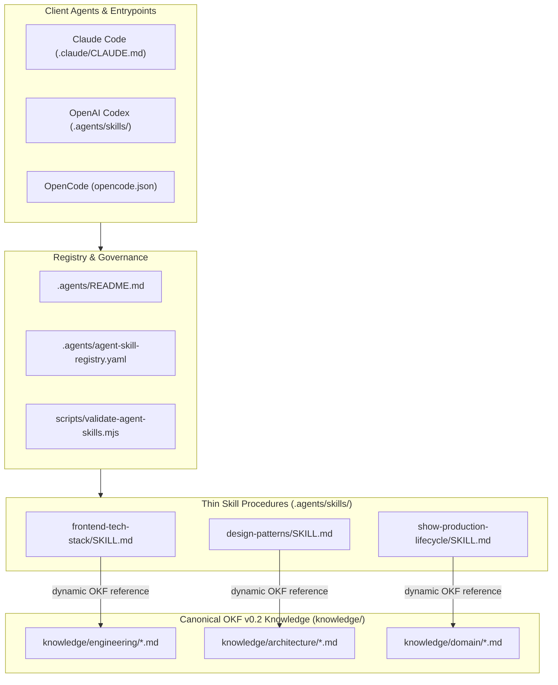

# PRD: Agentic Tool Enhancement & OKF Consolidation Program

**Status**: Active / In-Progress
**Type**: Product Requirements Document & Delivery Roadmap
**Owner**: AI Platform & Agent Systems Engineering

---

## 1. Overview & Objectives

This document serves as the repository PRD and delivery roadmap for consolidating agent skills, migrating static guides into Open Knowledge Format (OKF v0.2) bundles, establishing dynamic skill routing, and standardizing developer/agent tooling across `eridu-services`.

### Key Objectives
1. **Reduce Prompt Overhead & Token Waste**: Extract static reference material from `.agents/skills/` into canonical OKF v0.2 knowledge bundles (`knowledge/`), converting skills into thin procedural bridges.
2. **Cap Implicit Skill Routing (<50)**: Trim the active implicit skill catalog down to `<50` skills (target post-consolidation `<35`), setting `allow_implicit_invocation: false` for explicit-only workflows.
3. **Enhance Agentic Toolsuite**: Ensure developer & agent tools (`rtk`, `caveman`, `graphify`, `mattpocock`, `karpathy`) are intuitive, sharable, and documented across all supported clients.
4. **100% Cross-Client Compatibility**: Maintain full functionality across **Claude Code**, **Codex**, and **OpenCode with VSCode** without breaking public entrypoints.

---

## 2. Architecture & Knowledge Flow Diagrams

### System Architecture & Thin Skill Routing

### Catalog Token Optimization & Policy Gate

The character budget and the skill-count cap are **two different constraints**. This PR meets the character budget and does not meet the count cap; see Scope 2.3 and 2.4.

---

## 3. Compatibility Invariants

- **Public Skill Entrypoints Preserved**: Public skill IDs (`pr-ready`, `knowledge-sync`, `repository-health`, `upload-openwebui-skill`, `graphify`, `caveman`, `setup-matt-pocock-skills`, etc.) must remain discoverable and invocable across Claude Code, Codex, and OpenCode. Codex `interface:` metadata (display name, short description, icons, default prompt) is part of the entrypoint and must survive any `agents/openai.yaml` edit.
- **Thin Bridge Pattern**: When static reference material is moved to `knowledge/`, thin procedural bridges remain in `.agents/skills/<name>/SKILL.md`, and every `references/` file stays reachable from either the bridge or the knowledge concept.
- **Zero Loss of Doctrine**: Content moves to `knowledge/` **verbatim**. Resummarizing doctrine into bullets is not migration — it deletes rules. Section numbering that other documents cite (for example `database-patterns` §6 and §12) is preserved, and every citing document is repointed in the same PR.
- **No Invented Facts**: Every code-level claim written into `knowledge/` (state values, guard names, component names, script names) is verified against source first. `pnpm agents:validate` checks bundle structure, not truth.
- **Zero Loss of Functionality**: All changes must bring net-positive value to LLM prompt context size and execution speed without breaking existing slash commands or `$skill` / `/skill` triggers.

> **Note on token savings**: `pnpm agents:validate` counts only frontmatter `description` characters toward the Codex catalog budget. Thinning a `SKILL.md` **body** saves nothing against that budget — the entire reduction comes from `allow_implicit_invocation: false`. Do not delete body content in the name of catalog savings.

---

## 4. Scope & Delivery Roadmap Checklist

### Scope 1: Machine-Readable Skill Registry & Validation Tooling
- [x] **1.1 Skill Registry**: Add `.agents/agent-skill-registry.yaml` mapping all active skills to classification, lifecycle stage, and knowledge sources.
- [x] **1.2 Validation Script Enforcement**: Update `scripts/validate-agent-skills.mjs` (`pnpm agents:validate`) to check registry coverage, validate knowledge links, and enforce character budgets.
- [x] **1.3 Registry Metadata Is Enforced, Not Decorative**: `implicit` in the registry is cross-checked against each skill's `agents/openai.yaml`; drift fails validation. `implicit_catalog_ceiling` ratchets the implicit count so it cannot silently grow.
- [x] **1.4 OKF Bundle Validation**: Validate `knowledge/` structurally — bundle-root `okf_version`, fenced YAML frontmatter on every concept, non-empty `type` and `description`, `okf_version` only at the root, and index coverage.

---

### Scope 2: OKF Knowledge Migration & Skill Consolidation
- [x] **2.1 Core Engineering & Architecture OKF Migration**:
  - [x] Create `knowledge/engineering/frontend-tech-stack.md` and convert `frontend-tech-stack` to a thin procedural skill bridge.
  - [x] Create `knowledge/architecture/design-patterns.md` and convert `design-patterns` to a thin procedural skill bridge.
  - [x] Create `knowledge/architecture/service-pattern-nestjs.md` and convert `service-pattern-nestjs` to a thin procedural skill bridge.
  - [x] Create `knowledge/architecture/backend-controller-pattern-nestjs.md` and convert `backend-controller-pattern-nestjs` to a thin procedural skill bridge.
  - [x] Create `knowledge/architecture/database-patterns.md` and convert `database-patterns` to a thin procedural skill bridge.
- [x] **2.2 Core Domain OKF Migration**:
  - [x] Create `knowledge/domain/show-production-lifecycle.md` and convert `show-production-lifecycle` to a thin procedural skill bridge.
  - [x] Create `knowledge/engineering/pwa-best-practices.md` and convert `pwa-best-practices` to a thin procedural skill bridge.
  - [x] Create `knowledge/engineering/table-view-pattern.md` and convert `table-view-pattern` to a thin procedural skill bridge.
- [x] **2.3 Implicit Catalog Character Budget (<8KB limit)**:
  - [x] Configure explicit policy (`allow_implicit_invocation: false`) for presentation modes and manual workflows (`caveman`, `cavecrew`, `graphify`, `setup-matt-pocock-skills`, etc.) — 33 skills explicit-only.
  - [x] Reduce implicit description character budget from 8,991 to 7,526 characters (below the 8,000 budget).
- [ ] **2.4 Implicit Skill *Count* Cap — NOT MET**:
  - Current: **69** implicitly invocable skills. Milestone target `<50`; post-consolidation target `<35`.
  - The character budget above is met; the count cap is a separate, unfinished constraint. `implicit_catalog_ceiling: 69` prevents regression while this stays open.
  - [ ] Consolidate overlapping list pattern skills (`admin-list-pattern`, `studio-list-pattern`).
  - [ ] Consolidate quality and architecture skills (`solid-principles` into `code-quality`).
  - [ ] Lower `implicit_catalog_ceiling` in `.agents/agent-skill-registry.yaml` with each reduction.

---

### Scope 3: Agentic Tool Enhancement (`rtk`, `caveman`, `graphify`, `mattpocock`)
- [x] **3.1 Developer Tooling & Doctor Integration**:
  - [x] Update `scripts/check-agent-tooling.mjs` (`pnpm agents:doctor`) to verify `rtk`, `graphify`, `ripgrep`, Node 22, pnpm 10, and skill registry adapter.
- [x] **3.2 Shared Developer & Agent Documentation**:
  - [x] Update `AGENTS.md` with a toolsuite table for `rtk`, `caveman`, `graphify`, and `mattpocock`, each pointing at its owning skill or section.
  - [x] Drop `karpathy` as a named tool — no such skill exists. Those principles are `AGENTS.md` § Shared Behavioral Guidelines and apply unconditionally.

---

### Scope 4: Catalog Index Regeneration & Final Reconciliation
- [x] **4.1 Index Regeneration**:
  - [x] Regenerate `.agents/skills/INDEX.md` via `pnpm agents:index`.
- [ ] **4.2 Final Inventory Update & Operating Model Reconciliation**:
  - [ ] Update `docs/engineering/AGENT_CONTENT_REORGANIZATION.md` with final skill counts.
  - [ ] Conduct final end-to-end verification pass across Claude Code, Codex, and OpenCode.

---

## 5. Verification & Success Criteria

Every slice and PR must pass:

1. `pnpm agents:validate` — zero errors. This enforces registry coverage, registry/`openai.yaml` implicit agreement, the `implicit_catalog_ceiling` ratchet, OKF bundle structure, and local link resolution. The `<50` implicit-count target is reported as a warning until Scope 2.4 closes.
2. `pnpm agents:index` — regenerated; `agents:validate` fails on a stale index.
3. `pnpm agents:doctor` — All toolsuite components ready.
4. `pnpm lint:markdown` — Markdown formatting clean.
5. `pnpm lint` && `pnpm typecheck` && `pnpm build` — Zero errors across all workspaces.

Structural validation is necessary but not sufficient. Content correctness — that a documented state value, guard, or component actually exists — is a **reviewer** responsibility; no script checks it.
