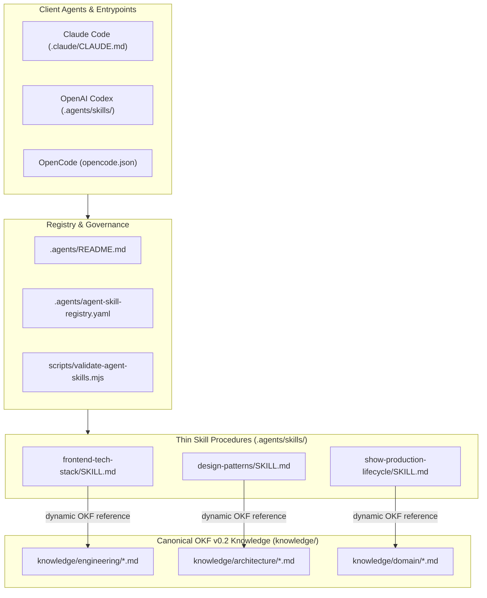
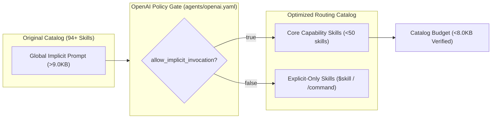

# PRD: Agentic Tool Enhancement & OKF Consolidation Program

**Status**: Active / In-Progress
**Type**: Product Requirements Document & Delivery Roadmap
**Owner**: AI Platform & Agent Systems Engineering

---

## 1. Overview & Objectives

This document serves as the repository PRD and delivery roadmap for consolidating agent skills, migrating static guides into Open Knowledge Format (OKF v0.2) bundles, establishing dynamic skill routing, and standardizing developer/agent tooling across `eridu-services`.

### Key Objectives
1. **Reduce Prompt Overhead & Token Waste**: Extract static reference material from `.agents/skills/` into canonical OKF v0.2 knowledge bundles (`knowledge/`), converting skills into thin procedural bridges.
2. **Cap Implicit Skill Routing (<50)**: Trim the active implicit skill catalog down to `<50` skills (target post-consolidation `<35`), setting `allow_implicit_invocation: false` for explicit-only workflows.
3. **Enhance Agentic Toolsuite**: Ensure developer & agent tools (`rtk`, `caveman`, `graphify`, `mattpocock`, `karpathy`) are intuitive, sharable, and documented across all supported clients.
4. **100% Cross-Client Compatibility**: Maintain full functionality across **Claude Code**, **Codex**, and **OpenCode with VSCode** without breaking public entrypoints.

---

## 2. Architecture & Knowledge Flow Diagrams

### System Architecture & Thin Skill Routing

### Catalog Token Optimization & Policy Gate

---

## 3. Compatibility Invariants

- **Public Skill Entrypoints Preserved**: Public skill IDs (`pr-ready`, `knowledge-sync`, `repository-health`, `upload-openwebui-skill`, `graphify`, `caveman`, `mattpocock`, `karpathy`, etc.) must remain discoverable and invocable across Claude Code, Codex, and OpenCode.
- **Thin Bridge Pattern**: When static reference material is moved to `knowledge/`, thin procedural bridges remain in `.agents/skills/<name>/SKILL.md`.
- **Zero Loss of Functionality**: All changes must bring net-positive value to LLM prompt context size and execution speed without breaking existing slash commands or `$skill` / `/skill` triggers.

---

## 4. Scope & Delivery Roadmap Checklist

### Scope 1: Machine-Readable Skill Registry & Validation Tooling
- [x] **1.1 Skill Registry**: Add `.agents/agent-skill-registry.yaml` mapping all active skills to classification, lifecycle stage, and knowledge sources.
- [x] **1.2 Validation Script Enforcement**: Update `scripts/validate-agent-skills.mjs` (`pnpm agents:validate`) to check registry coverage, validate knowledge links, and enforce character budgets.

---

### Scope 2: OKF Knowledge Migration & Skill Consolidation
- [x] **2.1 Core Engineering & Architecture OKF Migration**:
  - [x] Create `knowledge/engineering/frontend-tech-stack.md` and convert `frontend-tech-stack` to a thin procedural skill bridge.
  - [x] Create `knowledge/architecture/design-patterns.md` and convert `design-patterns` to a thin procedural skill bridge.
  - [x] Create `knowledge/architecture/service-pattern-nestjs.md` and convert `service-pattern-nestjs` to a thin procedural skill bridge.
  - [x] Create `knowledge/architecture/backend-controller-pattern-nestjs.md` and convert `backend-controller-pattern-nestjs` to a thin procedural skill bridge.
  - [x] Create `knowledge/architecture/database-patterns.md` and convert `database-patterns` to a thin procedural skill bridge.
- [x] **2.2 Core Domain OKF Migration**:
  - [x] Create `knowledge/domain/show-production-lifecycle.md` and convert `show-production-lifecycle` to a thin procedural skill bridge.
  - [x] Create `knowledge/engineering/pwa-best-practices.md` and convert `pwa-best-practices` to a thin procedural skill bridge.
  - [x] Create `knowledge/engineering/table-view-pattern.md` and convert `table-view-pattern` to a thin procedural skill bridge.
- [x] **2.3 Implicit Catalog Budget Optimization (<8KB limit)**:
  - [x] Configure explicit policy (`allow_implicit_invocation: false`) for presentation modes and manual workflows (`caveman`, `cavecrew`, `graphify`, `mattpocock`, `karpathy-guidelines`, etc.).
  - [x] Reduce implicit description character budget from 8,991 down to 7,458 characters (below 8,000 budget).
- [ ] **2.4 Deep Skill Deduplication & Advanced Consolidation**:
  - [ ] Consolidate overlapping list pattern skills (`admin-list-pattern`, `studio-list-pattern`).
  - [ ] Consolidate quality and architecture skills (`solid-principles` into `code-quality`).
  - [ ] Target post-consolidation implicit skill count cap (<35 skills).

---

### Scope 3: Agentic Tool Enhancement (`rtk`, `caveman`, `graphify`, `mattpocock`, `karpathy`)
- [x] **3.1 Developer Tooling & Doctor Integration**:
  - [x] Update `scripts/check-agent-tooling.mjs` (`pnpm agents:doctor`) to verify `rtk`, `graphify`, `ripgrep`, Node 22, pnpm 10, and skill registry adapter.
- [x] **3.2 Shared Developer & Agent Documentation**:
  - [x] Update `AGENTS.md` with explicit guidance for `rtk`, `caveman`, `graphify`, `mattpocock`, and `karpathy`.

---

### Scope 4: Catalog Index Regeneration & Final Reconciliation
- [x] **4.1 Index Regeneration**:
  - [x] Regenerate `.agents/skills/INDEX.md` via `pnpm agents:index`.
- [ ] **4.2 Final Inventory Update & Operating Model Reconciliation**:
  - [ ] Update `docs/engineering/AGENT_CONTENT_REORGANIZATION.md` with final skill counts.
  - [ ] Conduct final end-to-end verification pass across Claude Code, Codex, and OpenCode.

---

## 5. Verification & Success Criteria

Every slice and PR must pass:
1. `pnpm agents:validate` — 100% clean, implicit skills cap < 50.
2. `pnpm agents:doctor` — All toolsuite components ready.
3. `pnpm lint` && `pnpm typecheck` && `pnpm build` — Zero errors across all workspaces.
