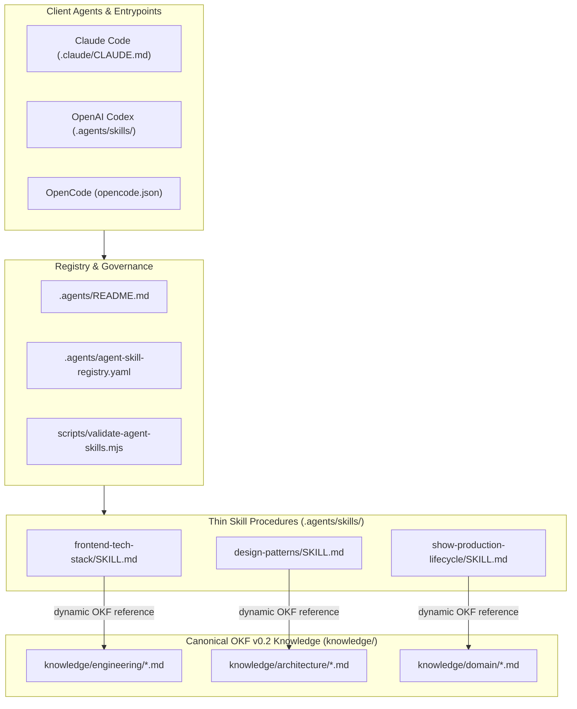
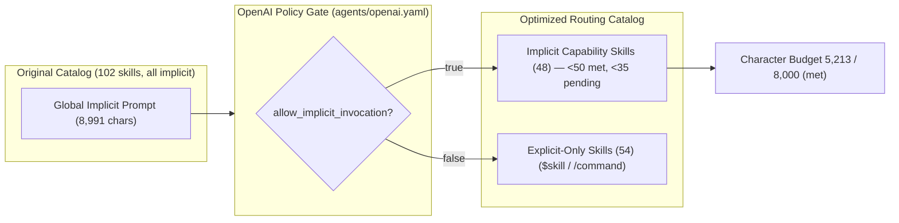

# Agentic Tool Enhancement & OKF Consolidation Program

**Status**: Active — 2 of 4 PRs merged
**Type**: Multi-PR execution tracker for repository tooling
**Owner**: AI Platform & Agent Systems Engineering

> **Doc-type note.** This is an execution tracker, not a PRD as [`docs/prd/README.md`](./README.md) defines one — it has no user stories, acceptance criteria, or product rules, and it covers repository tooling rather than a user-facing feature. It currently lives in `docs/prd/` for historical reasons. Relocating it to a roadmap tracker is tracked as row 4 below; until then, treat § 4 (PR Roadmap) as the authoritative progress record.

---

## 1. Background & Why

**Background.** `.agents/skills/` grew to 102 skills that mixed two different kinds of content: *procedures* (what an agent should do) and *knowledge* (what is true about this repo's architecture, domain, and stack). [`.agents/README.md`](../../.agents/README.md) classifies these as separate content classes with separate homes, but the tree predates that taxonomy. Two costs followed:

1. **Routing cost.** Every implicitly invocable skill contributes its `description` to the catalog Codex injects into each session. That catalog was 8,991 characters against a ~8,000-character fallback budget, so Codex could silently shorten or drop entries — degrading routing for skills that were never the problem.
2. **Retrieval cost.** Durable facts were only reachable by loading a whole procedural skill, and had no lifecycle metadata (`status`, `stale_after`, `sources`), so no agent could tell current doctrine from stale doctrine.

**Why now.** [`docs/engineering/OKF_AGENT_CONTRACT.md`](../engineering/OKF_AGENT_CONTRACT.md) already specifies the strict OKF v0.2 profile this repo targets, and [`AGENT_CONTENT_REORGANIZATION.md`](../engineering/AGENT_CONTENT_REORGANIZATION.md) already names the extraction candidates. The contract existed with nothing conforming to it. This program makes `knowledge/` real and puts the catalog under enforced limits so neither can regress silently.

**Why not just delete skills.** Skill count and catalog characters are different constraints (see § 4.1). Cutting content out of `SKILL.md` bodies saves nothing against the catalog budget — only `allow_implicit_invocation: false` does. Deleting bodies to "save tokens" trades real doctrine for zero benefit.

### Key Objectives

1. **Reduce Prompt Overhead & Token Waste**: Extract static reference material from `.agents/skills/` into canonical OKF v0.2 knowledge bundles (`knowledge/`), converting skills into thin procedural bridges.
2. **Cap Implicit Skill Routing (<50)**: Trim the active implicit skill catalog down to `<50` skills (target post-consolidation `<35`), setting `allow_implicit_invocation: false` for explicit-only workflows.
3. **Enhance Agentic Toolsuite**: Ensure developer & agent tools (`rtk`, `caveman`, `graphify`, `mattpocock`) are intuitive, sharable, and documented across all supported clients.
4. **100% Cross-Client Compatibility**: Maintain full functionality across **Claude Code**, **Codex**, and **OpenCode with VSCode** without breaking public entrypoints.

---

## 2. Architecture & Knowledge Flow Diagrams

### System Architecture & Thin Skill Routing

### Catalog Token Optimization & Policy Gate

The character budget and the skill-count cap are **two different constraints**. PR 1 met the budget; PR 2 met the `<50` count cap. The post-consolidation `<35` target remains open — see § 4.1 and Scope 2.4b.

---

## 3. Compatibility Invariants

- **Public Skill Entrypoints Preserved**: Public skill IDs (`pr-ready`, `knowledge-sync`, `repository-health`, `upload-openwebui-skill`, `graphify`, `caveman`, `setup-matt-pocock-skills`, etc.) must remain discoverable and invocable across Claude Code, Codex, and OpenCode. Codex `interface:` metadata (display name, short description, icons, default prompt) is part of the entrypoint and must survive any `agents/openai.yaml` edit.
- **Thin Bridge Pattern**: When static reference material is moved to `knowledge/`, thin procedural bridges remain in `.agents/skills/<name>/SKILL.md`, and every `references/` file stays reachable from either the bridge or the knowledge concept.
- **Zero Loss of Doctrine**: Content moves to `knowledge/` **verbatim**. Resummarizing doctrine into bullets is not migration — it deletes rules. Section numbering that other documents cite (for example `database-patterns` §6 and §12) is preserved, and every citing document is repointed in the same PR.
- **No Invented Facts**: Every code-level claim written into `knowledge/` (state values, guard names, component names, script names) is verified against source first. `pnpm agents:validate` checks bundle structure, not truth.
- **Zero Loss of Functionality**: All changes must bring net-positive value to LLM prompt context size and execution speed without breaking existing slash commands or `$skill` / `/skill` triggers.

> **Note on token savings**: `pnpm agents:validate` counts only frontmatter `description` characters toward the Codex catalog budget. Thinning a `SKILL.md` **body** saves nothing against that budget — the entire reduction comes from `allow_implicit_invocation: false`. Do not delete body content in the name of catalog savings.

---

## 4. PR Roadmap

Progress record for this program. **Every PR in this program states its row number and the remaining count in its description** (see [`pr-review.md`](../../.agents/workflows/pr-review.md) § PR description check).

| # | PR | Scopes | Depends on | Status |
| --- | --- | --- | --- | --- |
| 1 | Skill registry, validator enforcement, OKF bundle + doctrine extraction, toolsuite docs | 1, 2.1–2.3, 3, 4.1 | — | ✅ Done ([#367](https://github.com/allenlin90/eridu-services/pull/367)) |
| 2 | Implicit-catalog triage — 18 skills whose trigger is a human decision become explicit-only; ceiling lowered to 48 | 2.4 (part) | 1 | ✅ Done |
| 3 | Skill consolidation — merge `admin-list-pattern`/`studio-list-pattern`, fold `solid-principles` into `code-quality`, lower the ceiling again | 2.4 (rest) | 2 | ⬜ Not started |
| 4 | Final reconciliation — inventory counts, relocate this tracker out of `docs/prd/`, cross-client verification on Claude Code / Codex / OpenCode | 4.2 | 2, 3 | ⬜ Not started |

**Remaining: 2 of 4 PRs.**

### 4.1 Two constraints, tracked separately

| Constraint | Limit | Current | State |
| --- | --- | --- | --- |
| Implicit description characters (Codex catalog budget) | 8,000 | **5,213** | ✅ Met by PR 1 (7,074); further reduced by PR 2 |
| Implicitly invocable skill count | 50 | **48** | ✅ Met (PR 2) |
| Implicitly invocable skill count — post-consolidation | 35 | **48** | ❌ Not met — PR 3 |
| Regression ratchet (`implicit_catalog_ceiling`) | 48 | 48 | 🔒 Enforced — validation fails if exceeded |

These are independent. PR 1 met the character budget without moving the count; PR 2 moved the count. Do not report one as satisfying the other.

### Explicit-only selection criterion

`implicit` is a **Codex-only** routing signal (`agents/openai.yaml`). Claude Code and OpenCode discover skills from `.agents/skills/` directly, and explicit-only skills stay in `INDEX.md` and the `AGENTS.md` routing map — so the flip changes auto-routing, not discoverability.

A skill is explicit-only when its trigger is a **human decision** rather than *"an agent touched this code"*. PR 2 applied that to three groups: deployed-platform operations (7), authoring and meta-work (6), and deliberate investigations or one-off ops (5). Skills triggered by a code edit stay implicit, because missing one produces a defect — that is what auto-routing is for. Full rationale and membership: [`AGENT_CONTENT_REORGANIZATION.md`](../engineering/AGENT_CONTENT_REORGANIZATION.md) § Revised Provisional Inventory.

---

## 5. Scope & Delivery Roadmap Checklist

### Scope 1: Machine-Readable Skill Registry & Validation Tooling
- [x] **1.1 Skill Registry**: Add `.agents/agent-skill-registry.yaml` mapping all active skills to classification, lifecycle stage, and knowledge sources.
- [x] **1.2 Validation Script Enforcement**: Update `scripts/validate-agent-skills.mjs` (`pnpm agents:validate`) to check registry coverage, validate knowledge links, and enforce character budgets.
- [x] **1.3 Registry Metadata Is Enforced, Not Decorative**: `implicit` in the registry is cross-checked against each skill's `agents/openai.yaml`; drift fails validation. `implicit_catalog_ceiling` ratchets the implicit count so it cannot silently grow.
- [x] **1.4 OKF Bundle Validation**: Validate `knowledge/` structurally — bundle-root `okf_version`, fenced YAML frontmatter on every concept, non-empty `type` and `description`, `okf_version` only at the root, and index coverage.

---

### Scope 2: OKF Knowledge Migration & Skill Consolidation
- [x] **2.1 Core Engineering & Architecture OKF Migration**:
  - [x] Create `knowledge/engineering/frontend-tech-stack.md` and convert `frontend-tech-stack` to a thin procedural skill bridge.
  - [x] Create `knowledge/architecture/design-patterns.md` and convert `design-patterns` to a thin procedural skill bridge.
  - [x] Create `knowledge/architecture/service-pattern-nestjs.md` and convert `service-pattern-nestjs` to a thin procedural skill bridge.
  - [x] Create `knowledge/architecture/backend-controller-pattern-nestjs.md` and convert `backend-controller-pattern-nestjs` to a thin procedural skill bridge.
  - [x] Create `knowledge/architecture/database-patterns.md` and convert `database-patterns` to a thin procedural skill bridge.
- [x] **2.2 Core Domain OKF Migration**:
  - [x] Create `knowledge/domain/show-production-lifecycle.md` and convert `show-production-lifecycle` to a thin procedural skill bridge.
  - [x] Create `knowledge/engineering/pwa-best-practices.md` and convert `pwa-best-practices` to a thin procedural skill bridge.
  - [x] Create `knowledge/engineering/table-view-pattern.md` and convert `table-view-pattern` to a thin procedural skill bridge.
- [x] **2.3 Implicit Catalog Character Budget (<8KB limit)**:
  - [x] Configure explicit policy (`allow_implicit_invocation: false`) for presentation modes and manual workflows (`caveman`, `cavecrew`, `graphify`, `setup-matt-pocock-skills`, etc.) — 36 skills explicit-only at merge, including the three presentation modes added in review.
  - [x] Reduce implicit description character budget from 8,991 to 7,074 characters (below the 8,000 budget).
- [x] **2.4a Implicit Skill *Count* Cap `<50` — MET (PR 2)**:
  - [x] Move 18 human-decision-triggered skills to explicit-only: 66 → **48** implicit, 54 explicit-only.
  - [x] Lower `implicit_catalog_ceiling` 66 → 48.
- [ ] **2.4b Post-consolidation target `<35` — NOT MET**:
  - Current: **48** implicitly invocable skills.
  - [ ] Consolidate overlapping list pattern skills (`admin-list-pattern`, `studio-list-pattern`).
  - [ ] Consolidate quality and architecture skills (`solid-principles` into `code-quality`).
  - [ ] Lower `implicit_catalog_ceiling` in `.agents/agent-skill-registry.yaml` with each reduction.

---

### Scope 3: Agentic Tool Enhancement (`rtk`, `caveman`, `graphify`, `mattpocock`)
- [x] **3.1 Developer Tooling & Doctor Integration**:
  - [x] Update `scripts/check-agent-tooling.mjs` (`pnpm agents:doctor`) to verify `rtk`, `graphify`, `ripgrep`, Node 22, pnpm 10, and skill registry adapter.
- [x] **3.2 Shared Developer & Agent Documentation**:
  - [x] Update `AGENTS.md` with a toolsuite table for `rtk`, `caveman`, `graphify`, and `mattpocock`, each pointing at its owning skill or section.
  - [x] Drop `karpathy` as a named tool — no such skill exists. Those principles are `AGENTS.md` § Shared Behavioral Guidelines and apply unconditionally.

---

### Scope 4: Catalog Index Regeneration & Final Reconciliation
- [x] **4.1 Index Regeneration**:
  - [x] Regenerate `.agents/skills/INDEX.md` via `pnpm agents:index`.
- [ ] **4.2 Final Inventory Update & Operating Model Reconciliation**:
  - [ ] Update `docs/engineering/AGENT_CONTENT_REORGANIZATION.md` with final skill counts.
  - [ ] Conduct final end-to-end verification pass across Claude Code, Codex, and OpenCode.

---

## 6. Value Delivered To `master`

What each merged PR actually changed for someone working in this repo. Filled in at merge, not at open.

### PR 1 — merged

- **Agents get correct doctrine.** 8 concepts now carry the full rule set with lifecycle metadata, so a skill can no longer hand an agent a four-bullet summary in place of the rule that mattered. Restored content includes the `txHost` lazy-delegate rule, the `createdAt`-ordering trap, the optimistic-lock bump rule, the metadata-vs-audit gate, migration naming policy, and the CDN cache-poisoning section.
- **Three classes of wrong fact removed** from canonical docs: a show lifecycle with two states that do not exist, a guard API (`RolesGuard`, `@RequirePermission`) that does not exist, and two table components that do not exist. Each replaced with the verified value from source.
- **Codex catalog fits its budget**: 8,991 → 7,074 characters, 36 skills explicit-only. Codex no longer silently truncates skill entries.
- **`knowledge/` is machine-checkable.** `pnpm agents:validate` now fails on malformed OKF frontmatter, a missing `type`, an unindexed concept, registry/`openai.yaml` drift, or implicit-catalog growth. Before this, none of those were detectable.
- **Nothing is orphaned or dangling**: all 12 `references/` files reachable, all cited section numbers resolve, Codex `interface:` metadata intact.

### PR 2 — merged

- **Codex stops auto-routing to 18 skills nobody wanted auto-routed.** Deployed-platform operations (Open WebUI, LiteLLM, wiki), authoring/meta tooling, and one-off investigations now require `$skill`. An agent editing repo code can no longer be pulled into an external-platform API skill by a loose description match.
- **`<50` implicit milestone met**: 66 → **48** implicit, 54 explicit-only. Implicit descriptions 7,074 → **5,213** characters, now 65% of the Codex catalog budget rather than 94%.
- **Ratchet tightened** 66 → 48, so the reduction cannot silently erode.
- **The selection criterion is written down**, not just applied — "human decision vs. an agent touched this code", with the three qualifying groups and the reason code-edit-triggered skills stay implicit. PR 3 and future skills have a rule to apply instead of a precedent to guess at.
- **No discoverability loss anywhere**: the flip is Codex-only; all 102 skills remain in `INDEX.md` and the `AGENTS.md` routing map.

---

## 7. Verification & Success Criteria

Every PR in this program must pass:

1. `pnpm agents:validate` — zero errors. This enforces registry coverage, registry/`openai.yaml` implicit agreement, the `implicit_catalog_ceiling` ratchet, OKF bundle structure, and local link resolution. The `<50` implicit-count target is reported as a warning until Scope 2.4 closes.
2. `pnpm agents:index` — regenerated; `agents:validate` fails on a stale index.
3. `pnpm agents:doctor` — All toolsuite components ready.
4. `pnpm lint:markdown` — Markdown formatting clean.
5. `pnpm lint` && `pnpm typecheck` && `pnpm build` — Zero errors across all workspaces.

Structural validation is necessary but not sufficient. Content correctness — that a documented state value, guard, or component actually exists — is a **reviewer** responsibility; no script checks it.
