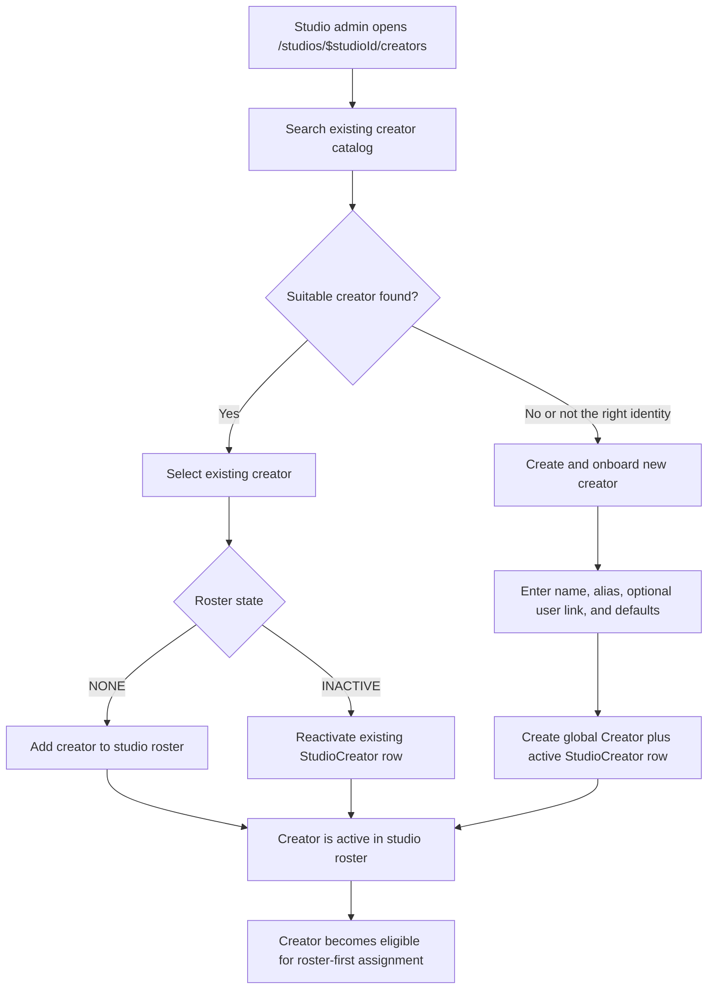
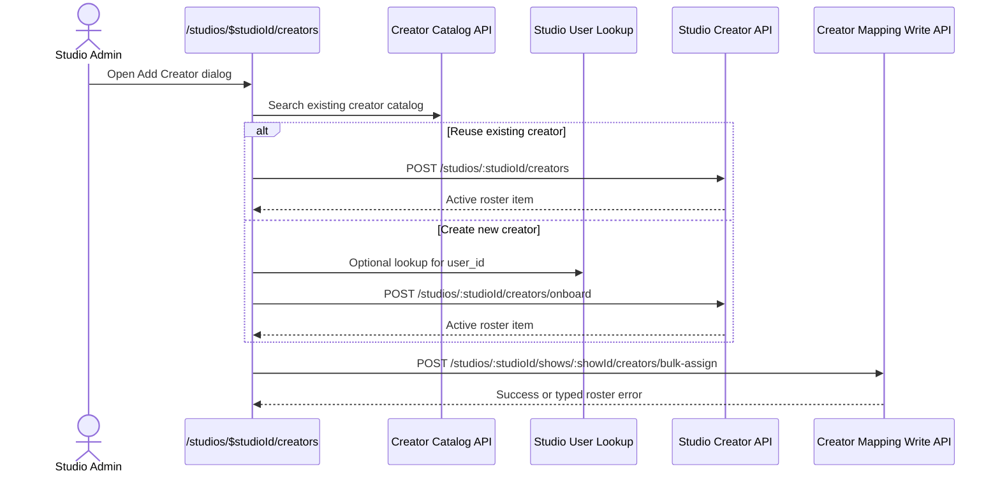

# PRD: Studio Creator Onboarding & Roster-First Assignment

> **Status**: Active
> **Phase**: 4 — Extended Scope
> **Workstream**: Creator operations — studio onboarding and roster governance completion
> **Depends on**: Studio Creator Roster — ✅ **Complete** (`docs/features/studio-creator-roster.md` provides studio-scoped roster/defaults and inactive-state enforcement)
> **Blocks**: Creator Availability Hardening, completion of studio creator management in Phase 4

## Problem

Phase 4 shipped studio creator roster CRUD and studio-side creator mapping, but the end-to-end onboarding workflow is still incomplete.

Current state:

- `/system/creators` is still the only shipped surface that can create a brand-new `Creator`, and `/system/*` is reserved for system admins.
- `POST /studios/:studioId/creators` only adds or reactivates an **existing** creator from the global catalog.
- Creator assignment writes now enforce studio roster membership, but the studio UI still lacks the full onboarding path and clear missing-creator handoff.

Consequences today:

- A studio admin cannot onboard a brand-new creator from the studio workspace without system-admin help.
- Managers and talent managers still need clearer in-product guidance when a creator is missing from the roster.
- Phase 4 cannot honestly claim "studio creator management complete" while day-to-day onboarding still depends on `/system/*`.

Key unanswered questions:

- *"What should a studio admin do when a new creator does not exist in the catalog yet?"*
- *"Should creator mapping ever allow assignment of a creator who is not in the studio roster?"*
- *"How does a talent manager resolve a missing creator without leaving the studio workspace?"*

## Design Clarifications

- **Search is mandatory before create** — the studio flow must always begin with catalog search, but "Create and onboard new creator" remains available after search even when returned matches are visible but not suitable.
- **Optional user linking must stay studio-safe** — if `user_id` is collected during onboarding, the studio flow must provide its own guarded user lookup and must not depend on `/admin/users`.
- **Mapping remains discovery-first in this slice** — current creator-mapping search may remain broad until availability hardening ships, but assignment writes are the authoritative roster gate and the UI must explain off-roster failures clearly.

## Users

- **Studio ADMIN**: onboard brand-new creators, reactivate roster rows, maintain studio defaults
- **Studio MANAGER**: assign only active roster creators; no dependency on system-admin tools
- **Studio TALENT_MANAGER**: same as Manager for assignment; needs a clear handoff when a creator is missing
- **System Admin**: retains cross-system governance, but is no longer the required operator for routine studio talent intake

## Existing Infrastructure

| Surface / Model | Current Behavior | Status |
| --- | --- | --- |
| `/system/creators` | Global creator CRUD, system-admin only | ✅ Exists |
| `POST /studios/:studioId/creators` | Adds/reactivates an existing catalog creator in the studio roster | ✅ Exists |
| `GET /studios/:studioId/creators/catalog` | Returns rostered + non-rostered creators for discovery | ✅ Exists |
| `POST /studios/:studioId/shows/:showId/creators/bulk-assign` | Accepts existing creators; rejects off-roster and inactive roster rows at write time | ✅ Exists |
| `Creator` | Global creator identity shared across studios | ✅ Exists |
| `StudioCreator` | Studio-scoped creator roster, defaults, active state | ✅ Exists |

## Requirements

### In Scope

1. **Studio-side onboarding path outside `/system/*`**
   - Add a studio-scoped onboarding workflow reachable from `/studios/$studioId/creators`.
   - A studio admin can either:
     - add/reactivate an existing catalog creator, or
     - create a brand-new creator and onboard them into the studio in one flow.
   - Ordinary studio talent onboarding must no longer require `/system/creators`.

2. **Search-first onboarding UX**
   - The flow starts by searching the existing creator catalog.
   - If a suitable creator already exists, the operator should reuse that identity instead of creating a duplicate.
   - "Create new creator" is a secondary action shown only after search, with clear copy that creator identities are global across studios.
   - The create-new path remains available after search even when visible results exist, because operators may determine that none of the returned identities are the correct creator.
   - Existing active roster matches may stay visible for duplicate prevention, but they are not addable paths.

3. **Create-and-roster in one operation**
   - Creating a new creator from the studio flow must create the global `Creator` record and the `StudioCreator` roster row in the same workflow.
   - The newly created creator is immediately active in the current studio roster after success.
   - Studio default compensation still belongs to `StudioCreator`, not to the global `Creator`.

4. **Minimum onboarding fields**
   - Required: `name`, `alias_name`
   - Optional: `user_id`, `metadata`, `default_rate`, `default_rate_type`, `default_commission_rate`
   - Linking a creator to a user account remains optional at onboarding time.
   - If `user_id` is supported in the UI, selection must happen from a studio-scoped lookup flow rather than a system-admin-only user surface.

5. **Roster-first assignment alignment**
   - Only **active studio roster creators** are assignable from `/studios/:studioId/creator-mapping`.
   - Creators with `roster_state = NONE` are not assignable in single-show or bulk assignment flows.
   - The onboarding flow and mapping UI must align with the existing write-time `CREATOR_NOT_IN_ROSTER` / `CREATOR_INACTIVE_IN_ROSTER` gate.

6. **Studio mapping UX for missing creators**
   - If an operator cannot find a creator in mapping, the UI explains that the creator must be onboarded to the studio roster first.
   - If an operator selects a creator who is rejected as off-roster, the UI surfaces the same onboarding guidance instead of only showing a generic failure.
   - Studio admins see a direct CTA back to the creator roster onboarding flow.
   - Managers and talent managers see guidance to ask a studio admin to onboard the creator.

7. **Preserve current role ownership**
   - `ADMIN`: create/onboard/reactivate/update studio creator roster
   - `MANAGER`, `TALENT_MANAGER`: read roster, assign active roster creators only
   - No expansion of `/system/*` access and no change to system-admin route rules

8. **Reactivation over duplication**
   - If the creator already has an inactive `StudioCreator` row for the studio, onboarding reactivates that row instead of creating a duplicate.
   - If the creator is already active in the roster, the flow returns the existing duplicate error rather than silently creating another path.

### Out of Scope

- Creator invitation emails or automatic account provisioning
- Cross-studio duplicate merge tools
- Fuzzy identity matching or automated duplicate resolution
- Silent creator creation directly from creator-mapping without explicit onboarding
- Expanding roster write permissions beyond `ADMIN`
- Overlap/conflict metadata rules beyond off-roster enforcement (tracked by `creator-availability-hardening.md`)

## Desired User Flow

1. A studio admin opens `/studios/$studioId/creators`.
2. They click `Add Creator`.
3. They search the existing catalog first.
4. If a matching creator exists, they add or reactivate that creator in the studio roster.
5. If no suitable creator exists, or returned matches are not the right person, they choose `Create and onboard new creator`.
6. They enter name, alias, and optional user/default-compensation fields.
7. The system creates the global creator and the active studio roster row.
8. The creator is immediately available in creator mapping.
9. Managers and talent managers only assign active roster creators from that point onward.



## Product Decisions

- **Studio onboarding may create a global creator identity** — `Creator` remains global, but routine creator intake is a studio operation and must not depend on system-admin-only routes.
- **Search first, create second** — duplicate risk is reduced by forcing catalog search before create.
- **Roster is authoritative** — assignment is roster-first, not catalog-first.
- **Loose discovery, strict assignment for this slice** — creator-mapping search may remain broad until availability hardening ships, but assignment writes must enforce roster membership immediately.
- **No silent auto-create during mapping** — onboarding happens explicitly through the roster flow so defaults and audit intent are captured at the right moment.
- **Admin-owned onboarding** — this removes the system-admin dependency without widening studio roster write permissions.
- **Studio-safe optional user linking** — if onboarding links a creator to a user account, the lookup must be available from the studio workspace itself.

## API / Route Shape

### Studio UI Surface

- Continue to use `/studios/$studioId/creators` as the onboarding home.
- The Add Creator dialog becomes a search-first onboarding flow instead of a catalog-only picker.

### API Shape

Keep the existing roster-add route for existing creators:

```http
POST /studios/:studioId/creators
```

Add a dedicated studio onboarding action for brand-new creators:

```http
POST /studios/:studioId/creators/onboard
```

Supporting lookup for optional user linking:

```http
GET /studios/:studioId/creators/onboarding-users?search=alice
```

Example request:

```json
{
  "creator": {
    "name": "Alice Example",
    "alias_name": "Alice",
    "user_id": "user_123",
    "metadata": {}
  },
  "roster": {
    "default_rate": 500,
    "default_rate_type": "FIXED",
    "default_commission_rate": null,
    "metadata": {}
  }
}
```

Expected behavior:

- `creator` creates the global identity
- `roster` creates the studio-scoped `StudioCreator` row
- response returns the canonical studio roster item so the UI can refresh the roster directly
- the optional `user_id` is chosen from a studio-scoped lookup flow rather than `/admin/users`



### Assignment Error Contract

| Code | HTTP Status | Condition |
| --- | --- | --- |
| `CREATOR_NOT_IN_ROSTER` | 422 | Creator exists globally but is not active in the studio roster |
| `CREATOR_INACTIVE_IN_ROSTER` | 422 | Creator has a studio roster row but it is inactive |

These are distinct from 403 (authorization) and 404 (creator not found).

## Acceptance Criteria

- [ ] A studio admin can onboard a brand-new creator from `/studios/$studioId/creators` without using `/system/*`.
- [ ] The onboarding flow always begins with catalog search before showing create-new.
- [ ] The create-new path remains available after catalog search even when returned matches are visible but not suitable.
- [ ] Creating a new creator from the studio flow creates both the global `Creator` and the active `StudioCreator` row.
- [ ] Existing catalog creators can still be added or reactivated in the studio roster from the same studio surface.
- [ ] Optional user linking can be completed from the studio onboarding flow without depending on `/admin/users`.
- [ ] Managers and talent managers can no longer assign `roster_state = NONE` creators from single-show or bulk creator mapping.
- [ ] Mapping UI shows a clear "onboard to roster first" message when a creator is missing or when assignment is rejected as `CREATOR_NOT_IN_ROSTER`.
- [ ] Studio creator onboarding no longer depends on `/system/creators` for ordinary day-to-day operations.

## Design Reference

- Backend design + task list: [`apps/erify_api/docs/design/STUDIO_CREATOR_ONBOARDING_DESIGN.md`](../../apps/erify_api/docs/design/STUDIO_CREATOR_ONBOARDING_DESIGN.md)
- Frontend design + task list: [`apps/erify_studios/docs/design/STUDIO_CREATOR_ONBOARDING_DESIGN.md`](../../apps/erify_studios/docs/design/STUDIO_CREATOR_ONBOARDING_DESIGN.md)
- Related shipped feature: `docs/features/studio-creator-roster.md`
- Related follow-up PRD: `docs/prd/creator-availability-hardening.md`
