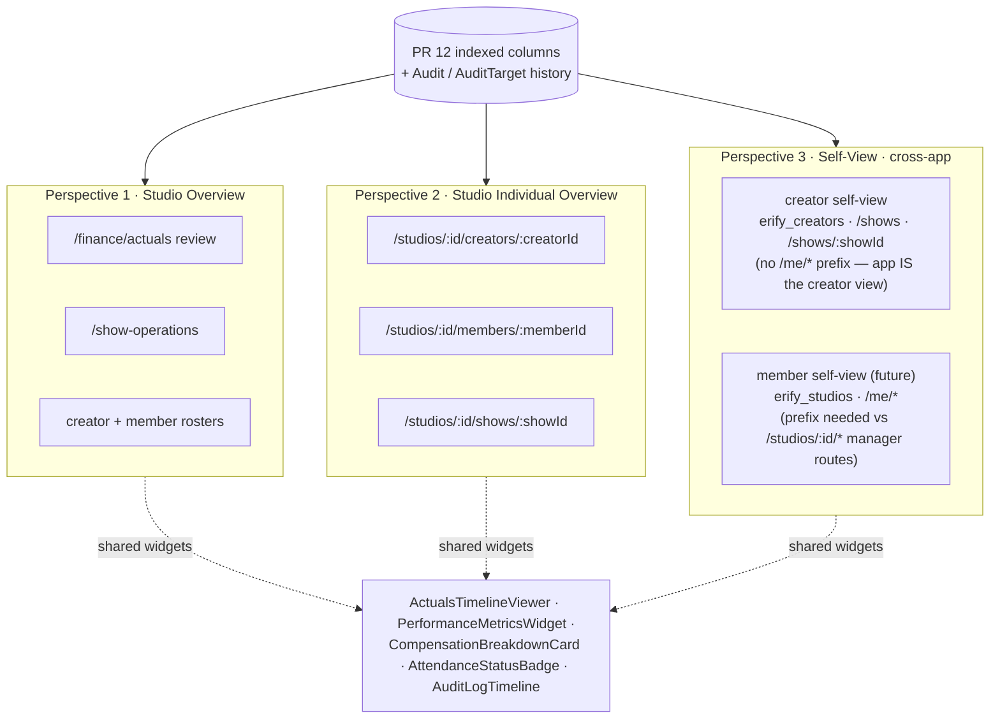

# PRD: Task-Input Fact Binding & Event-Driven Actuals (PR 12)

> **Status**: 📝 Draft Under Review  
> **Phase**: 4 — Wave 2 Core Ingestion Engine  
> **Workstream**: Operational Actuals & Performance Reporting  
> **Tracks**: [PHASE_4.md](../roadmap/PHASE_4.md) (PR 12 Meta-Row)  
> **Technical Design Reference**: [`TASK_INPUT_FACT_BINDING_DESIGN.md`](../../apps/erify_api/docs/design/TASK_INPUT_FACT_BINDING_DESIGN.md)

---

## 1. Executive Summary & Core Objective

### The Problem
Generic task templates in Erify are highly customizable and modular, but the data captured in task sheets lives as generic, untyped JSON blobs in `task.content`. 
Because the system cannot natively associate these inputs with canonical operational metrics:
1. Managers must manually re-enter actual start/end times, platform statistics (e.g. GMV, views — analytical, deferred to 12.5), and host attendance on spreadsheets or override views.
2. The database has no structured, indexed columns for these metrics, preventing efficient aggregation, real-time lateness calculation, or platform violation tracking.
3. Multiple conflicting inputs (e.g. automated scraper metrics, operator task sheets, and manager manual overrides) have no structured resolution hierarchy, leading to inconsistent actuals reporting.

### The Solution: PR 12
PR 12 implements a **type-safe, event-driven ingestion pipeline** that bridges generic operator task forms with structured, indexed columns on core database models (`Show`, `ShowCreator`, `ShowPlatform`, and `ShowPlatformViolation`). 

By introducing template-level **system fact key bindings**, the system dynamically expands simple form layouts into target-specific inputs, compares submissions against a strict **source priority resolver**, and updates indexed metrics in real-time while maintaining a bulletproof **polymorphic audit trail** with target retention.

```
+------------------------+      Instantiation      +----------------------------+
| Generic Task Template  | ──────────────────────> | Target-Hydrated Task Form  |
| - system_fact_key      |                         | - fld_gmv_platform_abc123  |
+------------------------+                         +----------------------------+
                                                                 │
                                                                 │ Submission
                                                                 ▼
+------------------------+      Ingestion          +----------------------------+
| Core Operational DB    | <────────────────────── | Extraction Ingestion Pipeline|
| - show.actual_start    |   Priority Resolver     | - Ingestion-Time Validation|
| - show_creator.actuals |                         | - Priority Logic Comparison|
+------------------------+                         +----------------------------+
            │
            ▼
+------------------------+
| Polymorphic Auditing   |
| - audits & target maps |
| - onDelete: Cascade    |
+------------------------+
```

---

## 2. Key Architectural Design Choices

To deliver high-performance reporting, seamless operator UI, and strict audit compliance, the pipeline is built around five core specifications:

### A. Additive Snapshot Hydration
Task templates remain target-agnostic. At task generation (or form rendering), the generation engine reads `system_fact_key` markers on fields and dynamically creates target-scoped input fields with stable, deterministic keys (e.g. `fld_attendance_missing_creator_<creatorUid>` or `fld_gmv_platform_<platformUid>`).
* **Append-Only Lifecycle**: If target assignments change in the database after task generation, the engine appends new fields on the next render but **never** deletes old ones, avoiding loss of in-progress operator input.
* **Stale Indicators**: Fields whose targets have been unassigned are flagged `binding_stale: true`, rendered dimmed on the form, and skipped by the ingestion pipeline.
* **Ingestion-Time Safety Net**: To protect against scenarios where an operator submits a task without opening it first after an assignment change, the ingestion engine dynamically validates targets against active database records at execution time.

### B. Event-Driven Push Model & Source Priority Resolver
Actuals are written to core models immediately upon event triggers (task submissions, telemetry sync, or manager edits). Writes are governed by a strict source-priority hierarchy:

$$\text{MANAGER\_OVERRIDE} > \text{PLATFORM\_DATA} > \text{CREATOR\_INPUT} \text{ (Reserved)} > \text{OPERATOR\_INPUT} > \text{PLANNED\_SCHEDULE}$$

* If an incoming fact is of **higher or equal priority** compared to the currently recorded source (stored in the row's `metadata.actuals_source` map), the column is updated and the audit log is written.
* If the incoming fact is of **lower priority**, the database write is skipped, but the input is preserved in `task.content` for reference and creates a `SKIPPED_LOWER_PRIORITY` audit log.

### C. Polymorphic Auditing with Join-Table Cascading (`onDelete: Cascade`)
All automated ingestion writes and manual manager overrides write to a unified `Audit` and `AuditTarget` schema.
* **The Audit Structure**: A single `Audit` row records the actor, IP, free-text `reason`, metadata (old/new values, ingestion context), and timestamp. A child table `AuditTarget` maps the audit to optional foreign keys: `showId`, `showCreatorId`, `showPlatformId`, and `studioShiftId`.
* **First-class `reason` column**: Override-class writes carry a free-text justification supplied by the actor. The codebase already collects this in the FE today (`shift-compensation-dialog`, `show-creator-compensation-dialog`) and validates it per-writer on the BE (`studio-shift hourly_rate` rejects without `override_reason`). `Audit.reason` is a top-level nullable column — not a `metadata` key — so it is indexable for review queries (e.g., "unjustified overrides this week") and gives the legacy sidecar back-fill a 1:1 target. Engine writes leave it `null`; required-ness is enforced per writer, not at the schema level.
* **History Retention via Cascading**: When a show, platform, or creator record is deleted, its matching `AuditTarget` join records are automatically deleted via `onDelete: Cascade`. Since `Audit` itself has no foreign key dependencies on the target entities, the primary historical `Audit` log is fully preserved in the database. Deleting the target automatically cleans up useless join records, preventing database bloat while keeping the core audit trail 100% intact.

### D. Safe Monetary Casting (Finance Guardrail #2)
To prevent IEEE-754 precision issues (IEEE float inaccuracies):
* Platform GMV is deferred to 12.5 (analytical). When it returns, values entered on task forms will be transported numerically but cast immediately to strict `Prisma.Decimal` in the ingestion pipe before any write; the precision (`Decimal(12, 2)` or other) is decided by the analytics infrastructure step.
* No raw JS floats are used in calculations or updates.

### E. Derived Status (Read-Side Metrics)
To minimize database writes and prevent state divergence, creator attendance status (`ON_TIME`, `LATE`, `MISSING`) and `lateMinutes` are **derived live at read time** from `ShowCreator.actualStartTime`, the `attendanceMissing` flag, and `Show.startTime`. They are never persisted as static columns.

### F. Three-Perspective UI & Reusable Component Pattern
To maintain visual consistency and ease development, every PR 12 feature scoped to an identity-bearing entity (`Creator`, studio `Member`, `Show`) ships across **three unified perspectives**:



1. **Studio Overview**: Studio-wide aggregate dashboards, grids, and operations reviews (e.g. `/finance/actuals` review dashboard, `/show-operations`, creator/member roster tables).
2. **Studio Individual Overview**: Single-entity detail pages accessed by managers from studio rosters — applies to **creators**, **members**, and **shows** (e.g. `/studios/:id/creators/:creatorId`, `/studios/:id/members/:memberId`, `/studios/:id/shows/:showId`).
3. **Individual Overview**: first-person self-view for the logged-in entity, with a cross-app boundary:
   - **Creator self-view** = the entire `erify_creators` app. Routes are top-level (`/shows`, `/shows/:showId`); no `/me/*` prefix, because the JWT scope already identifies the viewer as the creator.
   - **Member self-view** = a future `/me/*` surface inside `erify_studios`. The `/me/*` prefix is required there to disambiguate from `/studios/:id/*` manager routes that share the same app.
   - Because P3 for creators lives in a *different app* from P1/P2, any widget reused across these perspectives must live in a shared package (`@eridu/ui` or a domain-shared package), not in either app's `src/features/`.

**Scope per sub-PR**: which of the three perspectives ship is decided by each sub-PR. PR 12.4 lights up Perspective 1 (`/finance/actuals` review); Perspective 2 detail pages and `/me/*` self-views are introduced incrementally as their host routes land. Use the three-perspective layout as a design checklist for new features, not as a same-PR delivery mandate.

**Shared Component Mandate**: To avoid logic drift, raw queries or visualization code must not be duplicated across perspectives that *do* ship together. Unit components (`ActualsTimelineViewer`, `PerformanceMetricsWidget`, `CompensationBreakdownCard`, `AttendanceStatusBadge`, `AuditLogTimeline`) live in reusable packages or shared app folders and are consumed identically by each perspective, varying only by the query parameters / role scopes passed in. See [`TASK_INPUT_FACT_BINDING_DESIGN.md` §5–6](../../apps/erify_api/docs/design/TASK_INPUT_FACT_BINDING_DESIGN.md#5-frontend-surfaces--endpoint-map) for the read-shape map and per-widget coverage matrix.

### G. Performance Review as Upstream of Economics Review
PR 12 stands up the **operational performance review surface** (PR 12.4 — actuals & abnormality dashboard). It is the upstream counterpart to [PR 13's economics review surface](../roadmap/PHASE_4.md#pr-13--economics-review-surface) at `/studios/:id/finance/economics`: operational facts (actual times, attendance, violations) are captured and reviewed here first; only after they're trustworthy does the economics surface read them as cost inputs. Late arrivals, no-shows, and platform violations are tracked here primarily because they are **damage-causing operational events** that downstream economics may translate into deductions and penalties — but the storage and review layer is intentionally agnostic to monetary impact. PR 12 never writes derived finance totals or analytical aggregates; it only emits typed operational facts. Analytical metrics (GMV, viewer count, CTR, CTO, trend dashboards, OLAP/read-model infrastructure) are deferred to the 12.5 post-investigation.

---

## 3. Section-by-Section Deliverables Breakdown

Implementation is structured into **three logical sections** totaling 11 reviewable PRs. Each section serves a distinct functional layer.

```
   ┌─────────────────────────────────────────────────────────────┐
   │                    SECTION C: REVIEW SURFACE                │
   │  - PR 12.4: Abnormality Dashboard, Sign-Off, Stale Queue    │
   └──────────────────────────────┬──────────────────────────────┘
                                  ▼
   ┌─────────────────────────────────────────────────────────────┐
   │                    SECTION B: EXTRACTORS                    │
   │  - PR 12.1.1: Show Times      - PR 12.2: Creator Attendance │
   │  - PR 12.1.2: Platform Times  - PR 12.3.2: Violations       │
   │  - PR 12.3.1 (GMV/Views) → deferred to 12.5                 │
   └──────────────────────────────┬──────────────────────────────┘
                                  ▼
   ┌─────────────────────────────────────────────────────────────┐
   │                    SECTION A: FOUNDATION                    │
   │  - PR 12.0.1: Audit Models    - PR 12.0.4: Form Hydration    │
   │  - PR 12.0.2: Core DDL Diffs  - PR 12.0.5: Ingestion Core &  │
   │  - PR 12.0.3: Field Picker                 Wire-Label Rename│
   └─────────────────────────────────────────────────────────────┘
```

---

### SECTION A: Foundation (PRs 12.0.1 – 12.0.5)
*This section delivers the database schema additions, core audit models, template config picker, form rendering hydration, and the central ingestion priority resolver engine.*

#### 🟩 PR 12.0.1 · `Audit` / `AuditTarget` Foundation — ✅ Shipped in [#91](https://github.com/allenlin90/eridu-services/pull/91)
* **Purpose**: Establish polymorphic audit schemas with target retention and a first-class `reason` column to trace all automated writes and overrides.
* **Functional Deliverable**: 
  * Schema definition for `Audit` and `AuditTarget` using `onDelete: Cascade` on target foreign keys to clean up join records.
  * Top-level `Audit.reason` column (nullable) so the existing FE override flows that already collect `override_reason` (shift-compensation, show-creator-compensation, etc.) land in a first-class, indexable field instead of a `metadata` key.
  * Backend repositories, services, and Zod verification schemas.
  * A read-time **legacy sidecar merger** that seamlessly projects old metadata audits (`metadata.audit.snapshot_overrides[]`) and new `Audit` records in one unified timeline. The merger reads the new `reason` column with a fallback to `metadata.reason` for any pre-column rows back-filled later.

#### 🟩 PR 12.0.2 · Phase 4 Actuals Schema Additions — ✅ Shipped in [#92](https://github.com/allenlin90/eridu-services/pull/92)
* **Purpose**: Run a single, clean SQL database migration that adds all operational columns and indices upfront.
* **Functional Deliverable**:
  * `Show`: Uses the existing `actualStartTime` / `actualEndTime` operational columns and adds the actual-time index. No show-level performance JSONB bucket.
  * `ShowCreator`: Adds `actualStartTime`, `actualEndTime`, `attendanceMissing`, and `attendanceReason`.
  * `ShowPlatform`: Adds `actualStartTime`, `actualEndTime`, and the actual-time index. **No** `gmv`, `performanceMetrics`, or new index on `viewerCount` — all platform-scoped performance metrics are classified as analytical and deferred to 12.5 (see [`show-performance-analytics-infra.md`](../ideation/show-performance-analytics-infra.md)). `viewerCount` retains its pre-existing `Int @default(0)` column from the init migration but is treated as an analytical fact.
  * `ShowPlatformViolation`: Creates the violation table and indices.
  * **No logic, no routes**: This is a pure DDL migration. Downstream PRs assume these columns compile.

#### 🟩 PR 12.0.3 · Fact-Key Binding Picker
* **Purpose**: Allow studio producers to bind template fields to system fact keys.
* **Functional Deliverable**:
  * Binds `FieldItemV2Schema` in `@eridu/api-types` to a closed `system_fact_key` enum.
  * Adds save-time Zod validations: ensures field types match fact key types (e.g. `creator_attendance_missing` restricts type to `checkbox`, `show_actual_start_time` restricts to `datetime`) and rejects duplicate fact-key bindings in the same template. Analytical fact keys (`platform_gmv`, `platform_view_count`, etc.) re-enter the catalog once 12.5 lands.
  * **Template Builder UI**: Exposes a searchable "Auto-fill record field" binding picker (with an info-icon tooltip explaining downstream behavior) for template designers.
  * `creator_attendance_missing` uses the existing `require_reason: "on-true"` sidecar flow for the operator's explanation; there is no separate `creator_attendance_reason` binding input.

#### 🟩 PR 12.0.4 · Dynamic Target-Scoped Form Hydration — ✅ Shipped in [#95](https://github.com/allenlin90/eridu-services/pull/95)
* **Purpose**: Dynamically expand a template's bound fields into individual inputs for each assigned creator or platform.
* **Functional Deliverable**:
  * Pure `hydrateTaskFormSchema` in `@eridu/api-types/task-management` plus `buildHydratedContentKey` / `parseHydratedContentKey` for the deterministic `<fieldId>__<scope>__<uid>` key format.
  * Task read responses expose `show_creators` / `show_platforms` UIDs and a `hydration_context` block on `taskWithRelationsDto`.
  * BE: `TaskValidationService.validateContent` accepts a `hydrationContext` and re-runs hydration server-side so `require_reason` and other per-field rules apply per-target; stale items have `require_reason` stripped to keep submission unblocked.
  * FE: `resolveHydratedTaskSchema` consumed by `task-execution-sheet`, `studio-task-action-sheet`, and `my-task-card`; `JsonForm` recognizes `binding_stale: true` and renders the row dimmed, read-only, with an amber "Target no longer assigned" explainer.
  * **Storage contract** (revised from the original design wording): the template snapshot stays immutable. There is no per-task snapshot clone and no append-only mutation; per-task hydration is computed at render and submission time from `task.content` + the show's current assignments. Submitted tasks (`COMPLETED` / `CLOSED`) freeze their content; later re-renders do not rehydrate.

#### 🟩 PR 12.0.5 · Ingestion Pipeline Foundation, Wire-Label Rename & Show Task Assignment Check
* **Purpose**: Ship the core priority resolver pipeline, write a smoke-test extractor, implement the atomic label rename, and align the show operations views with task assignments.
* **Functional Deliverable**:
  * Ingestion pipeline: reads `task.content`, validates targets against active DB records, compares source priorities, and writes audited facts or skips them (`SKIPPED_LOWER_PRIORITY`).
  * Smoke test: wires the pipeline end-to-end for `show_actual_start_time` → `Show.actualStartTime`.
  * Cross-task collision guard: before ingestion, detect active tasks assigned to the same show that bind the same fact key and route the lower-priority or ambiguous write to the review path instead of overwriting silently.
  * **Wire-Label Rename**: Atomic find-and-replace of `OPERATOR_RECORD` to `OPERATOR_INPUT` across all backend schemas, frontend calculators, and compensation badge components in `/me/` and `/studios/` views.
  * **`/show-operations` Task-Assignment Alignment**:
    * **Backend (BE)**: Update the `/show-operations` query endpoint to check for active task assignments and return `has_proper_task_assignment: boolean`.
    * **Frontend (FE)**: Update `/show-operations` in `erify_studios` to display an amber/orange warning badge: ⚠️ `No Task Assigned` for any show without a valid active task template or sheet assignment, linking directly to the task instantiation modal.

---

### SECTION B: Extractors (PRs 12.1.1 – 12.3.2)
*This section implements the specific business logic, data validation, and extraction scripts for each distinct fact key.*

#### 🟦 PR 12.1.1 · Show Actuals Extractor
* **Purpose**: Extract overall show timelines.
* **Functional Deliverable**:
  * Extracts `show_actual_start_time` and `show_actual_end_time` → `Show` columns.
  * Asserts the validation invariant: start time must be before end time.

#### 🟦 PR 12.1.2 · ShowPlatform Stream Times Extractor
* **Purpose**: Extract platform stream timelines.
* **Functional Deliverable**:
  * Extracts platform-specific stream windows (`show_platform_actual_*_time`) → `ShowPlatform` actual columns.

#### 🟦 PR 12.2 · Creator Actuals & Attendance Extractor
* **Purpose**: Extract individual host times and enforce reasons for host abnormalities.
* **Functional Deliverable**:
  * Extracts `ShowCreator` times and `attendanceMissing`.
  * **Read-Side Derivation**: Implements live lateness, presence (`ON_TIME` / `LATE` / `MISSING`), and `lateMinutes` math (e.g. `ShowCreator.actualStartTime` compared against `Show.startTime`).
  * Enforces `attendanceReason` on `LATE`/`MISSING` statuses from the task field reason sidecar. Safe fallback logic writes a system flag if the builder failed to collect the operator reason, preventing form blockages.

#### ⬜ PR 12.3.1 · Platform GMV/Views Extractor — **Deferred to 12.5**
* **Status**: Removed from Phase 4 critical path. GMV and viewer count are analytical metrics; their storage shape (typed column, read model, or OLAP path) is decided by the 12.5 analytics infrastructure investigation. The original purpose, casting rules, and default-zero disambiguation logic carry forward; see [`show-performance-analytics-infra.md`](../ideation/show-performance-analytics-infra.md).

#### 🟦 PR 12.3.2 · Platform Violations Extractor
* **Purpose**: Extract stream-level warnings and violations.
* **Functional Deliverable**:
  * Writes record rows into `ShowPlatformViolation`.
  * **Replace-All Scope**: A task re-submission only supersedes violation records created by *that specific task field* (`(sourceTaskId, sourceFieldId)`). It leaves manual manager-entered violations or violations from other tasks untouched.

---

### SECTION C: Review Surface (PR 12.4)
*This section builds the management portal where studio managers audit ingested data, manage anomalies, and log operational sign-offs.*

#### 🟨 PR 12.4 · Actuals & Performance Review Sign-Off
* **Purpose**: Consolidate actuals and platform metrics into a control panel with sign-off audits.
* **Functional Deliverable**:
  * **Review Screen**: Date-range filtering dashboard displaying actual timelines, platform metrics, and violation counts.
  * **Abnormality Highlighter**: Visual flags for incomplete time pairs, missing/late hosts, active platform violations, and manager-vs-platform source conflicts. (GMV / views abnormality highlights re-enter once 12.5 decides the analytical storage path.)
  * **Stale Queue**: Panel to resolve values submitted for unassigned/stale targets.
  * **Bulk Sign-Off**: Action logging the selected range, signing manager, timestamp, and active unresolved anomalies for the compliance audit trail.
  * **Incremental Rollout**: Wires up first widgets as soon as 12.1.1 merges; additional widgets automatically activate as 12.1.2–12.3.2 land in the database.

---

## 4. Verification Gates per PR (Mandatory Checklist)

Every sub-PR within Sections A, B, and C must pass the monorepo quality checklist before merge approval:

```bash
# Backend Verification Gate
pnpm --filter erify_api lint && pnpm --filter erify_api typecheck && pnpm --filter erify_api test && pnpm --filter erify_api build

# Frontend Verification Gate
pnpm --filter erify_studios lint && pnpm --filter erify_studios typecheck && pnpm --filter erify_studios test && pnpm --filter erify_studios build
```

---

## 5. Deferrals & Future Scope (Post-Phase-4)

The following items are explicitly **out of scope** and deferred to subsequent phases:
1. **Settlement Gating**: Gating compensation calculations on absolute actuals "Settled" state.
2. **System Write-Freeze Guards**: Hard time-locks that block agreement edits or line-item additions.
3. **Grace Windows**: Studio-level configurations tolerating lateness up to X minutes.
4. **OT / Tiered Commissions**: Complex rule-engine calculations based on duration or tiered actuals.
5. **Real-time Notifications**: Triggering mobile/email alerts to hosts when managers override actuals.
6. **Show-Level Analytics Infrastructure**: OLAP/read-model design for post-show analytical features such as aggregate platform performance trends, client/studio dashboards, and historical metric exploration.
