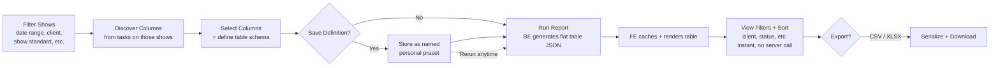
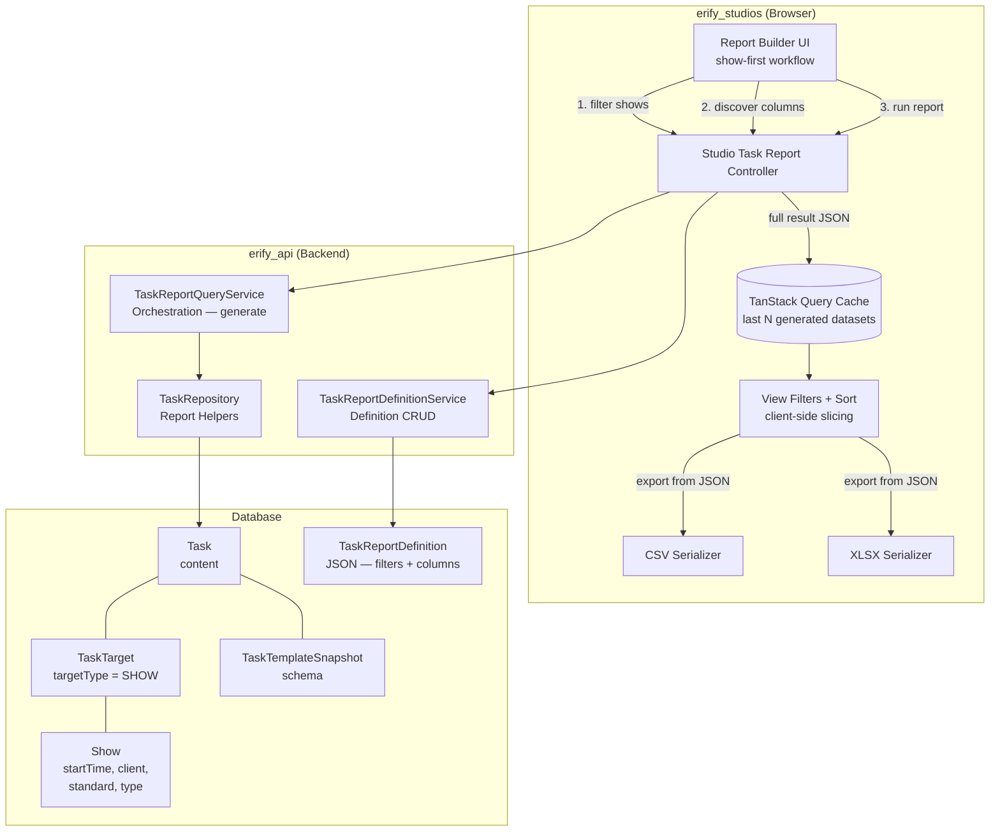

# PRD: Task Submission Reporting & Export

> **Status**: Draft
> **Phase**: 5 — Parking Lot / immediate post-Phase-4 follow-up candidate
> **Workstream**: Reporting, review, and manager visibility from submitted tasks
> **Depends on**: Phase 2 task-management foundation, [RBAC Roles](./rbac-roles.md)
> **Can power**: [Show Economics](./show-economics.md) and any future feature that needs cross-show submitted-task data aggregation

## Naming & Convention Notes

The following conventions apply throughout this PRD and the linked design docs. They follow the project-wide API contract rules (`@eridu/api-types`):

- **`client_id`** — external client identifier in API request/response bodies and URL params. Uses the `_id` suffix even though the value is a UID string (e.g. `client_abc123`). This is the established convention across `shows`, `schedules`, and `task-management` schemas — do not rename to `client_uid`.
- **`show_id` / `show_ids`** — external show identifier(s) in API request/response bodies and URL params. Uses the `_id` / `_ids` suffix, consistent with `client_id` and all other external identifier fields across the codebase. Do not use `show_uid` / `show_uids` in external API contract fields; those are only acceptable as internal service-layer variable names.
- **Never expose internal BigInt DB IDs** in API responses. All external identifiers must be UID strings in the format `{prefix}_{nanoid}` (e.g. `show_abc123`, `client_xyz789`).
- **API JSON fields**: snake_case. Service layer (TypeScript): camelCase. DB columns: snake_case via `@map`.

## Problem

Studio managers can review submitted tasks one-by-one, but they cannot reliably answer cross-show questions such as:

- *"What was the GMV, views, and performance output for all premium moderation tasks this week?"*
- *"Which premium shows already have post-production upload links ready for QC review?"*
- *"Can I export one clean spreadsheet for a client or date range without hand-copying from dozens of submitted tasks?"*

Today the data exists inside `Task.content`, but the system has no manager-facing workflow that can:

1. query a set of target shows by scope filters (date range, client, show standard, etc.),
2. discover which task columns are available on those shows,
3. select columns and generate a flat, reviewable table,
4. slice and sort the generated table client-side for focused review, and
5. export the result as CSV/XLSX.

The moderation team currently does this on Google Sheets with manual data entry and filter views. This feature replaces that workflow.

## Users

- **Studio managers**: review submitted operational data across many shows and export it for internal follow-up
- **Moderation managers**: summarize moderation KPIs such as GMV, views, conversion, and live-performance metrics
- **Studio admins**: audit premium-show QC readiness using uploaded post-production URLs and other submitted evidence

## Core Workflow

The workflow is **show-first**: managers start by narrowing the shows they care about, then discover what task data is available.

Steps:

1. **Filter shows** (scope filters) — set date range, client, show standard, show type, and other show-level attributes. These scope filters determine what data the BE generates. At least one scope filter is required.
2. **Discover columns** — the BE returns which task templates/snapshots have submitted tasks for those filtered shows, plus their field catalogs. Columns are contextual — bound to the actual tasks on the selected shows.
3. **Select columns** — pick system columns (show name, start time, client) and task-content columns from the discovered catalog. This defines the target table schema.
4. **Save definition** (optional) — save the scope filters + column selection as a named personal preset. Definitions can store a default date preset (`this_week`, `this_month`, or absolute dates) that pre-fills on load.
5. **Run report** — triggers BE to join submitted task data across matching shows into a flat table JSON. The full result is returned inline — no server-side storage.
6. **Review + view filters** — FE caches and renders the flat table. Managers apply client-side view filters (by client, show status, assignee, room) and column sorting to focus on subsets — all instant, no server round-trip.
7. **Export** — FE serializes the visible (or full) table to CSV or XLSX and downloads.

## Two-Level Filtering

Filters are split into two tiers:

### Scope filters (server-side — determine what data is generated)

These change the *dataset* the BE produces. Changing a scope filter triggers re-generation.

- `date_from` / `date_to` (or date preset)
- `show_standard_id` — premium vs standard (affects which templates are in scope)
- `show_type_id` — different show types have different task structures
- `submitted_statuses` — default `[REVIEW, COMPLETED, CLOSED]`
- `source_templates[]` — optional, to narrow to specific task templates

### View filters (client-side — slice the cached dataset)

These refine the *display* without re-querying. Applied instantly on the cached result.

- `client_id` / client name — focus on one client's shows
- `show_status_id` — live, completed, cancelled
- `assignee` — filter by task assignee
- `studio_room_id` — filter by room
- `platform_name` — filter by platform
- Text search — search across show name, client, etc.
- Column sort — sort by any column ascending/descending

The distinction maps to how the moderation team uses Google Sheets: they have one sheet per time range (scope), then use filter views to focus on specific clients or statuses (view filters).

## Requirements

### Show-first querying

1. Managers start by filtering shows — date range, client, show standard, show type, and other show-level attributes.
2. Filters can be single or compound. At least one scope filter is required to prevent unscoped full-studio scans.
3. After shows are filtered, the BE returns a contextual column catalog: only templates/snapshots with submitted tasks on the filtered shows, plus their available fields.
4. This ensures column options are bound to the actual data — no dead-end selections.

### Submitted-task source fidelity

1. Historical data must always be read from the task snapshot that generated the task; current template schema is only a selection convenience, not the source of truth.
2. Template-based selections may span multiple snapshot versions, but the result must preserve version boundaries when schemas differ.
3. Default source scope is submitted/approved tasks only: `REVIEW`, `COMPLETED`, and `CLOSED`.
4. Only tasks with show-type targets are included. Tasks targeting studios or other non-show entities (e.g. `ADMIN` type tasks) are excluded.

### Generated result

1. The BE joins and aggregates selected columns from submitted tasks into a flat JSON table — one row per show, with selected task-content values merged in.
2. The result JSON is structured for easy transformation into tabular data (2D arrays for rendering and export).
3. The result is returned inline in the API response — **no server-side result storage**. Generation is fast (< 1s typical) and the result is cached on the client.
4. Missing submissions appear as `null` values in the row; the UI must not silently pretend missing data is zero.
5. File and URL fields are included as string values (clickable links in the UI, plain URLs in export).
6. When multiple submitted tasks match the same show and source (duplicate sources), they appear as separate rows with a warning flag — not silently merged.

### Saved definitions (personal presets)

1. Managers can save a named definition containing scope filters, selected columns, and optionally a default date preset.
2. Definitions function as **personal presets** — like Google Sheets filter views. Each manager creates definitions reflecting their review needs.
3. Definitions can store a default date preset (`this_week`, `this_month`, or explicit dates) that pre-fills the date range on load. The manager can override before running.
4. Definitions can be **cloned and edited** — a "Clone" action creates a copy with a new name for the manager to customize.
5. The definition list is the **landing view** of the Task Reports page — managers open a definition and run it, rather than building from scratch each time.
6. Definitions are persisted as JSON only; the backend does not store generated results.

### Client-side caching and view filters

1. The FE caches recently generated results in memory (TanStack Query). Switching between cached datasets (e.g., different weeks) is instant.
2. A reasonable cache depth (e.g., last 5 generated datasets) prevents unnecessary re-generation when toggling between scopes.
3. View filters (client, status, assignee, room, sort, search) are applied client-side on the cached dataset — no server round-trip.
4. View filter state is independent of the definition — it's ephemeral UI state for the current session.
5. Submissions change infrequently once completed. Re-generation is needed only when the scope filter changes or the manager explicitly refreshes.

### Export behavior

1. CSV export is required for compatible result sets.
2. XLSX export should use the same normalized dataset and support multi-sheet output when multiple compatible groups are present.
3. Incompatible source groups (different template schemas) must not be silently merged — export splits them into separate sheets/files.
4. Exported rows include stable show/task metadata plus the selected submitted values.
5. Export can apply to the full dataset or the currently filtered view.

## Acceptance Criteria

- [ ] A studio manager can filter shows by date range and client, see which task columns are available, select them, and review the results in one flat table.
- [ ] A premium-show reviewer can include post-production file/url fields and open those links directly from the review table.
- [ ] Running a report returns the full result inline. The FE caches it for instant re-access.
- [ ] Client-side view filters (client, status, assignee, sort) slice the cached table instantly without server round-trips.
- [ ] A saved definition pre-fills scope filters and columns. Running it generates fresh data.
- [ ] Definitions can be cloned and edited to create variations.
- [ ] Switching between recently generated datasets (e.g., different weeks) is instant from cache.
- [ ] When selected data comes from incompatible template snapshots, export splits the output into separate sheets/files.
- [ ] Only show-targeted tasks appear in results; non-show tasks are excluded.
- [ ] Duplicate submitted tasks for the same show and source are shown as separate rows with a warning indicator.
- [ ] The table shows row count and generation timestamp for sanity checking.
- [ ] *(Deferred)* Numeric column summaries (count, sum, average) are a future enhancement. See [ideation/task-analytics-summaries.md](../ideation/task-analytics-summaries.md).

## Reporting as an Engine

This system is a **generic submitted-task export engine**, not a Show Economics feature. It reads any submitted task fields defined in template snapshots and surfaces them as a reviewable, exportable dataset. Show Economics, P&L rollups, and other future features can consume this engine's output — they are downstream consumers, not prerequisites.

The engine is intentionally unopinionated about what the submitted fields mean. GMV, views, and post-production URLs are examples of field content, not hardcoded concepts. New use cases (e.g. a finance rollup that reads creator-fee fields from a compensation task) can be served by selecting different columns — no engine changes required.

## Product Decisions

- **Show-first workflow.** Managers think in terms of "which shows" first. The column catalog is contextual — only columns from tasks that exist on the filtered shows are offered.
- **Two-level filtering.** Scope filters (server-side) define what data is generated. View filters (client-side) slice the cached dataset for focused review. This mirrors the Google Sheets pattern of one sheet per time range with filter views per client/status.
- **No server-side result storage.** The generated result is returned inline and cached on the client. Generation is fast (< 1s typical for 500–1000 shows). Re-running is cheap. Server-side result persistence adds complexity (staleness tracking, cleanup jobs, result CRUD) without proportional benefit at this scale.
- **Definition as personal preset.** Definitions are like Google Sheets filter views — each manager saves their preferred scope + columns. The definition list is the landing page. Date presets pre-fill but can be overridden.
- **Flat materialized table as the result shape.** The BE produces a joined, show-centric table — not separate partitions that the FE must merge. Column metadata tracks which template/snapshot each column came from, preserving export integrity.
- **Date presets are optional in definitions.** `this_week`, `this_month`, or absolute dates. The FE always shows the date picker pre-filled from the definition's default. Managers can override before running.
- **JSON is the first-class report format.** CSV and XLSX are serialization targets derived from it — no CSV/XLSX files are generated or stored server-side.
- **File fields export as references, not binaries.** CSV/XLSX output contains URL strings only.
- **Show-targeted tasks only.** Tasks link to shows via the polymorphic `TaskTarget` model. Only tasks where `targetType = SHOW` are reportable.
- **Definition before run.** A definition captures the query schema (filters + columns). Saving a definition is a pre-run step — not a post-export action. Running a report either references a saved definition or uses an ad-hoc inline payload.
- **Clone + edit for definitions.** No new endpoint — FE reads an existing definition and POSTs a copy with a new name.
- **Studio-scoped.** Definitions are bound to one studio. Cross-studio reporting is out of scope.
- **Role-based source visibility is deferred to milestone 2.** MVP grants all permitted roles (`ADMIN`, `MANAGER`, `MODERATION_MANAGER`) access to all templates in the studio.
- **Duplicate-source rows are always visible.** Separate rows with a warning badge.
- **Client-side cache replaces server-side result storage.** TanStack Query in-memory cache holds recently generated datasets. Switching between cached scopes is instant. IndexedDB for cross-session persistence is a future enhancement.

## Out of Scope

- Server-side result storage (PostgreSQL JSONB, Redis) — generation is fast enough for inline response
- Server-side CSV/XLSX file generation or cloud-storage report artifacts
- Cross-studio reporting or definition sharing across studios
- Arbitrary formula builders or BI-style pivot tables
- Binary attachment packaging inside exported files
- Scheduled/recurring report generation (deferred — definitions with date presets enable manual rerun)

## Architecture Overview

## Design Reference

- Backend design: [TASK_SUBMISSION_REPORTING_DESIGN.md](../../apps/erify_api/docs/design/TASK_SUBMISSION_REPORTING_DESIGN.md)
- Frontend design: [TASK_SUBMISSION_REPORTING_DESIGN.md](../../apps/erify_studios/docs/design/TASK_SUBMISSION_REPORTING_DESIGN.md)
