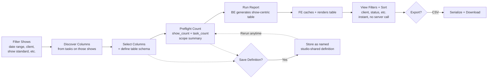
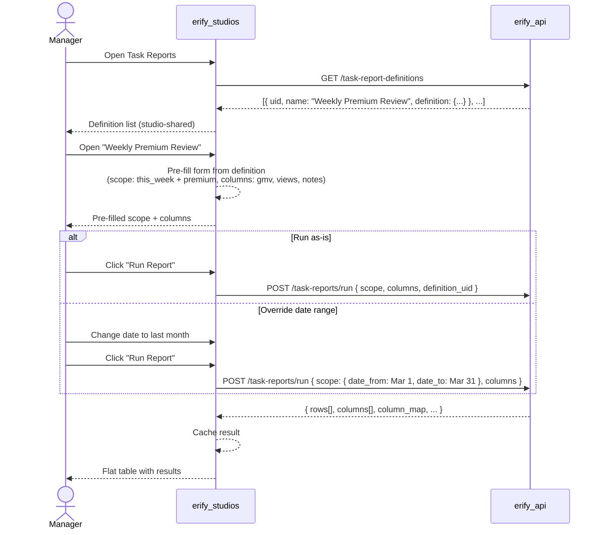
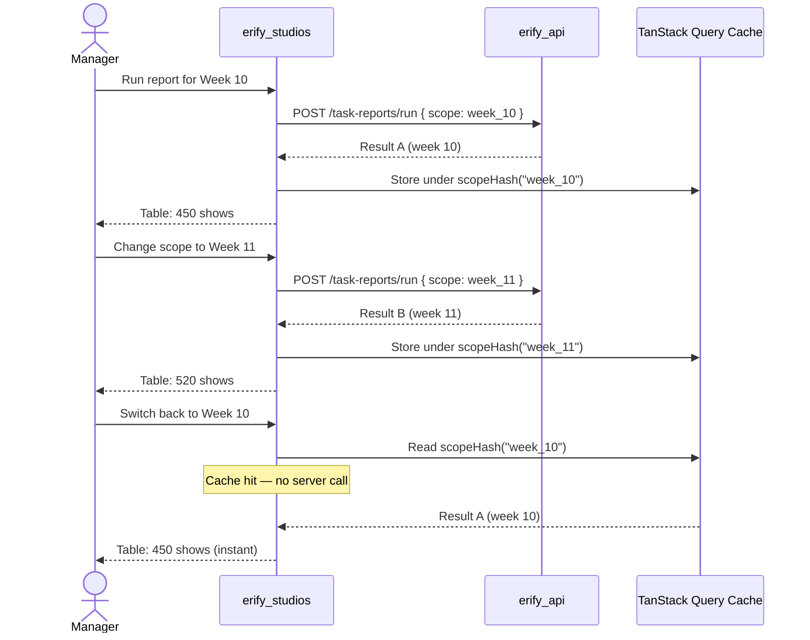
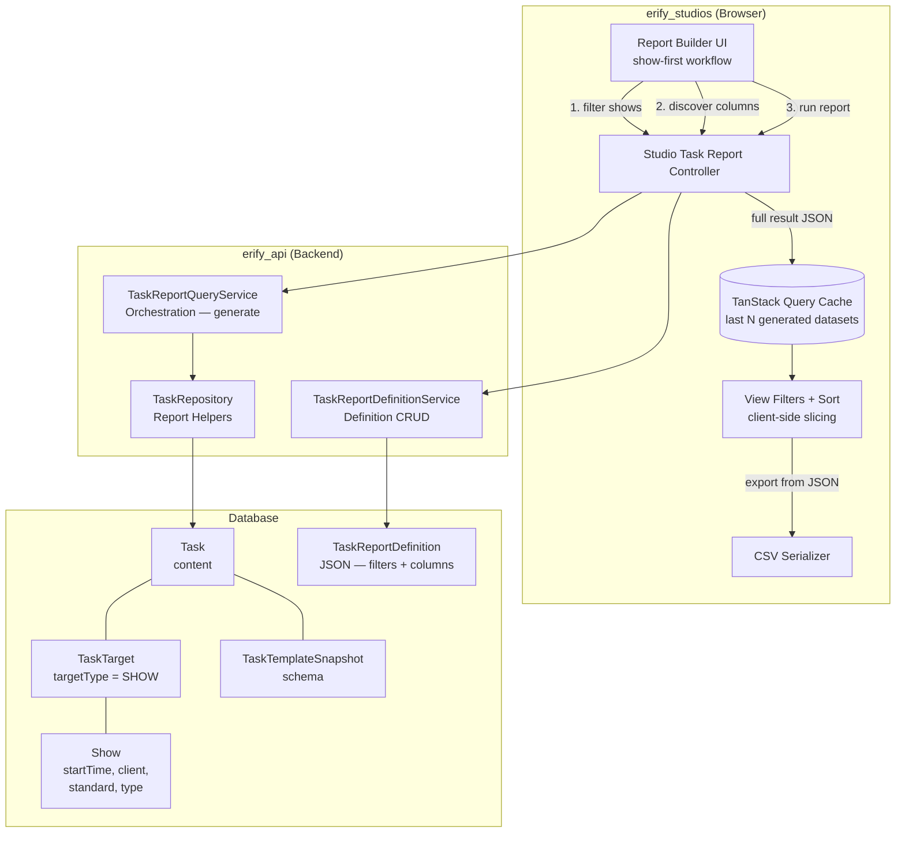

# PRD: Task Submission Reporting & Export

> **Status**: Draft
> **Phase**: 5 — Parking Lot / immediate post-Phase-4 follow-up candidate
> **Workstream**: Reporting, review, and manager visibility from submitted tasks
> **Depends on**: Phase 2 task-management foundation, [RBAC Roles](./rbac-roles.md)
> **Can power**: [Show Economics](./show-economics.md) and any future feature that needs cross-show submitted-task data aggregation

## Naming & Convention Notes

The following conventions apply throughout this PRD and the linked design docs. They follow the project-wide API contract rules (`@eridu/api-types`):

- **`client_id`** — external client identifier in API request/response bodies and URL params. Uses the `_id` suffix even though the value is a UID string (e.g. `client_abc123`). This is the established convention across `shows`, `schedules`, and `task-management` schemas — do not rename to `client_uid`.
- **`show_id` / `show_ids`** — external show identifier(s) in API request/response bodies and URL params. Uses the `_id` / `_ids` suffix, consistent with `client_id` and all other external identifier fields across the codebase. Do not use `show_uid` / `show_uids` in external API contract fields; those are only acceptable as internal service-layer variable names.
- **Never expose internal BigInt DB IDs** in API responses. All external identifiers must be UID strings in the format `{prefix}_{nanoid}` (e.g. `show_abc123`, `client_xyz789`).
- **API JSON fields**: snake_case. Service layer (TypeScript): camelCase. DB columns: snake_case via `@map`.

## Problem

Studio managers can review submitted tasks one-by-one, but they cannot reliably answer cross-show questions such as:

- *"What was the GMV, views, and performance output for all premium moderation tasks this week?"*
- *"Which premium shows already have post-production upload links ready for QC review?"*
- *"Can I export one clean spreadsheet for a client or date range without hand-copying from dozens of submitted tasks?"*

Today the data exists inside `Task.content`, but the system has no manager-facing workflow that can:

1. query a set of target shows by scope filters (date range, client, show standard, etc.),
2. discover which task columns are available on those shows,
3. select columns and generate a flat, reviewable table,
4. slice and sort the generated table client-side for focused review, and
5. export the result as CSV.

The moderation team currently does this on Google Sheets with manual data entry and filter views. This feature replaces that workflow.

## Users

This is a **management and oversight tool** — not part of the operator task-execution flow. Junior moderators submit tasks through existing mobile/desktop workflows; they do not use the report builder.

- **Studio managers**: review submitted operational data across many shows and export it for internal follow-up
- **Moderation managers**: summarize moderation KPIs such as GMV, views, conversion, and live-performance data across brands
- **Studio admins**: audit premium-show QC readiness using uploaded post-production URLs and other submitted evidence

All three roles use this to answer cross-show questions after tasks are submitted — not to manage individual task execution.

## Design Principles

> **Strong semantics, flexible operations.**

The reporting layer standardizes how data is *understood*, not how it is *collected*. These principles guide every design decision in this feature:

1. **Standardize the semantic layer, not the templates.** A small set of shared fields (5–8 KPIs like GMV, views, conversion) adopt fixed keys so the report engine can merge them across templates. This is the beginning of a long-term reporting vocabulary — a canonical set of fields with stable semantics that any template can contribute to. The vast majority of each template's fields remain custom and template-scoped.

2. **Keep custom fields template-scoped.** Brand-specific fields, workflow-specific notes, and per-template data stay under each template's control. Custom fields from different templates never merge — they appear as separate columns. Template authors retain full flexibility over their non-standard fields.

3. **Lock canonical keys, keep labels flexible.** Shared field keys, types, and categories are immutable once created — `gmv` is always `gmv`, always a number, always a `metric`. But labels, descriptions, and per-template validation rules can be customized. This gives engineering-level semantic stability with product-level display flexibility.

4. **Preserve snapshot integrity.** Shared field definitions are captured in `TaskTemplateSnapshot` at save time. The report engine reads from snapshots, never from live studio settings. Changes to the shared field list never break existing reports. Backfill uses controlled application-level migration, not raw SQL.

5. **Protect operational workflows.** Operational task templates stay optimized for real usage — especially mobile moderation workflows. Reporting requirements must not force task fragmentation (no second data-collection task), template redesigns, or operator-facing complexity. One task per show per template, submitted by the assigned operator.

6. **Studio-scoped for now, portable later.** Shared fields are studio-scoped because we currently operate one studio. This is practical and avoids premature abstraction. The design leaves room for future multi-studio divergence (each studio defines its own fields) or sharing (promote fields to a global catalog) without structural changes.

Reporting standardization is an **engineering best-practice layer** — it ensures cross-template data is semantically interoperable for analysis. It is not a reason to overconstrain day-to-day template design or operator workflows.

## Core Workflow

### Route model

- Viewer/landing: `/studios/$studioId/task-reports`
- Builder/run workspace: `/studios/$studioId/task-reports/builder`
- Viewer is definitions-first; users open builder from viewer actions.

The workflow is **show-first**: managers start by narrowing the shows they care about, then discover what task data is available.



Steps:

1. **Filter shows** (scope filters) — set date range, client, show standard, show type, and other show-level attributes. These scope filters shape the contextual column catalog. `date_from` + `date_to` are **mandatory** for source discovery, preflight, and run.
2. **Discover columns** — the BE returns which task templates/snapshots have submitted tasks for those filtered shows, plus their field catalogs. Columns are contextual — bound to the actual tasks on the selected shows.
3. **Select columns** — pick system columns (show id, show name, show external id, client name, start/end time, show standard, show type, room) and task-content columns from the discovered catalog. This defines the target table schema. Hard cap: 50 columns. Soft warning at 30+ for table readability (the export is the primary deliverable — wide tables are best reviewed in the spreadsheet).
4. **Save definition** (optional) — save the scope filters + column selection as a named studio-shared definition. Saving can happen before or after preflight/run. Definitions can store a default date preset (`this_week`, `this_month`, or absolute dates) that pre-fills on load.
5. **Preflight check** — before generating, the FE requests a count summary (`show_count`, `task_count`). The manager sees the scope size and run stays disabled until preflight succeeds. Over-limit scopes are blocked with guidance.
6. **Run report** — triggers BE to join submitted task data across matching shows into a flat table JSON with show-centric rows. The full result is returned inline — no server-side storage.
7. **Review + view filters** — FE caches and renders the flat table. Managers apply client-side view filters (by client, show status, assignee, room) and column sorting (asc/desc on any column) to focus on subsets — all instant, no server round-trip. These filters are driven by per-row metadata returned with the result, not by whether those columns are visible in the table. If scope + columns match a cached result, the builder offers a "View cached result" shortcut.
8. **Export** — FE serializes the full dataset to CSV and downloads (view filters do not affect export).

## Two-Level Filtering

Filters are split into two tiers:

### Scope filters (server-side — determine what data is generated)

These change the *dataset* the BE produces. Changing a scope filter triggers re-generation.

- `date_from` / `date_to` — **required** for source discovery, preflight, and run
- `client_id[]` (studio-scoped client filter, multi-select)
- `show_standard_id[]` — premium vs standard (multi-select; affects which templates are in scope)
- `show_type_id[]` — different show types (multi-select)
- `submitted_statuses[]` — default `[REVIEW, COMPLETED, CLOSED]` (multi-select)
- `source_templates[]` — optional, to narrow to specific task templates
- scope reset action — restores default statuses and clears other scope filters

### View filters (client-side — slice the cached dataset)

These refine the *display* without re-querying. Applied instantly on the cached result.

- `client_id` / client name — focus on one client's shows
- `show_status_id` — live, completed, cancelled
- `assignee` — filter by task assignee
- `studio_room_id` — filter by room
- Text search — search across show name, client, etc.
- Column sort — sort by any column ascending/descending
- `Clear view filters` — quick reset

Filters only render when matching values exist in the cached dataset; if values disappear, the filter is cleared automatically.

The run result includes hidden row metadata for these filters (`client_id`, `client_name`, `show_status_id`, `show_status_name`, `studio_room_id`, `studio_room_name`, `assignee_ids`, `assignee_names`, plus scalar assignee fields when there is exactly one unique assignee). This keeps view filters available even when those columns are not part of the visible table.

Filter dropdowns should display human-friendly labels (`client_name`, `show_status_name`, `studio_room_name`, assignee names), but use stable IDs as the underlying selected value whenever an ID is available. This preserves exact filtering when two entities share the same display name. Name-as-value is only a fallback when no stable ID exists in the row metadata.

The distinction maps to how the moderation team uses Google Sheets: they have one sheet per time range (scope), then use filter views to focus on specific clients or statuses (view filters).

## Requirements

### Show-first querying

1. Managers start by filtering shows — date range, client, show standard, show type, and other show-level attributes.
2. Date range (`date_from` + `date_to`) is mandatory to prevent unbounded scans.
3. Scope dropdown filters are compoundable. Managers can multi-select `client_id`, `show_standard_id`, `show_type_id`, `submitted_statuses`, and `source_templates`.
4. The scope panel includes a reset utility so managers can clear all scoped filters quickly and return to default statuses.
5. The report scope UI does not allow manual `show_ids` picking. Show selection is derived from studio-scoped filters only.
6. After shows are filtered, the BE returns a contextual column catalog: only templates/snapshots with submitted tasks on the filtered shows, plus their available fields.
7. This ensures column options are bound to the actual data — no dead-end selections.
8. Reporting lookups (clients/show standards/show types/sources) are studio-scoped (`/studios/:studioId/*`). The report feature does not call `/system/*` directly.

### Submitted-task source fidelity

1. Historical data must always be read from the task snapshot that generated the task; current template schema is only a selection convenience, not the source of truth.
2. Template-based selections may span multiple snapshot versions, but the result must preserve version boundaries when schemas differ.
3. Default source scope is submitted/approved tasks only: `REVIEW`, `COMPLETED`, and `CLOSED`.
4. Only tasks with show-type targets are included. Tasks targeting studios or other non-show entities (e.g. `ADMIN` type tasks) are excluded.

### High-density column-selection UX

When scope includes many client-dedicated moderation templates and loop-heavy schemas, the column catalog becomes large and noisy. The FE must prioritize signal over raw list length.

1. If scoped templates exceed 10, template groups default to collapsed (highest-volume templates open first) with explicit **Expand all** and **Collapse all** actions.
2. Column picker shows scope telemetry before selection:
   - template count in scope
   - submitted-task count in scope
   - shared/custom field option counts
3. Picker must support rapid narrowing with:
   - free-text search (template name + field key/label/type)
   - `Selected only` mode
   - `Templates with selection` mode
4. Shared fields remain a dedicated grouped section so cross-template metrics stay visible even when template-specific field lists are large.
5. Selection guardrails remain:
   - hard cap: 50 columns
   - soft warning at 30+ columns for table readability

### Preflight count (before generation)

1. Before generating a report, the FE requests a **preflight count** — the number of shows and **reportable submitted tasks** that match the current scope filters.
2. The preflight response includes `show_count` and `task_count`. Run is disabled until preflight succeeds, and the manager sees the scope size before generating.
3. If either `show_count` (row volume) or `task_count` exceeds the guardrail (default 10,000), the preflight response indicates this and the FE blocks the run with guidance to narrow scope. The manager never waits for a generation that will fail.
4. The preflight count is lightweight — it runs count queries only, not full data extraction.
5. `task_count` must use the same eligibility rules as run: only submitted tasks with both template + snapshot references are counted (unsnapshotted tasks are excluded from both preflight and generation).

### Generated result

1. The BE joins selected columns from submitted tasks into a flat JSON table with strictly **one row per show**. All task data for a show is merged into a single row. If columns from different templates cannot be consolidated (e.g., custom fields with the same key but from different templates), they appear as separate columns on the same row — never as separate rows.
2. The result JSON is structured for easy transformation into tabular data (2D arrays for rendering and export).
3. The result is returned inline in the API response — **no server-side result storage**. Generation is fast (< 1s typical) and the result is cached on the client.
4. Missing submissions appear as `null` values in the row; the UI must not silently pretend missing data is zero.
5. File and URL fields are included as string values (clickable links in the UI, plain URLs in export).
6. When multiple submitted tasks match the same show and source (duplicate sources), the **latest task wins** — its values populate the row. A warning flag is set on the affected row for data hygiene visibility, but the row stays single.
7. Each row also includes hidden metadata used by client-side view filters: client/status/room ids and names, plus assignee ids and names. Assignee metadata may be multi-value because one show row can merge submitted tasks from different assignees.
8. If a saved definition contains columns that are incompatible with the current scope (missing/renamed/misaligned sources), preflight/run is blocked with an explicit conflict summary until the user resolves those columns.

### Saved definitions (studio-shared)

1. Managers can save a named definition containing scope filters, selected columns, and optional description metadata.
2. Definitions are **studio-shared** — all studio members with report access (`ADMIN`, `MANAGER`, `MODERATION_MANAGER`) can view and run any definition in the studio. This mirrors Google Sheets filter views where all editors see the same saved views.
3. **Permission model**: the definition creator or a studio `ADMIN` can update or delete a definition. Other roles can view and run but not modify definitions they didn't create.
4. Definitions can store a default date preset (`this_week`, `this_month`, or explicit dates) that pre-fills the date range on load. Before source/preflight/run requests are sent, the FE resolves to explicit `date_from` + `date_to`.
5. Builder save UX exposes explicit actions:
   - `Save as Definition` for new drafts
   - `Save Definition` when editing an existing definition
   - clearing an existing description is supported by saving with an empty description field
6. Save is blocked until the definition has a name, a valid date range, and at least one compatible selected column.
7. Definition clone is deferred to Phase 2. See [Phase 2 deliverables](#phase-2-polish--advanced-table-ux).
8. The definition list is the **landing view** of the Task Reports page — managers open a definition and run it, rather than building from scratch each time.
9. Definitions are persisted as JSON only; the backend does not store generated results.

### Client-side caching and view filters

1. The FE caches recently generated results in memory (TanStack Query). Switching between cached datasets (e.g., different weeks) is instant.
2. A reasonable cache depth (e.g., last 5 generated datasets) prevents unnecessary re-generation when toggling between scopes.
3. View filters (client, status, assignee, room, sort, search) are applied client-side on the cached dataset — no server round-trip.
4. View filter state is independent of the definition — it's ephemeral UI state for the current session.
5. Submissions change infrequently once completed. Re-generation is needed only when the scope filter changes or the manager explicitly refreshes.

### Shared fields (semantic standardization layer)

Moderation task templates are created per-brand (~30 templates), each with 8–10 data collection fields. A small subset of these fields — shared performance metrics, QC evidence, and compliance indicators — need to merge into single report columns across all templates. The rest of each template's fields are brand-specific and remain template-scoped.

**This is not full template standardization — it is semantic standardization for reporting.** The goal is a small set of shared fields (5–15 fields) with fixed keys, types, and categories that form a canonical reporting vocabulary. This vocabulary enables cross-template reporting without constraining how templates are designed or how operators use them. Each template keeps its own custom fields unchanged — only the shared fields adopt fixed keys. (See [Design Principles](#design-principles).)

#### Field categories

Shared fields are classified into three categories. The category is immutable after creation (like key and type) and determines how the field is used in reporting:

| Category | Purpose | Typical types | Examples |
|----------|---------|---------------|----------|
| **`metric`** | Numeric KPIs for performance analysis | `number` | `gmv`, `views`, `orders`, `conversion_rate`, `peak_viewers` |
| **`evidence`** | Proof artifacts for QC and audit | `file`, `url` | `qc_image`, `proof_url`, `post_production_link` |
| **`status`** | Compliance/readiness indicators | `checkbox`, `select` | `is_qc_ready`, `is_post_production_complete` |

Categories serve two purposes: (1) FE sub-groups shared fields by category in the column picker and settings UI for discoverability, and (2) they document intent — a `metric` field is for numeric analysis, an `evidence` field is for proof review, a `status` field is for readiness checks.

#### Field qualification rules

A field qualifies as a shared field (rather than a custom field) when it meets **all** of the following criteria:

1. **Cross-template semantics** — the field has the same meaning across multiple templates (e.g., `gmv` means gross merchandise value regardless of brand).
2. **Stable type** — the field type is consistent across templates. If one brand uses `number` for GMV and another uses `text`, it cannot be a shared field.
3. **Merge intent** — the field is expected to appear as a single merged column in reports. If managers would never compare this field across templates, it should stay custom.
4. **Small set** — the shared field catalog should remain small (5–15 fields). If the catalog grows beyond 15, review whether fields are truly cross-template or should remain custom.

Fields that fail any criterion stay as custom fields. When in doubt, keep the field custom — promotion to shared is easy; demotion is not (keys are immutable).

#### Phase 1 shared field set

The following shared fields are recommended for phase 1 deployment. This set covers the primary moderation reporting use cases:

| Key | Type | Category | Label | Rationale |
|-----|------|----------|-------|-----------|
| `gmv` | `number` | `metric` | GMV | Primary financial KPI across all moderation templates |
| `views` | `number` | `metric` | Views | Show performance — universal across brands |
| `orders` | `number` | `metric` | Orders | Sales metric — universal across brands |
| `conversion_rate` | `number` | `metric` | Conversion Rate | Derived performance indicator |
| `peak_viewers` | `number` | `metric` | Peak Viewers | Live-show performance metric |
| `qc_image` | `file` | `evidence` | QC Image | Post-production screenshot for quality check |

**Deferred from phase 1:**

- `fulfillment_percent` (`number`, `status`) — Checklist fulfillment percentage. Many templates include operator checklists ("check A", "verify B") — these are `checkbox` fields specific to each brand's moderation workflow. They stay as custom fields. The review use case for checklists is fulfillment percentage (how many boxes checked per task), which is a derived metric the FE can compute from cached row data. **Recommendation:** Implement as an FE-computed column in phase 2 (no BE shared field needed). The FE scans checkbox fields in each row and computes `checked / total` as a percentage. This avoids storing a redundant shared field whose value is always derivable from existing data.

#### Shared fields support any field type

Not just numbers. Performance KPIs use `number` (GMV, views, orders), QC evidence fields use `file` or `url` (post-production screenshots, proof images), and compliance indicators use `checkbox` or `select`. The merge behavior is identical: same key + `standard: true` = one merged column in the report. This makes shared fields a general-purpose cross-template vocabulary.

#### Who manages it

Studio ADMINs manage shared fields in studio settings — a simple list of field definitions (key, type, category, label) stored in `Studio.metadata`. Keys, types, and categories are **immutable once created** — if the key is wrong, create a new one; the old key stays reserved. This keeps the workflow simple: no rename cascades, no backward-compatibility checks. Labels and descriptions can be updated or cleared (display-only). Shared-field keys also cannot reuse reserved system-column keys (`show_id`, `show_name`, `show_external_id`, `client_name`, `studio_room_name`, `show_standard_name`, `show_type_name`, `start_time`, `end_time`). ADMINs and MANAGERs can both read the shared-field catalog when building templates, but only ADMINs can create or update that catalog.

#### End-to-end setup flow

Shared fields flow through the system in a clear pipeline from studio configuration to exported report:

```
Studio Settings                    Template Editor                     Snapshot
─────────────────                  ─────────────────                   ────────
ADMIN creates shared fields  →     ADMIN/MANAGER selects shared   →   Snapshot captures full
(key, type, category, label)       fields when building template      field definition (key, type,
Stored in Studio.metadata          (fixed key + type + standard:      category, label, standard:
                                   true flag inserted)                true) — self-contained

                                        ↓

Report Builder                     Export
──────────────                     ──────
Engine reads standard: true   →    Merged columns appear in
from snapshots, merges same-key    CSV as single columns
fields across templates            (e.g., one "GMV" column)
```

1. **Studio ADMIN creates shared fields** in studio settings (e.g., `gmv` / number / metric / "GMV"). Keys, types, and categories are immutable after creation.
2. **ADMIN or MANAGER selects shared fields** when building a template — the template editor picker inserts the field with the fixed key, type, and `standard: true` flag.
   - For moderation workflows, the picker can insert repeated loop-scoped copies (auto-generated unique keys) so the same metric can be collected per loop. These loop-scoped copies are template-designed fields and are not treated as canonical shared keys unless they use the exact canonical key.
3. **Snapshot captures the definition** — when the template is saved, the snapshot records the full shared field definition (key, type, category, label, `standard: true`). The snapshot is self-contained.
4. **Report engine reads from snapshots** — merges fields with the same key + `standard: true` across templates into one column. The engine never queries studio settings.
5. **Managers see merged columns** in the report builder — shared fields appear grouped by category in the column picker, and as single merged columns in the result table and export.

#### Implementation requirements

To enable this:

1. **Shared fields** — a studio-scoped list of field definitions stored in `Studio.metadata.shared_fields[]`. Managed by ADMIN via a settings endpoint. `GET /studios/:studioId/settings/shared-fields` is readable by ADMIN and MANAGER so template authors can load the picker; create/update management stays ADMIN-only. Keys are immutable once created; fields can be deactivated but not deleted.
   - Shared-field key validation rejects reserved system-column keys and view-filter metadata keys (`assignee_id`, `studio_room_id`, etc.) to avoid collisions with built-in report columns and row metadata.
   - **Deactivation behavior**: setting `is_active: false` prevents the field from being selected when creating new template snapshots or new definitions. However, deactivated fields still appear in the report column picker if they exist in scoped snapshots — historical data is never hidden from reports.
2. **`standard` flag on field items** — `FieldItemBaseSchema` gains an optional `standard: boolean` property. Fields marked `standard: true` use their `key` directly as the report column key (no template prefix). All other fields (the majority) remain template-scoped with `{template_uid}:{field.key}`.
3. **Cross-template merging** — when generating a report, shared fields from different templates merge into one column because they share the same key. Custom fields remain template-scoped — this is the expected behavior.
4. **Template rebuild (alpha-phase migration)** — the system is in alpha testing, not yet in real operational usage. The ~30 existing moderation templates are rebuilt from the current Google Sheets source with correct shared field keys from the start:
   - Studio ADMIN creates the shared fields in studio settings first.
   - Rebuild each template with shared field keys and `standard: true` flag. Each rebuild creates a new snapshot.
   - **Existing task data is not retroactively migrated.** Old tasks retain their original snapshot references and content keys. Shared fields apply to new records only — what has happened has happened. Old data appears as template-scoped columns; new data merges via shared fields. This avoids confusion from partial migration and keeps the boundary clean.
   - Only the shared fields adopt canonical keys. Brand-specific custom fields are carried over as-is.
5. **Shared-field freshness in template builder** — when opening template create/edit pages, FE must revalidate shared fields on mount (avoid stale cache after settings edits). Shared-field settings mutations must invalidate shared-field queries so newly created/deactivated fields are immediately reflected in template builder insertion options.
6. **Shared-field fetch failure visibility** — if shared fields fail to load on template create/edit pages, FE must show an explicit warning banner. The page remains usable for custom fields, but shared-field insertion is clearly marked unavailable.

This is a **requirement for MVP** — without it, the reporting engine cannot produce cross-client moderation summaries, which is the primary use case. The forward-only approach is acceptable for alpha: old data volume is small, and shared field columns will naturally populate as new tasks are submitted against rebuilt templates.

**Cross-doc impact:** This feature extends the existing task template and studio management systems. See BE design §4.6.6 for the full list of docs, skills, and route configs that must be updated.

### Export behavior

1. CSV export produces **one flat file** — all columns (system + shared fields + custom fields from any number of templates) in a single table. No multi-file splitting.
2. Custom fields from different templates appear as separate columns in the same file, clearly labeled with their template origin.
3. Exported rows include stable show/task metadata plus the selected submitted values.
4. Export always applies to the full dataset (view filters do not affect export).

## Acceptance Criteria

- [ ] A studio manager can filter shows by date range and client, see which task columns are available, select them, and review the results in a flat table.
- [ ] A premium-show reviewer can include post-production file/url fields and open those links directly from the review table.
- [ ] Before running, the manager sees a preflight count summary (`show_count`, `task_count`) and run remains disabled until preflight succeeds. Over-limit scopes are blocked with guidance to narrow filters.
- [ ] Running a report returns the full result inline. The FE caches it for instant re-access.
- [ ] Client-side view filters (client, status, assignee) and column sorting (asc/desc) slice the cached table instantly without server round-trips.
- [ ] A saved definition pre-fills scope filters and columns. Running it generates fresh data.
- [ ] *(Deferred to Phase 2)* Definitions can be cloned and edited to create variations.
- [ ] Switching between recently generated datasets (e.g., different weeks) is instant from cache.
- [ ] Export always produces one flat CSV file — no multi-file splitting regardless of template mix.
- [ ] Only show-targeted tasks appear in results; non-show tasks are excluded.
- [ ] Strictly one row per show — duplicate submitted tasks for the same show and source are resolved by latest-wins merge with a warning summary surfaced in the result view.
- [ ] The table shows row count and generation timestamp for sanity checking.
- [ ] Preflight `task_count` uses the same reportable-task scope as run (submitted + has template + has snapshot), so unsnapshotted tasks do not falsely block generation.
- [ ] Studio ADMIN can create and manage shared fields in studio settings. Keys, types, and categories are immutable after creation.
- [ ] Shared-field key creation rejects reserved system-column keys (`show_name`, `client_name`, etc.) and view-filter metadata keys (`assignee_id`, `studio_room_id`, etc.) to prevent collisions with built-in report columns and row metadata.
- [ ] Studio MANAGER can read the shared-field catalog in template create/edit flows, but cannot create or update shared fields.
- [ ] After shared fields are created/updated in settings, template create/edit pages reflect the latest shared-field options without manual hard refresh.
- [ ] If shared fields fail to load on template create/edit pages, an explicit warning is shown (no silent disappearance of shared-field insertion UI).
- [ ] Shared fields (e.g., `gmv`, `views`, `qc_image`) from different templates merge into a single report column.
- [ ] Custom (non-standard) fields remain template-scoped — different templates produce separate columns even if keys happen to match.
- [ ] Existing ~30 moderation templates are rebuilt with shared field keys. Existing task data is not retroactively migrated — shared fields apply to new records only. Brand-specific custom fields are untouched.
- [ ] *(Deferred)* Numeric column summaries (count, sum, average) are a future enhancement. See [ideation/task-analytics-summaries.md](../ideation/task-analytics-summaries.md).

## Reporting as an Engine

This system is a **generic submitted-task export engine**, not a Show Economics feature. It reads any submitted task fields defined in template snapshots and surfaces them as a reviewable, exportable dataset. Show Economics, P&L rollups, and other future features can consume this engine's output — they are downstream consumers, not prerequisites.

The engine is intentionally unopinionated about what the submitted fields mean. GMV, views, and post-production URLs are examples of field content, not hardcoded concepts. New use cases (e.g. a finance rollup that reads creator-fee fields from a compensation task) can be served by selecting different columns — no engine changes required.

**One operational task, minimal standardization.** The design preserves the current moderation workflow: one task per show per template, submitted by the assigned operator. We do not split data collection into a second task or redesign the moderation loop. Standardization is limited to a small shared field set (5–15 fields across three categories: metrics, evidence, and status) — the minimum needed for cross-template reporting. Template-specific fields and operator workflows are untouched.

**Strong semantics, flexible operations.** The shared fields layer standardizes *how data is understood* for reporting — fixed keys, locked types, stable merge semantics. But it does not standardize *how data is collected* — templates remain fully flexible, mobile workflows are unaffected, and operators never see the reporting abstraction. This separation ensures that improving reporting quality never comes at the cost of operational usability. The shared field set is an engineering best-practice layer: it exists to make cross-template data interoperable, not to constrain template design.

## Product Decisions

- **Show-first workflow.** Managers think in terms of "which shows" first. The column catalog is contextual — only columns from tasks that exist on the filtered shows are offered.
- **Two-level filtering.** Scope filters (server-side) define what data is generated. View filters (client-side) slice the cached dataset for focused review. This mirrors the Google Sheets pattern of one sheet per time range with filter views per client/status.
- **No server-side result storage.** The generated result is returned inline and cached on the client. Generation is fast (< 1s typical for 500–1000 shows). Re-running is cheap. Server-side result persistence adds complexity (staleness tracking, cleanup jobs, result CRUD) without proportional benefit at this scale.
- **Studio-shared definitions.** Definitions are visible to all studio members with report access — like Google Sheets filter views where all editors see the same saved views. The definition creator or a studio ADMIN can modify or delete; all permitted roles can view and run. The definition list is the landing page. Date presets pre-fill but can be overridden.
- **Flat materialized table with strict one-row-per-show.** The BE produces a joined table — exactly one row per show, with all task data merged in. Custom fields from different templates appear as separate columns on the same row. No multi-row expansion, no multi-file export splitting. Column metadata tracks template origin for display grouping.
- **Preflight count before generation.** The FE requests a lightweight count (`show_count`, `task_count`) before triggering full generation. This lets the manager confirm scope size, prevents wasted generation on over-broad filters, and enforces the row cap before any heavy query runs.
- **Date presets are optional in definitions.** `this_week`, `this_month`, or absolute dates. The FE always shows the date picker pre-filled from the definition's default. Managers can override before running.
- **JSON is the first-class report format.** CSV is the current serialization target derived from it — no CSV files are generated or stored server-side. XLSX is deferred.
- **File fields export as references, not binaries.** CSV output contains URL strings only.
- **Show-targeted tasks only.** Tasks link to shows via the polymorphic `TaskTarget` model. Only tasks where `targetType = SHOW` are reportable.
- **Definition before run.** A definition captures the query schema (filters + columns). Saving a definition is a pre-run step — not a post-export action. Running a report either references a saved definition or uses an ad-hoc inline payload.
- **Clone + edit for definitions.** No new endpoint — FE reads an existing definition and POSTs a copy with a new name.
- **Studio-scoped.** Definitions are bound to one studio. Cross-studio reporting is out of scope.
- **Role-based source visibility is deferred to milestone 2.** MVP grants all permitted roles (`ADMIN`, `MANAGER`, `MODERATION_MANAGER`) access to all templates in the studio.
- **Duplicate-source tasks use latest-wins merge.** If multiple tasks match the same show + template, the most recently updated task's values populate the row. A warning badge flags the row for data hygiene review, but the row stays single.
- **Client-side cache replaces server-side result storage.** TanStack Query in-memory cache holds recently generated datasets. Switching between cached scopes is instant. IndexedDB for cross-session persistence is a future enhancement.
- **Shared fields as a semantic standardization layer.** A small set of shared fields (5–15 across three categories: metric, evidence, status) adopt fixed keys so the report engine can merge them across templates. This is the canonical reporting vocabulary — strong semantics for analysis, with no impact on operational flexibility. Studio ADMINs manage this list in studio settings; keys, types, and categories are immutable once created. The vast majority of each template's fields are brand-specific custom fields that remain unchanged. One operational moderation task per show, no template redesign, no second data-collection task.
- **Studio-scoped shared fields.** Shared fields are scoped to the studio because we currently operate one studio. This is practical and avoids premature abstraction. The design accommodates future multi-studio divergence (each studio defines its own fields) or sharing (promote fields to a global catalog) without structural changes.
- **Definition is inherently stable.** Definitions reference column keys, not snapshot versions. Tasks are fixed to their assigned snapshot — template updates don't change existing tasks' content keys. Definitions don't become "outdated" because the underlying data doesn't drift.
- **FE form is the run-time source of truth.** When running from a saved definition, the FE pre-fills the form from the definition's stored scope + columns. The manager can override any field before running. The run request sends whatever the form shows — the BE does not merge definition + overrides.

## Out of Scope

- Server-side result storage (PostgreSQL JSONB, Redis) — generation is fast enough for inline response
- Server-side CSV file generation or cloud-storage report artifacts (XLSX deferred)
- Cross-studio reporting or definition sharing across studios
- Arbitrary formula builders or BI-style pivot tables
- Binary attachment packaging inside exported files
- Scheduled/recurring report generation (deferred — definitions with date presets enable manual rerun)

## Critical Flow Sequences

### Flow 1: First-time report creation (new user)

```mermaid
sequenceDiagram
    actor Manager
    participant FE as erify_studios
    participant BE as erify_api
    participant DB as PostgreSQL

    Manager->>FE: Open Task Reports
    FE->>BE: GET /task-report-definitions
    BE->>DB: Query definitions (studioId)
    DB-->>BE: [] (empty)
    BE-->>FE: [] (no definitions)
    FE-->>Manager: "Create your first report" prompt

    Manager->>FE: Set scope filters (this_week, premium)
    FE->>BE: GET /task-report-sources?date_from=...&show_standard_id=...
    BE->>DB: Find shows in scope → tasks → snapshots
    DB-->>BE: Templates with submitted tasks + field catalogs
    BE-->>FE: { sources[], standard_fields[] }
    FE-->>Manager: Column picker (standard + custom fields)

    Manager->>FE: Select columns (gmv, views, notes)
    Manager->>FE: Save as "Weekly Premium Review"
    FE->>BE: POST /task-report-definitions { name, scope, columns }
    BE->>DB: Insert TaskReportDefinition
    DB-->>BE: definition_uid
    BE-->>FE: Saved definition

    Manager->>FE: Click "Preflight Scope"
    FE->>BE: GET /task-reports/preflight?date_from=...&...
    BE->>DB: COUNT shows + tasks matching scope
    DB-->>BE: { show_count: 487, task_count: 1204 }
    BE-->>FE: Preflight summary
    FE-->>Manager: "487 shows, 1,204 tasks — Scope ready"

    Manager->>FE: Click "Run Report"
    FE->>BE: POST /task-reports/run { scope, columns }
    BE->>DB: Query shows → tasks → content (batched)
    Note over BE: Extract values, merge into show rows,<br/>flag duplicates, build flat table
    DB-->>BE: Task batches
    BE-->>FE: { rows[], columns[], column_map, row_count, generated_at }
    FE-->>FE: Cache result in TanStack Query
    FE-->>Manager: Flat table (487 shows · Generated just now)

    Manager->>FE: Filter by client "Brand X"
    Note over FE: Client-side filter — no server call
    FE-->>Manager: Filtered table (52 shows)

    Manager->>FE: Export → CSV
    Note over FE: Serialize visible rows using column_map
    Note over FE: Serialize full cached dataset;<br/>view filters do not affect export
    FE-->>Manager: Download CSV file
```

### Flow 2: Returning user — run from saved definition



### Flow 3: Compare two scopes — cache switching



## Architecture Overview



## Implementation Plan

### Phase 1a: Engine + shared fields infrastructure

> **Goal**: Build the report generation engine and shared fields foundation. Validate scope resolution, row construction, and cross-template merge before investing in the full UI.

**Backend:**

| # | Deliverable | Details |
|---|-------------|---------|
| 1 | Shared fields settings endpoint | `GET /studios/:studioId/settings/shared-fields` readable by ADMIN + MANAGER for template authoring; `POST/PATCH` remain ADMIN-only. Stored in `Studio.metadata.shared_fields[]`. |
| 2 | `standard` flag + `sharedFieldSchema` in `@eridu/api-types` | Add `standard: z.boolean().optional()` to `FieldItemBaseSchema`. Add `sharedFieldSchema` (with `category` enum) and settings endpoint schemas. |
| 3 | `TaskReportScopeService` (Layer 1) | Scope resolution shared by `/sources`, `/preflight`, and `/run`. Resolves filters → shows → task counts → guardrails. |
| 4 | Preflight endpoint | `POST /task-reports/preflight` — count-only validation before generation |
| 5 | Report generation endpoint | `POST /task-reports/run` — Layer 2 extraction + row construction, flat table inline response |

**Frontend:**

| # | Deliverable | Details |
|---|-------------|---------|
| 6 | Shared fields settings UI | Simple CRUD list in studio settings (ADMIN-only). Key/type/category immutable after creation. Fields sub-grouped by category. |
| 7 | Scope filter controls | Date range, show standard, show type. URL state for shareability. |
| 8 | Column picker | Contextual source catalog fetch + column selection with shared fields sub-grouped by category (Metrics / Evidence / Status), 50-column cap, live counter |

**Template rebuild** (parallel with BE work):

| # | Deliverable | Details |
|---|-------------|---------|
| 9 | Create shared fields in studio settings | Define canonical vocabulary per phase 1 set: `gmv` (number/metric), `views` (number/metric), `conversion_rate` (number/metric), `peak_viewers` (number/metric), `orders` (number/metric), `qc_image` (file/evidence). |
| 10 | Rebuild ~30 moderation templates | Rebuild from current Google Sheets with correct shared field keys + `standard: true`. Forward-only — old tasks stay as-is. |

**Exit criteria**: The `/run` endpoint correctly merges shared fields (including `file`/`url` types) across multiple templates into one-row-per-show. Preflight counts match run results. Scope resolution is identical across all three endpoints.

### Phase 1b: Full report workflow

> **Goal**: Ship the complete manager-facing workflow — this is where the Google Sheets replacement becomes real.

**Backend:**

| # | Deliverable | Details |
|---|-------------|---------|
| 11 | Contextual source catalog | `GET /task-report-sources` — returns templates/snapshots with submitted tasks for filtered shows, field catalogs, shared fields deduplication |
| 12 | Definition CRUD | `TaskReportDefinition` model + 5 endpoints. Studio-shared definitions with scope + columns + optional date presets. Creator or ADMIN can modify/delete; all permitted roles can view and run. |
| 13 | Cross-doc updates | Update authorization skill, role matrix, route access config, api-types — all items from BE design §4.6.6 |
| 14 | Error contract | Structured error responses per BE design §11.1 — designed alongside the feature, not after |

**Frontend:**

| # | Deliverable | Details |
|---|-------------|---------|
| 15 | Report table rendering | Frozen system columns (show name, client, start time), horizontal virtual scroll, column group headers (System / Shared Fields / Custom by template) |
| 16 | View filters + column sort | Client-side filters (client, status, assignee, room, search) + simple asc/desc sort on cached rows |
| 17 | Definition list as landing view | Save, load, clone definitions. Pre-fill scope + columns from definition. Landing page for the Task Reports route. |
| 18 | Preflight summary UX | Show count summary before generation. Run remains disabled until preflight succeeds. |
| 19 | CSV export | One flat file from cached JSON. Full dataset only. Column headers include template origin for custom fields. |

**Exit criteria**: A manager can open Task Reports, load a saved definition, preflight, generate a report, review the table with view filters, and export a CSV — replacing the current Google Sheets workflow end-to-end.

### Phase 2: Polish + advanced table UX

> **Goal**: Improve table readability for wide reports and add cross-session persistence.

| # | Deliverable | Details |
|---|-------------|---------|
| 20 | XLSX export | Single-sheet export via lazy-loaded ExcelJS |
| 21 | Column visibility toggles | Hide/show columns in table view without affecting export output |
| 22 | Column pinning | Pin additional columns beyond default frozen ones |
| 23 | Collapsible column groups | Collapse custom field groups to summary column in table; export always expanded |
| 24 | Definition clone + edit | Read existing definition → POST copy with new name |
| 25 | Date preset in definitions | `this_week`, `this_month`, or absolute dates pre-fill on load |
| 26 | IndexedDB persistence | Cross-session result cache (last 5 per studio) using `idb-keyval` |
| 27 | Checkbox fulfillment percentage | FE-computed derived column — count checked/total checkboxes per row. Displayed as a progress indicator on the table. No BE shared field needed — derived from existing checkbox data in each row. |

### Phase 3: Scale (if needed)

> **Trigger**: Promote when P95 generation > 5s, HTTP timeout hit, or product requires removing the 10,000-row cap.

| # | Deliverable | Details |
|---|-------------|---------|
| 28 | Async generation | BullMQ + 202 Accepted + polling. See [ideation/bullmq-async-processing.md](../ideation/bullmq-async-processing.md). |
| 29 | Server-side result caching | Optional — for expensive reports that are re-run frequently |
| 30 | Server-side CSV export | For very large datasets that are impractical to serialize in the browser (XLSX deferred) |
| 31 | Numeric column summaries | Count, sum, average for numeric columns. See [ideation/task-analytics-summaries.md](../ideation/task-analytics-summaries.md). |

### Deferred (no current trigger)

- Cross-studio reporting or definition sharing
- Role-scoped template visibility (all permitted roles see all templates for MVP)
- Scheduled/recurring report generation
- BI-style pivot tables or formula builders
- `submittedAt` typed field — see [ideation/submitted-at-state-machine.md](../ideation/submitted-at-state-machine.md)

## Design Reference

- Backend design: [TASK_SUBMISSION_REPORTING_DESIGN.md](../../apps/erify_api/docs/design/TASK_SUBMISSION_REPORTING_DESIGN.md)
- Frontend design: [TASK_SUBMISSION_REPORTING_DESIGN.md](../../apps/erify_studios/docs/design/TASK_SUBMISSION_REPORTING_DESIGN.md)
