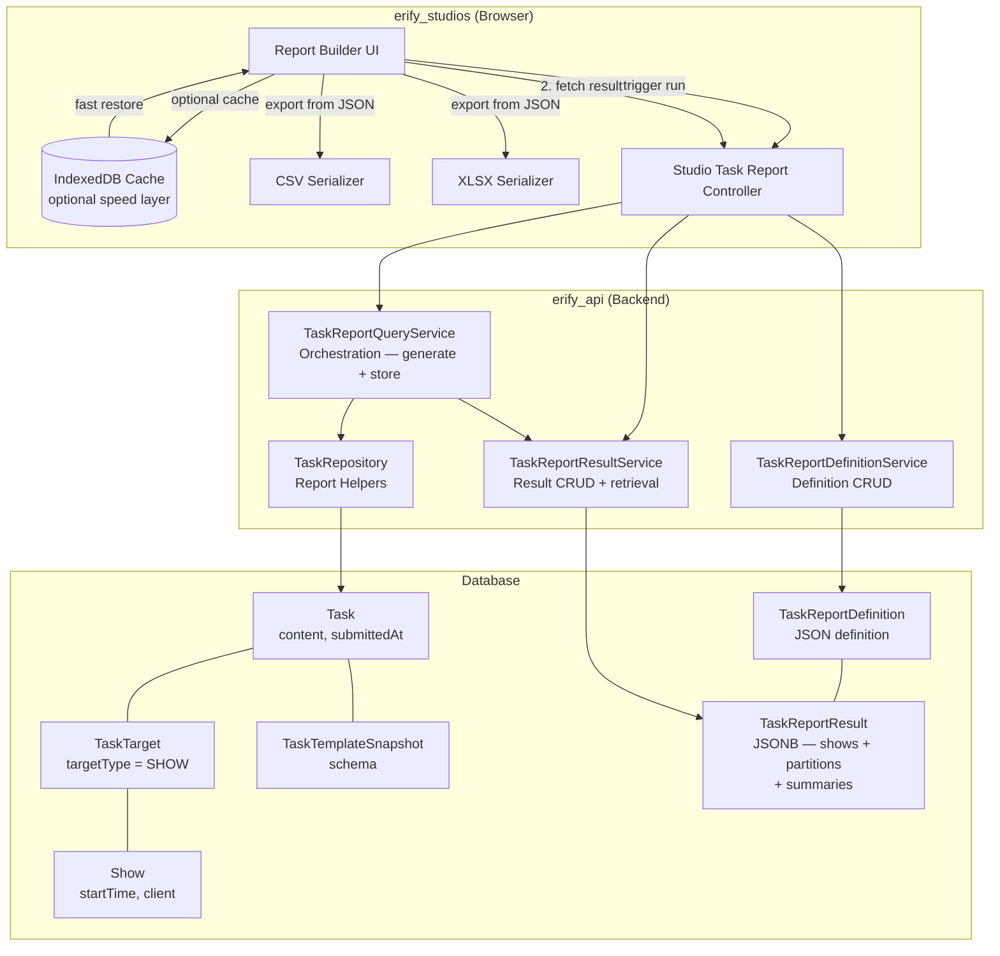
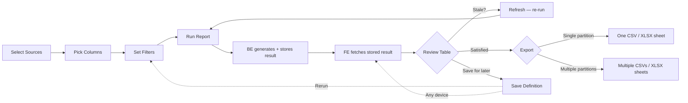

# PRD: Task Submission Reporting & Export

> **Status**: Draft
> **Phase**: 5 — Parking Lot / immediate post-Phase-4 follow-up candidate
> **Workstream**: Reporting, review, and manager visibility from submitted tasks
> **Depends on**: Phase 2 task-management foundation, [RBAC Roles](./rbac-roles.md)
> **Can power**: [Show Economics](./show-economics.md) and any future feature that needs cross-show submitted-task data aggregation

## Naming & Convention Notes

The following conventions apply throughout this PRD and the linked design docs. They follow the project-wide API contract rules (`@eridu/api-types`):

- **`client_id`** — external client identifier in API request/response bodies and URL params. Uses the `_id` suffix even though the value is a UID string (e.g. `client_abc123`). This is the established convention across `shows`, `schedules`, and `task-management` schemas — do not rename to `client_uid`.
- **`show_id` / `show_ids`** — external show identifier(s) in API request/response bodies and URL params. Uses the `_id` / `_ids` suffix, consistent with `client_id` and all other external identifier fields across the codebase. Do not use `show_uid` / `show_uids` in external API contract fields; those are only acceptable as internal service-layer variable names.
- **Never expose internal BigInt DB IDs** in API responses. All external identifiers must be UID strings in the format `{prefix}_{nanoid}` (e.g. `show_abc123`, `client_xyz789`).
- **API JSON fields**: snake_case. Service layer (TypeScript): camelCase. DB columns: snake_case via `@map`.

## Problem

Studio managers can review submitted tasks one-by-one, but they cannot reliably answer cross-show questions such as:

- *"What was the GMV, views, and performance output for all premium moderation tasks this week?"*
- *"Which premium shows already have post-production upload links ready for QC review?"*
- *"Can I export one clean spreadsheet for a client or date range without hand-copying from dozens of submitted tasks?"*

Today the data exists inside `Task.content`, but the system has no manager-facing reporting workflow that can:

1. read submitted task data across many shows,
2. respect the historical template snapshot used by each task,
3. join that data into a reviewable table,
4. generate and persist complete result snapshots for cross-device access and repeated analysis, and
5. export the result as CSV/XLSX without creating server-side file artifacts.

## Users

- **Studio managers**: review submitted operational data across many shows and export it for internal follow-up
- **Moderation managers**: summarize moderation KPIs such as GMV, views, conversion, and live-performance metrics
- **Studio admins**: audit premium-show QC readiness using uploaded post-production URLs and other submitted evidence

## Requirements

### Submitted-task source fidelity

1. Managers can build a report from one or more task sources chosen by task template or by exact template snapshot version.
2. Historical data must always be read from the task snapshot that generated the task; current template schema is only a selection convenience, not the source of truth.
3. Template-based selections may span multiple snapshot versions, but the result must preserve version boundaries when schemas differ.
4. Default source scope is submitted/approved tasks only: `REVIEW`, `COMPLETED`, and `CLOSED`.
5. Only tasks with show-type targets are included in report results. Tasks targeting studios or other non-show entities (e.g. `ADMIN` type tasks) are excluded from the reporting scope.

### Scope and filtering

1. Managers can filter by show date range, client, show, task type, template, snapshot version, assignee, and task status.
2. Report queries require at least one scope filter (`show_ids`, `date_from`, `date_to`, or `client_id`) to prevent unscoped full-studio scans. There is no hard upper limit on date ranges — managers may query a full quarter, 6 months, or longer. The system handles large result sets through internal batch processing, not by rejecting the request.
3. The backend generates complete results internally (iterating all matching tasks in batches) and stores the structured JSON result for retrieval. The frontend does not accumulate pages — it fetches the stored result in one request.

### Review workspace

1. The review surface is show-centric: one show row can display selected values sourced from one or more submitted tasks linked to that show. Tasks link to shows through the polymorphic `TaskTarget` relation (`targetType = SHOW`), not a direct foreign key.
2. Missing submissions must be visible as blank cells plus source-status metadata; the UI must not silently pretend missing data is zero.
3. Numeric columns display pre-computed summaries (count, sum, average) generated by the backend during result creation. Client-side re-computation is available for local column filtering.
4. File and URL fields render as clickable links for manager review and QC workflows.
5. When multiple submitted tasks match the same show and source partition (duplicate sources), the UI must display them as separate rows with a visible warning badge — not silently merge them. Export must include all duplicate rows. This surfaces data hygiene issues explicitly rather than hiding them.
6. Results are accessible from any authenticated device — a report generated on desktop is instantly viewable on mobile without re-running the query.

### Saved report definitions and results

1. Managers can save a named report definition containing selected sources, selected columns, filters, and preferred export settings.
2. Saved definitions are persisted as JSON only; the backend must not store pre-generated CSV/XLSX files.
3. Running a report generates a `TaskReportResult` stored as structured JSON (JSONB) in the database. This is the canonical report output — not a file artifact.
4. Saved definitions link to their latest result. Opening a saved definition loads the stored result instantly without re-querying live data.
5. Stale results (default: 24h after generation) show a warning and offer a one-click refresh.
6. Only one active result per definition is kept; re-running replaces the previous result.

### Export behavior

1. CSV export is required for compatible result sets.
2. XLSX export should use the same normalized dataset and support multi-sheet output when multiple compatible groups are present.
3. Incompatible source groups must not be merged only because `task_type` or snapshot `version` numbers happen to match.
4. Exported rows include stable show/task metadata plus the selected submitted values.

## Acceptance Criteria

- [ ] A studio manager can select moderation-task columns such as `gmv`, `views`, and other performance metrics, filter by client and show date range, and review the results in one table.
- [ ] A premium-show reviewer can include post-production file/url fields in the same workspace and open those links directly from the review table.
- [ ] Running a report generates a server-stored JSON result that can be retrieved on any authenticated device without re-querying.
- [ ] A saved report definition loads its latest stored result instantly — no re-generation needed unless the manager explicitly refreshes.
- [ ] When selected data comes from incompatible template snapshots, export splits the output into separate sheets/files instead of silently mixing schemas.
- [ ] Numeric columns show correct pre-computed aggregate summaries (count, sum, avg) in the review workspace.
- [ ] Only show-targeted tasks appear in results; non-show tasks (e.g. studio-targeted admin tasks) are excluded.
- [ ] Duplicate submitted tasks for the same show and source partition are shown as separate rows with a warning indicator, not merged.
- [ ] Stale results (past expiry) display a visible freshness warning with a one-click refresh action.
- [ ] The same report result is accessible from desktop and mobile browsers (cross-device access).

## Reporting as an Engine

This system is a **generic submitted-task reporting engine**, not a Show Economics feature. It reads any submitted task fields defined in template snapshots and surfaces them as a reviewable, exportable dataset. Show Economics, P&L rollups, and other future features can consume this engine's output — they are downstream consumers, not prerequisites.

The engine is intentionally unopinionated about what the submitted fields mean. GMV, views, and post-production URLs are examples of field content, not hardcoded concepts. New use cases (e.g. a finance rollup that reads creator-fee fields from a compensation task) can be served by selecting different sources and columns — no engine changes required.

## Product Decisions

- **Review is show-centric; export is snapshot-centric.** Managers want one operational table per show, but export integrity depends on preserving snapshot compatibility groups.
- **Do not group by `task_type + version` alone.** Snapshot version numbers are local to a template. Safe grouping must include template identity and snapshot compatibility.
- **Server-stored JSON results (PostgreSQL JSONB) are the primary persistence layer.** The backend generates complete results, stores them as structured JSON, and serves them to any device. IndexedDB is an optional FE speed optimization, not the primary cache. See [BE design section 4.4.1](../../apps/erify_api/docs/design/TASK_SUBMISSION_REPORTING_DESIGN.md) for the comparison matrix evaluating FE-only (IndexedDB), PostgreSQL JSONB, Redis, and Redis+PostgreSQL approaches.
- **JSON is the first-class report format.** The stored JSON result serves as both the review data and the export source. CSV and XLSX are serialization targets derived from it — no CSV/XLSX files are generated or stored server-side.
- **File fields export as references, not binaries.** CSV/XLSX output contains URL strings and related metadata only; it does not duplicate uploaded assets.
- **CSV is the baseline format.** XLSX uses the same normalized dataset and is expected as the next milestone, especially for multi-sheet export.
- **Show-targeted tasks only.** Tasks link to shows via the polymorphic `TaskTarget` model. Only tasks where `targetType = SHOW` are reportable. Admin or studio-targeted tasks are excluded by design.
- **Role-based source visibility is deferred to milestone 2.** MVP grants all permitted roles (`ADMIN`, `MANAGER`, `MODERATION_MANAGER`) access to all templates in the studio. If role-scoped template visibility becomes necessary (e.g. moderation managers seeing only moderation templates), it should be added as a source-catalog filter — not a separate endpoint.
- **Duplicate-source rows are always visible.** When multiple submitted tasks match the same show + source partition, they appear as separate rows with a warning badge. Export includes all rows. This is a deliberate data-hygiene signal, not a bug.
- **Offset-based pagination for list endpoints.** Standard `page` + `limit` pattern following existing codebase conventions. Report generation uses internal batching — no client-facing pagination for the report query itself.
- **No external cache layer (Redis) for MVP.** PostgreSQL JSONB is sufficient for the access pattern (single-row read by UID). Redis can be added as a transparent read-through cache in a later milestone if needed.

## Out of Scope

- Server-side CSV/XLSX file generation or cloud-storage report artifacts
- External cache layers (Redis) for MVP
- Cross-studio reporting
- Arbitrary formula builders or BI-style pivot tables
- Binary attachment packaging inside exported files
- Scheduled/recurring report generation

## Architecture Overview

### Manager Workflow

## Design Reference

- Backend design: [TASK_SUBMISSION_REPORTING_DESIGN.md](../../apps/erify_api/docs/design/TASK_SUBMISSION_REPORTING_DESIGN.md)
- Frontend design: [TASK_SUBMISSION_REPORTING_DESIGN.md](../../apps/erify_studios/docs/design/TASK_SUBMISSION_REPORTING_DESIGN.md)
