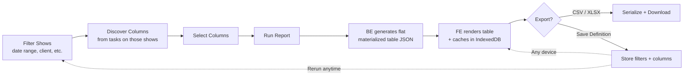
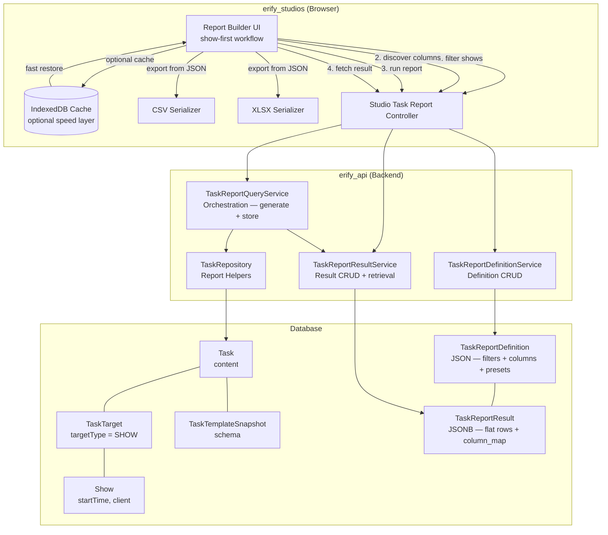

# PRD: Task Submission Reporting & Export

> **Status**: Draft
> **Phase**: 5 — Parking Lot / immediate post-Phase-4 follow-up candidate
> **Workstream**: Reporting, review, and manager visibility from submitted tasks
> **Depends on**: Phase 2 task-management foundation, [RBAC Roles](./rbac-roles.md)
> **Can power**: [Show Economics](./show-economics.md) and any future feature that needs cross-show submitted-task data aggregation

## Naming & Convention Notes

The following conventions apply throughout this PRD and the linked design docs. They follow the project-wide API contract rules (`@eridu/api-types`):

- **`client_id`** — external client identifier in API request/response bodies and URL params. Uses the `_id` suffix even though the value is a UID string (e.g. `client_abc123`). This is the established convention across `shows`, `schedules`, and `task-management` schemas — do not rename to `client_uid`.
- **`show_id` / `show_ids`** — external show identifier(s) in API request/response bodies and URL params. Uses the `_id` / `_ids` suffix, consistent with `client_id` and all other external identifier fields across the codebase. Do not use `show_uid` / `show_uids` in external API contract fields; those are only acceptable as internal service-layer variable names.
- **Never expose internal BigInt DB IDs** in API responses. All external identifiers must be UID strings in the format `{prefix}_{nanoid}` (e.g. `show_abc123`, `client_xyz789`).
- **API JSON fields**: snake_case. Service layer (TypeScript): camelCase. DB columns: snake_case via `@map`.

## Problem

Studio managers can review submitted tasks one-by-one, but they cannot reliably answer cross-show questions such as:

- *"What was the GMV, views, and performance output for all premium moderation tasks this week?"*
- *"Which premium shows already have post-production upload links ready for QC review?"*
- *"Can I export one clean spreadsheet for a client or date range without hand-copying from dozens of submitted tasks?"*

Today the data exists inside `Task.content`, but the system has no manager-facing workflow that can:

1. query a set of target shows by filters (date range, client, standard),
2. discover which task columns are available on those shows,
3. join submitted task data across shows into a flat, reviewable table,
4. persist both the query definition and the materialized result for cross-device reuse, and
5. export the result as CSV/XLSX without creating server-side file artifacts.

## Users

- **Studio managers**: review submitted operational data across many shows and export it for internal follow-up
- **Moderation managers**: summarize moderation KPIs such as GMV, views, conversion, and live-performance metrics
- **Studio admins**: audit premium-show QC readiness using uploaded post-production URLs and other submitted evidence

## Core Workflow

The workflow is **show-first**: managers start by narrowing the shows they care about, then discover what task data is available.

Steps:

1. **Filter shows** — set scope filters (date range, client, show, assignee, task status). Filters can be single or compound.
2. **Discover columns** — the BE returns which task templates/snapshots have submitted tasks for those filtered shows, plus their field catalogs. Columns are contextual — bound to the actual tasks on the selected shows.
3. **Select columns** — pick system columns (show name, start time, client) and task-content columns from the discovered catalog.
4. **Run report** — triggers BE to join submitted task data across matching shows into a flat materialized table JSON.
5. **Review** — FE renders the materialized table. Each row is one show with selected columns merged from its submitted tasks.
6. **Export** — FE serializes the table JSON to CSV or XLSX and downloads.
7. **Save definition** — optionally save the filter + column selection as a named definition for reuse. Definitions support relative date presets (this week, last 7 days, this month) that resolve dynamically at run time.

## Requirements

### Show-first querying

1. Managers start by filtering shows — date range, client, show, assignee, task status, and other show-level attributes.
2. Filters can be single or compound. At least one scope filter is required to prevent unscoped full-studio scans.
3. After shows are filtered, the BE returns a contextual column catalog: only templates/snapshots with submitted tasks on the filtered shows, plus their available fields.
4. This ensures column options are bound to the actual data — no dead-end selections.

### Submitted-task source fidelity

1. Historical data must always be read from the task snapshot that generated the task; current template schema is only a selection convenience, not the source of truth.
2. Template-based selections may span multiple snapshot versions, but the result must preserve version boundaries when schemas differ.
3. Default source scope is submitted/approved tasks only: `REVIEW`, `COMPLETED`, and `CLOSED`.
4. Only tasks with show-type targets are included. Tasks targeting studios or other non-show entities (e.g. `ADMIN` type tasks) are excluded.

### Materialized result

1. The BE joins and aggregates selected columns from submitted tasks into a flat JSON table — one row per show, with selected task-content values merged in.
2. The result JSON is structured for easy transformation into tabular data (2D arrays for rendering and export).
3. The result is stored server-side (PostgreSQL JSONB) as a `TaskReportResult` for cross-device access.
4. Missing submissions appear as `null` values in the row; the UI must not silently pretend missing data is zero.
5. File and URL fields are included as string values (clickable links in the UI, plain URLs in export).
6. When multiple submitted tasks match the same show and source (duplicate sources), they appear as separate rows with a warning flag — not silently merged.

### Saved definitions with relative date presets

1. Managers can save a named report definition containing selected filters, selected columns, and preferred export settings.
2. Definitions support **relative date presets** that resolve dynamically at run time:
   - `this_week` — current week's shows
   - `last_7_days` — rolling 7-day window
   - `this_month` — current month
   - `custom` — absolute date range (explicit `date_from` / `date_to`)
3. Definitions can be **cloned and edited** — a "Clone" action creates a copy with a new name for the manager to customize.
4. Saved definitions are persisted as JSON only; the backend must not store pre-generated CSV/XLSX files.
5. Saved definitions link to their latest result. Opening a saved definition loads the stored result instantly without re-querying.
6. Stale results (default: 24h after generation) show a warning and offer a one-click refresh.
7. Only one active result per definition is kept; re-running replaces the previous result.

### Export behavior

1. CSV export is required for compatible result sets.
2. XLSX export should use the same normalized dataset and support multi-sheet output when multiple compatible groups are present.
3. Incompatible source groups (different template schemas) must not be silently merged — export splits them into separate sheets/files.
4. Exported rows include stable show/task metadata plus the selected submitted values.

## Acceptance Criteria

- [ ] A studio manager can filter shows by date range and client, see which task columns are available, select them, and review the results in one flat table.
- [ ] A premium-show reviewer can include post-production file/url fields and open those links directly from the review table.
- [ ] Running a report generates a server-stored JSON result (flat materialized table) that can be retrieved on any authenticated device.
- [ ] A saved report definition with a relative date preset (e.g. "this week") resolves dynamically on each run.
- [ ] Definitions can be cloned and edited to create variations.
- [ ] A saved definition loads its latest stored result instantly — no re-generation needed unless the manager explicitly refreshes.
- [ ] When selected data comes from incompatible template snapshots, export splits the output into separate sheets/files.
- [ ] Only show-targeted tasks appear in results; non-show tasks are excluded.
- [ ] Duplicate submitted tasks for the same show and source are shown as separate rows with a warning indicator.
- [ ] Stale results display a visible freshness warning with a one-click refresh action.
- [ ] The same report result is accessible from desktop and mobile browsers.
- [ ] *(Deferred)* Numeric column summaries (count, sum, average) are a future enhancement. See [ideation/task-analytics-summaries.md](../ideation/task-analytics-summaries.md).

## Reporting as an Engine

This system is a **generic submitted-task export engine**, not a Show Economics feature. It reads any submitted task fields defined in template snapshots and surfaces them as a reviewable, exportable dataset. Show Economics, P&L rollups, and other future features can consume this engine's output — they are downstream consumers, not prerequisites.

The engine is intentionally unopinionated about what the submitted fields mean. GMV, views, and post-production URLs are examples of field content, not hardcoded concepts. New use cases (e.g. a finance rollup that reads creator-fee fields from a compensation task) can be served by selecting different columns — no engine changes required.

## Product Decisions

- **Show-first workflow.** Managers think in terms of "which shows" first. The column catalog is contextual — only columns from tasks that exist on the filtered shows are offered.
- **Flat materialized table as the result shape.** The BE produces a joined, show-centric table — not separate partitions that the FE must merge. Column metadata tracks which template/snapshot each column came from, preserving export integrity.
- **Relative date presets in definitions.** Definitions store the *intent* (`this_week`, `last_7_days`) not resolved dates. The BE resolves at run time. The stored result records the resolved absolute dates.
- **Server-stored JSON results (PostgreSQL JSONB) are the primary persistence layer.** IndexedDB is an optional FE speed optimization, not the primary cache. See [BE design section 4.4.1](../../apps/erify_api/docs/design/TASK_SUBMISSION_REPORTING_DESIGN.md) for the comparison matrix.
- **JSON is the first-class report format.** CSV and XLSX are serialization targets derived from it — no CSV/XLSX files are generated or stored server-side.
- **File fields export as references, not binaries.** CSV/XLSX output contains URL strings only.
- **Show-targeted tasks only.** Tasks link to shows via the polymorphic `TaskTarget` model. Only tasks where `targetType = SHOW` are reportable.
- **Clone + edit for definitions.** No new endpoint — FE reads an existing definition and POSTs a copy with a new name.
- **Studio-scoped.** Definitions and results are bound to one studio. Cross-studio reporting is out of scope.
- **Role-based source visibility is deferred to milestone 2.** MVP grants all permitted roles (`ADMIN`, `MANAGER`, `MODERATION_MANAGER`) access to all templates in the studio.
- **Duplicate-source rows are always visible.** Separate rows with a warning badge.
- **No external cache layer (Redis) for MVP.** PostgreSQL JSONB is sufficient.

## Out of Scope

- Server-side CSV/XLSX file generation or cloud-storage report artifacts
- External cache layers (Redis) for MVP
- Cross-studio reporting or definition sharing across studios
- Arbitrary formula builders or BI-style pivot tables
- Binary attachment packaging inside exported files
- Scheduled/recurring report generation (deferred — definitions with relative dates enable manual "rerun" for now)

## Architecture Overview

## Design Reference

- Backend design: [TASK_SUBMISSION_REPORTING_DESIGN.md](../../apps/erify_api/docs/design/TASK_SUBMISSION_REPORTING_DESIGN.md)
- Frontend design: [TASK_SUBMISSION_REPORTING_DESIGN.md](../../apps/erify_studios/docs/design/TASK_SUBMISSION_REPORTING_DESIGN.md)
