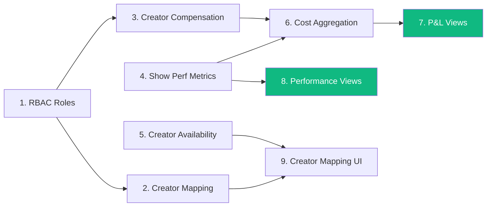

# Phase 4: P&L Visibility & Creator Operations

> **Status**: 🚧 Active execution

## Goal

Phase 4 makes **show-level profitability visible** by connecting creator operations, compensation tracking, and show performance metrics into a unified cost/revenue view.

> *"Give every role the information and tools they need to coordinate show operations — and make the financial outcome of those operations visible."*

## Scope

Phase 4 is scoped to the **critical path to P&L**. Features that are valuable but independent of P&L (ad-hoc ticketing, material management) are deferred to a later phase.

### Naming Boundary

- Domain terminology is creator-first across API/UI/shared contracts.
- `MC` is treated as a creator classification/business type, not the primary domain entity.
- Prisma model symbols are now creator-first (`Creator`, `ShowCreator`, `StudioCreator`).
- Physical DB compatibility fields/tables can still retain legacy names via `@map/@@map` (for example `mc_id`) until a dedicated storage cleanup scope.

## Workstreams

### 1. RBAC Roles

Add distinct roles to `StudioMembership`: `TALENT_MANAGER`, `DESIGNER`, `MODERATION_MANAGER`. This enables role-specific authorization across Phase 4 endpoints and prepares the access model for future workstreams.

PRD: [docs/prd/rbac-roles.md](../prd/rbac-roles.md)

### 2. Creator Mapping & Talent Operations

Bulk creator-to-show assignment so talent managers can efficiently map creators to shows. Studio-scoped creator endpoints for add/remove on individual shows. Creator availability query (conflict check against booked shows).

PRD: [docs/prd/mc-mapping.md](../prd/mc-mapping.md) (creator mapping domain)

### 3. Show Economics & P&L

Creator compensation model (fixed/commission/hybrid rates). Show performance metrics (GMV, sales, orders on ShowPlatform). Variable cost aggregation per show (creator fees + shift labor). P&L and performance views grouped by show, schedule, or client.

PRD: [docs/prd/show-economics.md](../prd/show-economics.md)

## Sequencing

| Order | Feature                             | Est  |
| ----- | ----------------------------------- | ---- |
| 1     | RBAC roles                          | 1-2d |
| 2     | Bulk creator-to-show mapping (BE)   | 2-3d |
| 3     | Creator compensation model          | 1-2d |
| 4     | Show performance metrics            | 1-2d |
| 5     | Creator availability query          | 1-2d |
| 6     | Cost aggregation API                | 3-4d |
| 7     | P&L views (by show/schedule/client) | 2-3d |
| 8     | Performance views                   | 2-3d |
| 9     | Creator mapping UI                  | 3-4d |

**Estimated total: ~18-27 working days**

## Existing Infrastructure (Phase 4 Builds On)

- `StudioShift.hourlyRate`, `projectedCost`, `calculatedCost` — shift costs already modeled
- `StudioMembership.baseHourlyRate` — member rates already modeled
- `ShowPlatform.viewerCount` — basic performance tracking exists
- `show_creators` join table — creator-show linkage exists
- R2 presigned upload infrastructure — shipped in Phase 3

## Resolved Design Decisions

| Decision               | Answer                                                             |
| ---------------------- | ------------------------------------------------------------------ |
| Talent manager role    | `TALENT_MANAGER` via RBAC — distinct from manager, below admin     |
| Creator studio scoping | Creators not studio-scoped (can work across studios) — future concern |
| Creator compensation   | Default rate on creator + per-show override on show-creator mapping |
| Compensation types     | FIXED, COMMISSION, HYBRID                                          |
| Show performance input | Manual entry first; platform API integration is future             |
| P&L scope              | Variable costs only (creator fees, shift labor); fixed costs are future |

## Open PRD Questions

Per-workstream questions are tracked in the respective PRD documents.

## Deferred From Phase 4

Features deferred to later phases — see [Phase 5](./PHASE_5.md):

- Ad-hoc ticketing (cross-functional, show/client-targeted tickets)
- Material management engine (asset versioning, show-material linking)
- Review quality hardening (transition enforcement, rejection notes)
- Client self-service (separate FE app)

## Doc Hierarchy

- **Roadmap** (this file): phase scope, priorities, sequencing
- **PRDs** ([docs/prd/](../prd/README.md)): user stories, acceptance criteria, product rules
- **Technical Designs** ([apps/erify_api/docs/design/](../../apps/erify_api/docs/design/README.md)): data models, API contracts, service architecture
