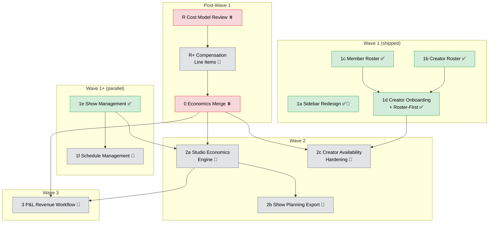

# Phase 4: P&L Visibility & Creator Operations

> **Status**: 🚧 Active (Wave 1 shipped; studio autonomy and economics engine follow-ups next)
> **Primary tracker**: This file (`PHASE_4.md`)
> **Last updated**: 2026-04-17

## Goal

Build the P&L system on existing entities, focusing on the **L-side** (labor and creator costs), while completing studio operational autonomy so studios no longer depend on `/system/*` for routine workflows.

Key outcomes:
- Studio operators can manage labor rates and creator compensation defaults without system-admin intervention.
- Studio admins can onboard brand-new creators, create shows, and manage schedules from the studio workspace.
- Variable cost visibility baseline is revised and merged from the deferred economics branch, then surfaced via economics endpoints.
- Studio admins and managers can review and export future projected costs and past actual costs from one date-ranged economics engine.
- Pre-show planning exports reuse the same economics engine as a locked preset/output.
- Creator assignment correctness is enforced (overlap + roster conflicts).
- Internal documentation is available in an authenticated monorepo knowledge base (`eridu_docs`).
- Revenue inputs (P-side) complete the full P&L model.

## Workstream Tracker

Single source of truth for all Phase 4 features. Each row links to its PRD (pre-ship), feature doc (post-ship), or archived branch reference when work was deferred before merge.

| #   | Workstream                               | Doc                                                                | Status                           | Wave   | Notes                                                                                                                     |
| --- | ---------------------------------------- | ------------------------------------------------------------------ | -------------------------------- | ------ | ------------------------------------------------------------------------------------------------------------------------- |
| P   | Task template migration                  | —                                                                  | ✅ Done (operational, 2026-03-24) | Pre    | Not repo-tracked; operational CSV rebuild                                                                                 |
| KB  | `eridu_docs` internal knowledge base     | [feature](../features/eridu-docs-knowledge-base.md)                | ✅ Implemented                    | Ext    | Astro + Starlight SSR app with JWKS-based auth, silent SSO, and local BYPASS_AUTH support                                 |
| 1a  | Sidebar redesign                         | [design](../../apps/erify_studios/docs/design/SIDEBAR_REDESIGN.md) | 🔁 Incremental                    | 1      | Core regrouping shipped (My Workspace, Operations, Studio Settings, Creators). Reports split and Finance group land as downstream features ship. |
| 1b  | Studio creator roster CRUD               | [feature](../features/studio-creator-roster.md)                    | ✅ Implemented (PR #30)           | 1      | Roster + compensation defaults + inactive enforcement                                                                     |
| 1c  | Studio member roster CRUD                | [feature](../features/studio-member-roster.md)                     | ✅ Shipped (PR #28)               | 1      | `baseHourlyRate` editing, self-demotion guard                                                                             |
| 1d  | Studio creator onboarding + roster-first | [feature](../features/studio-creator-onboarding.md)                | ✅ Implemented (PR #32)           | 1      | Fixes roster enforcement bug; removes `/system/*` dependency; unblocks Wave 2                                             |
| 1e  | Studio show management                   | [feature](../features/studio-show-management.md)                   | ✅ Implemented                    | 1+     | Studio CRUD for shows. Delete allowed only before start time. V1 update semantics are last-write-wins. |
| 1f  | Studio schedule management               | [PRD](../prd/studio-schedule-management.md)                        | 🔲 Planned                        | 1+     | Extends 1e with show assignment, arrangement, validation, publish, and snapshots                                          |
| R   | Economics cost model review              | —                                                                  | ⏸️ Deferred                       | Post-1 | Gate: Wave 1 complete. Lock projected-vs-actual semantics plus bonus/OT/allowance treatment                               |
| R+  | Compensation line items                  | [PRD](../prd/compensation-line-items.md)                           | 🔲 Planned                        | Post-1 | `CompensationLineItem` + `CompensationTarget`; required for complete actual-cost review                                   |
| 0   | Economics baseline merge                 | [reference](../features/show-economics.md)                         | ⏸️ Deferred                       | Post-1 | Branch `feat/show-economics-baseline` (commit `8de31ffe`). Merge revised contract after R+                                |
| 2a  | Studio economics review                  | [PRD](../prd/studio-economics-review.md)                           | 🔲 Planned                        | 2      | Configurable finance review/export engine: perspective selection, included items, preflight, cached results               |
| 2b  | Show planning export                     | [PRD](../prd/show-planning-export.md)                              | 🔲 Planned                        | 2      | Downstream of 2a. Locked planning preset / CSV-JSON export over the future-horizon economics engine                      |
| 2c  | Creator availability hardening           | [PRD](../prd/creator-availability-hardening.md)                    | 🔲 Planned                        | 2      | Gate: 1d merged. `strict=true` overlap + roster enforcement                                                               |
| 3   | P&L revenue workflow                     | [PRD](../prd/pnl-revenue-workflow.md)                              | 🔲 Planned                        | 3      | Extends 2a with GMV/sales, commission activation, and contribution margin                                                 |

### Phase 5 Deferrals

| Workstream                                                             | PRD                                     | Track |
| ---------------------------------------------------------------------- | --------------------------------------- | ----- |
| Studio reference data (clients, platforms, types, standards, statuses) | [PRD](../prd/studio-reference-data.md)  | C     |
| Studio creator profile editing (name/alias at studio level)            | [PRD](../prd/studio-creator-profile.md) | C     |
| Studio snapshot/audit trail visibility                                 | —                                       | C     |
| Advanced compensation rule engine                                      | —                                       | A     |
| Creator HR & operations (HRMS, fixed costs)                            | —                                       | A     |
| Ticketing, material management, inventory                              | —                                       | B     |

## Implementation Sequencing

### Dependency Graph



### Current Priority

| Priority | PR  | Workstream                                                         | Why                                                                                                                |
| -------- | --- | ------------------------------------------------------------------ | ------------------------------------------------------------------------------------------------------------------ |
| Primary  | 1f  | [Studio Schedule Management](../prd/studio-schedule-management.md) | Direct extension of 1e (now shipped). Studios need a workspace to assign and arrange owned shows into schedules.   |
| Parallel | R   | Economics cost model review                                        | Must lock projected-vs-actual semantics before the finance workspace and exports harden around the wrong contract. |
| Next     | 2a  | [Studio Economics Review](../prd/studio-economics-review.md)       | First finance-facing surface. Needs a task-report-style builder/result workflow, not just one grouped table.      |

**Per-PR workflow**: review PRD → create BE/FE design docs under `apps/*/docs/design/` → implement → post-ship knowledge-sync.

## Architecture Guardrails

- Finance arithmetic must live in dedicated economics domain services/calculators.
- Phase 4 "planned cost" means the current projection from live assignments/rates, not a frozen historical budget snapshot.
- Controllers must stay transport-focused (authz, DTO parsing, response shaping only).
- Orchestration services may coordinate flows but must not own financial formulas.
- `metadata` is not a compensation rule engine and must not store executable bonus logic.
- `CompensationLineItem` records are flat monetary amounts entered by humans (or written by a future rule engine). The model stores **outcomes**, not **rules**. Rule engines are Phase 5 scope.
- The compensation system is a single-entry cost journal, not a double-entry ledger.
- `CompensationTarget` follows the `TaskTarget` polymorphic pattern: single intermediate table with `targetType` + `targetId` discriminator and nullable FK columns.
- A person can be both a `StudioMembership` and a `StudioCreator` simultaneously. Line items attach to the **association record** via `CompensationTarget` — separate target records, independent P&L cost buckets.

## Economics Baseline (Deferred Merge)

- **Branch**: `feat/show-economics-baseline` — 1 commit ahead of `master`, not yet merged
- **Current repo state**: retained as an archived branch reference, not a shipped feature on `master`
- **Endpoints**: `GET /studios/:studioId/shows/:showId/economics` (single show) and `GET /studios/:studioId/economics` (grouped)
- **Planned consumers**: Studio economics review/export engine first, then show planning export as a preset, then Wave 3 revenue/margin extension
- **Why deferred**: Cost model may need rework for bonus/OT/allowances. Review after Wave 1 when roster data layer is stable.
- **Merge target**: After compensation line items ship (PR R+), revise and merge with line item aggregation.
- **Risk**: Branch drift — rebase periodically as Wave 1 features merge to master.

## Documentation

### Doc Flow (per feature)

```
docs/prd/<feature>.md                              ← PRD (pre-ship)
    ↓
apps/erify_api/docs/design/<FEATURE>_DESIGN.md      ← BE design
apps/erify_studios/docs/design/<FEATURE>_DESIGN.md   ← FE design
    ↓
Implementation PR (code + tests)
    ↓
Post-ship: promote PRD → docs/features/, promote app docs → apps/*/docs/, run knowledge-sync
```

### Phase-Level Reference Docs

| Scope          | Doc                                                                                                    |
| -------------- | ------------------------------------------------------------------------------------------------------ |
| BE index       | [PHASE_4_PNL_BACKEND.md](../../apps/erify_api/docs/PHASE_4_PNL_BACKEND.md)                             |
| FE index       | [PHASE_4_PNL_FRONTEND.md](../../apps/erify_studios/docs/PHASE_4_PNL_FRONTEND.md)                       |
| Authorization  | [AUTHORIZATION_GUIDE.md](../../apps/erify_api/docs/design/AUTHORIZATION_GUIDE.md)                      |
| Role use cases | [STUDIO_ROLE_USE_CASES_AND_VIEWS.md](../../apps/erify_studios/docs/STUDIO_ROLE_USE_CASES_AND_VIEWS.md) |

### Per-Feature Technical Docs

| Feature                        | Product Doc                                         | BE Doc                                                                          | FE Doc                                                                               |
| ------------------------------ | --------------------------------------------------- | ------------------------------------------------------------------------------- | ----------------------------------------------------------------------------------- |
| Creator mapping                | [feature](../features/creator-mapping.md)           | —                                                                               | —                                                                                   |
| Economics baseline             | [reference](../features/show-economics.md)          | [BE](../../apps/erify_api/docs/design/SHOW_ECONOMICS_DESIGN.md)                 | [FE](../../apps/erify_studios/docs/design/SHOW_ECONOMICS_DESIGN.md)                 |
| Studio economics review        | [PRD](../prd/studio-economics-review.md)            | [BE](../../apps/erify_api/docs/design/STUDIO_ECONOMICS_REVIEW_DESIGN.md)        | [FE](../../apps/erify_studios/docs/design/STUDIO_ECONOMICS_REVIEW_DESIGN.md)        |
| Studio member roster           | [feature](../features/studio-member-roster.md)      | Shipped (PR #28)                                                                | Shipped (PR #28)                                                                    |
| Studio creator roster          | [feature](../features/studio-creator-roster.md)     | [BE](../../apps/erify_api/docs/STUDIO_CREATOR_ROSTER.md)                        | [FE](../../apps/erify_studios/docs/STUDIO_CREATOR_ROSTER.md)                        |
| Studio creator onboarding      | [feature](../features/studio-creator-onboarding.md) | [BE](../../apps/erify_api/docs/STUDIO_CREATOR_ONBOARDING.md)                    | [FE](../../apps/erify_studios/docs/STUDIO_CREATOR_ONBOARDING.md)                    |
| Internal knowledge base        | [feature](../features/eridu-docs-knowledge-base.md) | N/A                                                                             | [Auth design](../../apps/eridu_docs/docs/AUTH_DESIGN.md)                            |
| Compensation line items        | [PRD](../prd/compensation-line-items.md)            | [BE](../../apps/erify_api/docs/design/COMPENSATION_LINE_ITEMS_DESIGN.md)        | [FE](../../apps/erify_studios/docs/design/COMPENSATION_LINE_ITEMS_DESIGN.md)        |
| Show planning export           | [PRD](../prd/show-planning-export.md)               | [BE](../../apps/erify_api/docs/design/SHOW_PLANNING_EXPORT_DESIGN.md)           | [FE](../../apps/erify_studios/docs/design/SHOW_PLANNING_EXPORT_DESIGN.md)           |
| Creator availability hardening | [PRD](../prd/creator-availability-hardening.md)     | [BE](../../apps/erify_api/docs/design/CREATOR_AVAILABILITY_HARDENING_DESIGN.md) | [FE](../../apps/erify_studios/docs/design/CREATOR_AVAILABILITY_HARDENING_DESIGN.md) |
| P&L revenue workflow           | [PRD](../prd/pnl-revenue-workflow.md)               | [BE](../../apps/erify_api/docs/design/PNL_REVENUE_WORKFLOW_DESIGN.md)           | [FE](../../apps/erify_studios/docs/design/PNL_REVENUE_WORKFLOW_DESIGN.md)           |
| Sidebar redesign               | N/A                                                 | N/A                                                                             | [FE](../../apps/erify_studios/docs/design/SIDEBAR_REDESIGN.md)                      |
| Studio show management         | [feature](../features/studio-show-management.md)    | [BE](../../apps/erify_api/docs/STUDIO_SHOW_MANAGEMENT.md)                       | [FE](../../apps/erify_studios/docs/STUDIO_SHOW_MANAGEMENT.md)                       |
| Studio schedule management     | [PRD](../prd/studio-schedule-management.md)         | TBD                                                                             | TBD                                                                                 |
| Studio reference data          | [PRD](../prd/studio-reference-data.md)              | TBD                                                                             | TBD                                                                                 |
| Studio creator profile         | [PRD](../prd/studio-creator-profile.md)             | TBD                                                                             | TBD                                                                                 |
| Task submission reporting      | [feature](../features/task-submission-reporting.md) | [BE](../../apps/erify_api/docs/TASK_SUBMISSION_REPORTING.md)      | [FE](../../apps/erify_studios/docs/TASK_SUBMISSION_REPORTING.md)                    |

## Risks & Open Items

| Item                                                                     | Risk   | Mitigation                                                                           |
| ------------------------------------------------------------------------ | ------ | ------------------------------------------------------------------------------------ |
| Roster enforcement bug — non-rostered creators silently assigned         | High   | Fix in PR #1d (roster-first enforcement)                                             |
| Economics cost model may need rework for bonus/OT/allowances             | High   | Review after Wave 1; revise before merge                                             |
| No immutable planned-cost snapshot for historical variance               | Medium | Keep Phase 4 semantics explicit; defer true budget-vs-actual to snapshot/audit phase |
| P&L Revenue Workflow has 4 unresolved design questions                   | High   | Resolve during Wave 1/2 so Wave 3 isn't delayed                                      |
| Economics branch drift (`feat/show-economics-baseline` since 2026-03-22) | Medium | Rebase periodically                                                                  |
| No financial arithmetic library — JS `Number` with `.toFixed(2)`         | Medium | Adopt `big.js` before Wave 3                                                         |
| Economics engine/result scope at scale                                   | Medium | Keep preflight + 90-day cap before widening range or adding heavier perspectives     |

## Definition of Done (Phase 4)

- [x] Creator mapping + assignment flow stable and merged
- [ ] Economics baseline merged on `master` (per-show and grouped endpoints)
- [x] Studio member roster with `baseHourlyRate` editing
- [x] Studio creator roster CRUD with compensation defaults
- [x] Studio-side creator onboarding outside `/system/*` with roster-first assignment enforcement
- [x] Studio show CRUD — studios can create, update, and delete shows before start time
- [ ] Studio schedule management — studios can create schedules, assign/rearrange shows, validate, and publish
- [ ] Compensation line items (`CompensationLineItem` + `CompensationTarget`) with economics integration
- [ ] Studio economics review/export engine — perspective-based, date-ranged projected and actual cost review
- [ ] Show planning export (pre-show, with cost column)
- [ ] Creator availability strict-mode (overlap + roster conflict)
- [ ] Sidebar follow-up groups complete (`Reports`/`Finance`) and aligned with shipped navigation structure
- [x] Internal docs knowledge base (`eridu_docs`) with authenticated SSR access
- [ ] P&L revenue workflow — GMV/sales input, COMMISSION/HYBRID activation

## Historical Notes

<details>
<summary>Resolved from Ideation (2026-03-22)</summary>

| Topic                                                    | Disposition             | Commit / PR  |
| -------------------------------------------------------- | ----------------------- | ------------ |
| Frontend API Contract Consistency (`pageSize` → `limit`) | ✅ Implemented           | PRs #21, #23 |
| API Read-Path Optimization (show / task-template slice)  | ✅ Partial slice shipped | PR #22       |
| Studios Internal Read Burst Hardening                    | ✅ Implemented           | PR #24       |

</details>

<details>
<summary>Task Template Migration (2026-03-23)</summary>

Moderation templates rebuilt operationally on March 24, 2026 from real moderator worksheet CSV. One-off operational rebuild, not permanent repo-tracked tooling. Ongoing follow-up is reporting validation plus template-surface refinement.

</details>

<details>
<summary>Studio Autonomy Gap Analysis (2026-03-28)</summary>

Cross-reference of `/admin/*` vs `/studios/*` routes identified operations where studios depend on system admins:

| Gap                                                             | Severity | Phase  | PRD                                         |
| --------------------------------------------------------------- | -------- | ------ | ------------------------------------------- |
| Show CRUD                                                       | Critical | 4 (1+) | [feature](../features/studio-show-management.md) ✅ |
| Schedule management                                             | High     | 4 (1+) | [PRD](../prd/studio-schedule-management.md) |
| Reference data (clients, platforms, types, standards, statuses) | Medium   | 5      | [PRD](../prd/studio-reference-data.md)      |
| Creator profile editing (name/alias)                            | Low      | 5      | [PRD](../prd/studio-creator-profile.md)     |
| Snapshot/audit trail                                            | Low      | 5      | —                                           |

</details>
