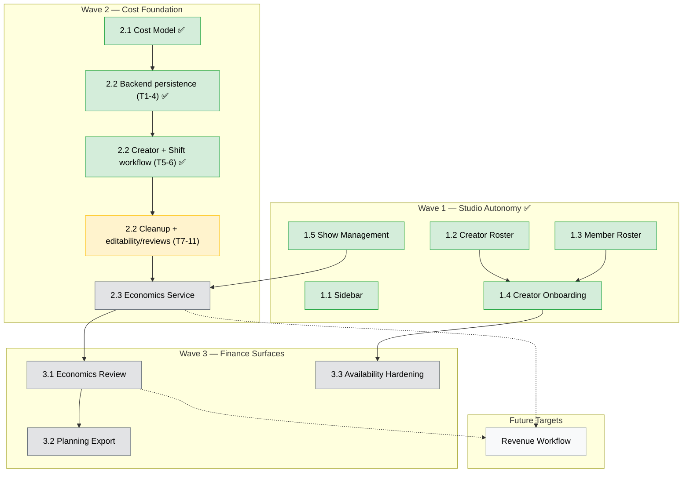

# Phase 4: P&L Visibility & Creator Operations

> **Status**: 🚧 Active — Wave 1 shipped; Wave 2 (Cost Foundation) in progress (2.2 Tasks 1-6 merged; Task 7 next; Tasks 8-11 ahead)
> **Last updated**: 2026-05-15

## Goal

Build the L-side (cost) of P&L on existing studio entities, while completing studio operational autonomy so studios no longer depend on `/system/*` routes for routine workflows.

**Phase 4 produces reference compensation figures, not payments.** No money moves through this system. Admin and manager surfaces may show projected, actual-backed, or planned-fallback values for planning and reconciliation. Creator/operator/helper self-views show actual-backed compensation only; when actuals are missing or incomplete, they show the acknowledged event as pending instead of showing any compensation amount. A future workstream (post-Phase 4) will consume these rows as input to actual payment processing and bank-statement reconciliation. Recipient acknowledgement, dispute, and recipient-initiated adjustment flows are deferred to that future phase; Phase 4 self-views are read-only.

Outcomes:

- Studio operators manage labor rates and creator compensation defaults without system-admin intervention.
- Studio admins onboard creators, create shows, and manage schedules from the studio workspace.
- A canonical cost model defines the snapshot-on-write contract, the actuals priority cascade, and three read-only compensation views (creator, operator, operational) used as reconciliation references.
- Studios review and export projected, actual-backed, and planned-fallback reference costs from a single date-ranged economics engine, with show planning export as a preset.
- Creator assignment correctness is enforced (overlap + roster conflicts).
- **Future target:** revenue inputs (P-side), commission resolution, and contribution margin complete the full P&L model after the simplified Phase 4 cost stack is stable.
- **Out of scope for Phase 4:** revenue workflow, payment processing, bank transfers, bank-statement reconciliation, recipient acknowledgement / dispute, recipient-initiated adjustments, and notifications on actuals edits.

## Workstream Tracker

| #   | Workstream                               | Doc                                                                | Status             | Wave   |
| --- | ---------------------------------------- | ------------------------------------------------------------------ | ------------------ | ------ |
| 1.1 | Sidebar redesign                         | [design](../../apps/erify_studios/docs/design/SIDEBAR_REDESIGN.md) | 🔁 Incremental      | 1      |
| 1.2 | Studio creator roster                    | [feature](../features/studio-creator-roster.md)                    | ✅ Shipped (PR #30) | 1      |
| 1.3 | Studio member roster                     | [feature](../features/studio-member-roster.md)                     | ✅ Shipped (PR #28) | 1      |
| 1.4 | Studio creator onboarding (roster-first) | [feature](../features/studio-creator-onboarding.md)                | ✅ Shipped (PR #32) | 1      |
| 1.5 | Studio show management                   | [feature](../features/studio-show-management.md)                   | ✅ Shipped          | 1      |
| 2.1 | Economics cost model                     | [PRD](../prd/economics-cost-model.md)                              | ✅ Signed off       | 2      |
| 2.2 | Compensation line items + actuals        | [Tracker §PR 3-10](./PHASE_4_REMAINING.md)                         | 🚧 Tasks 1-6 merged; PR 3 next; PRs 4-10 ahead | 2 |
| 2.3 | Economics service                        | [Tracker §PR 11-13](./PHASE_4_REMAINING.md)                        | 🔲 Planned          | 2      |
| 3.1 | Studio economics review surface          | [Tracker §PR 14](./PHASE_4_REMAINING.md)                           | 🔲 Planned          | 3      |
| 3.2 | Page-local exports (shifts + show-operations) | [Tracker §PR 1-2](./PHASE_4_REMAINING.md)                     | 🔲 Planned          | 3      |
| 3.3 | Creator availability hardening           | [Tracker §PR 15](./PHASE_4_REMAINING.md)                           | 🔲 Planned          | 3      |
| 4.1 | P&L revenue workflow                     | [Future PRD](../prd/future/pnl-revenue-workflow.md)                | ⏭️ Future target    | Future |

Single source of truth for remaining work: [PHASE_4_REMAINING.md](./PHASE_4_REMAINING.md) — 15 focused PRs, user-flow-first.

3.3 depends only on shipped 1.4 and is independent of the Wave 2 cost stack. It may start in parallel with Wave 2 if capacity allows.

3.2 is no longer a separate "show planning export" workstream — operations export the page they already review. Page-local exports on `/shifts` and `/show-operations` cover the use case (Tracker PRs 1-2).

4.1 is no longer required to close Phase 4. The PRD has been moved to `docs/prd/future/` until revenue planning restarts.

Studio schedule management is deferred — Google Sheets is the production scheduling path; revisit with the Client Portal workstream.

## Phase 5 Deferrals

| Workstream                                                             | PRD                                     | Track |
| ---------------------------------------------------------------------- | --------------------------------------- | ----- |
| Studio reference data (clients, platforms, types, standards, statuses) | [PRD](../prd/studio-reference-data.md)  | C     |
| Studio creator profile editing (name/alias at studio level)            | [PRD](../prd/studio-creator-profile.md) | C     |
| Studio snapshot/audit trail visibility                                 | —                                       | C     |
| Advanced compensation rule engine                                      | —                                       | A     |
| Creator HR & operations (HRMS, fixed costs)                            | —                                       | A     |
| Ticketing, material management, inventory                              | —                                       | B     |
| Payment processing and bank-statement reconciliation                   | —                                       | A     |
| Recipient acknowledgement / dispute on read-only reference figures     | —                                       | A     |
| Recipient-initiated adjustment requests (in-product channel)           | —                                       | A     |
| Notifications when manager edits actuals                               | —                                       | B     |
| Review-period close lock for standing/schedule line items              | —                                       | A     |
| Platform and creator-app actuals sources                               | —                                       | A     |
| P&L revenue workflow, commission resolution, contribution margin       | [Future PRD](../prd/future/pnl-revenue-workflow.md) | A     |

## Implementation Sequencing



### Wave 2 critical path

| Step | Workstream                                                   | Why                                                                                                                                                                                                                                                                                         |
| ---- | ------------------------------------------------------------ | ------------------------------------------------------------------------------------------------------------------------------------------------------------------------------------------------------------------------------------------------------------------------------------------- |
| 2.1  | [Economics cost model](../prd/economics-cost-model.md)       | ✅ Signed off: creator pay is `FIXED` / `COMMISSION` / `HYBRID` only; show actuals are the only Phase 4 creator-attendance source, with `ShowCreator` / `ShowPlatform` participation actuals retained as extension points only. |
| 2.2  | [Tracker PR 3-10](./PHASE_4_REMAINING.md)                    | 🚧 Tasks 1-6 merged. Remaining work tracked PR-by-PR: cleanup (PR 3), creator/manager edit + review (PR 4-5), show actuals + queue (PR 6-7), per-member review (PR 8), roster warning (PR 9), recipient escalation (PR 10). |
| 2.3  | [Tracker PR 11-13](./PHASE_4_REMAINING.md)                   | Greenfield economics service split into recipient self-views (PR 11), cross-user reads + show drill-in (PR 12), and the operational rollup endpoint (PR 13). Pure calculator over persisted 2.2 inputs. No state machine. |

Wave 3 (PR 14) begins after PR 13 merges to master. PR 15 (creator availability hardening) is independent and may ship in parallel.

### Phase 4 Product Constraints

The compensation-line-items plan, PRDs, and app design docs share three product constraints:

1. **No `HOURLY` for creators.** Creator pay is `FIXED` / `COMMISSION` / `HYBRID` only — flat per show, never time-multiplied.
2. **Show actuals are the only creator-attendance source in Phase 4.** `ShowCreator` and `ShowPlatform` participation actuals are extension points the calculator must remain structured to consume later, but they are not active fields. One actual window per show covers every creator and every platform on that show.
3. **Actuals are typed by `ADMIN`/`MANAGER`.** The `actuals_source: OPERATOR_RECORD` label means "typed into the system by an authorized user," not "the operator who was on set." When/if creator-app or punch-clock sources ship, they fit into the existing enum without re-naming.

The remaining UX work that closes Phase 4 is tracked PR-by-PR in [PHASE_4_REMAINING.md](./PHASE_4_REMAINING.md). Each PR entry is user-flow-first and sized for focused review.

## Architecture Guardrails

Platform-level rules. Domain-specific decisions (line item types, view shapes, etc.) live in the relevant PRDs.

1. **Finance arithmetic is owned by economics services and calculators.** Controllers stay transport-only (authz, DTO parsing, response shaping). Orchestration services coordinate flows but do not own financial formulas.

2. **Monetary arithmetic uses `Prisma.Decimal` end-to-end.** Do not convert to JS `Number` before aggregation. Serialize to string at the API boundary. `toFixed(2)` is forbidden inside aggregation paths. `Prisma.Decimal` is backed by `decimal.js` and ships with `@prisma/client` — no new dependency required.

3. **Polymorphic discriminators on financial tables use Prisma enums where cleanly supported.** Applies to the compensation line-item attachment discriminator and any future financial / audit-bearing tables. Use the repo's `TaskTarget` pattern as the local Prisma polymorphism reference, but do not migrate `TaskTarget` itself.

4. **Historical cost inputs are snapshot-on-write.** `StudioShift.hourlyRate` and `ShowCreator.agreedRate` (plus `compensationType` and `commissionRate`) are persisted at the moment of assignment from explicit input or roster defaults, and never rewritten by source-table edits to `StudioMembership.baseHourlyRate` or `StudioCreator.defaultRate`. Snapshot fields are intended-immutable: ADMIN/MANAGER may update them through the normal endpoint with an FE warning; each update appends an audit entry to the entity's `metadata` column (existing pattern) — no separate audit table in Phase 4. Recorded actual/performance/revenue facts live on their narrowest meaningful entity scope (`Show`, `ShowCreator`, `ShowPlatform`, `StudioShiftBlock`). Projection arithmetic (e.g., shift `hourlyRate × scheduled minutes`) is computed live, not cached.

5. **Aggregation queries exclude soft-deleted rows by default.** An explicit `includeDeleted` flag is permitted only on admin / audit surfaces.

6. **Self-access uses the existing `/me/` module.** Endpoints where a user reads their own data live under `/me/<resource>` (`apps/erify_api/src/me/`) and derive identity from auth context. Cross-user reads (admin viewing another user's data) live under studio-scoped routes with role guards. Do not invent new self-access decorators or per-endpoint identity checks.

7. **Economics aggregation services ship with fixture-based tests.** Coverage includes the actuals priority cascade resolution, null-bubbling cases at each grain, and the read shape defined in [economics-cost-model.md](../prd/economics-cost-model.md). Phase 4 has no cost-state machine — tests target the calculator's resolved-vs-unresolved branches directly.

8. **Symmetry by default across parallel entities.** When two entities share an architectural pattern (e.g., `ShowCreator` and `StudioShift` both use snapshot + line items + actuals + audit), they share a UX pattern by default. Asymmetry is a deliberate, documented decision with a written reason in the plan. New plans must run the symmetry diff in [`.agent/skills/plan-workflow-completeness/`](../../.agent/skills/plan-workflow-completeness/SKILL.md) before sign-off.

9. **Every snapshot field has a documented post-creation edit path with audit.** Snapshot-on-write fields (`ShowCreator.{agreedRate, compensationType, commissionRate}`, `StudioShift.hourlyRate`) must ship with: (a) the write path that creates the snapshot, (b) the edit path that updates it after creation via `appendSnapshotAudit()`, and (c) the UI surface that exposes the edit to the right role. A snapshot without an edit path produces data managers cannot correct without admin intervention and must be flagged as a planning bug.

## Documentation

### Doc flow per feature

The default flow for **novel features** (new domain, new pattern):

```
docs/workflows/<journey>.md         ← Workflow trace (required for new journeys)
    ↓
docs/prd/<feature>.md               ← PRD (pre-ship requirements)
    ↓
apps/*/docs/design/<FEATURE>.md     ← BE / FE design (when implementation introduces a novel pattern)
    ↓
Implementation PR (code + tests)
    ↓
Post-ship: promote PRD → docs/features/, run knowledge-sync
```

The lightweight flow for **additive work that replicates a shipped pattern**:

```
Tracker entry in PHASE_<n>_REMAINING.md  ← User flow + UX target + scope + acceptance
    ↓
Implementation PR (code + tests)
```

No PRD, no design doc unless the change introduces something new. The tracker entry is the spec.

The workflow trace is still the right starting artifact when an end-to-end user journey crosses multiple features — it names every actor, every state transition, every read/write, and every role for every step. PRDs written without a workflow trace tend to orphan input surfaces and per-perspective read views; the Wave 2 expansion in `PHASE_4_REMAINING.md` exists because the original Wave 2 plan was sliced by data layer (storage → calc → UI) without a journey-level pass.

### Phase-level reference

| Scope          | Doc                                                                                                    |
| -------------- | ------------------------------------------------------------------------------------------------------ |
| BE index       | [PHASE_4_PNL_BACKEND.md](../../apps/erify_api/docs/PHASE_4_PNL_BACKEND.md)                             |
| FE index       | [PHASE_4_PNL_FRONTEND.md](../../apps/erify_studios/docs/PHASE_4_PNL_FRONTEND.md)                       |
| Authorization  | [AUTHORIZATION_GUIDE.md](../../apps/erify_api/docs/design/AUTHORIZATION_GUIDE.md)                      |
| Role use cases | [STUDIO_ROLE_USE_CASES_AND_VIEWS.md](../../apps/erify_studios/docs/STUDIO_ROLE_USE_CASES_AND_VIEWS.md) |

### Per-feature docs

| Workstream                            | Product                                                 | BE                                                                              | FE                                                                                  |
| ------------------------------------- | ------------------------------------------------------- | ------------------------------------------------------------------------------- | ----------------------------------------------------------------------------------- |
| 1.2 Studio creator roster             | [feature](../features/studio-creator-roster.md)         | [BE](../../apps/erify_api/docs/STUDIO_CREATOR_ROSTER.md)                        | [FE](../../apps/erify_studios/docs/STUDIO_CREATOR_ROSTER.md)                        |
| 1.3 Studio member roster              | [feature](../features/studio-member-roster.md)          | Shipped (PR #28)                                                                | Shipped (PR #28)                                                                    |
| 1.4 Studio creator onboarding         | [feature](../features/studio-creator-onboarding.md)     | [BE](../../apps/erify_api/docs/STUDIO_CREATOR_ONBOARDING.md)                    | [FE](../../apps/erify_studios/docs/STUDIO_CREATOR_ONBOARDING.md)                    |
| 1.5 Studio show management            | [feature](../features/studio-show-management.md)        | [BE](../../apps/erify_api/docs/STUDIO_SHOW_MANAGEMENT.md)                       | [FE](../../apps/erify_studios/docs/STUDIO_SHOW_MANAGEMENT.md)                       |
| 2.1 Economics cost model              | [PRD](../prd/economics-cost-model.md)                          | N/A (docs-only)                                                                 | N/A                                                                                 |
| 2.2 Compensation line items + actuals | [Tracker §PR 3-10](./PHASE_4_REMAINING.md)                     | [BE design](../../apps/erify_api/docs/design/COMPENSATION_LINE_ITEMS_DESIGN.md) | [FE design](../../apps/erify_studios/docs/design/COMPENSATION_LINE_ITEMS_DESIGN.md) |
| 2.3 Economics service                 | [Tracker §PR 11-13](./PHASE_4_REMAINING.md)                    | Design doc on the first PR that introduces a novel pattern                      | Same                                                                                |
| 3.1 Studio economics review           | [Tracker §PR 14](./PHASE_4_REMAINING.md)                       | n/a (FE-only consumer of PR 13)                                                 | Design doc on PR 14                                                                 |
| 3.2 Page-local exports                | [Tracker §PR 1-2](./PHASE_4_REMAINING.md)                      | n/a (FE-only)                                                                   | n/a (no new pattern)                                                                |
| 3.3 Creator availability hardening    | [Tracker §PR 15](./PHASE_4_REMAINING.md)                       | [BE](../../apps/erify_api/docs/design/CREATOR_AVAILABILITY_HARDENING_DESIGN.md) | [FE](../../apps/erify_studios/docs/design/CREATOR_AVAILABILITY_HARDENING_DESIGN.md) |
| Future P&L revenue workflow           | [Future PRD](../prd/future/pnl-revenue-workflow.md)            | Redraft when revenue planning restarts                                          | Redraft when revenue planning restarts                                              |

## Definition of Done

Phase 4 explicitly does not process payments. Every figure produced is a read-only reference value. Admin/manager planned-fallback values must carry warnings; creator/operator/helper self-views must hide money for any event with missing or incomplete actuals and show pending events until actuals are complete.

DoD is scenario-based: each bullet names *who* does *what* and ends with a *verifiable observable outcome*. A scenario cannot be partially satisfied — either the loop closes or it doesn't.

**Wave 1 — Studio autonomy** (shipped)

- [x] A studio admin edits a member's `baseHourlyRate` from the studio member roster and the change is reflected in subsequent shift snapshots.
- [x] A studio admin creates a creator roster entry with default compensation; a talent manager can then assign that creator to a show using the roster-first enforcement.
- [x] A studio admin creates, updates, and deletes a show from the studio workspace without `/system/*` access.
- [x] An internal user reads phase docs via the authenticated `eridu_docs` SSR site.

**Wave 2 — Cost foundation** (in progress)

- [x] 2.1 Economics cost model is signed off — data model, pure calculator, three read views, planned-fallback warnings, and future-extension surface are locked.
- [x] 2.2 Tasks 1-6 merged (PRs #59, #60, #62, #63, #64, #65) — see [PHASE_4_REMAINING.md](./PHASE_4_REMAINING.md) for shipped checkboxes.
- [ ] 2.2 Tasks 7-11 + 2.3 economics service — tracked PR-by-PR in [PHASE_4_REMAINING.md § Definition of Done](./PHASE_4_REMAINING.md#definition-of-done).

**Wave 3 — Finance surfaces** (planned)

Tracked PR-by-PR in [PHASE_4_REMAINING.md](./PHASE_4_REMAINING.md) (PRs 1, 2, 14, 15).

Future target, not a Phase 4 close requirement:

- [ ] P&L revenue workflow (revenue input, `COMMISSION` / `HYBRID` activation, contribution margin) — relocated to [`docs/prd/future/`](../prd/future/pnl-revenue-workflow.md).
