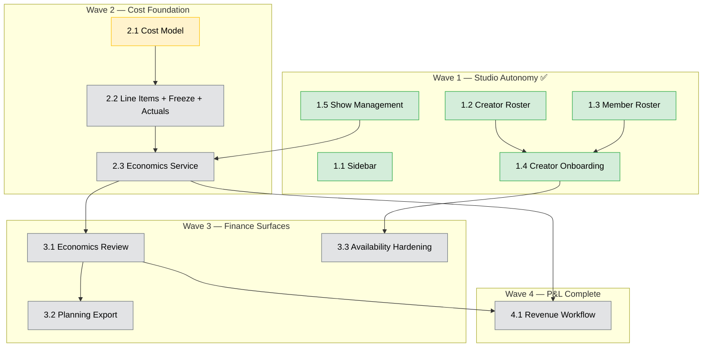

# Phase 4: P&L Visibility & Creator Operations

> **Status**: 🚧 Active — Wave 1 shipped; Wave 2 (Cost Foundation) is the current critical path
> **Last updated**: 2026-04-25

## Goal

Build the L-side (cost) of P&L on existing studio entities, while completing studio operational autonomy so studios no longer depend on `/system/*` routes for routine workflows.

**Phase 4 produces reference compensation figures, not payments.** No money moves through this system. Every figure the L-side stack emits — projected or settled — is a *settled-reference value* that creators, operators, and managers inspect to reconcile work-vs-compensation as if it were an agreement preview. A future workstream (post-Phase 4) will consume settled rows as input to actual payment processing and bank-statement reconciliation. Recipient acknowledgement, dispute, and recipient-initiated adjustment flows are deferred to that future phase; Phase 4 self-views are read-only.

Outcomes:

- Studio operators manage labor rates and creator compensation defaults without system-admin intervention.
- Studio admins onboard creators, create shows, and manage schedules from the studio workspace.
- A canonical cost model defines the contract (agreement freeze at show-end), the actuals priority cascade, and three read-only compensation views (creator, operator, operational) used as reconciliation references.
- Studios review and export projected and settled-reference costs from a single date-ranged economics engine, with show planning export as a preset.
- Creator assignment correctness is enforced (overlap + roster conflicts).
- Revenue inputs (P-side) complete the full P&L model.
- **Out of scope for Phase 4:** payment processing, bank transfers, bank-statement reconciliation, recipient acknowledgement / dispute, recipient-initiated adjustments, and notifications on actuals edits.

## Workstream Tracker

| #   | Workstream                               | Doc                                                                | Status                 | Wave |
| --- | ---------------------------------------- | ------------------------------------------------------------------ | ---------------------- | ---- |
| 1.1 | Sidebar redesign                         | [design](../../apps/erify_studios/docs/design/SIDEBAR_REDESIGN.md) | 🔁 Incremental          | 1    |
| 1.2 | Studio creator roster                    | [feature](../features/studio-creator-roster.md)                    | ✅ Shipped (PR #30)     | 1    |
| 1.3 | Studio member roster                     | [feature](../features/studio-member-roster.md)                     | ✅ Shipped (PR #28)     | 1    |
| 1.4 | Studio creator onboarding (roster-first) | [feature](../features/studio-creator-onboarding.md)                | ✅ Shipped (PR #32)     | 1    |
| 1.5 | Studio show management                   | [feature](../features/studio-show-management.md)                   | ✅ Shipped              | 1    |
| 2.1 | Economics cost model                     | [PRD](../prd/economics-cost-model.md)                              | 🔲 Active (this branch) | 2    |
| 2.2 | Compensation line items + actuals        | [PRD](../prd/compensation-line-items.md)                           | 🔲 Planned (visioning)  | 2    |
| 2.3 | Economics service                        | (design doc lands when 2.3 starts)                                 | 🔲 Planned              | 2    |
| 3.1 | Studio economics review engine           | [PRD](../prd/studio-economics-review.md)                           | 🔲 Planned              | 3    |
| 3.2 | Show planning export                     | [PRD](../prd/show-planning-export.md)                              | 🔲 Planned              | 3    |
| 3.3 | Creator availability hardening           | [PRD](../prd/creator-availability-hardening.md)                    | 🔲 Planned              | 3    |
| 4.1 | P&L revenue workflow                     | [PRD](../prd/pnl-revenue-workflow.md)                              | 🔲 Planned              | 4    |

3.3 depends only on shipped 1.4 and is independent of the Wave 2 cost stack. It may start in parallel with Wave 2 if capacity allows.

Studio schedule management is deferred — Google Sheets is the production scheduling path; revisit with the Client Portal workstream.

## Phase 5 Deferrals

| Workstream                                                             | PRD                                     | Track |
| ---------------------------------------------------------------------- | --------------------------------------- | ----- |
| Studio reference data (clients, platforms, types, standards, statuses) | [PRD](../prd/studio-reference-data.md)  | C     |
| Studio creator profile editing (name/alias at studio level)            | [PRD](../prd/studio-creator-profile.md) | C     |
| Studio snapshot/audit trail visibility                                 | —                                       | C     |
| Advanced compensation rule engine                                      | —                                       | A     |
| Creator HR & operations (HRMS, fixed costs)                            | —                                       | A     |
| Ticketing, material management, inventory                              | —                                       | B     |
| Payment processing and bank-statement reconciliation                   | —                                       | A     |
| Recipient acknowledgement / dispute on settled-reference figures       | —                                       | A     |
| Recipient-initiated adjustment requests (in-product channel)           | —                                       | A     |
| Notifications when manager edits actuals                               | —                                       | B     |
| Review-period close lock for standing/schedule line items              | —                                       | A     |
| Platform-feed and creator-app actuals sources (priority 1 and 3)       | —                                       | A     |

## Implementation Sequencing



### Wave 2 critical path

Wave 2 is single-track. Each step gates the next.

| Step | Workstream                                                   | Why                                                                                                                                                                                                                                                                                                                               |
| ---- | ------------------------------------------------------------ | --------------------------------------------------------------------------------------------------------------------------------------------------------------------------------------------------------------------------------------------------------------------------------------------------------------------------------- |
| 2.1  | [Economics cost model](../prd/economics-cost-model.md)       | Docs-only. Locks the simplified Phase 4 data model, computation rules, three read-only views, and extensibility hooks. Sibling PRDs and design docs are visioning.                                                                                                                                                                |
| 2.2  | [Compensation line items](../prd/compensation-line-items.md) | First code. Prisma additions for `CompensationLineItem` + `Show.actualStartTime/EndTime` + `StudioShiftBlock.actualStartTime/EndTime`; per-target compensation surfaces. **No freeze guards, no settlement, no grace, no audit table** in Phase 4 — sibling PRD is visioning and will be redrafted to match the simplified scope. |
| 2.3  | Economics service                                            | Greenfield implementation of the pure calculator against 2.1, consuming line-items + actuals from 2.2. No state machine.                                                                                                                                                                                                          |

Wave 3 begins after 2.3 merges to master.

## Architecture Guardrails

Platform-level rules. Domain-specific decisions (line item types, view shapes, etc.) live in the relevant PRDs.

1. **Finance arithmetic is owned by economics services and calculators.** Controllers stay transport-only (authz, DTO parsing, response shaping). Orchestration services coordinate flows but do not own financial formulas.

2. **Monetary arithmetic uses `Prisma.Decimal` end-to-end.** Do not convert to JS `Number` before aggregation. Serialize to string at the API boundary. `toFixed(2)` is forbidden inside aggregation paths. `Prisma.Decimal` is backed by `decimal.js` and ships with `@prisma/client` — no new dependency required.

3. **Polymorphic discriminators on financial tables use Prisma enums.** Applies to `CompensationTarget` and any future financial / audit-bearing tables. `TaskTarget` is pre-existing with a string discriminator and is not migrated.

4. **Historical cost inputs are snapshot-on-write.** `StudioShift.hourlyRate` and `ShowCreator.agreedRate` (plus `compensationType` and `commissionRate`) are persisted at the moment of assignment from explicit input or roster defaults, and never rewritten by source-table edits to `StudioMembership.baseHourlyRate` or `StudioCreator.defaultRate`. Snapshot fields are intended-immutable: ADMIN/MANAGER may update them through the normal endpoint with an FE warning; each update appends an audit entry to the entity's `metadata` column (existing pattern) — no separate audit table in Phase 4. Projection arithmetic (e.g., shift `hourlyRate × scheduled minutes`) is computed live, not cached.

5. **Aggregation queries exclude soft-deleted rows by default.** An explicit `includeDeleted` flag is permitted only on admin / audit surfaces.

6. **Self-access uses the existing `/me/` module.** Endpoints where a user reads their own data live under `/me/<resource>` (`apps/erify_api/src/me/`) and derive identity from auth context. Cross-user reads (admin viewing another user's data) live under studio-scoped routes with role guards. Do not invent new self-access decorators or per-endpoint identity checks.

7. **Economics aggregation services ship with fixture-based tests.** Coverage includes the actuals priority cascade resolution, null-bubbling cases at each grain, and the read shape defined in [economics-cost-model.md](../prd/economics-cost-model.md). Phase 4 has no cost-state machine — tests target the calculator's resolved-vs-unresolved branches directly.

## Documentation

### Doc flow per feature

```
docs/prd/<feature>.md                                ← PRD (pre-ship)
    ↓
apps/erify_api/docs/design/<FEATURE>_DESIGN.md       ← BE design
apps/erify_studios/docs/design/<FEATURE>_DESIGN.md   ← FE design
    ↓
Implementation PR (code + tests)
    ↓
Post-ship: promote PRD → docs/features/, promote app docs → apps/*/docs/, run knowledge-sync
```

### Phase-level reference

| Scope          | Doc                                                                                                    |
| -------------- | ------------------------------------------------------------------------------------------------------ |
| BE index       | [PHASE_4_PNL_BACKEND.md](../../apps/erify_api/docs/PHASE_4_PNL_BACKEND.md)                             |
| FE index       | [PHASE_4_PNL_FRONTEND.md](../../apps/erify_studios/docs/PHASE_4_PNL_FRONTEND.md)                       |
| Authorization  | [AUTHORIZATION_GUIDE.md](../../apps/erify_api/docs/design/AUTHORIZATION_GUIDE.md)                      |
| Role use cases | [STUDIO_ROLE_USE_CASES_AND_VIEWS.md](../../apps/erify_studios/docs/STUDIO_ROLE_USE_CASES_AND_VIEWS.md) |

### Per-feature docs

| Workstream                            | Product                                                | BE                                                                                     | FE                                                                                         |
| ------------------------------------- | ------------------------------------------------------ | -------------------------------------------------------------------------------------- | ------------------------------------------------------------------------------------------ |
| 1.2 Studio creator roster             | [feature](../features/studio-creator-roster.md)        | [BE](../../apps/erify_api/docs/STUDIO_CREATOR_ROSTER.md)                               | [FE](../../apps/erify_studios/docs/STUDIO_CREATOR_ROSTER.md)                               |
| 1.3 Studio member roster              | [feature](../features/studio-member-roster.md)         | Shipped (PR #28)                                                                       | Shipped (PR #28)                                                                           |
| 1.4 Studio creator onboarding         | [feature](../features/studio-creator-onboarding.md)    | [BE](../../apps/erify_api/docs/STUDIO_CREATOR_ONBOARDING.md)                           | [FE](../../apps/erify_studios/docs/STUDIO_CREATOR_ONBOARDING.md)                           |
| 1.5 Studio show management            | [feature](../features/studio-show-management.md)       | [BE](../../apps/erify_api/docs/STUDIO_SHOW_MANAGEMENT.md)                              | [FE](../../apps/erify_studios/docs/STUDIO_SHOW_MANAGEMENT.md)                              |
| 2.1 Economics cost model              | [PRD](../prd/economics-cost-model.md)                  | N/A (docs-only)                                                                        | N/A                                                                                        |
| 2.2 Compensation line items + actuals | [PRD](../prd/compensation-line-items.md) *(visioning)* | [BE](../../apps/erify_api/docs/design/COMPENSATION_LINE_ITEMS_DESIGN.md) *(visioning)* | [FE](../../apps/erify_studios/docs/design/COMPENSATION_LINE_ITEMS_DESIGN.md) *(visioning)* |
| 2.3 Economics service                 | (design doc lands when 2.3 starts)                     | [BE](../../apps/erify_api/docs/design/SHOW_ECONOMICS_DESIGN.md) *(visioning)*          | [FE](../../apps/erify_studios/docs/design/SHOW_ECONOMICS_DESIGN.md) *(visioning)*          |
| 3.1 Studio economics review           | [PRD](../prd/studio-economics-review.md) *(visioning)* | [BE](../../apps/erify_api/docs/design/STUDIO_ECONOMICS_REVIEW_DESIGN.md) *(visioning)* | [FE](../../apps/erify_studios/docs/design/STUDIO_ECONOMICS_REVIEW_DESIGN.md) *(visioning)* |
| 3.2 Show planning export              | [PRD](../prd/show-planning-export.md) *(visioning)*    | [BE](../../apps/erify_api/docs/design/SHOW_PLANNING_EXPORT_DESIGN.md)                  | [FE](../../apps/erify_studios/docs/design/SHOW_PLANNING_EXPORT_DESIGN.md)                  |
| 3.3 Creator availability hardening    | [PRD](../prd/creator-availability-hardening.md)        | [BE](../../apps/erify_api/docs/design/CREATOR_AVAILABILITY_HARDENING_DESIGN.md)        | [FE](../../apps/erify_studios/docs/design/CREATOR_AVAILABILITY_HARDENING_DESIGN.md)        |
| 4.1 P&L revenue workflow              | [PRD](../prd/pnl-revenue-workflow.md) *(visioning)*    | [BE](../../apps/erify_api/docs/design/PNL_REVENUE_WORKFLOW_DESIGN.md)                  | [FE](../../apps/erify_studios/docs/design/PNL_REVENUE_WORKFLOW_DESIGN.md)                  |

## Definition of Done

Phase 4 explicitly does not process payments — every figure produced is a settled-reference value, and recipient self-views are read-only references.

- [x] Studio member roster with `baseHourlyRate` editing
- [x] Studio creator roster CRUD with compensation defaults
- [x] Studio-side creator onboarding with roster-first assignment enforcement
- [x] Studio show CRUD (create / update / delete before start time)
- [x] Internal docs knowledge base (`eridu_docs`) with authenticated SSR access
- [ ] 2.1 Economics cost model locked (simplified data model + pure calculator + three read-only views + future-extensions surface)
- [ ] 2.2 `CompensationLineItem` + actuals fields (`Show.actualStartTime/EndTime`, `StudioShiftBlock.actualStartTime/EndTime`) + per-target compensation surfaces (read-only). **No freeze guards, no settlement, no grace, no audit table in Phase 4.** Snapshot-field overrides audited via existing `metadata`-column pattern.
- [ ] 2.3 Economics service implemented as a pure calculator + three read endpoints; merged to `master`
- [ ] 3.1 Studio economics review engine (date-ranged, read-only) consuming the operational view
- [ ] 3.2 Show planning export
- [ ] 3.3 Creator availability hardening (overlap + roster conflict)
- [ ] Sidebar Finance group landed alongside 3.1
- [ ] 4.1 P&L revenue workflow (revenue input, COMMISSION/HYBRID activation, contribution margin)
