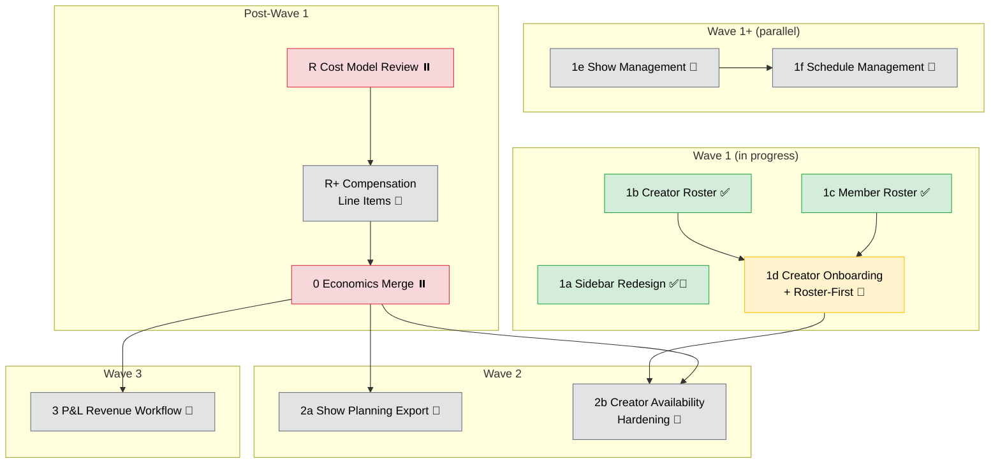

# Phase 4: P&L Visibility & Creator Operations

> **Status**: 🚧 Active (Wave 1 in progress — rosters shipped, onboarding next)
> **Primary tracker**: This file (`PHASE_4.md`)
> **Last updated**: 2026-03-28

## Goal

Build the P&L system on existing entities, focusing on the **L-side** (labor and creator costs), while completing studio operational autonomy so studios no longer depend on `/system/*` for routine workflows.

Key outcomes:
- Studio operators can manage labor rates and creator compensation defaults without system-admin intervention.
- Studio admins can onboard brand-new creators, create shows, and manage schedules from the studio workspace.
- Variable cost visibility (creator costs + shift labor) is surfaced via economics endpoints.
- Pre-show planning exports include estimated cost data.
- Creator assignment correctness is enforced (overlap + roster conflicts).
- Revenue inputs (P-side) complete the full P&L model.

## Workstream Tracker

Single source of truth for all Phase 4 features. Each row links to its PRD (pre-ship) or feature doc (post-ship).

| #   | Workstream                               | Doc                                                                | Status                           | Wave   | Notes                                                                                                                     |
| --- | ---------------------------------------- | ------------------------------------------------------------------ | -------------------------------- | ------ | ------------------------------------------------------------------------------------------------------------------------- |
| P   | Task template migration                  | —                                                                  | ✅ Done (operational, 2026-03-24) | Pre    | Not repo-tracked; operational CSV rebuild                                                                                 |
| 1a  | Sidebar redesign                         | [design](../../apps/erify_studios/docs/design/SIDEBAR_REDESIGN.md) | 🔁 Incremental                    | 1      | Structure done (My Workspace, Settings, Creators). Reports + Finance groups added as features ship. Icon fixes remaining. |
| 1b  | Studio creator roster CRUD               | [feature](../features/studio-creator-roster.md)                    | ✅ Implemented (PR #30)           | 1      | Roster + compensation defaults + inactive enforcement                                                                     |
| 1c  | Studio member roster CRUD                | [feature](../features/studio-member-roster.md)                     | ✅ Shipped (PR #28)               | 1      | `baseHourlyRate` editing, self-demotion guard                                                                             |
| 1d  | Studio creator onboarding + roster-first | [PRD](../prd/studio-creator-onboarding.md)                         | 🔲 **Next** (critical path)       | 1      | Fixes roster enforcement bug; removes `/system/*` dependency; unblocks Wave 2                                             |
| 1e  | Studio show management                   | [PRD](../prd/studio-show-management.md)                            | 🔲 Planned                        | 1+     | No deps. Highest-impact studio autonomy gap                                                                               |
| 1f  | Studio schedule management               | [PRD](../prd/studio-schedule-management.md)                        | 🔲 Planned                        | 1+     | Benefits from 1e. Schedule CRUD + publish + snapshots                                                                     |
| R   | Economics cost model review              | —                                                                  | ⏸️ Deferred                       | Post-1 | Gate: Wave 1 complete. Review bonus/OT/allowance cost components                                                          |
| R+  | Compensation line items                  | [PRD](../prd/compensation-line-items.md)                           | 🔲 Planned                        | Post-1 | `CompensationLineItem` + `CompensationTarget` schema, CRUD, economics integration                                         |
| 0   | Economics baseline merge                 | [feature](../features/show-economics.md)                           | ⏸️ Deferred                       | Post-1 | Branch `feat/show-economics-baseline` (commit `8de31ffe`). Merge after R+                                                 |
| 2a  | Show planning export                     | [PRD](../prd/show-planning-export.md)                              | 🔲 Planned                        | 2      | Gate: economics on master. CSV/JSON + cost column                                                                         |
| 2b  | Creator availability hardening           | [PRD](../prd/creator-availability-hardening.md)                    | 🔲 Planned                        | 2      | Gate: 1d merged. `strict=true` overlap + roster enforcement                                                               |
| 3   | P&L revenue workflow                     | [PRD](../prd/pnl-revenue-workflow.md)                              | 🔲 Planned                        | 3      | Gate: 4 design Qs resolved + `big.js`. GMV/sales, commission activation                                                   |

### Phase 5 Deferrals

| Workstream                                                             | PRD                                     | Track |
| ---------------------------------------------------------------------- | --------------------------------------- | ----- |
| Studio reference data (clients, platforms, types, standards, statuses) | [PRD](../prd/studio-reference-data.md)  | C     |
| Studio creator profile editing (name/alias at studio level)            | [PRD](../prd/studio-creator-profile.md) | C     |
| Studio snapshot/audit trail visibility                                 | —                                       | C     |
| Advanced compensation rule engine                                      | —                                       | A     |
| Creator HR & operations (HRMS, fixed costs)                            | —                                       | A     |
| Ticketing, material management, inventory                              | —                                       | B     |

## Execution Plan

### Dependency Graph



### Current Priority

| Priority    | PR  | Workstream                                                               | Why                                                                                                                    |
| ----------- | --- | ------------------------------------------------------------------------ | ---------------------------------------------------------------------------------------------------------------------- |
| **Primary** | 1d  | [Creator Onboarding + Roster-First](../prd/studio-creator-onboarding.md) | Critical path blocker. Fixes roster bug, removes `/system/*` dep, unblocks Wave 2. Also fixes 2 minor PR #30 warnings. |
| Parallel    | 1e  | [Studio Show Management](../prd/studio-show-management.md)               | Highest-impact autonomy gap. No deps. PRD ready.                                                                       |

**Per-PR workflow**: review PRD → create BE/FE design docs under `apps/*/docs/design/` → implement → post-ship knowledge-sync.

## Architecture Guardrails

- Finance arithmetic must live in dedicated economics domain services/calculators.
- Controllers must stay transport-focused (authz, DTO parsing, response shaping only).
- Orchestration services may coordinate flows but must not own financial formulas.
- `metadata` is not a compensation rule engine and must not store executable bonus logic.
- `CompensationLineItem` records are flat monetary amounts entered by humans (or written by a future rule engine). The model stores **outcomes**, not **rules**. Rule engines are Phase 5 scope.
- The compensation system is a single-entry cost journal, not a double-entry ledger.
- `CompensationTarget` follows the `TaskTarget` polymorphic pattern: single intermediate table with `targetType` + `targetId` discriminator and nullable FK columns.
- A person can be both a `StudioMembership` and a `StudioCreator` simultaneously. Line items attach to the **association record** via `CompensationTarget` — separate target records, independent P&L cost buckets.

## Economics Baseline (Deferred Merge)

- **Branch**: `feat/show-economics-baseline` — 1 commit ahead of `master`, not yet merged
- **Endpoints**: `GET /studios/:studioId/shows/:showId/economics` (single show) and `GET /studios/:studioId/economics` (grouped)
- **Why deferred**: Cost model may need rework for bonus/OT/allowances. Review after Wave 1 when roster data layer is stable.
- **Merge target**: After compensation line items ship (PR R+), revise and merge with line item aggregation.
- **Risk**: Branch drift — rebase periodically as Wave 1 features merge to master.

## Documentation

### Doc Flow (per feature)

```
docs/prd/<feature>.md                              ← PRD (pre-ship)
    ↓
apps/erify_api/docs/design/<FEATURE>_DESIGN.md      ← BE design
apps/erify_studios/docs/design/<FEATURE>_DESIGN.md   ← FE design
    ↓
Implementation PR (code + tests)
    ↓
Post-ship: promote PRD → docs/features/, run knowledge-sync
```

### Phase-Level Reference Docs

| Scope          | Doc                                                                                                    |
| -------------- | ------------------------------------------------------------------------------------------------------ |
| BE index       | [PHASE_4_PNL_BACKEND.md](../../apps/erify_api/docs/PHASE_4_PNL_BACKEND.md)                             |
| FE index       | [PHASE_4_PNL_FRONTEND.md](../../apps/erify_studios/docs/PHASE_4_PNL_FRONTEND.md)                       |
| Authorization  | [AUTHORIZATION_GUIDE.md](../../apps/erify_api/docs/design/AUTHORIZATION_GUIDE.md)                      |
| Role use cases | [STUDIO_ROLE_USE_CASES_AND_VIEWS.md](../../apps/erify_studios/docs/STUDIO_ROLE_USE_CASES_AND_VIEWS.md) |

### Per-Feature Design Docs

| Feature                        | Product Doc                                         | BE Design                                                                       | FE Design                                                                           |
| ------------------------------ | --------------------------------------------------- | ------------------------------------------------------------------------------- | ----------------------------------------------------------------------------------- |
| Creator mapping                | [feature](../features/creator-mapping.md)           | —                                                                               | —                                                                                   |
| Economics baseline             | [feature](../features/show-economics.md)            | [BE](../../apps/erify_api/docs/design/SHOW_ECONOMICS_DESIGN.md)                 | [FE](../../apps/erify_studios/docs/design/SHOW_ECONOMICS_DESIGN.md)                 |
| Studio member roster           | [feature](../features/studio-member-roster.md)      | Shipped (PR #28)                                                                | Shipped (PR #28)                                                                    |
| Studio creator roster          | [feature](../features/studio-creator-roster.md)     | [BE](../../apps/erify_api/docs/STUDIO_CREATOR_ROSTER.md)                        | [FE](../../apps/erify_studios/docs/STUDIO_CREATOR_ROSTER.md)                        |
| Studio creator onboarding      | [PRD](../prd/studio-creator-onboarding.md)          | [BE](../../apps/erify_api/docs/design/STUDIO_CREATOR_ONBOARDING_DESIGN.md)      | [FE](../../apps/erify_studios/docs/design/STUDIO_CREATOR_ONBOARDING_DESIGN.md)      |
| Compensation line items        | [PRD](../prd/compensation-line-items.md)            | [BE](../../apps/erify_api/docs/design/COMPENSATION_LINE_ITEMS_DESIGN.md)        | [FE](../../apps/erify_studios/docs/design/COMPENSATION_LINE_ITEMS_DESIGN.md)        |
| Show planning export           | [PRD](../prd/show-planning-export.md)               | [BE](../../apps/erify_api/docs/design/SHOW_PLANNING_EXPORT_DESIGN.md)           | [FE](../../apps/erify_studios/docs/design/SHOW_PLANNING_EXPORT_DESIGN.md)           |
| Creator availability hardening | [PRD](../prd/creator-availability-hardening.md)     | [BE](../../apps/erify_api/docs/design/CREATOR_AVAILABILITY_HARDENING_DESIGN.md) | [FE](../../apps/erify_studios/docs/design/CREATOR_AVAILABILITY_HARDENING_DESIGN.md) |
| P&L revenue workflow           | [PRD](../prd/pnl-revenue-workflow.md)               | [BE](../../apps/erify_api/docs/design/PNL_REVENUE_WORKFLOW_DESIGN.md)           | [FE](../../apps/erify_studios/docs/design/PNL_REVENUE_WORKFLOW_DESIGN.md)           |
| Sidebar redesign               | N/A                                                 | N/A                                                                             | [FE](../../apps/erify_studios/docs/design/SIDEBAR_REDESIGN.md)                      |
| Studio show management         | [PRD](../prd/studio-show-management.md)             | TBD                                                                             | TBD                                                                                 |
| Studio schedule management     | [PRD](../prd/studio-schedule-management.md)         | TBD                                                                             | TBD                                                                                 |
| Studio reference data          | [PRD](../prd/studio-reference-data.md)              | TBD                                                                             | TBD                                                                                 |
| Studio creator profile         | [PRD](../prd/studio-creator-profile.md)             | TBD                                                                             | TBD                                                                                 |
| Task submission reporting      | [feature](../features/task-submission-reporting.md) | [BE](../../apps/erify_api/docs/design/TASK_SUBMISSION_REPORTING_DESIGN.md)      | [FE](../../apps/erify_studios/docs/design/TASK_SUBMISSION_REPORTING_DESIGN.md)      |

## Risks & Open Items

| Item                                                                     | Risk   | Mitigation                                      |
| ------------------------------------------------------------------------ | ------ | ----------------------------------------------- |
| Roster enforcement bug — non-rostered creators silently assigned         | High   | Fix in PR #1d (roster-first enforcement)        |
| Economics cost model may need rework for bonus/OT/allowances             | High   | Review after Wave 1; revise before merge        |
| P&L Revenue Workflow has 4 unresolved design questions                   | High   | Resolve during Wave 1/2 so Wave 3 isn't delayed |
| Economics branch drift (`feat/show-economics-baseline` since 2026-03-22) | Medium | Rebase periodically                             |
| No financial arithmetic library — JS `Number` with `.toFixed(2)`         | Medium | Adopt `big.js` before Wave 3                    |
| Show Planning Export batch cost at scale                                 | Medium | Cap at 90-day range                             |

## Definition of Done (Phase 4)

- [x] Creator mapping + assignment flow stable and merged
- [x] Economics baseline shipped (per-show and grouped endpoints)
- [x] Studio member roster with `baseHourlyRate` editing
- [x] Studio creator roster CRUD with compensation defaults
- [ ] Studio-side creator onboarding outside `/system/*` with roster-first assignment enforcement
- [ ] Studio show CRUD — studios can create, update, and delete shows
- [ ] Studio schedule management — studios can create, validate, publish schedules
- [ ] Compensation line items (`CompensationLineItem` + `CompensationTarget`) with economics integration
- [ ] Show planning export (pre-show, with cost column)
- [ ] Creator availability strict-mode (overlap + roster conflict)
- [ ] Sidebar redesigned to function-based groups
- [ ] P&L revenue workflow — GMV/sales input, COMMISSION/HYBRID activation

## Historical Notes

<details>
<summary>Resolved from Ideation (2026-03-22)</summary>

| Topic                                                    | Disposition             | Commit / PR  |
| -------------------------------------------------------- | ----------------------- | ------------ |
| Frontend API Contract Consistency (`pageSize` → `limit`) | ✅ Implemented           | PRs #21, #23 |
| API Read-Path Optimization (show / task-template slice)  | ✅ Partial slice shipped | PR #22       |
| Studios Internal Read Burst Hardening                    | ✅ Implemented           | PR #24       |

</details>

<details>
<summary>Task Template Migration (2026-03-23)</summary>

Moderation templates rebuilt operationally on March 24, 2026 from real moderator worksheet CSV. One-off operational rebuild, not permanent repo-tracked tooling. Ongoing follow-up is reporting validation plus template-surface refinement.

</details>

<details>
<summary>Studio Autonomy Gap Analysis (2026-03-28)</summary>

Cross-reference of `/admin/*` vs `/studios/*` routes identified operations where studios depend on system admins:

| Gap                                                             | Severity | Phase  | PRD                                         |
| --------------------------------------------------------------- | -------- | ------ | ------------------------------------------- |
| Show CRUD                                                       | Critical | 4 (1+) | [PRD](../prd/studio-show-management.md)     |
| Schedule management                                             | High     | 4 (1+) | [PRD](../prd/studio-schedule-management.md) |
| Reference data (clients, platforms, types, standards, statuses) | Medium   | 5      | [PRD](../prd/studio-reference-data.md)      |
| Creator profile editing (name/alias)                            | Low      | 5      | [PRD](../prd/studio-creator-profile.md)     |
| Snapshot/audit trail                                            | Low      | 5      | —                                           |

</details>
