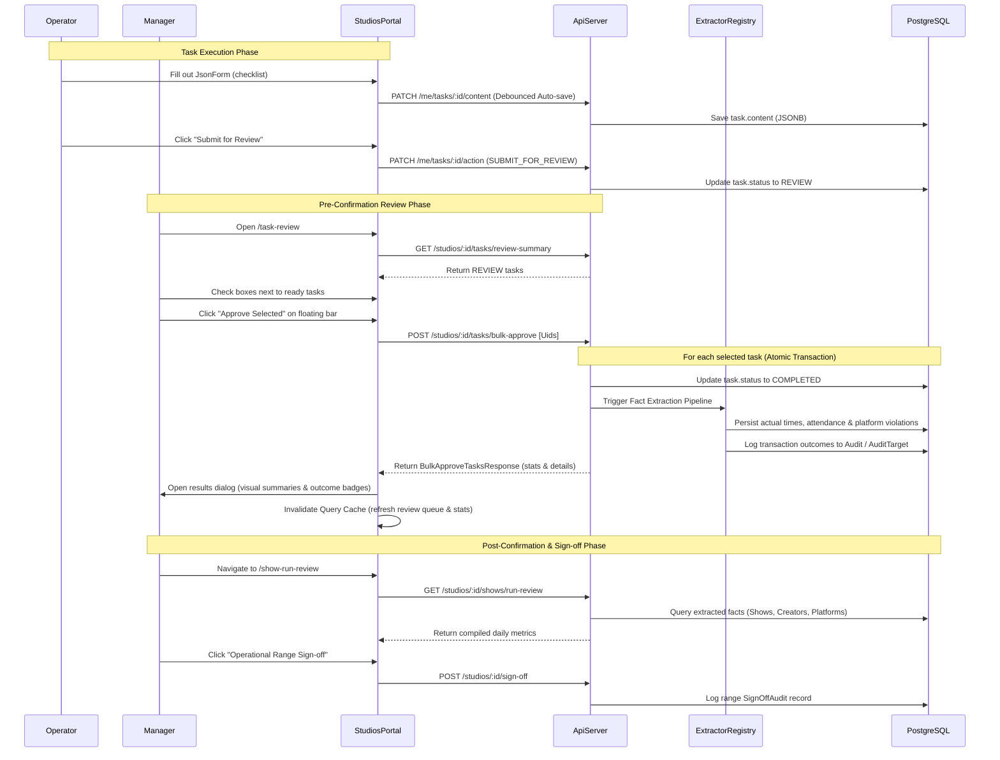

# Workflow: Task & Operations Review

End-to-end workflow for how a studio manages operator task execution, manager bulk approvals, database fact extraction, and compiled daily operations sign-offs.

---

## Actors

| Actor | Role | Key Capability |
| --- | --- | --- |
| Operator (Host/Producer) | All | Executes check-lists, fills out forms, auto-saves input, and submits tasks. |
| Studio Manager | `MANAGER` | Reviews submissions, bulk-approves tasks, reviews compiled daily facts, and logs sign-offs. |
| Studio Admin | `ADMIN` | Same as Manager, plus template creation and task configuration. |

---

## Flow Overview

```
1. Admin binds template fields to system fact keys (Task Template Builder)
       ↓
2. Admin instantiates tasks for shows (Task Setup / Automatic generation)
       ↓
3. Operator fills out JsonForm checklists, auto-saves, and SUBMITS for review
       ↓
4. Manager triages Task Review queues (/task-review), checking boxes on ready items
       ↓
5. Manager clicks "Approve Selected" in the floating selection bar
       ↓  ◄── Ingestion & Fact Extraction (Atomic transactions walk task content)
6. Confirmed operational facts populate target tables (Show, ShowCreator, ShowPlatform)
       ↓
7. Manager reviews consolidated daily outcomes in Show Run Review (/show-run-review)
       ↓
8. Manager signs off the operational range (PR 12.4.5)
```

---

## Step-by-Step

### 1. Template and Field Binding Setup
The admin configures task checklists at `/studios/:studioId/task-templates`. While designing template schemas, the admin binds specific fields to standard `SystemFactKey` definitions (e.g. `show_actual_start_time` or `creator_attendance_missing`) from the `@eridu/api-types/task-management` catalog.
* **Feature**: [Task Templates](../features/task-templates.md)
* **Design Ref**: [TASK_INPUT_FACT_BINDING_DESIGN.md](../../apps/erify_api/docs/design/TASK_INPUT_FACT_BINDING_DESIGN.md)

### 2. Task Generation and Operator Execution
When shows are scheduled, tasks are instantiated from these templates:
1. Operators find their assigned work at `/studios/:studioId/my-tasks`.
2. Tapping a task opens the **Task Execution Sheet** (`JsonForm`). As fields are updated, inputs auto-save via debounced PATCH queries.
3. When the checklist is complete, the operator taps **`Submit for Review`**, transitioning the task status `→ REVIEW`.
* **Runbook**: [JSON_FORM_SUBMISSION_UPLOAD_FLOW.md](../../apps/erify_studios/docs/JSON_FORM_SUBMISSION_UPLOAD_FLOW.md)

### 3. Pre-Confirmation Review (`/task-review`)
Studio managers review submitted operator task checklists for the operational day (06:00–05:59 local window) at `/studios/:studioId/task-review`:
* **Ready for Approval Tab**: Contains all tasks in `REVIEW` status that have an assignee and no outstanding alignment issues.
* **Needs Attention Tab**: Isolates task anomalies, strictly defined as tasks that are **Unassigned** or **Unsubmitted and Overdue** (`PENDING`, `IN_PROGRESS`, or `BLOCKED` status past their due date).
* *Note: A task in `REVIEW` status is never flagged as "Overdue" or placed in "Needs Attention" just because the due date has passed. The operator completed their role on time; it is simply waiting for the manager.*

### 4. Multi-Selection and Bulk Approval
Managers use individual row checkboxes (or the table header toggle to select all clean rows) to select tasks they wish to confirm:
* **Floating Selection Bar**: Checking one or more rows causes a bottom toolbar to slide up, showing the selected count.
* **Trigger Bulk Approval**: Clicking `Approve Selected` triggers `POST /studios/:studioId/tasks/bulk-approve` carrying the task UIDs.
* **Error Isolation**: The loop processes each task inside its own transaction. If one task fails (validation issues or concurrency conflicts), its diagnostic error is preserved while adjacent clean tasks successfully commit and complete.

### 5. Fact Extraction Pipeline (Ingestion Core)
For each successfully approved task (`REVIEW` → `COMPLETED`):
1. The backend walks the task's `content` and routes bound field values through registered `Extractor` modules.
2. Actual times, late/missing reasons, and stream violation records are extracted and written to primary database columns.
3. **Priority Resolver**: Resolves conflicting sources atomically (`MANAGER` > `PLATFORM` > `OPERATOR` > `PLANNED`).
4. **Collision Guard**: Prevents overwriting already established higher-priority records, logging skipped rows as `skipped_lower_priority` in `Audit` history.

### 6. Post-Confirmation Show Run Review (`/show-run-review`)
Once tasks are bulk-approved and facts are populated in the database, the manager opens `/studios/:studioId/show-run-review` to inspect the consolidated operational day metrics:
* Shows actual start/end timeline status.
* Creator attendance reports with submitted reasons.
* Active platform violation lists.

### 7. Range Sign-Off
Once daily outcomes are verified, the manager signs off the operational range (PR 12.4.5), which logs the sign-off event with a count of unresolved exceptions into the permanent audit history, making the operational cost facts ready for downstream financial visibility.

---

## Data Flow



---

## Related Docs

| Document | Purpose |
| --- | --- |
| [Task Templates](../features/task-templates.md) | Specs for snapshots and template schema builders |
| [Task Submission Reporting](../features/task-submission-reporting.md) | Summarize and export show runs and loop datasets |
| [TASK_MANAGEMENT_SUMMARY (BE)](../../apps/erify_api/docs/TASK_MANAGEMENT_SUMMARY.md) | Technical reference of task endpoints and schemas |
| [TASK_MANAGEMENT_SUMMARY (FE)](../../apps/erify_studios/docs/TASK_MANAGEMENT_SUMMARY.md) | Technical reference of review controllers, tabs, and query pools |
| [table-view-pattern skill](../../.agent/skills/table-view-pattern/SKILL.md) | Mandates for tabular pagination, URL state, and selection checks |
