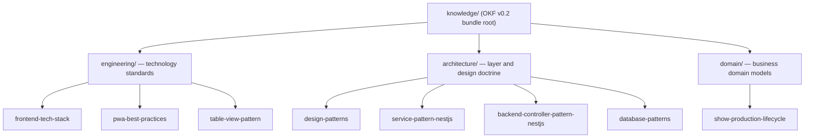

# Eridu Services Knowledge Bundle

Canonical Open Knowledge Format (OKF v0.2) bundle for `eridu-services`. Durable facts, domain concepts, architecture doctrine, and technology standards live here. Invocable procedures live in [`.agents/skills/`](../.agents/skills/) and select the concepts below.

Read [`docs/engineering/OKF_AGENT_CONTRACT.md`](../docs/engineering/OKF_AGENT_CONTRACT.md) before materially changing any concept in this bundle.

## Discovery

Start here, follow the link for the concept you need, and open only that file. Do not load the whole bundle. The portable concept ID is the bundle-relative path without `.md` — for example `architecture/database-patterns`.

## Knowledge Architecture

## Concepts

### Architecture

- [`architecture/design-patterns`](architecture/design-patterns.md) — Architectural layers, OLTP-vs-analytical boundaries, REST route shape, module exports, and monorepo package organization.
- [`architecture/service-pattern-nestjs`](architecture/service-pattern-nestjs.md) — Capability and model service boundaries, ORM decoupling rules, and error handling by service type.
- [`architecture/backend-controller-pattern-nestjs`](architecture/backend-controller-pattern-nestjs.md) — Controller types, guard ordering, response decorators, and UID validation.
- [`architecture/database-patterns`](architecture/database-patterns.md) — Soft delete, transactions, optimistic locking, advisory locks, polymorphism, audit history, and migration policy.

### Engineering

- [`engineering/frontend-tech-stack`](engineering/frontend-tech-stack.md) — React 19, Vite, Tailwind v4, TanStack Router and Query, and project structure standards.
- [`engineering/pwa-best-practices`](engineering/pwa-best-practices.md) — Service worker segregation, double-caching anti-pattern, iOS pitfalls, and CDN cache-poisoning prevention.
- [`engineering/table-view-pattern`](engineering/table-view-pattern.md) — Server-driven tables, URL state, pagination review gate, row selection, and current-view export.

### Domain

- [`domain/show-production-lifecycle`](domain/show-production-lifecycle.md) — Livestream Show state machine, entity relationships, lifecycle phases, readiness conditions, and operating roles.
