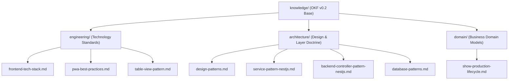

# Eridu Services Open Knowledge Base

okf_version: "0.2"

## Overview

This directory contains canonical Open Knowledge Format (OKF v0.2) bundles for `eridu-services`.
Factual domain concepts, architecture rules, technology standards, and system lifecycle references live here.

## Knowledge Architecture

## Knowledge Tree

- [`engineering/frontend-tech-stack`](engineering/frontend-tech-stack.md) — Technical stack, Vite configuration, React 19, and Tailwind v4 standards.
- [`engineering/pwa-best-practices`](engineering/pwa-best-practices.md) — Service worker, Workbox navigation fallback, and offline state standards.
- [`engineering/table-view-pattern`](engineering/table-view-pattern.md) — TanStack Table v8, URL search state, and empty/error state UI standards.
- [`architecture/design-patterns`](architecture/design-patterns.md) — High-level architecture decisions, modular monolith boundaries, and package organization.
- [`architecture/service-pattern-nestjs`](architecture/service-pattern-nestjs.md) — Capability vs model services, transaction boundaries, and public UID invariants.
- [`architecture/backend-controller-pattern-nestjs`](architecture/backend-controller-pattern-nestjs.md) — Request routing, guard binding, and DTO validation rules.
- [`architecture/database-patterns`](architecture/database-patterns.md) — Prisma transaction isolation, N+1 query prevention, and soft delete rules.
- [`domain/show-production-lifecycle`](domain/show-production-lifecycle.md) — Livestream Show domain model, status transitions, and lifecycle rules.
