# Auth SDK

## Overview

The `@eridu/auth-sdk` package provides a framework-agnostic SDK for authentication (JWT validation and JWKS management), enabling both frontend and backend services to authenticate users via tokens issued by the `erify_auth` service (Better Auth).

**Purpose**: This is an **SDK package** that provides reusable authentication utilities for JWT/JWKS validation. It can be integrated into any Node.js service (NestJS, Express, Hono, etc.) and will support frontend integration in the future (replacing `@eridu/auth-service`).

## Executive Summary

**Status**: ✅ **SDK Package** - Ready for implementation

This SDK design provides:

- **JWKS Management**: Fetch and cache JSON Web Key Sets from Better Auth's JWKS endpoint
- **JWT Verification**: Local token verification using cached public keys (no network calls per request)
- **Framework Adapters**: NestJS guard and decorator implementations for easy integration
- **Type Safety**: Shared TypeScript types for JWT payloads and user information

## Current State Analysis

### erify_api Requirements

**Needed Components:**

1. **JWKS Service** - Fetch JWKS from `{ERIFY_AUTH_URL}/api/auth/jwks` on startup, cache in memory, support edge/worker runtimes
2. **JWT Validation Guard** - Local JWT verification using JWKS, extract user info, validate issuer/audience
3. **Admin Guard** - Service-specific (depends on StudioMembership) - remains in erify_api
4. **JWKS Management Endpoints** - Framework-specific - remains in erify_api

### erify_auth Service

**Provides:**

- Better Auth service with JWT plugin enabled
- JWKS endpoint: `GET /api/auth/jwks` (standard Better Auth endpoint)
- Algorithm: EdDSA/Ed25519 (Better Auth default)
- Base path: `/api/auth` (configurable)
- JWT payload includes: `id`, `name`, `email`, `image`, `activeOrganizationId`, `activeTeamId`, `impersonatedBy`

### Package Structure

```
packages/auth-sdk/
├── src/
│   ├── server/                    # Server-side utilities
│   │   ├── jwks/
│   │   │   ├── jwks-service.ts   # Core JWKS fetching & caching
│   │   │   ├── jwks-client.ts    # HTTP client for JWKS endpoint
│   │   │   └── types.ts          # JWKS-related types
│   │   ├── jwt/
│   │   │   ├── jwt-verifier.ts   # Core JWT verification logic
│   │   │   ├── jwt-payload.ts    # JWT payload types & parsing
│   │   │   └── types.ts          # JWT-related types
│   │   └── index.ts              # Server-side exports
│   ├── adapters/                 # Framework-specific adapters
│   │   ├── nestjs/
│   │   │   ├── jwt-auth.guard.ts      # NestJS guard (uses core verifier)
│   │   │   ├── current-user.decorator.ts # Type-safe user extraction decorator
│   │   │   └── index.ts
│   │   └── index.ts
│   └── types.ts                  # Shared TypeScript types
└── package.json
```

## Package Exports

```json
{
  "exports": {
    // Server-side (Node.js)
    "./server/jwks": "./src/server/jwks/index.ts",
    "./server/jwt": "./src/server/jwt/index.ts",
    "./server": "./src/server/index.ts",

    // Framework adapters
    "./adapters/nestjs": "./src/adapters/nestjs/index.ts",

    // Types
    "./types": "./src/types.ts"
  }
}
```

## Installation

```bash
pnpm add @eridu/auth-sdk
```

## Dependencies

**Required Dependencies:**

- `jose`: ^6.0.11 - JWT verification with JWKS support
- `zod`: ^4.1.12 - Configuration validation

**Runtime Requirements:**

- Node.js 18+ (for native `fetch` API)
- TypeScript 5.8+

## Core Components

### 1. JWKS Service

**Purpose**: Fetch and cache JSON Web Key Sets from Better Auth's JWKS endpoint.

**Features:**

- Fetches JWKS from `{ERIFY_AUTH_URL}/api/auth/jwks` on startup
- Caches JWKS in memory for efficient local JWT verification
- Supports edge/worker runtimes with on-demand fetching (when `EDGE_RUNTIME=true`)
- Automatic key rotation detection and refresh
- Methods: `getJwks()`, `refreshJwks()`, `getKeysCount()`, `getLastFetchedTime()`

**Usage:**

```typescript
import { JwksService } from "@eridu/auth-sdk/server/jwks";

const jwksService = new JwksService({
  authServiceUrl: process.env.ERIFY_AUTH_URL!,
  jwksPath: "/api/auth/jwks", // optional, defaults to '/api/auth/jwks'
  edgeRuntime: false, // optional, defaults to false
});

// Initialize on startup
await jwksService.initialize();

// Get cached JWKS
const jwks = await jwksService.getJwks();

// Manually refresh JWKS
await jwksService.refreshJwks();
```

### 2. JWT Verifier

**Purpose**: Verify JWT tokens locally using cached JWKS (no network call per request).

**Features:**

- Local JWT verification using public keys from JWKS
- Validates issuer and audience against `ERIFY_AUTH_URL`
- Extracts user information from JWT payload
- Automatic key rotation handling (refreshes JWKS if unknown key ID detected)

**Usage:**

```typescript
import { JwksService } from "@eridu/auth-sdk/server/jwks";
import { JwtVerifier } from "@eridu/auth-sdk/server/jwt";

const jwksService = new JwksService({
  authServiceUrl: process.env.ERIFY_AUTH_URL!,
});
await jwksService.initialize();

const jwtVerifier = new JwtVerifier({
  jwksService,
  issuer: process.env.ERIFY_AUTH_URL!,
  audience: process.env.ERIFY_AUTH_URL!, // optional, defaults to issuer
});

// Verify token
const payload = await jwtVerifier.verify(token);

// Extract user info
const userInfo = jwtVerifier.extractUserInfo(payload);
```

### 3. NestJS Adapter

**Purpose**: NestJS guard implementation for easy integration into NestJS applications.

**Usage:**

```typescript
import { JwtAuthGuard } from "@eridu/auth-sdk/adapters/nestjs";
// Use in controllers with @CurrentUser() decorator (recommended)
import { CurrentUser } from "@eridu/auth-sdk/adapters/nestjs";
import { JwksService, JwtVerifier } from "@eridu/auth-sdk/server";
import { ConfigService } from "@nestjs/config";

import type { UserInfo } from "@eridu/auth-sdk/types";

@Module({
  providers: [
    {
      provide: JwksService,
      useFactory: async (config: ConfigService) => {
        const service = new JwksService({
          authServiceUrl: config.get("ERIFY_AUTH_URL")!,
          edgeRuntime: config.get("EDGE_RUNTIME", false),
        });
        // Initialize on startup (fetches and caches JWKS)
        await service.initialize();
        return service;
      },
      inject: [ConfigService],
    },
    {
      provide: JwtVerifier,
      useFactory: (jwksService: JwksService, config: ConfigService) => {
        return new JwtVerifier({
          jwksService,
          issuer: config.get("ERIFY_AUTH_URL")!,
        });
      },
      inject: [JwksService, ConfigService],
    },
    JwtAuthGuard,
  ],
  exports: [JwksService, JwtVerifier, JwtAuthGuard],
})
export class CommonModule {}

@Controller("profile")
@UseGuards(JwtAuthGuard)
export class ProfileController {
  @Get()
  getProfile(@CurrentUser() user: UserInfo) {
    // Type-safe user extraction - no need to access req.user manually
    return {
      id: user.id,
      email: user.email,
      name: user.name,
    };
  }
}

// Alternative: Use @Request() with AuthenticatedRequest (legacy approach)
@Controller("admin")
@UseGuards(JwtAuthGuard)
export class AdminController {
  @Get("profile")
  getProfile(@Request() req: AuthenticatedRequest) {
    return req.user; // UserInfo attached by guard
  }
}
```

**Note**: Environment variables (`ERIFY_AUTH_URL`, `EDGE_RUNTIME`) are validated via Zod schema in `env.schema.ts` on application startup. The SDK uses a pre-compile strategy where these values are resolved at runtime, not at build time.

### 4. CurrentUser Decorator

**Purpose**: Type-safe decorator to extract authenticated user from request objects in NestJS controllers.

**Features:**

- Type-safe user extraction without manual request typing
- Works with `UserInfo` type by default
- Supports transformed user types when using custom guards
- Throws `UnauthorizedException` if user is not found (guard should have set it)
- Cleaner code than accessing `request.user` directly

**Usage:**

```typescript
import { CurrentUser, JwtAuthGuard } from "@eridu/auth-sdk/adapters/nestjs";

import type { UserInfo } from "@eridu/auth-sdk/types";

@Controller("profile")
@UseGuards(JwtAuthGuard)
export class ProfileController {
  @Get()
  getProfile(@CurrentUser() user: UserInfo) {
    // TypeScript knows user is UserInfo
    return {
      id: user.id,
      email: user.email,
      name: user.name,
    };
  }

  @Get(":id")
  getItem(
    @CurrentUser() user: UserInfo,
    @Param("id") id: string,
  ) {
    return this.service.getItem(id, user.id);
  }
}
```

**Usage with Transformed User Type:**

If your app extends `JwtAuthGuard` and transforms the user:

```typescript
import { CurrentUser, JwtAuthGuard } from "@eridu/auth-sdk/adapters/nestjs";

// App-specific user type (from guard transformation)
type AuthenticatedUser = {
  ext_id: string;
  id: string;
  name: string;
  email: string;
  image?: string;
  payload: JwtPayload;
};

@Controller("profile")
@UseGuards(CustomJwtAuthGuard) // Transforms UserInfo → AuthenticatedUser
export class ProfileController {
  @Get()
  getProfile(@CurrentUser() user: AuthenticatedUser) {
    // Type annotation ensures AuthenticatedUser type
    return {
      ext_id: user.ext_id,
      email: user.email,
    };
  }
}
```

**Benefits:**

- **Type-safe**: TypeScript knows the exact type of user (via annotation)
- **Context-aware**: Only works when guard is applied
- **No global type pollution**: Doesn't affect Express types globally
- **Cleaner code**: No need to check if user exists (throws if missing)

## Type Definitions

### JWT Payload

```typescript
export type JwtPayload = {
  id: string;
  name: string;
  email: string;
  image?: string;
  activeOrganizationId?: string | null;
  activeTeamId?: string | null;
  impersonatedBy?: string | null;
  iat?: number;
  exp?: number;
  iss?: string;
  aud?: string;
};
```

### User Info

```typescript
export type UserInfo = {
  id: string;
  name: string;
  email: string;
  image?: string;
};
```

## Environment Configuration

### Required Environment Variables

**erify_api (consuming service):**

- `ERIFY_AUTH_URL`: Base URL of the erify_auth service (e.g., `http://localhost:3000` or `https://auth.example.com`)
  - **Required**: Must be a valid URL
  - **Validation**: Validated via Zod schema in `env.schema.ts` on application startup
  - **Usage**: Used to construct JWKS endpoint URL (`{ERIFY_AUTH_URL}/api/auth/jwks`) and validate JWT issuer/audience
- `EDGE_RUNTIME`: (Optional) Set to `true` if running on edge service or worker where caching isn't possible (defaults to `false`)
  - **Default**: `false` (standard Node.js runtime with caching)
  - **Validation**: Coerced to boolean via Zod schema
  - **Usage**: When `true`, JWKS are fetched on-demand per request instead of cached on startup

**erify_auth (auth service):**

- `BETTER_AUTH_URL`: Base URL for Better Auth (should match `ERIFY_AUTH_URL`)
- `BETTER_AUTH_SECRET`: Secret key for JWT signing
- Base path: `/api/auth` (default)

### Environment Variable Resolution Strategy

The SDK uses a **pre-compile strategy** where environment variables are resolved at runtime by the consuming application (erify_api), not at build time. This approach:

1. **Runtime Resolution**: Environment variables are read from `process.env` when services are instantiated
2. **Type Safety**: Environment variables are validated using Zod schemas in `env.schema.ts` on application startup
3. **Configuration Injection**: Services receive configuration through constructor parameters, allowing for:
   - Dependency injection in NestJS
   - Testing with mock configurations
   - Different configurations per environment

**Example Flow:**

```typescript
// 1. Environment variables are validated on startup via ConfigModule
ConfigModule.forRoot({
  validate: (config) => {
    const result = envSchema.safeParse(config);
    // ERIFY_AUTH_URL and EDGE_RUNTIME are validated here
    return result.data;
  },
});

// 2. Services are instantiated with validated config
const jwksService = new JwksService({
  authServiceUrl: configService.get("ERIFY_AUTH_URL"), // From validated env
  edgeRuntime: configService.get("EDGE_RUNTIME", false), // From validated env
});

// 3. SDK uses these values at runtime
await jwksService.initialize(); // Fetches from {ERIFY_AUTH_URL}/api/auth/jwks
```

**Benefits:**

- ✅ No hardcoded values in compiled code
- ✅ Environment-specific configuration without rebuilds
- ✅ Type-safe configuration with runtime validation
- ✅ Easy testing with mock configurations
- ✅ Supports multiple environments (dev, staging, production)

### Validation

- Ensure `ERIFY_AUTH_URL` matches `BETTER_AUTH_URL` in erify_auth
- Verify JWKS endpoint is accessible at `{ERIFY_AUTH_URL}/api/auth/jwks`
- Test JWT token format matches SDK expectations
- Environment variables are validated on application startup via Zod schema

## Architecture

### Integration Flow

```mermaid
sequenceDiagram
    participant Client
    participant API as erify_api
    participant SDK as auth-sdk
    participant Auth as erify_auth
    participant DB as Database

    Note over API,SDK: Server Startup
    API->>SDK: Initialize JwksService
    SDK->>Auth: Fetch JWKS from /api/auth/jwks
    Auth-->>SDK: Return JWKS (public keys)
    SDK->>SDK: Cache JWKS

    Note over Client,DB: Request Flow
    Client->>API: Request with JWT token
    API->>SDK: Validate token (JwtAuthGuard)
    SDK->>SDK: Get JWKS (cached or fetch)
    alt JWKS cached
        SDK-->>SDK: Return cached JWKS
    else Edge/Worker (no cache)
        SDK->>Auth: Fetch JWKS (on-demand)
        Auth-->>SDK: Return JWKS
    end
    SDK->>SDK: Verify JWT locally using JWKS
    SDK->>SDK: Extract user info from payload
    SDK->>API: Attach user to request
    API->>DB: Query membership (if admin check needed)
    DB-->>API: Return membership data
    API-->>Client: Response (write/read-only)
```



### How JWT/JWKS Validation Works

1. **Server Startup**: When the server starts, `JwksService.initialize()` fetches the JWKS from `{ERIFY_AUTH_URL}/api/auth/jwks`
2. **JWKS Caching**: The JWKS (public keys) are cached in memory for efficient local JWT verification
3. **Edge/Worker Runtime**: If `EDGE_RUNTIME=true`, JWKS are not cached and are fetched on-demand when needed
4. **JWT Verification**: Each request validates the JWT token locally using the cached JWKS - no network call per request
5. **Automatic Key Rotation**: If a JWT contains an unknown key ID (`kid`), the service automatically refreshes the JWKS and retries verification
6. **Manual Refresh**: Applications can provide endpoints to manually refresh JWKS for key rotation and recovery scenarios

## Implementation Plan

### Phase 1: SDK Foundation

1. Create SDK structure in auth-sdk package
2. Implement JwksService
3. Implement JwtVerifier
4. Add TypeScript types
5. Write unit tests

### Phase 2: NestJS Adapter

1. Create NestJS adapter directory
2. Implement JwtAuthGuard
3. Implement CurrentUser decorator ✅
4. Write adapter tests
5. Document usage ✅

### Phase 3: erify_api Integration

1. Add SDK dependency to erify_api
2. Update CommonModule to use SDK
3. Implement AdminGuard (service-specific, remains in erify_api)
4. Update controllers to use guards
5. Add JWKS management endpoints (framework-specific, remains in erify_api)
6. Integration testing

### Phase 4: Documentation & Cleanup

1. Update all documentation
2. Remove local implementation (if exists)
3. Remove `jose` dependency from erify_api (SDK provides it)
4. Final validation

## Benefits

1. **Code Reusability**: Single source of truth for JWT/JWKS logic
2. **Consistency**: Same validation logic across all services
3. **Maintainability**: Updates to JWT handling in one place
4. **Testability**: Core logic can be unit tested independently
5. **Future Services**: New microservices can use the same SDK
6. **Type Safety**: Shared types ensure consistency
7. **Framework Agnostic**: Core utilities work in any Node.js environment
8. **Framework Adapters**: Easy integration with popular frameworks

## Compatibility Matrix

| Component             | Framework          | Status                                             |
| --------------------- | ------------------ | -------------------------------------------------- |
| JwksService           | Framework-agnostic | ✅ Can be used anywhere                            |
| JwtVerifier           | Framework-agnostic | ✅ Can be used anywhere                            |
| JwtAuthGuard          | NestJS             | ✅ Adapter provided                                |
| CurrentUser Decorator | NestJS             | ✅ Adapter provided                                |
| Admin Guard           | NestJS + erify_api | ⚠️ Keep in erify_api (depends on StudioMembership) |
| JWKS Endpoints        | NestJS + erify_api | ⚠️ Keep in erify_api (framework-specific)          |

## Security Considerations

### Token Security

- JWT tokens are validated locally using public keys from Better Auth's JWKS endpoint
- No shared secret required - uses asymmetric key cryptography (EdDSA/Ed25519)
- JWKS are fetched on server startup and cached for efficiency
- On edge/worker runtimes, JWKS are fetched on-demand when caching isn't available
- Tokens should be extracted from Authorization header only
- Automatic key rotation support - refreshes JWKS when unknown key ID detected

### Better Auth Integration

- **JWKS Endpoint**: Fetched directly via HTTP from Better Auth's standard endpoint
  - Default endpoint: `{ERIFY_AUTH_URL}/api/auth/jwks` (Better Auth's default `basePath`)
  - Uses standard HTTP `fetch` API - no client library required
- **JWT Issuer**: Matches `ERIFY_AUTH_URL` (configured in Better Auth's `baseURL`)
- **JWT Audience**: Matches `ERIFY_AUTH_URL` (default in Better Auth)
- **Algorithm**: EdDSA with Ed25519 curve (Better Auth default)
- **Key Format**: JWK (JSON Web Key) format as per RFC 7517

## Testing Strategy

### SDK Unit Tests

- JwksService: fetch, cache, refresh, edge runtime
- JwtVerifier: verify, extract user info, error handling
- NestJS adapter: guard behavior, request attachment, CurrentUser decorator

### Integration Tests

- End-to-end authentication flow
- Admin guard with StudioMembership (erify_api specific)
- JWKS refresh endpoints
- Error handling

## Error Handling

### Authentication Errors

- `UnauthorizedException`: No token provided, invalid token, token expired
- `ForbiddenException`: Admin access required, user not authenticated

### JWKS Errors

- Network failures when fetching JWKS
- Invalid JWKS format
- Key rotation detection and automatic refresh

## Troubleshooting

### Common Issues

1. **JWT Token Invalid**

   - Verify token format (Bearer <token>)
   - Check token expiration
   - Verify ERIFY_AUTH_URL is correct and erify_auth service is accessible
   - Check JWKS endpoint is accessible: `GET {ERIFY_AUTH_URL}/api/auth/jwks`
   - Verify token issuer and audience match ERIFY_AUTH_URL
   - Check logs for JWKS fetch errors on startup

2. **JWKS Fetch Failed**

   - Verify ERIFY_AUTH_URL is correct and accessible
   - Check that the JWKS endpoint is accessible: `GET {ERIFY_AUTH_URL}/api/auth/jwks`
   - Verify Better Auth's `basePath` matches the default `/api/auth` (or update JWKS URL construction if custom)
   - Check network connectivity to erify_auth service
   - Verify erify_auth service is running and JWKS endpoint is available
   - Check erify_auth logs for errors
   - For edge/worker runtimes, ensure on-demand fetching is working
   - **Recovery**: Use manual refresh endpoints (if implemented by consuming service) to refresh JWKS

3. **Type Mismatches**
   - Ensure JWT payload types match Better Auth's JWT configuration
   - Verify types are imported correctly from SDK

### Debugging Tools

In development environment, log user information for debugging purposes. Check `request.user` (attached by `JwtAuthGuard`) or use `@CurrentUser()` decorator to verify user information extraction.

## Migration Path

### From Local Implementation

If you have existing JWT/JWKS implementation in your service:

1. Install SDK: `pnpm add @eridu/auth-sdk`
2. Replace local JWKS service with SDK's `JwksService`
3. Replace local JWT verifier with SDK's `JwtVerifier`
4. Update guards to use SDK's NestJS adapter
5. Remove local implementation code
6. Remove `jose` dependency (SDK provides it)

### Backward Compatibility

- No breaking changes expected
- SDK provides same functionality as local implementation
- Gradual migration supported

## Related Documentation

- **[Implementation Strategy](../../apps/erify_api/docs/IMPLEMENTATION_STRATEGY.md)** - SDK implementation plan for erify_api
- **[Authentication Guide](../../apps/erify_api/docs/AUTHENTICATION_GUIDE.md)** - Authentication guide for erify_api
- **[Phase 1 Roadmap](../../apps/erify_api/docs/roadmap/PHASE_1.md)** - Implementation roadmap
- **[Architecture Overview](../../apps/erify_api/docs/ARCHITECTURE.md)** - System architecture

## License

ISC
